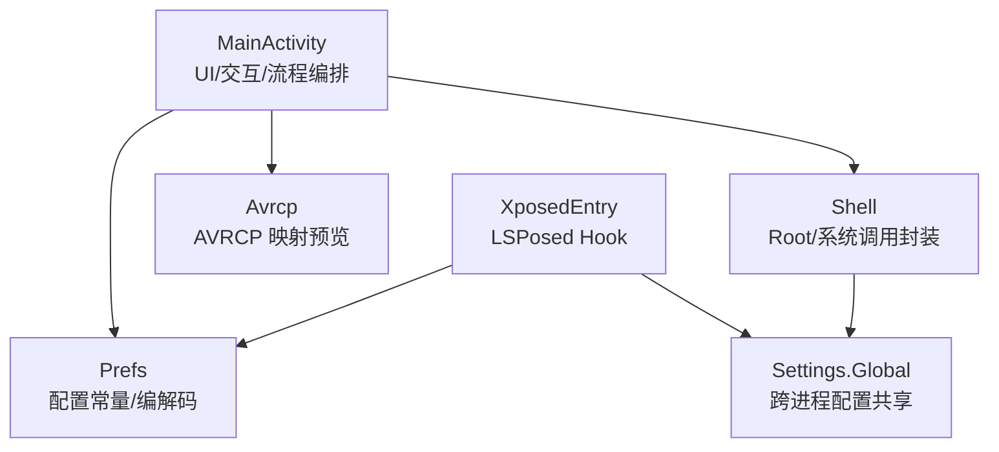
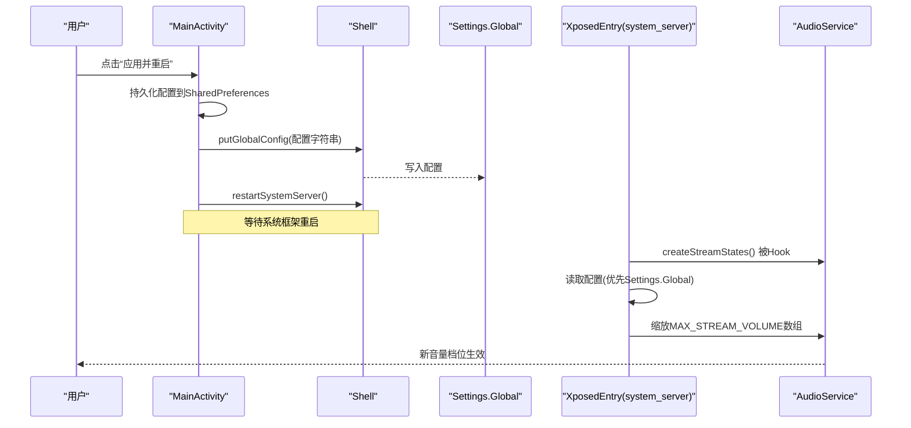
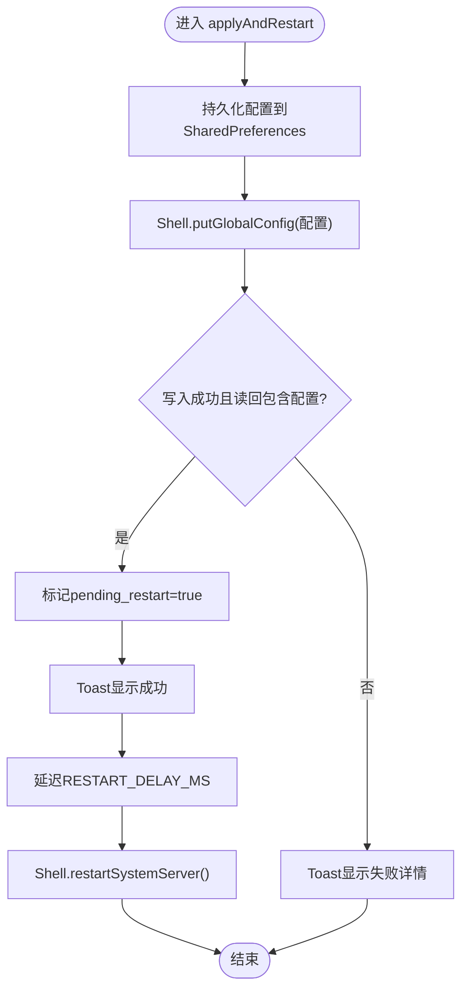
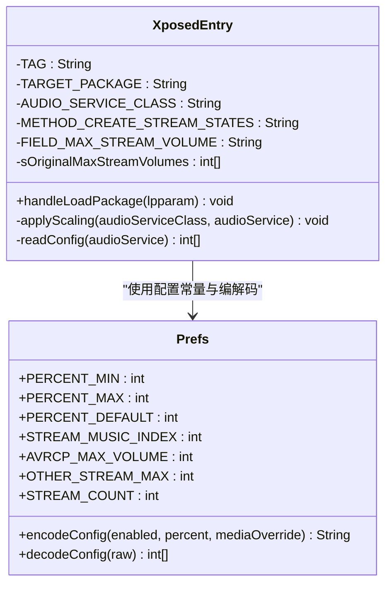
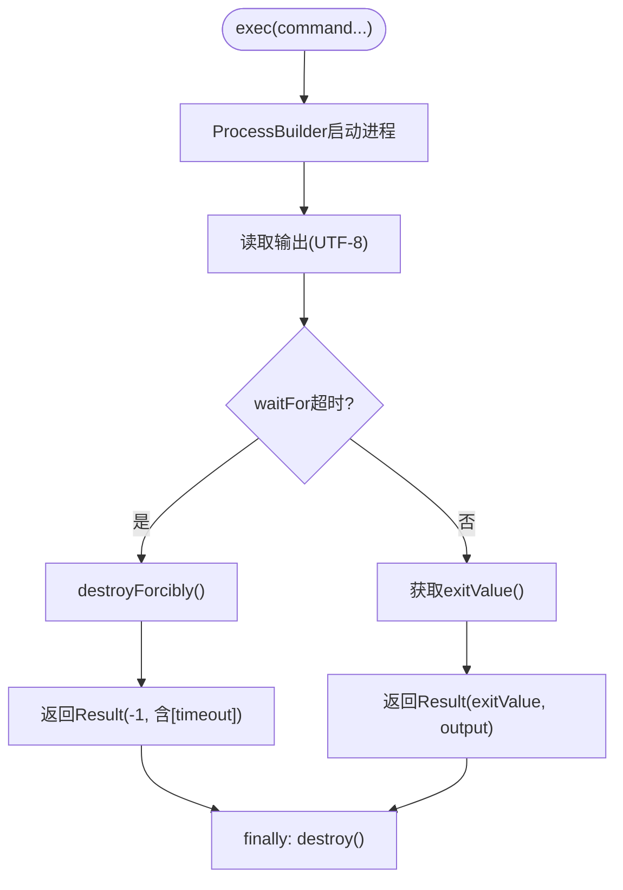
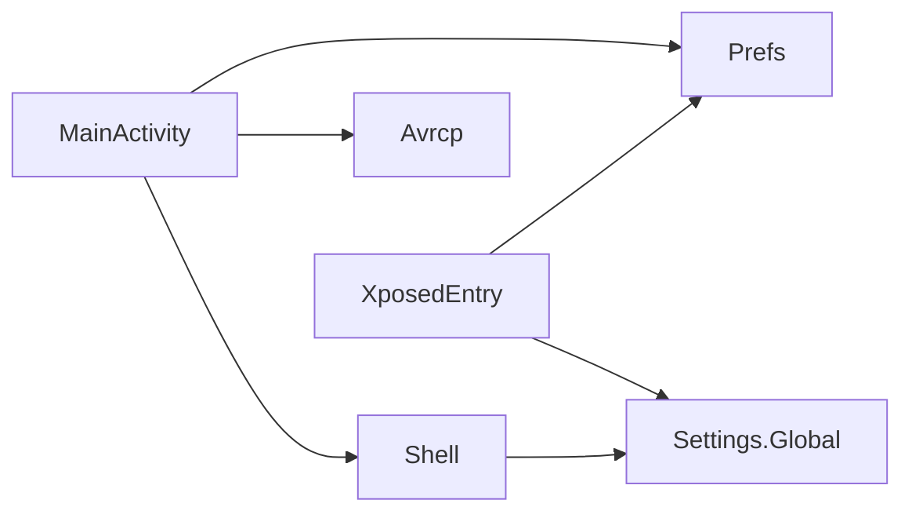

# 代码结构规范

<cite>
**本文引用的文件**
- [MainActivity.java](file://app/src/main/java/com/xiefeihong/volumecontrol/MainActivity.java)
- [XposedEntry.java](file://app/src/main/java/com/xiefeihong/volumecontrol/XposedEntry.java)
- [Shell.java](file://app/src/main/java/com/xiefeihong/volumecontrol/Shell.java)
- [Prefs.java](file://app/src/main/java/com/xiefeihong/volumecontrol/Prefs.java)
- [Avrcp.java](file://app/src/main/java/com/xiefeihong/volumecontrol/Avrcp.java)
</cite>

## 目录
1. [简介](#简介)
2. [项目结构](#项目结构)
3. [核心组件](#核心组件)
4. [架构总览](#架构总览)
5. [详细组件分析](#详细组件分析)
6. [依赖关系分析](#依赖关系分析)
7. [性能与健壮性](#性能与健壮性)
8. [故障排查指南](#故障排查指南)
9. [结论](#结论)
10. [附录：编码实践与审查清单](#附录编码实践与审查清单)

## 简介
本项目是一个 Android 应用，配合 LSPosed 模块对系统音量档位进行缩放控制。应用负责 UI 交互、配置持久化、Root 操作封装；LSPosed Hook 在 system_server 中拦截 AudioService 初始化逻辑，按配置修改各音频流的档位上限；蓝牙 AVRCP 映射计算用于预览媒体档位数与耳机绝对音量的对应关系。

## 项目结构
- 包名：com.xiefeihong.volumecontrol
- 源码组织：按职责划分到独立类，避免单点臃肿
  - MainActivity：UI 与用户交互、配置加载与预览、触发 Root 写入与软重启
  - XposedEntry：LSPosed 入口，Hook AudioService 创建流状态时缩放档位数组
  - Shell：root shell 执行工具，提供 su/exec、检测 root/LSPosed/Magisk、读写 Settings.Global、软重启 system_server
  - Prefs：配置常量与序列化/反序列化工具（被 App 与 Hook 端共同使用）
  - Avrcp：蓝牙 AVRCP 绝对音量映射计算与预览文本生成

图表来源
- [MainActivity.java:23-49](file://app/src/main/java/com/xiefeihong/volumecontrol/MainActivity.java#L23-L49)
- [XposedEntry.java:16-28](file://app/src/main/java/com/xiefeihong/volumecontrol/XposedEntry.java#L16-L28)
- [Shell.java:8-13](file://app/src/main/java/com/xiefeihong/volumecontrol/Shell.java#L8-L13)
- [Prefs.java:6-11](file://app/src/main/java/com/xiefeihong/volumecontrol/Prefs.java#L6-L11)
- [Avrcp.java:3-19](file://app/src/main/java/com/xiefeihong/volumecontrol/Avrcp.java#L3-L19)

章节来源
- [MainActivity.java:23-49](file://app/src/main/java/com/xiefeihong/volumecontrol/MainActivity.java#L23-L49)
- [XposedEntry.java:16-28](file://app/src/main/java/com/xiefeihong/volumecontrol/XposedEntry.java#L16-L28)
- [Shell.java:8-13](file://app/src/main/java/com/xiefeihong/volumecontrol/Shell.java#L8-L13)
- [Prefs.java:6-11](file://app/src/main/java/com/xiefeihong/volumecontrol/Prefs.java#L6-L11)
- [Avrcp.java:3-19](file://app/src/main/java/com/xiefeihong/volumecontrol/Avrcp.java#L3-L19)

## 核心组件
- MainActivity：负责界面绑定、监听器设置、配置读取与预览更新、Root 写入与校验、软重启 system_server、状态检测与渲染。
- XposedEntry：在 system_server 的 AudioService 初始化前拦截并缩放 MAX_STREAM_VOLUME 数组，实现全局音量档位调整。
- Shell：统一封装 su/exec、超时处理、输出合并、root/LSPosed/Magisk 检测、Settings.Global 读写、system_server 软重启。
- Prefs：集中管理配置键、范围常量、编解码方法，保证 App 与 Hook 端一致。
- Avrcp：基于 AOSP 公式计算媒体档位到 AVRCP 绝对音量的映射，并提供预览文本。

章节来源
- [MainActivity.java:23-49](file://app/src/main/java/com/xiefeihong/volumecontrol/MainActivity.java#L23-L49)
- [XposedEntry.java:16-28](file://app/src/main/java/com/xiefeihong/volumecontrol/XposedEntry.java#L16-L28)
- [Shell.java:8-13](file://app/src/main/java/com/xiefeihong/volumecontrol/Shell.java#L8-L13)
- [Prefs.java:6-11](file://app/src/main/java/com/xiefeihong/volumecontrol/Prefs.java#L6-L11)
- [Avrcp.java:3-19](file://app/src/main/java/com/xiefeihong/volumecontrol/Avrcp.java#L3-L19)

## 架构总览
应用通过 UI 收集用户意图，将配置持久化到 SharedPreferences，并通过 Shell 写入 Settings.Global；Hook 端优先从 Settings.Global 读取配置，回退到模块 SharedPreferences。生效需要重启 system_server 以重新创建 AudioService 的流状态。

图表来源
- [MainActivity.java:261-296](file://app/src/main/java/com/xiefeihong/volumecontrol/MainActivity.java#L261-L296)
- [Shell.java:92-112](file://app/src/main/java/com/xiefeihong/volumecontrol/Shell.java#L92-L112)
- [XposedEntry.java:41-65](file://app/src/main/java/com/xiefeihong/volumecontrol/XposedEntry.java#L41-L65)
- [XposedEntry.java:116-146](file://app/src/main/java/com/xiefeihong/volumecontrol/XposedEntry.java#L116-L146)

## 详细组件分析

### MainActivity：UI 交互与流程编排
- 职责
  - 初始化：绑定布局、加载配置、采集基准档位、更新预览、刷新状态
  - 用户输入：开关启用、百分比滑块、媒体覆盖档位、预设按钮、重置、应用并重启
  - 配置计算：根据启用状态、百分比、媒体覆盖计算目标档位，与 Hook 端算法保持一致
  - 持久化与写入：保存到 SharedPreferences，通过 Shell 写入 Settings.Global，校验后标记待重启
  - 状态检测：检测 root、LSPosed、当前媒体档位、蓝牙设备摘要，渲染提示
- 关键流程
  - 应用并重启：持久化 → 写 Settings.Global → 校验 → 提示 → 延迟重启 system_server
  - 刷新状态：后台线程检测 root/LSPosed/实际媒体档位 → 主线程渲染
- 并发与线程
  - 使用单线程 Executor 串行执行所有 root/系统查询，避免竞态
  - 主线程 Handler 回调更新 UI

图表来源
- [MainActivity.java:261-296](file://app/src/main/java/com/xiefeihong/volumecontrol/MainActivity.java#L261-L296)
- [Shell.java:92-112](file://app/src/main/java/com/xiefeihong/volumecontrol/Shell.java#L92-L112)

章节来源
- [MainActivity.java:23-49](file://app/src/main/java/com/xiefeihong/volumecontrol/MainActivity.java#L23-L49)
- [MainActivity.java:60-121](file://app/src/main/java/com/xiefeihong/volumecontrol/MainActivity.java#L60-L121)
- [MainActivity.java:145-231](file://app/src/main/java/com/xiefeihong/volumecontrol/MainActivity.java#L145-L231)
- [MainActivity.java:235-296](file://app/src/main/java/com/xiefeihong/volumecontrol/MainActivity.java#L235-L296)
- [MainActivity.java:300-366](file://app/src/main/java/com/xiefeihong/volumecontrol/MainActivity.java#L300-L366)

### XposedEntry：系统级 Hook 与档位缩放
- 职责
  - 在 system_server 的 AudioService.createStreamStates 方法执行前，按比例缩放 MAX_STREAM_VOLUME 数组
  - 读取配置：优先 Settings.Global，回退到模块 SharedPreferences
  - 保护原始数组：首次备份，避免重复缩放导致累积误差
- 关键点
  - 仅对 android 包进行 Hook，避免影响其他应用
  - 媒体流可单独覆盖为固定档位，非媒体流有安全上限
  - 日志记录便于调试

图表来源
- [XposedEntry.java:16-28](file://app/src/main/java/com/xiefeihong/volumecontrol/XposedEntry.java#L16-L28)
- [XposedEntry.java:41-65](file://app/src/main/java/com/xiefeihong/volumecontrol/XposedEntry.java#L41-L65)
- [XposedEntry.java:67-114](file://app/src/main/java/com/xiefeihong/volumecontrol/XposedEntry.java#L67-L114)
- [XposedEntry.java:116-146](file://app/src/main/java/com/xiefeihong/volumecontrol/XposedEntry.java#L116-L146)
- [Prefs.java:14-47](file://app/src/main/java/com/xiefeihong/volumecontrol/Prefs.java#L14-L47)
- [Prefs.java:56-82](file://app/src/main/java/com/xiefeihong/volumecontrol/Prefs.java#L56-L82)

章节来源
- [XposedEntry.java:16-28](file://app/src/main/java/com/xiefeihong/volumecontrol/XposedEntry.java#L16-L28)
- [XposedEntry.java:41-65](file://app/src/main/java/com/xiefeihong/volumecontrol/XposedEntry.java#L41-L65)
- [XposedEntry.java:67-114](file://app/src/main/java/com/xiefeihong/volumecontrol/XposedEntry.java#L67-L114)
- [XposedEntry.java:116-146](file://app/src/main/java/com/xiefeihong/volumecontrol/XposedEntry.java#L116-L146)

### Shell：Root 操作封装
- 职责
  - 统一执行 su 命令，合并 stdout/stderr，支持超时与强制销毁
  - 检测 root/LSPosed/Magisk 是否存在
  - 读写 Settings.Global（供 Hook 端读取）
  - 软重启 system_server（kill system_server，由 zygote 自动拉起）
- 设计要点
  - Result 对象封装退出码与输出，isSuccess 判断是否成功
  - exec 方法确保 Process 资源释放，异常兜底返回错误信息

图表来源
- [Shell.java:35-72](file://app/src/main/java/com/xiefeihong/volumecontrol/Shell.java#L35-L72)

章节来源
- [Shell.java:8-13](file://app/src/main/java/com/xiefeihong/volumecontrol/Shell.java#L8-L13)
- [Shell.java:21-33](file://app/src/main/java/com/xiefeihong/volumecontrol/Shell.java#L21-L33)
- [Shell.java:35-72](file://app/src/main/java/com/xiefeihong/volumecontrol/Shell.java#L35-L72)
- [Shell.java:74-112](file://app/src/main/java/com/xiefeihong/volumecontrol/Shell.java#L74-L112)

### Prefs：配置常量与编解码
- 职责
  - 定义配置键、范围常量、流索引、上限等
  - 提供 encodeConfig/decodeConfig 将配置序列化为字符串，供 Settings.Global 存储
  - 提供 joinInts/parseInts 用于基准档位 CSV 序列化
  - getOr 安全取值，避免越界
- 约束
  - 不引用任何 Xposed API，以便同时被 App 与 Hook 端使用

章节来源
- [Prefs.java:6-11](file://app/src/main/java/com/xiefeihong/volumecontrol/Prefs.java#L6-L11)
- [Prefs.java:14-47](file://app/src/main/java/com/xiefeihong/volumecontrol/Prefs.java#L14-L47)
- [Prefs.java:52-82](file://app/src/main/java/com/xiefeihong/volumecontrol/Prefs.java#L52-L82)
- [Prefs.java:84-122](file://app/src/main/java/com/xiefeihong/volumecontrol/Prefs.java#L84-L122)

### Avrcp：蓝牙 AVRCP 映射计算
- 职责
  - 按照 AOSP 公式将媒体档位换算为 AVRCP 绝对音量（0~127）
  - 统计相邻档位相同的情况数量，辅助评估档位密度
  - 生成可读的预览文本，展示最低档、最高档及映射表
- 设计要点
  - 纯函数式计算，无副作用，便于测试与复用

章节来源
- [Avrcp.java:3-19](file://app/src/main/java/com/xiefeihong/volumecontrol/Avrcp.java#L3-L19)
- [Avrcp.java:25-42](file://app/src/main/java/com/xiefeihong/volumecontrol/Avrcp.java#L25-L42)
- [Avrcp.java:44-88](file://app/src/main/java/com/xiefeihong/volumecontrol/Avrcp.java#L44-L88)

## 依赖关系分析
- MainActivity 依赖
  - Prefs：读取/写入配置常量与编解码
  - Shell：执行 Root 操作与系统调用
  - Avrcp：生成蓝牙映射预览
- XposedEntry 依赖
  - Prefs：配置常量与编解码
  - Settings.Global：跨进程配置共享
- Shell 依赖
  - 系统 su/settings/pidof/killall 等命令
- 耦合度
  - 低耦合：各组件职责清晰，通过接口/常量解耦
  - 共享数据：Prefs 作为唯一配置契约，避免不一致

图表来源
- [MainActivity.java:235-296](file://app/src/main/java/com/xiefeihong/volumecontrol/MainActivity.java#L235-L296)
- [XposedEntry.java:116-146](file://app/src/main/java/com/xiefeihong/volumecontrol/XposedEntry.java#L116-L146)
- [Shell.java:92-112](file://app/src/main/java/com/xiefeihong/volumecontrol/Shell.java#L92-L112)

章节来源
- [MainActivity.java:235-296](file://app/src/main/java/com/xiefeihong/volumecontrol/MainActivity.java#L235-L296)
- [XposedEntry.java:116-146](file://app/src/main/java/com/xiefeihong/volumecontrol/XposedEntry.java#L116-L146)
- [Shell.java:92-112](file://app/src/main/java/com/xiefeihong/volumecontrol/Shell.java#L92-L112)

## 性能与健壮性
- 线程模型
  - 单线程 Executor 串行执行 Root/系统查询，避免并发竞争
  - 主线程 Handler 回调更新 UI，避免跨线程 UI 操作
- I/O 与超时
  - Shell.exec 设置默认超时，防止阻塞；异常路径清理进程资源
- 容错
  - readStreamMaxSafe 捕获异常返回 0，避免崩溃
  - decodeConfig 非法输入返回 null，Hook 端保持系统默认
  - 蓝牙设备枚举与类型判断使用 try-catch 兜底
- 可维护性
  - 配置集中管理于 Prefs，避免魔法数字散落
  - 算法与 UI 分离，Avrcp 纯函数便于验证

[本节为通用指导，不直接分析具体文件]

## 故障排查指南
- 无法写入 Settings.Global
  - 检查 root 是否可用（uid=0），确认 su 授权
  - 查看 Shell.getGlobalConfig 读回是否包含配置
- Hook 未生效
  - 确认 LSPosed 已安装并启用模块
  - 检查 XposedEntry 日志，确认 createStreamStates 被 Hook
  - 确认已重启 system_server
- 蓝牙音量异常
  - 使用 Avrcp.buildPreview 检查映射情况，关注最低档与重复对数量
  - 若耳机在极低 AVRCP 音量无声，属硬件限制，需调高最低档或降低档位总数
- 状态检测不准确
  - 刷新状态后观察 tvStatusRoot/tvStatusLsposed/tvStatusVolume/tvStatusModule/tvStatusBt 的变化
  - 若 pending 状态持续，检查是否完成重启与配置同步

章节来源
- [Shell.java:74-112](file://app/src/main/java/com/xiefeihong/volumecontrol/Shell.java#L74-L112)
- [XposedEntry.java:41-65](file://app/src/main/java/com/xiefeihong/volumecontrol/XposedEntry.java#L41-L65)
- [XposedEntry.java:116-146](file://app/src/main/java/com/xiefeihong/volumecontrol/XposedEntry.java#L116-L146)
- [MainActivity.java:300-366](file://app/src/main/java/com/xiefeihong/volumecontrol/MainActivity.java#L300-L366)
- [Avrcp.java:44-88](file://app/src/main/java/com/xiefeihong/volumecontrol/Avrcp.java#L44-L88)

## 结论
本项目采用清晰的职责划分与低耦合设计：MainActivity 负责流程编排与 UI，XposedEntry 负责系统级 Hook，Shell 封装 Root 操作，Prefs 统一配置契约，Avrcp 提供蓝牙映射计算。通过 Settings.Global 实现跨进程配置共享，结合软重启 system_server 使配置生效。整体方案兼顾可维护性与健壮性，适合进一步扩展与优化。

[本节为总结，不直接分析具体文件]

## 附录：编码实践与审查清单

### 命名约定
- 类名：大驼峰，语义明确（如 MainActivity、XposedEntry、Shell、Prefs、Avrcp）
- 方法名：小驼峰，动词开头（如 applyScaling、restartSystemServer、buildPreview）
- 变量名：小驼峰，语义清晰（如 executor、mainHandler、baselineVolumes）
- 常量：全大写下划线（如 PERCENT_MIN、GLOBAL_KEY、STREAM_MUSIC_INDEX）
- 私有字段：前缀下划线或语义前缀（如 sOriginalMaxStreamVolumes）

章节来源
- [MainActivity.java:23-49](file://app/src/main/java/com/xiefeihong/volumecontrol/MainActivity.java#L23-L49)
- [XposedEntry.java:16-28](file://app/src/main/java/com/xiefeihong/volumecontrol/XposedEntry.java#L16-L28)
- [Shell.java:8-13](file://app/src/main/java/com/xiefeihong/volumecontrol/Shell.java#L8-L13)
- [Prefs.java:14-47](file://app/src/main/java/com/xiefeihong/volumecontrol/Prefs.java#L14-L47)
- [Avrcp.java:3-19](file://app/src/main/java/com/xiefeihong/volumecontrol/Avrcp.java#L3-L19)

### 注释标准
- 类注释：说明类的职责、作用域与重要约束（如 Prefs 同时被 App 与 Hook 端使用）
- 方法注释：复杂逻辑需说明输入、输出、边界条件与注意事项（如 decodeConfig 的格式与非法处理）
- 关键流程注释：解释为什么这样做（如 Hook 时机、重启必要性、AVRCP 映射原理）

章节来源
- [Prefs.java:6-11](file://app/src/main/java/com/xiefeihong/volumecontrol/Prefs.java#L6-L11)
- [Prefs.java:56-82](file://app/src/main/java/com/xiefeihong/volumecontrol/Prefs.java#L56-L82)
- [Avrcp.java:3-19](file://app/src/main/java/com/xiefeihong/volumecontrol/Avrcp.java#L3-L19)
- [XposedEntry.java:16-28](file://app/src/main/java/com/xiefeihong/volumecontrol/XposedEntry.java#L16-L28)

### 核心类职责划分
- MainActivity：UI 交互、配置加载与预览、Root 写入与校验、软重启、状态检测
- XposedEntry：Hook AudioService 创建流状态，缩放档位数组，读取配置
- Shell：Root 命令执行、超时处理、系统检测、Settings.Global 读写、system_server 软重启
- Prefs：配置常量、编解码、安全取值
- Avrcp：AVRCP 绝对音量映射计算与预览

章节来源
- [MainActivity.java:23-49](file://app/src/main/java/com/xiefeihong/volumecontrol/MainActivity.java#L23-L49)
- [XposedEntry.java:16-28](file://app/src/main/java/com/xiefeihong/volumecontrol/XposedEntry.java#L16-L28)
- [Shell.java:8-13](file://app/src/main/java/com/xiefeihong/volumecontrol/Shell.java#L8-L13)
- [Prefs.java:6-11](file://app/src/main/java/com/xiefeihong/volumecontrol/Prefs.java#L6-L11)
- [Avrcp.java:3-19](file://app/src/main/java/com/xiefeihong/volumecontrol/Avrcp.java#L3-L19)

### 良好编码实践示例（路径引用）
- 配置集中管理与编解码：[Prefs.java:56-82](file://app/src/main/java/com/xiefeihong/volumecontrol/Prefs.java#L56-L82)
- 安全取值与边界保护：[Prefs.java:116-122](file://app/src/main/java/com/xiefeihong/volumecontrol/Prefs.java#L116-L122)
- 异步任务与主线程回调：[MainActivity.java:261-296](file://app/src/main/java/com/xiefeihong/volumecontrol/MainActivity.java#L261-L296)
- 资源释放与异常兜底：[Shell.java:35-72](file://app/src/main/java/com/xiefeihong/volumecontrol/Shell.java#L35-L72)
- 纯函数式算法与预览：[Avrcp.java:25-88](file://app/src/main/java/com/xiefeihong/volumecontrol/Avrcp.java#L25-L88)

### 代码审查检查清单
- 结构与职责
  - 每个类职责单一，无明显臃肿
  - 配置常量集中在 Prefs，避免魔法数字
- 命名与注释
  - 类/方法/变量命名符合约定
  - 关键逻辑有类/方法注释，复杂分支有行内说明
- 并发与线程
  - Root/系统调用在后台线程执行
  - UI 更新在主线程回调
- 健壮性
  - 外部调用（su/settings）有超时与异常处理
  - 配置解析失败回退到默认值
- 可测试性
  - Avrcp 为纯函数，易于单元测试
  - Shell.Result 便于断言结果
- 安全性
  - 敏感操作（su）最小权限原则
  - 日志不包含敏感信息
- 可维护性
  - 依赖关系清晰，耦合度低
  - 变更影响面可控

[本节为通用指导，不直接分析具体文件]