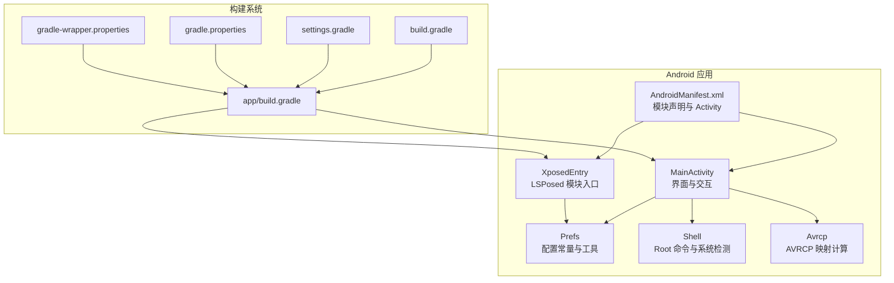
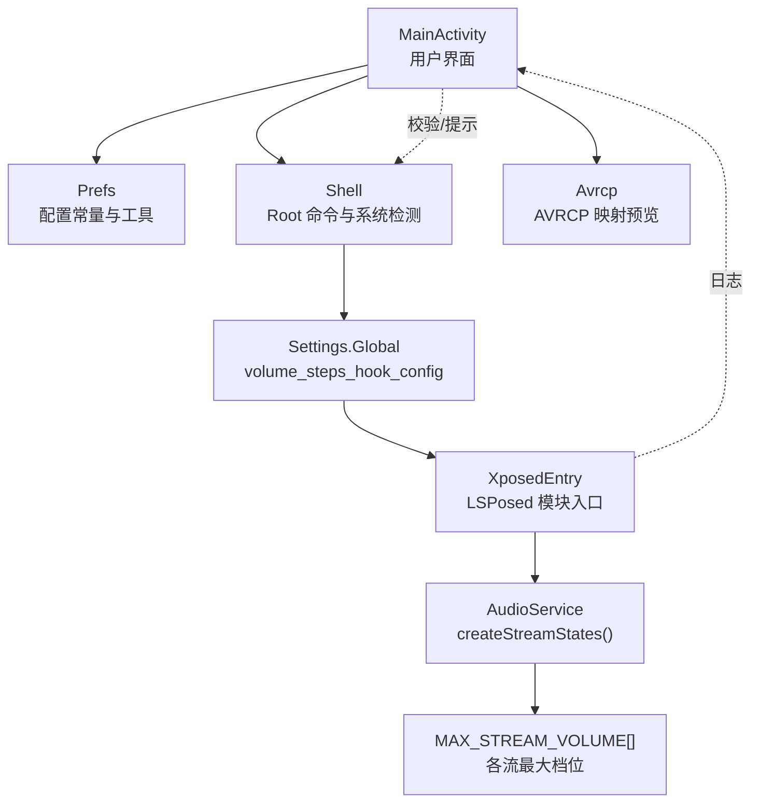
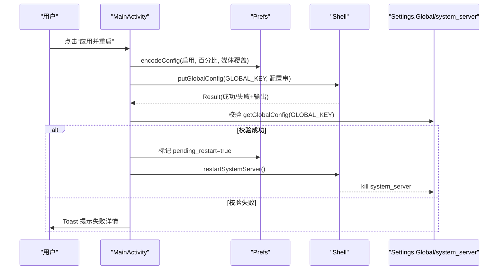
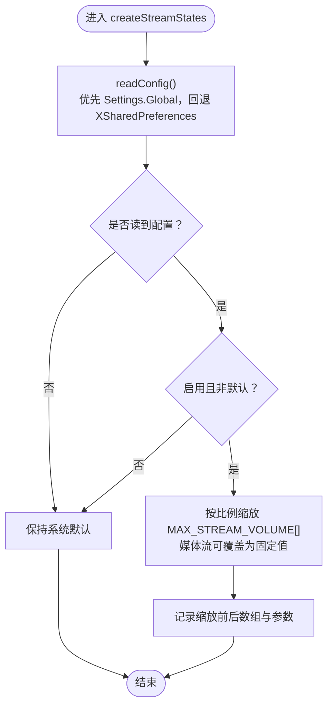

# 开发指南

<cite>
**本文引用的文件**   
- [app/build.gradle](file://app/build.gradle)
- [build.gradle](file://build.gradle)
- [gradle.properties](file://gradle.properties)
- [settings.gradle](file://settings.gradle)
- [gradle/wrapper/gradle-wrapper.properties](file://gradle/wrapper/gradle-wrapper.properties)
- [app/src/main/AndroidManifest.xml](file://app/src/main/AndroidManifest.xml)
- [app/src/main/java/com/xiefeihong/volumecontrol/MainActivity.java](file://app/src/main/java/com/xiefeihong/volumecontrol/MainActivity.java)
- [app/src/main/java/com/xiefeihong/volumecontrol/XposedEntry.java](file://app/src/main/java/com/xiefeihong/volumecontrol/XposedEntry.java)
- [app/src/main/java/com/xiefeihong/volumecontrol/Prefs.java](file://app/src/main/java/com/xiefeihong/volumecontrol/Prefs.java)
- [app/src/main/java/com/xiefeihong/volumecontrol/Shell.java](file://app/src/main/java/com/xiefeihong/volumecontrol/Shell.java)
- [app/src/main/java/com/xiefeihong/volumecontrol/Avrcp.java](file://app/src/main/java/com/xiefeihong/volumecontrol/Avrcp.java)
</cite>

## 目录
1. [简介](#简介)
2. [项目结构](#项目结构)
3. [核心组件](#核心组件)
4. [架构总览](#架构总览)
5. [详细组件分析](#详细组件分析)
6. [依赖与构建系统](#依赖与构建系统)
7. [环境搭建与工具链](#环境搭建与工具链)
8. [调试与测试](#调试与测试)
9. [代码贡献流程](#代码贡献流程)
10. [扩展点与二次开发](#扩展点与二次开发)
11. [性能优化与最佳实践](#性能优化与最佳实践)
12. [常见问题与故障排除](#常见问题与故障排除)
13. [结论](#结论)

## 简介
本项目是一个 Android 应用，同时也是一个 LSPosed/Xposed 模块。它通过 Hook 系统框架 AudioService 的初始化逻辑，按比例缩放各音频流的“音量档位数”，并提供一个可视化界面用于配置、预览和验证效果。应用还负责：
- 采集并保存系统原始档位作为基准；
- 将配置写入 Settings.Global，供 system_server 中的 Hook 端读取；
- 软重启 system_server 使新档位生效；
- 预览蓝牙 AVRCP 绝对音量映射关系，帮助理解不同档位数对耳机音量的影响。

本指南面向新加入的开发者，帮助你快速完成环境搭建、理解代码结构与扩展方式，并提供调试、测试、提交规范与排错建议。

## 项目结构
项目采用标准 Android Gradle 工程结构，包含一个 app 模块。关键目录与职责如下：
- app/src/main/java/com/xiefeihong/volumecontrol：核心 Java 源码
  - MainActivity：主界面与交互逻辑
  - XposedEntry：LSPosed/Xposed 模块入口（Hook 系统框架）
  - Prefs：配置常量与序列化/反序列化工具
  - Shell：root shell 执行与系统状态检测
  - Avrcp：蓝牙 AVRCP 绝对音量映射计算与预览
- app/src/main/res：资源文件（布局、字符串、主题等）
- app/src/main/AndroidManifest.xml：应用清单与 LSPosed/Xposed 模块元数据
- gradle 相关：Gradle 插件版本、仓库、Wrapper 版本、全局属性

**图表来源**
- [app/src/main/java/com/xiefeihong/volumecontrol/MainActivity.java:1-427](file://app/src/main/java/com/xiefeihong/volumecontrol/MainActivity.java#L1-L427)
- [app/src/main/java/com/xiefeihong/volumecontrol/XposedEntry.java:1-148](file://app/src/main/java/com/xiefeihong/volumecontrol/XposedEntry.java#L1-L148)
- [app/src/main/java/com/xiefeihong/volumecontrol/Prefs.java:1-124](file://app/src/main/java/com/xiefeihong/volumecontrol/Prefs.java#L1-L124)
- [app/src/main/java/com/xiefeihong/volumecontrol/Shell.java:1-114](file://app/src/main/java/com/xiefeihong/volumecontrol/Shell.java#L1-L114)
- [app/src/main/java/com/xiefeihong/volumecontrol/Avrcp.java:1-90](file://app/src/main/java/com/xiefeihong/volumecontrol/Avrcp.java#L1-L90)
- [app/src/main/AndroidManifest.xml:1-40](file://app/src/main/AndroidManifest.xml#L1-L40)
- [app/build.gradle:1-44](file://app/build.gradle#L1-L44)
- [build.gradle:1-4](file://build.gradle#L1-L4)
- [settings.gradle:1-21](file://settings.gradle#L1-L21)
- [gradle.properties:1-6](file://gradle.properties#L1-L6)
- [gradle/wrapper/gradle-wrapper.properties:1-8](file://gradle/wrapper/gradle-wrapper.properties#L1-L8)

**章节来源**
- [app/src/main/AndroidManifest.xml:1-40](file://app/src/main/AndroidManifest.xml#L1-L40)
- [app/build.gradle:1-44](file://app/build.gradle#L1-L44)

## 核心组件
- MainActivity：提供用户界面，负责监听开关、滑块、预设按钮，计算目标档位，预览 AVRCP 映射，持久化配置，并通过 Shell 写入 Settings.Global 与软重启 system_server。
- XposedEntry：在 system_server 中 Hook AudioService.createStreamStates，按配置缩放 MAX_STREAM_VOLUME 数组，实现整体音量档位调整。
- Prefs：定义配置键、范围常量、以及配置字符串与 CSV 的编解码工具，被 App 进程与 Hook 端共同使用。
- Shell：封装 su/exec 调用，提供 root 可用性检测、LSPosed/Magisk 存在性检测、Settings.Global 读写、system_server 软重启。
- Avrcp：根据 AOSP 蓝牙模块换算公式，计算媒体档位到 AVRCP 绝对音量的映射，并生成预览文本。

**章节来源**
- [app/src/main/java/com/xiefeihong/volumecontrol/MainActivity.java:1-427](file://app/src/main/java/com/xiefeihong/volumecontrol/MainActivity.java#L1-L427)
- [app/src/main/java/com/xiefeihong/volumecontrol/XposedEntry.java:1-148](file://app/src/main/java/com/xiefeihong/volumecontrol/XposedEntry.java#L1-L148)
- [app/src/main/java/com/xiefeihong/volumecontrol/Prefs.java:1-124](file://app/src/main/java/com/xiefeihong/volumecontrol/Prefs.java#L1-L124)
- [app/src/main/java/com/xiefeihong/volumecontrol/Shell.java:1-114](file://app/src/main/java/com/xiefeihong/volumecontrol/Shell.java#L1-L114)
- [app/src/main/java/com/xiefeihong/volumecontrol/Avrcp.java:1-90](file://app/src/main/java/com/xiefeihong/volumecontrol/Avrcp.java#L1-L90)

## 架构总览
下图展示应用与系统框架之间的交互关系，包括 UI 层、配置层、Shell 层与 LSPosed Hook 层。

**图表来源**
- [app/src/main/java/com/xiefeihong/volumecontrol/MainActivity.java:235-296](file://app/src/main/java/com/xiefeihong/volumecontrol/MainActivity.java#L235-L296)
- [app/src/main/java/com/xiefeihong/volumecontrol/Shell.java:92-112](file://app/src/main/java/com/xiefeihong/volumecontrol/Shell.java#L92-L112)
- [app/src/main/java/com/xiefeihong/volumecontrol/XposedEntry.java:41-65](file://app/src/main/java/com/xiefeihong/volumecontrol/XposedEntry.java#L41-L65)
- [app/src/main/java/com/xiefeihong/volumecontrol/XposedEntry.java:67-114](file://app/src/main/java/com/xiefeihong/volumecontrol/XposedEntry.java#L67-L114)
- [app/src/main/java/com/xiefeihong/volumecontrol/Prefs.java:17-18](file://app/src/main/java/com/xiefeihong/volumecontrol/Prefs.java#L17-L18)

## 详细组件分析

### MainActivity 分析与流程
- 主要职责：
  - 初始化 UI 绑定与 SharedPreferences；
  - 首次启动时采集系统原始档位作为基准；
  - 监听开关与滑块变化，计算目标档位并更新预览；
  - 将配置持久化，并通过 Shell 写入 Settings.Global；
  - 软重启 system_server 使新档位生效；
  - 刷新状态显示（root/LSPosed/音量/模块/蓝牙设备）。
- 关键流程：
  - applyAndRestart：持久化 → 写 Settings.Global → 校验 → 标记 pending restart → 延迟重启 system_server。
  - refreshStatus：后台线程检测 root/LSPosed，同步 Settings.Global，读取当前媒体最大档位，渲染状态。
  - updatePreview：根据启用状态、百分比、媒体覆盖档位计算目标档位，并调用 Avrcp.buildPreview 生成蓝牙映射预览。

**图表来源**
- [app/src/main/java/com/xiefeihong/volumecontrol/MainActivity.java:261-296](file://app/src/main/java/com/xiefeihong/volumecontrol/MainActivity.java#L261-L296)
- [app/src/main/java/com/xiefeihong/volumecontrol/Shell.java:92-112](file://app/src/main/java/com/xiefeihong/volumecontrol/Shell.java#L92-L112)
- [app/src/main/java/com/xiefeihong/volumecontrol/Prefs.java:56-59](file://app/src/main/java/com/xiefeihong/volumecontrol/Prefs.java#L56-L59)

**章节来源**
- [app/src/main/java/com/xiefeihong/volumecontrol/MainActivity.java:1-427](file://app/src/main/java/com/xiefeihong/volumecontrol/MainActivity.java#L1-L427)

### XposedEntry 分析与流程
- 主要职责：
  - 在 target package（android）加载时 Hook AudioService.createStreamStates；
  - 在 beforeHookedMethod 中读取配置并缩放 MAX_STREAM_VOLUME 数组；
  - 优先从 Settings.Global 读取配置，回退到 XSharedPreferences。
- 关键逻辑：
  - applyScaling：根据启用状态、百分比、媒体覆盖档位，原地修改 MAX_STREAM_VOLUME 元素；
  - readConfig：先读 Settings.Global，再读 XSharedPreferences，返回 int[]{enabled, percent, mediaOverride}。

**图表来源**
- [app/src/main/java/com/xiefeihong/volumecontrol/XposedEntry.java:41-65](file://app/src/main/java/com/xiefeihong/volumecontrol/XposedEntry.java#L41-L65)
- [app/src/main/java/com/xiefeihong/volumecontrol/XposedEntry.java:67-114](file://app/src/main/java/com/xiefeihong/volumecontrol/XposedEntry.java#L67-L114)
- [app/src/main/java/com/xiefeihong/volumecontrol/XposedEntry.java:122-146](file://app/src/main/java/com/xiefeihong/volumecontrol/XposedEntry.java#L122-L146)

**章节来源**
- [app/src/main/java/com/xiefeihong/volumecontrol/XposedEntry.java:1-148](file://app/src/main/java/com/xiefeihong/volumecontrol/XposedEntry.java#L1-L148)

### Prefs 工具类
- 作用：
  - 定义配置键（SharedPreferences 文件名、Settings.Global 键）、常量（百分比范围、媒体索引、AVRCP 上限、流数量）；
  - 提供 encodeConfig/decodeConfig（配置串）、joinInts/parseInts（CSV 基准数组）、getOr（安全取值）。
- 注意：该类同时被 App 进程与 Hook 端使用，因此不引用任何 Xposed API 类。

**章节来源**
- [app/src/main/java/com/xiefeihong/volumecontrol/Prefs.java:1-124](file://app/src/main/java/com/xiefeihong/volumecontrol/Prefs.java#L1-L124)

### Shell 工具类
- 作用：
  - 封装 su/exec 调用，统一超时处理与输出合并；
  - 提供 isRootAvailable/isLsposedPresent/isMagiskPresent 检测；
  - 提供 Settings.Global 读写与 system_server 软重启。
- 风险点：
  - 所有方法阻塞当前线程，必须在后台线程调用；
  - 超时或异常会返回错误码与错误信息，需在上层进行提示与恢复。

**章节来源**
- [app/src/main/java/com/xiefeihong/volumecontrol/Shell.java:1-114](file://app/src/main/java/com/xiefeihong/volumecontrol/Shell.java#L1-L114)

### Avrcp 映射计算
- 作用：
  - 根据 AOSP 蓝牙模块换算公式，计算媒体档位到 AVRCP 绝对音量的映射；
  - 统计相邻档位重复对数，生成预览文本，帮助用户理解不同档位数对耳机的听感影响。
- 关键点：
  - toAbsoluteVolume(step, maxSteps) = round(step * 127 / maxSteps)；
  - buildPreview 输出每档对应的 AVRCP 音量，便于调试与说明。

**章节来源**
- [app/src/main/java/com/xiefeihong/volumecontrol/Avrcp.java:1-90](file://app/src/main/java/com/xiefeihong/volumecontrol/Avrcp.java#L1-L90)

## 依赖与构建系统
- Gradle 插件版本：com.android.application 8.7.1（根 build.gradle）
- Android SDK：compileSdk/targetSdk=35，minSdk=26
- Java 版本：sourceCompatibility/targetCompatibility=JavaVersion.VERSION_17
- 依赖库：
  - androidx.appcompat:appcompat:1.6.1
  - com.google.android.material:material:1.10.0
  - de.robv.android.xposed:api:82（仅编译期，运行期由 LSPosed 提供）
- 仓库：
  - google()、mavenCentral()、gradlePluginPortal()
  - XposedBridge 旧版 API 仓库：https://api.xposed.info/
- Wrapper 版本：Gradle 8.9（国内镜像）
- 全局属性：
  - org.gradle.jvmargs=-Xmx2048m -Dfile.encoding=UTF-8
  - org.gradle.parallel=true
  - org.gradle.caching=true
  - android.useAndroidX=true
  - android.nonTransitiveRClass=true

**章节来源**
- [build.gradle:1-4](file://build.gradle#L1-L4)
- [app/build.gradle:1-44](file://app/build.gradle#L1-L44)
- [settings.gradle:1-21](file://settings.gradle#L1-L21)
- [gradle/wrapper/gradle-wrapper.properties:1-8](file://gradle/wrapper/gradle-wrapper.properties#L1-L8)
- [gradle.properties:1-6](file://gradle.properties#L1-L6)

## 环境搭建与工具链
- Android Studio：建议使用支持 AGP 8.7.1 与 Java 17 的稳定版本（例如 Android Hedgehog/Iguana 及以上）。
- JDK：JDK 17（IDE 与 Gradle 均需要）。
- Android SDK：
  - compileSdk/targetSdk=35
  - minSdk=26
- Gradle：8.9（通过 Wrapper 自动下载）
- LSPosed/Xposed：
  - 安装 LSPosed（或兼容的 Xposed 框架），并在设置中启用 VolumeControl 模块；
  - 确保已授予 root 权限（Magisk 或其他 root 方案）。
- 设备要求：
  - Android 10+（minSdk=26）
  - 已开启 USB 调试并授权 root（用于 Shell 操作）

**章节来源**
- [app/build.gradle:5-25](file://app/build.gradle#L5-L25)
- [gradle/wrapper/gradle-wrapper.properties:1-8](file://gradle/wrapper/gradle-wrapper.properties#L1-L8)
- [app/src/main/AndroidManifest.xml:21-36](file://app/src/main/AndroidManifest.xml#L21-L36)

## 调试与测试
- 日志输出：
  - LSPosed 侧使用 XposedBridge.log 输出 Hook 与配置读取日志；
  - 应用侧通过 Toast 提示用户操作结果（如 push 成功/失败、baseline 保存等）。
- 断点调试：
  - 在 MainActivity 的 applyAndRestart、refreshStatus、updatePreview 等方法设置断点；
  - 在 XposedEntry 的 handleLoadPackage、applyScaling、readConfig 等方法设置断点（需在 LSPosed 日志中确认 Hook 成功）。
- 单元测试：
  - 当前工程未包含单元测试目录；如需添加，可在 app/src/test/java 下编写 JUnit 测试用例，重点覆盖 Prefs 的编解码与 Avrcp 的映射计算。
- 集成测试：
  - 在真机或模拟器上安装 LSPosed 与模块；
  - 通过应用界面执行“应用并重启”，观察 system_server 软重启后音量档位是否生效；
  - 连接蓝牙耳机，验证 AVRCP 绝对音量映射是否符合预期。

**章节来源**
- [app/src/main/java/com/xiefeihong/volumecontrol/XposedEntry.java:41-65](file://app/src/main/java/com/xiefeihong/volumecontrol/XposedEntry.java#L41-L65)
- [app/src/main/java/com/xiefeihong/volumecontrol/MainActivity.java:261-296](file://app/src/main/java/com/xiefeihong/volumecontrol/MainActivity.java#L261-L296)
- [app/src/main/java/com/xiefeihong/volumecontrol/Avrcp.java:49-88](file://app/src/main/java/com/xiefeihong/volumecontrol/Avrcp.java#L49-L88)

## 代码贡献流程
- 分支管理：
  - 推荐主干分支（main/master）稳定发布；
  - 功能分支以 feature/xxx 命名，修复分支以 fix/xxx 命名；
  - 发布分支以 release/xxx 命名，热修复以 hotfix/xxx 命名。
- 代码审查：
  - 所有变更需通过 Pull Request 进行审查；
  - 至少一名维护者批准后方可合并；
  - 关注可读性、错误处理、性能与兼容性。
- 提交规范：
  - 提交消息遵循“类型: 描述”格式（例如 feat: 新增 AVRCP 预览文案）；
  - 避免无意义提交（如 “update”、“fix”）；
  - 每次提交应聚焦单一变更。
- 标签与版本：
  - 使用语义化版本号（SemVer）；
  - 在 Release 中记录变更摘要与已知问题。

[本节为通用流程建议，不直接分析具体文件]

## 扩展点与二次开发
- 新功能添加：
  - 在 MainActivity 中添加新的 UI 控件与监听器；
  - 在 Prefs 中新增配置键与默认值；
  - 在 Shell 中封装新的系统命令（如 settings put/get、kill 其他进程等）；
  - 在 XposedEntry 中增加新的 Hook 点（例如针对其他系统服务或方法）。
- 第三方集成：
  - 在 app/build.gradle 的 dependencies 中添加依赖；
  - 在 settings.gradle 的 dependencyResolutionManagement.repositories 中添加仓库（如私有 Maven 仓库）；
  - 注意依赖的许可证与运行时权限。
- 插件开发：
  - 若需要自定义 Gradle 插件，可在根目录创建 plugin 模块，并在 settings.gradle 中引入；
  - 通过 Gradle Plugin Portal 或私有仓库分发插件。

**章节来源**
- [app/build.gradle:38-43](file://app/build.gradle#L38-L43)
- [settings.gradle:9-17](file://settings.gradle#L9-L17)

## 性能优化与最佳实践
- 线程模型：
  - 所有 Shell 操作均在单线程 Executor 中串行执行，避免并发竞争；
  - UI 更新通过 Handler(Looper.getMainLooper()) 切回主线程。
- I/O 与缓存：
  - SharedPreferences 使用 apply（异步）为主，commit（同步）仅在关键路径使用；
  - baselineVolumes 缓存系统原始档位，避免频繁查询 AudioManager。
- 错误处理：
  - Shell.exec 统一捕获异常并返回错误码与输出；
  - MainActivity 中对 readStreamMaxSafe 等系统调用进行 try-catch 保护。
- 内存与对象：
  - 避免在循环中创建大量临时对象；
  - 使用 StringBuilder 拼接预览文本，减少 GC 压力。
- 兼容性：
  - 使用常量字面值兼容低版本 API（如蓝牙设备类型）；
  - 在 Hook 端优先读取 Settings.Global，回退到 XSharedPreferences，提高鲁棒性。

**章节来源**
- [app/src/main/java/com/xiefeihong/volumecontrol/MainActivity.java:34-36](file://app/src/main/java/com/xiefeihong/volumecontrol/MainActivity.java#L34-L36)
- [app/src/main/java/com/xiefeihong/volumecontrol/MainActivity.java:162-173](file://app/src/main/java/com/xiefeihong/volumecontrol/MainActivity.java#L162-L173)
- [app/src/main/java/com/xiefeihong/volumecontrol/Shell.java:40-72](file://app/src/main/java/com/xiefeihong/volumecontrol/Shell.java#L40-L72)
- [app/src/main/java/com/xiefeihong/volumecontrol/XposedEntry.java:122-146](file://app/src/main/java/com/xiefeihong/volumecontrol/XposedEntry.java#L122-L146)

## 常见问题与故障排除
- 无法检测到 root：
  - 检查是否已授予 su 权限；
  - 确认 Magisk 或其他 root 方案正常工作；
  - 查看 Shell.isRootAvailable 返回结果与日志。
- LSPosed 未生效：
  - 确认模块已在 LSPosed 中启用；
  - 检查 AndroidManifest 中的 xposedmodule/xposedscope 元数据；
  - 查看 XposedBridge.log 是否有 Hook 失败日志。
- 音量档位未生效：
  - 确认 Settings.Global 已成功写入并校验通过；
  - 确认 system_server 已软重启；
  - 检查 Prefs 配置是否正确（启用、百分比、媒体覆盖）。
- 蓝牙 AVRCP 映射异常：
  - 检查媒体档位数是否超过 AVRCP_MAX_VOLUME（127）；
  - 查看 Avrcp.buildPreview 输出的映射表；
  - 确认耳机固件对极低 AVRCP 音量的支持情况。

**章节来源**
- [app/src/main/java/com/xiefeihong/volumecontrol/Shell.java:74-90](file://app/src/main/java/com/xiefeihong/volumecontrol/Shell.java#L74-L90)
- [app/src/main/AndroidManifest.xml:21-36](file://app/src/main/AndroidManifest.xml#L21-L36)
- [app/src/main/java/com/xiefeihong/volumecontrol/XposedEntry.java:41-65](file://app/src/main/java/com/xiefeihong/volumecontrol/XposedEntry.java#L41-L65)
- [app/src/main/java/com/xiefeihong/volumecontrol/Avrcp.java:49-88](file://app/src/main/java/com/xiefeihong/volumecontrol/Avrcp.java#L49-L88)

## 结论
本项目通过应用界面与 LSPosed 模块协同工作，实现对系统音量档位的灵活控制与蓝牙 AVRCP 映射预览。开发者可基于现有架构快速扩展功能、集成第三方库、定制 Gradle 插件，并通过完善的调试与测试流程保障质量。建议在扩展时遵循统一的命名规范、注释标准与提交规范，确保代码的可维护性与团队协作效率。

[本节为总结性内容，不直接分析具体文件]