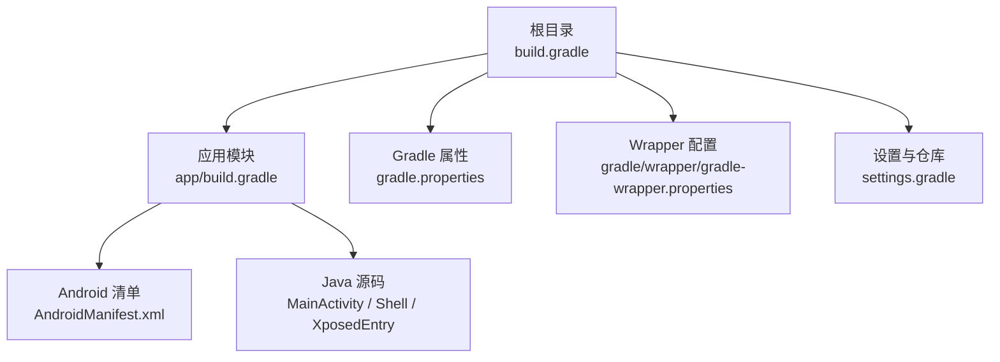
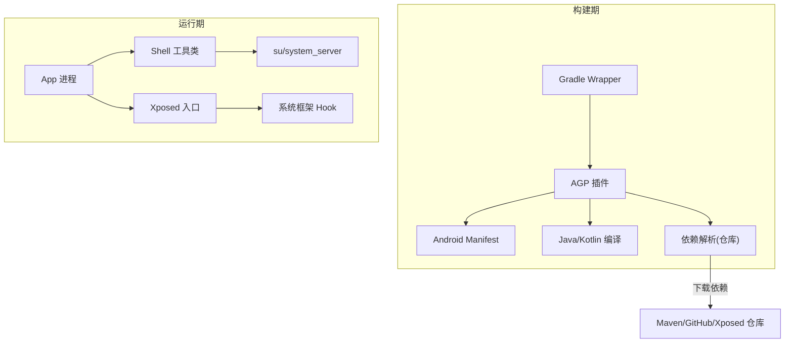
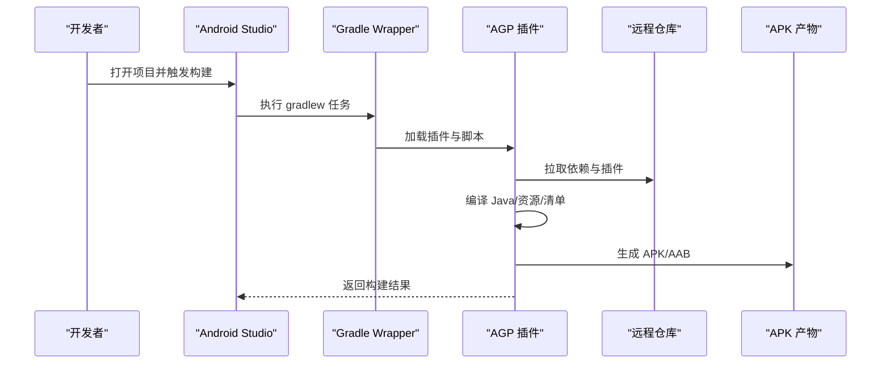
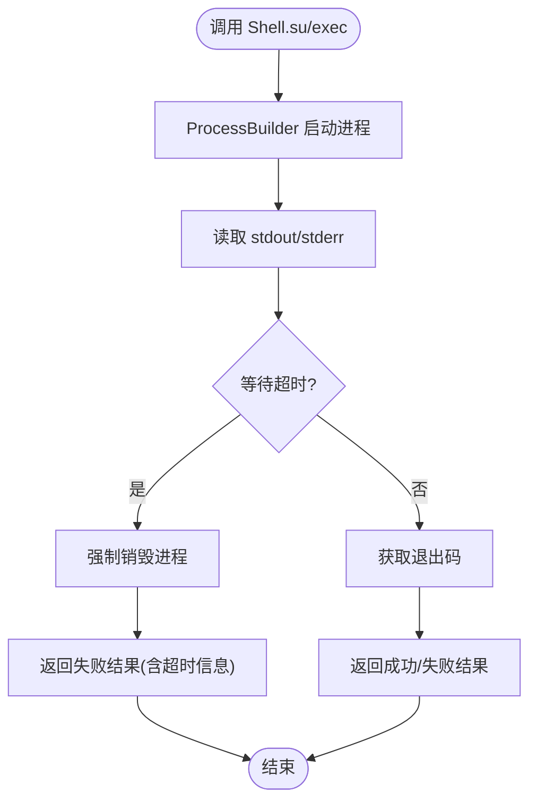

# 开发环境搭建

<cite>
**本文引用的文件**
- [build.gradle](file://build.gradle)
- [app/build.gradle](file://app/build.gradle)
- [gradle.properties](file://gradle.properties)
- [gradle/wrapper/gradle-wrapper.properties](file://gradle/wrapper/gradle-wrapper.properties)
- [settings.gradle](file://settings.gradle)
- [local.properties](file://local.properties)
- [AndroidManifest.xml](file://app/src/main/AndroidManifest.xml)
- [Shell.java](file://app/src/main/java/com/xiefeihong/volumecontrol/Shell.java)
- [MainActivity.java](file://app/src/main/java/com/xiefeihong/volumecontrol/MainActivity.java)
- [XposedEntry.java](file://app/src/main/java/com/xiefeihong/volumecontrol/XposedEntry.java)
</cite>

## 目录
1. [简介](#简介)
2. [项目结构](#项目结构)
3. [核心组件](#核心组件)
4. [架构总览](#架构总览)
5. [详细组件分析](#详细组件分析)
6. [依赖与仓库配置](#依赖与仓库配置)
7. [性能与构建优化](#性能与构建优化)
8. [常见问题排查](#常见问题排查)
9. [结论](#结论)
10. [附录：环境与验证清单](#附录：环境与验证清单)

## 简介
本指南面向首次在本项目上进行 Android 开发的工程师，目标是快速、稳定地搭建可编译、可调试、可运行的完整开发环境。内容覆盖：
- Android Studio、JDK、Android SDK 版本要求
- Gradle 构建系统与 Wrapper 版本
- 系统权限与 Root/LSPosed 环境要求
- IDE 导入、SDK 路径、模拟器配置步骤
- 常见环境问题定位与解决
- 环境正确性验证方法

## 项目结构
本项目为 Android 应用模块（包含 Xposed/LSPosed 模块声明），使用 Android Gradle Plugin 进行构建，并通过 Gradle Wrapper 管理构建工具版本。关键配置文件位于根目录与 app 模块中。

**图表来源**
- [build.gradle:1-4](file://build.gradle#L1-L4)
- [app/build.gradle:1-44](file://app/build.gradle#L1-L44)
- [gradle.properties:1-6](file://gradle.properties#L1-L6)
- [gradle/wrapper/gradle-wrapper.properties:1-8](file://gradle/wrapper/gradle-wrapper.properties#L1-L8)
- [settings.gradle:1-21](file://settings.gradle#L1-L21)
- [AndroidManifest.xml:1-40](file://app/src/main/AndroidManifest.xml#L1-L40)

**章节来源**
- [build.gradle:1-4](file://build.gradle#L1-L4)
- [app/build.gradle:1-44](file://app/build.gradle#L1-L44)
- [gradle.properties:1-6](file://gradle.properties#L1-L6)
- [gradle/wrapper/gradle-wrapper.properties:1-8](file://gradle/wrapper/gradle-wrapper.properties#L1-L8)
- [settings.gradle:1-21](file://settings.gradle#L1-L21)
- [AndroidManifest.xml:1-40](file://app/src/main/AndroidManifest.xml#L1-L40)

## 核心组件
- 构建插件与 AGP：根 build.gradle 声明了 Android 应用插件版本。
- 应用模块配置：compileSdk/targetSdk/minSdk、Java 版本、ViewBinding、BuildConfig、依赖等。
- Gradle 属性：JVM 参数、并行构建、缓存、AndroidX 开关、RClass 模式。
- Wrapper：指定 Gradle 发行版下载地址与缓存位置。
- 仓库与依赖：Google/MavenCentral/Xposed API 仓库。
- 运行时能力：Root shell 执行、LSPosed 检测、系统框架重启。

**章节来源**
- [build.gradle:1-4](file://build.gradle#L1-L4)
- [app/build.gradle:5-43](file://app/build.gradle#L5-L43)
- [gradle.properties:1-6](file://gradle.properties#L1-L6)
- [gradle/wrapper/gradle-wrapper.properties:1-8](file://gradle/wrapper/gradle-wrapper.properties#L1-L8)
- [settings.gradle:9-17](file://settings.gradle#L9-L17)
- [Shell.java:35-113](file://app/src/main/java/com/xiefeihong/volumecontrol/Shell.java#L35-L113)

## 架构总览
下图展示了构建期与运行期的关键关系：构建期由 AGP 与 Gradle 驱动；运行期通过 LSPosed 在系统框架层 Hook，并通过 Root Shell 写入系统设置与重启 system_server。

**图表来源**
- [gradle/wrapper/gradle-wrapper.properties:1-8](file://gradle/wrapper/gradle-wrapper.properties#L1-L8)
- [build.gradle:1-4](file://build.gradle#L1-L4)
- [settings.gradle:9-17](file://settings.gradle#L9-L17)
- [AndroidManifest.xml:21-36](file://app/src/main/AndroidManifest.xml#L21-L36)
- [Shell.java:35-113](file://app/src/main/java/com/xiefeihong/volumecontrol/Shell.java#L35-L113)
- [XposedEntry.java:1-29](file://app/src/main/java/com/xiefeihong/volumecontrol/XposedEntry.java#L1-L29)

## 详细组件分析

### 构建系统与工具链
- Android Studio：建议使用最新版本以匹配 AGP 8.7.x 的兼容性。
- JDK：Java 17（编译源与目标均为 Java 17）。
- Android SDK：compileSdk 与 targetSdk 均为 35；minSdk 为 26。
- Gradle：通过 Wrapper 使用 Gradle 8.9（镜像地址已配置）。
- 仓库：Google、MavenCentral、Xposed API（仅编译期）。

**章节来源**
- [app/build.gradle:5-25](file://app/build.gradle#L5-L25)
- [gradle/wrapper/gradle-wrapper.properties:1-8](file://gradle/wrapper/gradle-wrapper.properties#L1-L8)
- [settings.gradle:9-17](file://settings.gradle#L9-L17)

### IDE 配置与项目导入
- 导入项目：使用 Android Studio 打开根目录即可自动识别模块。
- SDK 路径：若本地未自动识别，请在 local.properties 中设置 sdk.dir 指向本机 Android SDK 路径。
- JDK 路径：确保 Project Structure 中的 JDK 路径指向 Java 17。
- 模拟器：创建或选择 API 35 的 AVD，建议开启硬件加速。

**章节来源**
- [local.properties:1-2](file://local.properties#L1-L2)
- [app/build.gradle:5-15](file://app/build.gradle#L5-L15)

### 权限与 Root/LSPosed 环境
- 清单声明：模块元数据声明为 Xposed/LSPosed 模块，最低版本要求与共享偏好等。
- Root 能力：通过 su 执行命令、检测 root 可用性、检测 LSPosed/Magisk、写入 Settings.Global、重启 system_server。
- 作用域：通过 xposedscope 指定模块作用范围（资源引用）。

**章节来源**
- [AndroidManifest.xml:21-36](file://app/src/main/AndroidManifest.xml#L21-L36)
- [Shell.java:74-113](file://app/src/main/java/com/xiefeihong/volumecontrol/Shell.java#L74-L113)

### 构建流程时序（从同步到打包）

**图表来源**
- [gradle/wrapper/gradle-wrapper.properties:1-8](file://gradle/wrapper/gradle-wrapper.properties#L1-L8)
- [build.gradle:1-4](file://build.gradle#L1-L4)
- [settings.gradle:9-17](file://settings.gradle#L9-L17)
- [app/build.gradle:1-44](file://app/build.gradle#L1-L44)

### 复杂逻辑流程图（Root Shell 执行）

**图表来源**
- [Shell.java:35-72](file://app/src/main/java/com/xiefeihong/volumecontrol/Shell.java#L35-L72)

## 依赖与仓库配置
- 仓库策略：统一在 settings.gradle 中集中管理，禁止子模块重复声明仓库。
- 仓库列表：google()、mavenCentral()、Xposed API（用于编译期依赖）。
- 依赖项：AndroidX AppCompat、Material、XposedBridge（compileOnly，运行期由 LSPosed 提供）。

**章节来源**
- [settings.gradle:9-17](file://settings.gradle#L9-L17)
- [app/build.gradle:38-43](file://app/build.gradle#L38-L43)

## 性能与构建优化
- 启用并行构建与构建缓存：已在 gradle.properties 中开启。
- JVM 内存：默认分配 2048MB，可根据机器配置调整。
- RClass 非传递模式：减少资源类体积，提升增量编译速度。
- 网络超时：Wrapper 中设置了合理的网络超时时间。

**章节来源**
- [gradle.properties:1-6](file://gradle.properties#L1-L6)
- [gradle/wrapper/gradle-wrapper.properties:1-8](file://gradle/wrapper/gradle-wrapper.properties#L1-L8)

## 常见问题排查
- Gradle 同步失败
  - 检查网络与代理，确认仓库可达（Google/MavenCentral/Xposed）。
  - 清理缓存：删除 .gradle 与 ~/.gradle/caches 后重试。
  - 检查 Wrapper 版本与 AGP 版本是否兼容。
- 编译错误（Java 版本不匹配）
  - 确保 IDE 与 Gradle 均使用 Java 17。
  - 检查 compileOptions 的 source/target 版本。
- SDK 未找到
  - 确认 local.properties 中 sdk.dir 指向本机 SDK。
  - 在 SDK Manager 安装 compileSdk/targetSdk 对应平台与构建工具。
- 无法获取 Root 或 LSPosed 未生效
  - 确认设备已 Root 且已安装并启用 LSPosed。
  - 检查模块是否被选中并在系统框架中加载。
  - 通过应用内状态检测刷新界面，观察 Root/LSPosed 状态。

**章节来源**
- [settings.gradle:9-17](file://settings.gradle#L9-L17)
- [gradle/wrapper/gradle-wrapper.properties:1-8](file://gradle/wrapper/gradle-wrapper.properties#L1-L8)
- [app/build.gradle:22-25](file://app/build.gradle#L22-L25)
- [local.properties:1-2](file://local.properties#L1-L2)
- [MainActivity.java:300-320](file://app/src/main/java/com/xiefeihong/volumecontrol/MainActivity.java#L300-L320)

## 结论
按照本指南完成 Android Studio、JDK、Android SDK、Gradle Wrapper 与仓库配置后，即可顺利导入并构建项目。由于项目涉及 Root 与 LSPosed 模块，实际功能需在已 Root 的设备上配合 LSPosed 框架运行。建议在真实设备上验证 Root 与模块加载情况，并使用内置的状态检测功能进行自检。

## 附录：环境与验证清单
- 工具链版本
  - Android Studio：推荐最新版本
  - JDK：Java 17
  - Android SDK：API 35（compile/target），API 26+（min）
  - Gradle：8.9（通过 Wrapper）
- 必要配置
  - local.properties 中设置 sdk.dir
  - settings.gradle 中仓库可用
  - gradle.properties 中启用并行与缓存
- 运行环境
  - 设备已 Root
  - 已安装并启用 LSPosed（模块最低版本要求满足）
  - 模块在 LSPosed 中启用并被正确加载
- 验证步骤
  - 在 IDE 中执行 Clean + Build，确认无编译错误
  - 在设备上安装并启动应用，查看 Root/LSPosed/音量状态是否正常显示
  - 如需修改系统设置，确认可通过 Root Shell 写入 Settings.Global 并重启 system_server 生效

**章节来源**
- [app/build.gradle:5-25](file://app/build.gradle#L5-L25)
- [gradle/wrapper/gradle-wrapper.properties:1-8](file://gradle/wrapper/gradle-wrapper.properties#L1-L8)
- [gradle.properties:1-6](file://gradle.properties#L1-L6)
- [AndroidManifest.xml:21-36](file://app/src/main/AndroidManifest.xml#L21-L36)
- [Shell.java:74-113](file://app/src/main/java/com/xiefeihong/volumecontrol/Shell.java#L74-L113)
- [MainActivity.java:300-320](file://app/src/main/java/com/xiefeihong/volumecontrol/MainActivity.java#L300-L320)