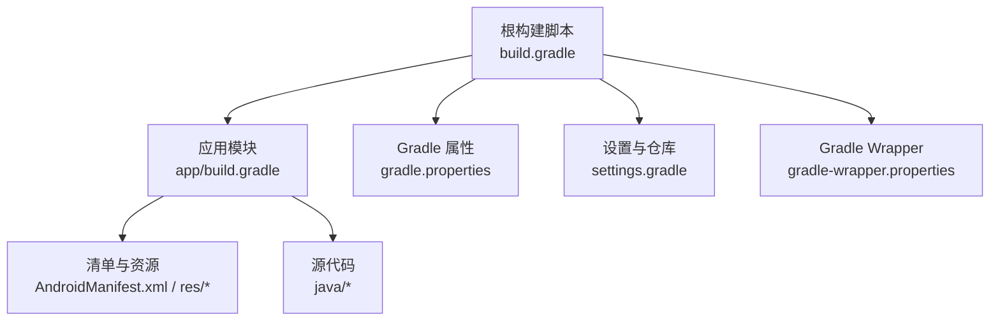
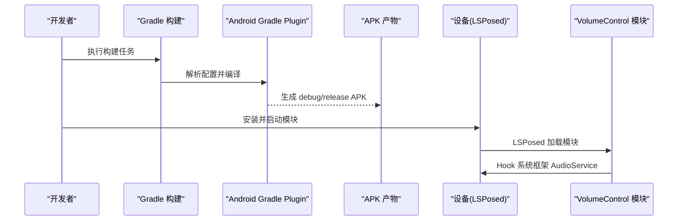
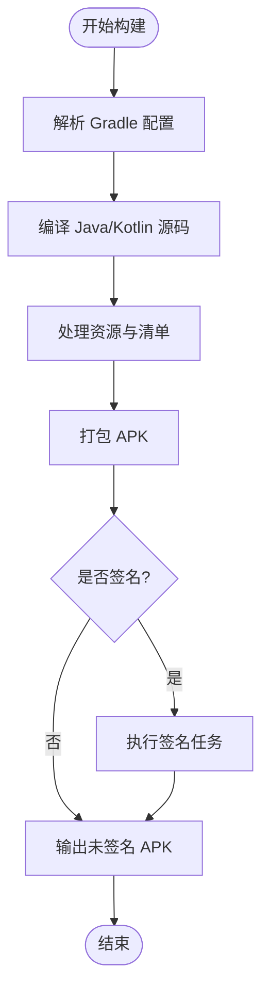
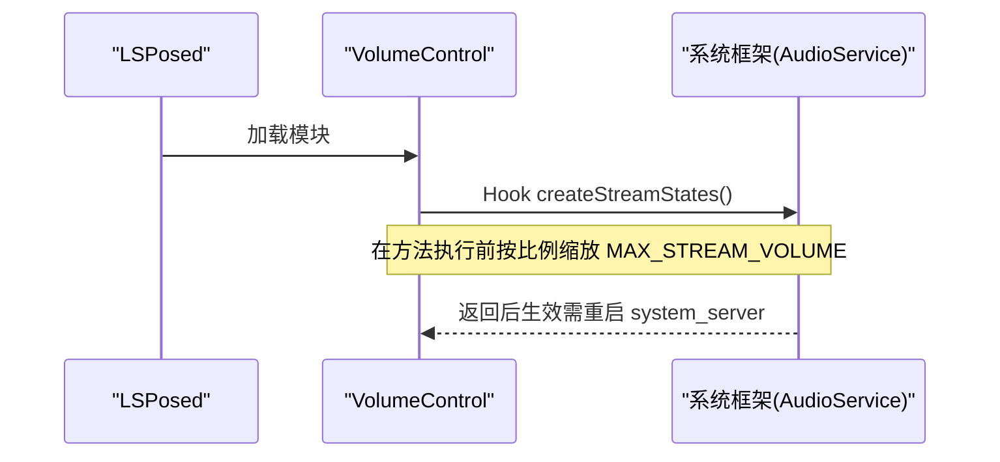
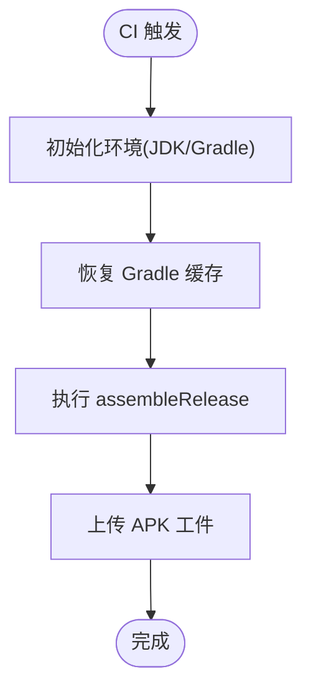
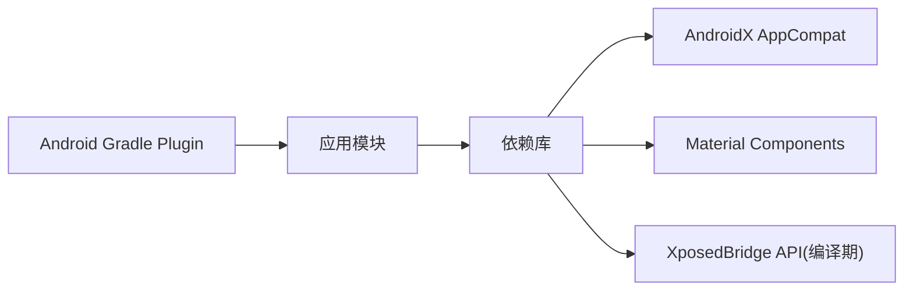

# 构建与部署

<cite>
**本文引用的文件**
- [build.gradle](file://build.gradle)
- [app/build.gradle](file://app/build.gradle)
- [settings.gradle](file://settings.gradle)
- [gradle.properties](file://gradle.properties)
- [gradle/wrapper/gradle-wrapper.properties](file://gradle/wrapper/gradle-wrapper.properties)
- [AndroidManifest.xml](file://app/src/main/AndroidManifest.xml)
- [arrays.xml](file://app/src/main/res/values/arrays.xml)
- [strings.xml](file://app/src/main/res/values/strings.xml)
- [XposedEntry.java](file://app/src/main/java/com/xiefeihong/volumecontrol/XposedEntry.java)
</cite>

## 目录
1. [简介](#简介)
2. [项目结构](#项目结构)
3. [核心组件](#核心组件)
4. [架构总览](#架构总览)
5. [详细组件分析](#详细组件分析)
6. [依赖分析](#依赖分析)
7. [性能考虑](#性能考虑)
8. [故障排查指南](#故障排查指南)
9. [结论](#结论)
10. [附录](#附录)

## 简介
本文件面向本项目的构建系统与部署流程，重点说明：
- Gradle 构建脚本的关键配置项（编译参数、签名、混淆）
- 构建类型差异（debug 与 release）
- APK 打包流程（手动命令与 IDE 集成）
- LSPosed 模块部署要求（模块元数据、作用域、权限）
- CI/CD 自动化构建示例
- 构建优化技巧与常见问题解决方案

本项目是一个基于 Android 的 LSPosed/Xposed 模块应用，通过 Hook 系统框架 AudioService 来调整各音频流的音量档位数，并提供用户界面进行配置。

## 项目结构
- 根级构建脚本定义 Android Gradle Plugin 版本与全局仓库策略
- app 模块包含所有业务代码、资源与清单
- 使用 AndroidX 与 Material Components
- 通过 XposedBridge 旧版 API 在编译期引用，运行期由 LSPosed 提供

**图表来源**
- [build.gradle:1-4](file://build.gradle#L1-L4)
- [app/build.gradle:1-44](file://app/build.gradle#L1-L44)
- [settings.gradle:1-21](file://settings.gradle#L1-L21)
- [gradle.properties:1-6](file://gradle.properties#L1-L6)
- [gradle/wrapper/gradle-wrapper.properties:1-8](file://gradle/wrapper/gradle-wrapper.properties#L1-L8)

**章节来源**
- [build.gradle:1-4](file://build.gradle#L1-L4)
- [app/build.gradle:1-44](file://app/build.gradle#L1-L44)
- [settings.gradle:1-21](file://settings.gradle#L1-L21)
- [gradle.properties:1-6](file://gradle.properties#L1-L6)
- [gradle/wrapper/gradle-wrapper.properties:1-8](file://gradle/wrapper/gradle-wrapper.properties#L1-L8)

## 核心组件
- 构建插件与版本：Android Gradle Plugin 8.7.1，Java 17 兼容
- 编译目标：compileSdk/targetSdk 35，minSdk 26
- 功能特性：启用 ViewBinding 与 BuildConfig
- 构建类型：仅定义 release，未开启混淆
- 依赖管理：Google/MavenCentral 及 Xposed 旧版 API 仓库
- 模块声明：在清单中声明为 Xposed/LSPosed 模块，作用域为系统框架

**章节来源**
- [app/build.gradle:5-35](file://app/build.gradle#L5-L35)
- [settings.gradle:9-17](file://settings.gradle#L9-L17)
- [AndroidManifest.xml:21-36](file://app/src/main/AndroidManifest.xml#L21-L36)

## 架构总览
下图展示从 Gradle 到 APK 的构建链路，以及 LSPosed 模块在系统中的加载关系。

**图表来源**
- [app/build.gradle:5-35](file://app/build.gradle#L5-L35)
- [AndroidManifest.xml:21-36](file://app/src/main/AndroidManifest.xml#L21-L36)
- [XposedEntry.java:41-65](file://app/src/main/java/com/xiefeihong/volumecontrol/XposedEntry.java#L41-L65)

## 详细组件分析

### Gradle 构建脚本与配置
- 根构建脚本：声明 Android Gradle Plugin 版本
- 应用模块脚本：
  - 命名空间、SDK 版本、默认配置（applicationId、minSdk、targetSdk、versionCode、versionName）
  - 构建特性：ViewBinding、BuildConfig
  - 编译选项：Java 17 源与目标兼容性
  - 构建类型：release 已定义但未启用混淆
  - Lint：不中断构建
- 设置与仓库：
  - 统一仓库策略，启用 Google/MavenCentral，额外添加 Xposed 旧版 API 仓库
- Gradle 属性：
  - JVM 内存、并行构建、缓存、AndroidX 开关、非传递 RClass
- Wrapper：
  - 指定 Gradle 分发地址与网络超时

**图表来源**
- [build.gradle:1-4](file://build.gradle#L1-L4)
- [app/build.gradle:5-35](file://app/build.gradle#L5-L35)
- [settings.gradle:9-17](file://settings.gradle#L9-L17)
- [gradle.properties:1-6](file://gradle.properties#L1-L6)
- [gradle/wrapper/gradle-wrapper.properties:1-8](file://gradle/wrapper/gradle-wrapper.properties#L1-L8)

**章节来源**
- [build.gradle:1-4](file://build.gradle#L1-L4)
- [app/build.gradle:5-35](file://app/build.gradle#L5-L35)
- [settings.gradle:9-17](file://settings.gradle#L9-L17)
- [gradle.properties:1-6](file://gradle.properties#L1-L6)
- [gradle/wrapper/gradle-wrapper.properties:1-8](file://gradle/wrapper/gradle-wrapper.properties#L1-L8)

### 构建类型与差异（debug vs release）
- 当前仅定义了 release 构建类型，且未启用混淆（minifyEnabled false）
- 未显式定义 debug 构建类型时，Gradle 会提供默认 debug 配置（可调试、未签名）
- 建议：
  - 在 release 中启用混淆与资源压缩以减小体积
  - 配置签名信息（本地或 CI 密钥库），避免发布失败
  - 针对不同渠道或环境使用 flavor 扩展

**章节来源**
- [app/build.gradle:27-31](file://app/build.gradle#L27-L31)

### APK 打包流程
- 手动构建：
  - 使用 Gradle Wrapper 执行 assembleDebug 或 assembleRelease
  - 产物位于 app/build/outputs/apk/ 对应目录下
- IDE 集成：
  - 在 Android Studio 中选择 Build Variants 切换构建类型
  - 使用 Build > Build Bundle(s)/APK(s) 生成产物
- 签名：
  - 建议在 module 级别 buildTypes.release 中配置 signingConfig
  - 生产环境建议使用独立密钥库并通过环境变量注入

**章节来源**
- [app/build.gradle:27-31](file://app/build.gradle#L27-L31)

### LSPosed 模块部署要求
- 模块元数据：
  - xposedmodule=true
  - xposeddescription 指向字符串资源
  - xposedminversion=93（最低支持的 Xposed 版本）
  - xposedscope 引用数组资源，限定作用域为系统框架包名 android
  - xposedsharedprefs=true（允许使用共享偏好）
- 权限与能力：
  - 模块通过 XposedBridge 在运行时 Hook 系统框架，无需额外 Android 权限
  - 需要 root 与 LSPosed 环境，并在 LSPosed 中启用模块与作用域
- 入口类：
  - XposedEntry 实现 IXposedHookLoadPackage，针对系统框架包名进行 Hook
  - 在 AudioService.createStreamStates 前缩放 MAX_STREAM_VOLUME 数组，从而改变音量档位

**图表来源**
- [AndroidManifest.xml:21-36](file://app/src/main/AndroidManifest.xml#L21-L36)
- [arrays.xml:3-5](file://app/src/main/res/values/arrays.xml#L3-L5)
- [XposedEntry.java:41-65](file://app/src/main/java/com/xiefeihong/volumecontrol/XposedEntry.java#L41-L65)

**章节来源**
- [AndroidManifest.xml:21-36](file://app/src/main/AndroidManifest.xml#L21-L36)
- [arrays.xml:3-5](file://app/src/main/res/values/arrays.xml#L3-L5)
- [strings.xml:28-38](file://app/src/main/res/values/strings.xml#L28-L38)
- [XposedEntry.java:41-65](file://app/src/main/java/com/xiefeihong/volumecontrol/XposedEntry.java#L41-L65)

### 自动化构建脚本示例（CI/CD）
以下示例适用于 GitHub Actions 等 CI 平台，演示如何安装依赖、执行构建与上传产物：
- 步骤要点：
  - 设置 JDK 17（与 compileOptions 一致）
  - 缓存 Gradle 依赖与构建缓存
  - 执行 assembleRelease
  - 将 APK 作为工件上传
- 注意：
  - 若启用混淆与签名，需在 CI 中配置密钥库与签名信息（通过环境变量注入）
  - 如需多 ABI 或多 flavor，可在命令中追加参数

[此图为概念性流程图，不直接映射具体源码文件]

### 构建优化技巧
- 启用并行与缓存：
  - gradle.properties 已启用 org.gradle.parallel=true 与 org.gradle.caching=true
  - 合理设置 JVM 内存（org.gradle.jvmargs）
- 减少构建时间：
  - 使用增量编译与配置缓存
  - 避免不必要的资源处理
- 产物优化：
  - 在 release 中启用混淆与资源压缩
  - 移除无用依赖与资源
- 稳定性：
  - 固定 Gradle 与 AGP 版本（Wrapper 与根脚本）
  - 统一仓库策略，避免冲突

**章节来源**
- [gradle.properties:1-6](file://gradle.properties#L1-L6)
- [gradle/wrapper/gradle-wrapper.properties:1-8](file://gradle/wrapper/gradle-wrapper.properties#L1-L8)
- [app/build.gradle:27-35](file://app/build.gradle#L27-L35)

### 常见问题与解决方案
- 构建失败：
  - 检查 JDK 版本是否与 compileOptions 一致（Java 17）
  - 确认 Gradle Wrapper 版本与 AGP 兼容
- 依赖下载缓慢：
  - 使用国内镜像或代理（Wrapper 已配置腾讯云镜像）
- 模块无法加载：
  - 确保 LSPosed 已安装并启用模块
  - 检查清单中的模块元数据与作用域是否正确
- 配置未生效：
  - 修改档位后需软重启系统框架（system_server）才能生效

**章节来源**
- [gradle/wrapper/gradle-wrapper.properties:1-8](file://gradle/wrapper/gradle-wrapper.properties#L1-L8)
- [AndroidManifest.xml:21-36](file://app/src/main/AndroidManifest.xml#L21-L36)
- [strings.xml:28-38](file://app/src/main/res/values/strings.xml#L28-L38)
- [XposedEntry.java:41-65](file://app/src/main/java/com/xiefeihong/volumecontrol/XposedEntry.java#L41-L65)

## 依赖分析
- 插件与工具链：
  - Android Gradle Plugin 8.7.1
  - Java 17 编译目标
- 第三方依赖：
  - AndroidX AppCompat、Material Components
  - XposedBridge 旧版 API（仅编译期）
- 仓库策略：
  - Google、MavenCentral、Xposed 旧版 API 仓库

**图表来源**
- [build.gradle:1-4](file://build.gradle#L1-L4)
- [app/build.gradle:38-43](file://app/build.gradle#L38-L43)
- [settings.gradle:9-17](file://settings.gradle#L9-L17)

**章节来源**
- [build.gradle:1-4](file://build.gradle#L1-L4)
- [app/build.gradle:38-43](file://app/build.gradle#L38-L43)
- [settings.gradle:9-17](file://settings.gradle#L9-L17)

## 性能考虑
- 构建性能：
  - 启用并行与缓存，合理设置 JVM 内存
  - 使用稳定的 Gradle 与 AGP 版本，避免频繁升级带来的不稳定
- 运行时性能：
  - Hook 逻辑仅在系统框架初始化时执行一次，影响有限
  - 避免在 Hook 中执行耗时操作

[本节为通用指导，不直接分析具体文件]

## 故障排查指南
- 构建阶段：
  - 检查 JDK 版本与 Gradle 版本匹配
  - 清理缓存后重试（./gradlew clean）
- 模块加载：
  - 确认 LSPosed 已安装并启用模块
  - 检查清单中的模块元数据与作用域
- 配置生效：
  - 修改档位后需软重启系统框架
  - 查看日志定位问题（XposedBridge.log）

**章节来源**
- [AndroidManifest.xml:21-36](file://app/src/main/AndroidManifest.xml#L21-L36)
- [XposedEntry.java:41-65](file://app/src/main/java/com/xiefeihong/volumecontrol/XposedEntry.java#L41-L65)
- [strings.xml:28-38](file://app/src/main/res/values/strings.xml#L28-L38)

## 结论
本项目采用标准 Android 构建体系，结合 LSPosed/Xposed 技术实现系统级音量档位控制。构建脚本简洁清晰，便于扩展与自动化。建议在 release 中完善签名与混淆配置，并结合 CI/CD 实现持续集成与交付。模块部署需确保 LSPosed 环境与正确的作用域配置，修改后需软重启系统框架以生效。

## 附录
- 常用构建命令（示例）：
  - 构建 debug：./gradlew assembleDebug
  - 构建 release：./gradlew assembleRelease
  - 清理构建：./gradlew clean
- 关键配置位置：
  - 构建类型与混淆：app/build.gradle
  - 仓库与插件：settings.gradle、build.gradle
  - 模块元数据：AndroidManifest.xml
  - 作用域数组：res/values/arrays.xml

[本节为补充信息，不直接分析具体文件]