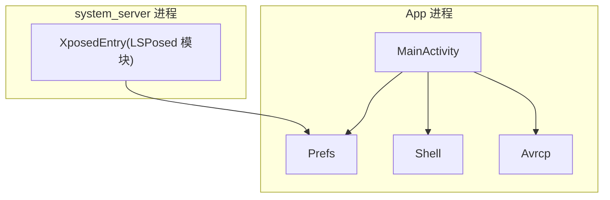
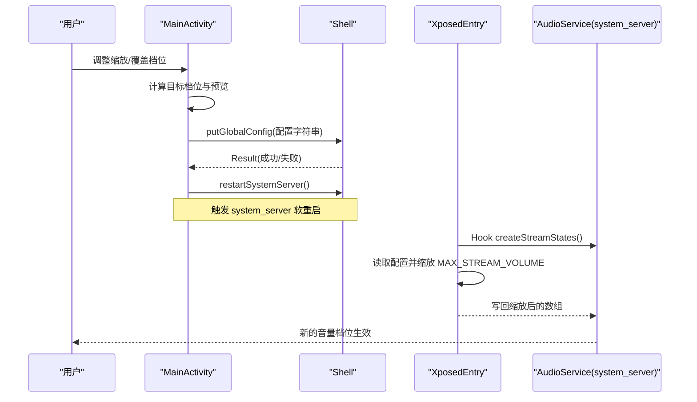
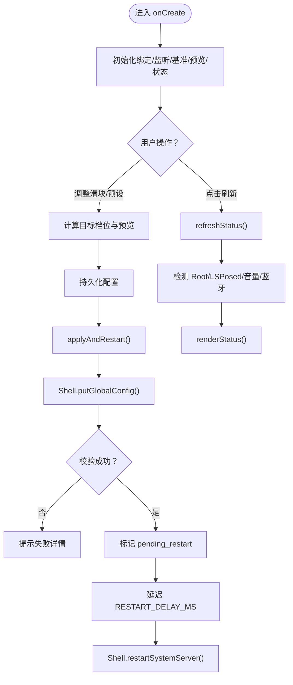
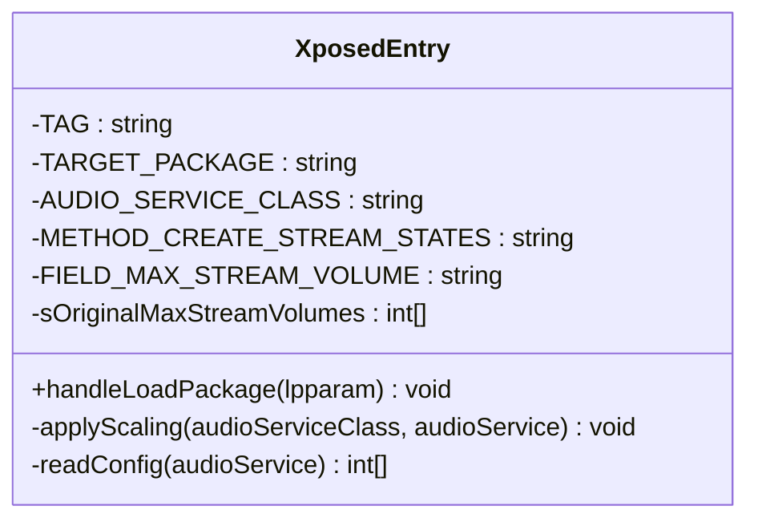
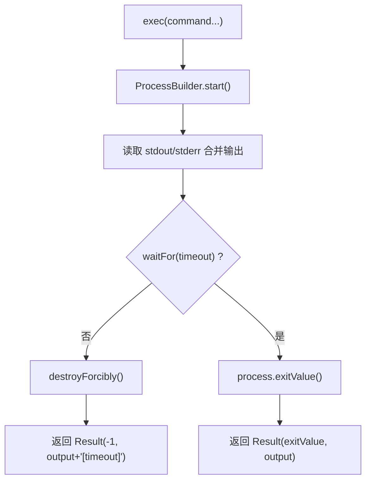
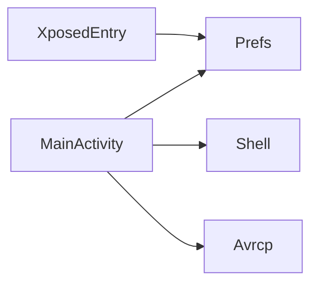

# 调试与测试

<cite>
**本文引用的文件**   
- [MainActivity.java](file://app/src/main/java/com/xiefeihong/volumecontrol/MainActivity.java)
- [XposedEntry.java](file://app/src/main/java/com/xiefeihong/volumecontrol/XposedEntry.java)
- [Shell.java](file://app/src/main/java/com/xiefeihong/volumecontrol/Shell.java)
- [Prefs.java](file://app/src/main/java/com/xiefeihong/volumecontrol/Prefs.java)
- [Avrcp.java](file://app/src/main/java/com/xiefeihong/volumecontrol/Avrcp.java)
- [AndroidManifest.xml](file://app/src/main/AndroidManifest.xml)
- [app/build.gradle](file://app/build.gradle)
</cite>

## 目录
1. [引言](#引言)
2. [项目结构](#项目结构)
3. [核心组件](#核心组件)
4. [架构总览](#架构总览)
5. [详细组件分析](#详细组件分析)
6. [依赖关系分析](#依赖关系分析)
7. [性能与内存注意事项](#性能与内存注意事项)
8. [调试指南](#调试指南)
9. [测试指南](#测试指南)
10. [故障排查](#故障排查)
11. [结论](#结论)

## 引言
本指南面向 Android Studio 开发者，围绕音量控制应用及其 LSPosed/Xposed Hook 模块，提供从断点、日志、调用栈到单元测试与集成测试的完整实践。重点覆盖：
- Android Studio 调试工具使用（断点、变量查看、调用栈）
- 日志输出策略（Logcat 过滤、自定义级别、性能监控）
- Xposed/LSPosed Hook 调试（模块加载、系统服务调试）
- 单元测试编写（Mock、用例设计）
- 集成测试方法（模拟 Root、测试音量控制）
- 性能分析与内存泄漏检测

## 项目结构
该项目为 Android 应用 + LSPosed 模块的组合：
- app 模块包含主界面、配置持久化、Root Shell 执行、蓝牙 AVRCP 映射计算等逻辑。
- XposedEntry 作为 LSPosed 模块入口，Hook system_server 中的 AudioService，修改音频流档位上限数组。
- Prefs 同时被 App 进程与 Hook 端共享，负责配置序列化与常量定义。
- Shell 封装 su 命令执行、Root 检测、Magisk/LSPosed 检测、Settings.Global 读写与 system_server 软重启。
- MainActivity 负责 UI、配置预览、状态检测与触发系统框架软重启。
- Avrcp 提供蓝牙绝对音量映射与预览文本生成。

图表来源
- [MainActivity.java:26-50](file://app/src/main/java/com/xiefeihong/volumecontrol/MainActivity.java#L26-L50)
- [XposedEntry.java:29-65](file://app/src/main/java/com/xiefeihong/volumecontrol/XposedEntry.java#L29-L65)
- [Prefs.java:12-47](file://app/src/main/java/com/xiefeihong/volumecontrol/Prefs.java#L12-L47)
- [Shell.java:13-38](file://app/src/main/java/com/xiefeihong/volumecontrol/Shell.java#L13-L38)
- [Avrcp.java:20-31](file://app/src/main/java/com/xiefeihong/volumecontrol/Avrcp.java#L20-L31)

章节来源
- [MainActivity.java:26-50](file://app/src/main/java/com/xiefeihong/volumecontrol/MainActivity.java#L26-L50)
- [AndroidManifest.xml:21-36](file://app/src/main/AndroidManifest.xml#L21-L36)
- [app/build.gradle:38-43](file://app/build.gradle#L38-L43)

## 核心组件
- MainActivity：UI 交互、配置计算与预览、状态检测、触发系统框架软重启。
- XposedEntry：LSPosed 模块入口，Hook AudioService.createStreamStates，按比例缩放 MAX_STREAM_VOLUME 数组。
- Shell：Root shell 执行、环境检测、Settings.Global 读写、system_server 软重启。
- Prefs：配置常量、序列化/反序列化、基准音量存储。
- Avrcp：蓝牙 AVRCP 绝对音量映射与预览文本生成。

章节来源
- [MainActivity.java:26-50](file://app/src/main/java/com/xiefeihong/volumecontrol/MainActivity.java#L26-L50)
- [XposedEntry.java:29-65](file://app/src/main/java/com/xiefeihong/volumecontrol/XposedEntry.java#L29-L65)
- [Shell.java:13-38](file://app/src/main/java/com/xiefeihong/volumecontrol/Shell.java#L13-L38)
- [Prefs.java:12-47](file://app/src/main/java/com/xiefeihong/volumecontrol/Prefs.java#L12-L47)
- [Avrcp.java:20-31](file://app/src/main/java/com/xiefeihong/volumecontrol/Avrcp.java#L20-L31)

## 架构总览
整体流程：用户在 MainActivity 中调整音量缩放比例与媒体覆盖档位；应用将配置写入 SharedPreferences 与 Settings.Global；Hook 端在 system_server 启动时读取配置并修改 AudioService 的 MAX_STREAM_VOLUME 数组；随后通过 Shell 软重启 system_server 使新档位生效。

图表来源
- [MainActivity.java:262-296](file://app/src/main/java/com/xiefeihong/volumecontrol/MainActivity.java#L262-L296)
- [Shell.java:96-112](file://app/src/main/java/com/xiefeihong/volumecontrol/Shell.java#L96-L112)
- [XposedEntry.java:42-65](file://app/src/main/java/com/xiefeihong/volumecontrol/XposedEntry.java#L42-L65)
- [XposedEntry.java:67-114](file://app/src/main/java/com/xiefeihong/volumecontrol/XposedEntry.java#L67-L114)

## 详细组件分析

### MainActivity 分析
职责：
- 初始化 UI、监听器、采集基准音量、加载配置、更新预览、刷新状态。
- 计算目标档位（与 Hook 端算法一致），支持媒体覆盖档位。
- 持久化配置、写入 Settings.Global、触发 system_server 软重启。
- 检测 Root、LSPosed、当前媒体最大档位、蓝牙设备摘要。

关键流程：
- 首次启动确保 baselineVolumes 存在，否则采集。
- 用户交互触发 persistToPrefs 与 updatePreview。
- applyAndRestart 将配置写入 Settings.Global 并校验，成功后标记 pending_restart 并延迟重启。
- refreshStatus 异步检测环境并渲染状态。

图表来源
- [MainActivity.java:38-50](file://app/src/main/java/com/xiefeihong/volumecontrol/MainActivity.java#L38-L50)
- [MainActivity.java:123-141](file://app/src/main/java/com/xiefeihong/volumecontrol/MainActivity.java#L123-L141)
- [MainActivity.java:175-231](file://app/src/main/java/com/xiefeihong/volumecontrol/MainActivity.java#L175-L231)
- [MainActivity.java:262-296](file://app/src/main/java/com/xiefeihong/volumecontrol/MainActivity.java#L262-L296)
- [MainActivity.java:300-366](file://app/src/main/java/com/xiefeihong/volumecontrol/MainActivity.java#L300-L366)

章节来源
- [MainActivity.java:26-50](file://app/src/main/java/com/xiefeihong/volumecontrol/MainActivity.java#L26-L50)
- [MainActivity.java:123-141](file://app/src/main/java/com/xiefeihong/volumecontrol/MainActivity.java#L123-L141)
- [MainActivity.java:175-231](file://app/src/main/java/com/xiefeihong/volumecontrol/MainActivity.java#L175-L231)
- [MainActivity.java:262-296](file://app/src/main/java/com/xiefeihong/volumecontrol/MainActivity.java#L262-L296)
- [MainActivity.java:300-366](file://app/src/main/java/com/xiefeihong/volumecontrol/MainActivity.java#L300-L366)

### XposedEntry 分析
职责：
- 实现 IXposedHookLoadPackage，仅对 android 包名生效。
- Hook AudioService.createStreamStates，在 beforeHookedMethod 中调用 applyScaling。
- applyScaling 读取配置，按百分比或媒体覆盖档位缩放 MAX_STREAM_VOLUME 数组。
- readConfig 优先从 Settings.Global 读取，失败回退到 XSharedPreferences。

关键点：
- 使用 XposedBridge.log 输出调试信息。
- 原地修改 final 字段数组元素以兼容 final 限制。
- 仅在首次备份原始数组长度，避免重复缩放。

图表来源
- [XposedEntry.java:29-65](file://app/src/main/java/com/xiefeihong/volumecontrol/XposedEntry.java#L29-L65)
- [XposedEntry.java:67-114](file://app/src/main/java/com/xiefeihong/volumecontrol/XposedEntry.java#L67-L114)
- [XposedEntry.java:122-146](file://app/src/main/java/com/xiefeihong/volumecontrol/XposedEntry.java#L122-L146)

章节来源
- [XposedEntry.java:29-65](file://app/src/main/java/com/xiefeihong/volumecontrol/XposedEntry.java#L29-L65)
- [XposedEntry.java:67-114](file://app/src/main/java/com/xiefeihong/volumecontrol/XposedEntry.java#L67-L114)
- [XposedEntry.java:122-146](file://app/src/main/java/com/xiefeihong/volumecontrol/XposedEntry.java#L122-L146)

### Shell 分析
职责：
- 封装 ProcessBuilder 执行命令，合并 stdout/stderr，超时处理，返回 Result(code, output)。
- 提供 isRootAvailable、isLsposedPresent、isMagiskPresent 检测方法。
- 提供 Settings.Global 读写与 system_server 软重启。

注意：
- 所有方法阻塞当前线程，应在后台线程调用。
- 超时默认 20 秒，失败返回 -1 并附带错误信息。

图表来源
- [Shell.java:41-72](file://app/src/main/java/com/xiefeihong/volumecontrol/Shell.java#L41-L72)

章节来源
- [Shell.java:13-38](file://app/src/main/java/com/xiefeihong/volumecontrol/Shell.java#L13-L38)
- [Shell.java:41-72](file://app/src/main/java/com/xiefeihong/volumecontrol/Shell.java#L41-L72)
- [Shell.java:74-112](file://app/src/main/java/com/xiefeihong/volumecontrol/Shell.java#L74-L112)

### Prefs 分析
职责：
- 定义 SharedPreferences 文件名、Settings.Global 键、配置键、常量（缩放范围、媒体索引、AVRCP 上限、非媒体上限、流数量）。
- 提供 encodeConfig/decodeConfig、joinInts/parseInts、getOr 安全取值。

注意：
- 该类同时被 App 进程与 Hook 端使用，不能引用任何 Xposed API。

章节来源
- [Prefs.java:12-47](file://app/src/main/java/com/xiefeihong/volumecontrol/Prefs.java#L12-L47)
- [Prefs.java:52-82](file://app/src/main/java/com/xiefeihong/volumecontrol/Prefs.java#L52-L82)
- [Prefs.java:84-122](file://app/src/main/java/com/xiefeihong/volumecontrol/Prefs.java#L84-L122)

### Avrcp 分析
职责：
- 提供 toAbsoluteVolume 换算公式（与 AOSP 蓝牙模块一致）。
- countDuplicatePairs 统计相邻档位映射相同的情况。
- buildPreview 生成蓝牙档位映射预览文本。

章节来源
- [Avrcp.java:20-31](file://app/src/main/java/com/xiefeihong/volumecontrol/Avrcp.java#L20-L31)
- [Avrcp.java:33-42](file://app/src/main/java/com/xiefeihong/volumecontrol/Avrcp.java#L33-L42)
- [Avrcp.java:44-88](file://app/src/main/java/com/xiefeihong/volumecontrol/Avrcp.java#L44-L88)

## 依赖关系分析
- MainActivity 依赖 Prefs（配置）、Shell（Root/设置/重启）、Avrcp（蓝牙预览）。
- XposedEntry 依赖 Prefs（配置常量与解析）、Xposed API（编译期依赖，运行期由 LSPosed 提供）。
- Shell 不依赖其他业务类，仅使用 Java IO 与 ProcessBuilder。
- Prefs 不依赖任何外部库，保证跨进程可用。
- Avrcp 仅依赖 Prefs 常量。

图表来源
- [MainActivity.java:26-50](file://app/src/main/java/com/xiefeihong/volumecontrol/MainActivity.java#L26-L50)
- [XposedEntry.java:29-65](file://app/src/main/java/com/xiefeihong/volumecontrol/XposedEntry.java#L29-L65)
- [app/build.gradle:38-43](file://app/build.gradle#L38-L43)

章节来源
- [app/build.gradle:38-43](file://app/build.gradle#L38-L43)
- [AndroidManifest.xml:21-36](file://app/src/main/AndroidManifest.xml#L21-L36)

## 性能与内存注意事项
- MainActivity 使用单线程 ExecutorService 串行执行 root/系统查询操作，避免并发竞争；onDestroy 中关闭线程池。
- Shell.exec 默认超时 20 秒，防止长时间阻塞；失败时 destroyForcibly 释放资源。
- XposedEntry 在 Hook 前备份原始数组长度，避免重复缩放导致累积误差。
- Avrcp 构建预览文本时使用 StringBuilder，减少字符串拼接开销。

建议：
- 在高频 UI 更新场景下，避免在主线程执行耗时操作（已使用 Handler 切回主线程）。
- 对 Settings.Global 读写进行重试与校验，避免网络/权限抖动导致失败。
- 对蓝牙设备枚举结果做缓存，减少频繁 I/O。

章节来源
- [MainActivity.java:34-36](file://app/src/main/java/com/xiefeihong/volumecontrol/MainActivity.java#L34-L36)
- [MainActivity.java:52-56](file://app/src/main/java/com/xiefeihong/volumecontrol/MainActivity.java#L52-L56)
- [Shell.java:15-16](file://app/src/main/java/com/xiefeihong/volumecontrol/Shell.java#L15-L16)
- [Shell.java:60-72](file://app/src/main/java/com/xiefeihong/volumecontrol/Shell.java#L60-L72)
- [XposedEntry.java:94-97](file://app/src/main/java/com/xiefeihong/volumecontrol/XposedEntry.java#L94-L97)
- [Avrcp.java:49-88](file://app/src/main/java/com/xiefeihong/volumecontrol/Avrcp.java#L49-L88)

## 调试指南

### Android Studio 调试工具使用
- 断点设置：
  - 在 MainActivity.applyAndRestart、Shell.exec、XposedEntry.applyScaling 处设置断点，观察配置写入与 Hook 行为。
  - 在 MainActivity.refreshStatus 处设置条件断点，仅当 Root 不可用时触发，快速定位环境问题。
- 变量查看：
  - 在 applyScaling 中查看 sOriginalMaxStreamVolumes 与 maxStreamVolumes 的变化，确认缩放是否正确。
  - 在 Shell.exec 中查看 output 与 code，判断命令执行是否成功。
- 调用栈分析：
  - 在 XposedEntry.handleLoadPackage 中断点，查看 LSPosed 模块加载路径与 Hook 时机。
  - 在 MainActivity.restartSystemServer 中断点，确认 system_server 软重启触发链。

### 日志输出策略
- Logcat 过滤：
  - 过滤 tag “VolumeSteps:” 查看 XposedEntry 的日志。
  - 过滤 “Toast” 或自定义标签（如需扩展）查看 UI 反馈。
- 自定义日志级别：
  - 建议在 Shell.exec 与 applyScaling 中加入更细粒度的日志（如 DEBUG/INFO/WARN），便于区分正常流程与异常分支。
- 性能监控：
  - 使用 Android Studio Profiler 观察 CPU/内存曲线，重点关注 applyAndRestart 与 refreshStatus 的执行时间。
  - 对 Bluetooth 设备枚举与 Settings.Global 读写进行耗时统计，必要时引入缓存。

### 调试 Xposed Hook 代码
- 模块加载问题排查：
  - 检查 AndroidManifest.xml 中的 xposedmodule、xposeddescription、xposedminversion、xposedscope、xposedsharedprefs 元数据是否正确。
  - 在 LSPosed Manager 中确认模块已启用且作用域包含 android 包。
  - 查看 Logcat 中 “VolumeSteps: hooked” 日志，确认 Hook 成功。
- 系统服务调试：
  - 在 XposedEntry.applyScaling 中打断点，验证配置读取与数组缩放逻辑。
  - 使用 adb shell dumpsys media.audio_flinger 或相关命令辅助验证音量档位变化（需 Root）。

章节来源
- [AndroidManifest.xml:21-36](file://app/src/main/AndroidManifest.xml#L21-L36)
- [XposedEntry.java:42-65](file://app/src/main/java/com/xiefeihong/volumecontrol/XposedEntry.java#L42-L65)
- [XposedEntry.java:67-114](file://app/src/main/java/com/xiefeihong/volumecontrol/XposedEntry.java#L67-L114)

## 测试指南

### 单元测试编写指南
- 测试目标：
  - Prefs.encodeConfig/decodeConfig 的正确性与边界值处理。
  - Avrcp.toAbsoluteVolume、countDuplicatePairs、buildPreview 的计算准确性。
  - Shell.exec 的超时与错误处理（可通过 Mock ProcessBuilder 或替换为测试替身）。
- Mock 对象使用：
  - 使用 Mockito 或 Robolectric 模拟 Android 上下文、SharedPreferences、AudioManager。
  - 对 Shell 层注入测试替身，避免真实 Root 环境依赖。
- 测试用例设计：
  - 针对 Prefs.decodeConfig 输入非法字符串、空值、越界索引等场景。
  - 针对 Avrcp.buildPreview 在不同 maxSteps 下的输出格式与重复对计数。
  - 针对 MainActivity.targetStreamSteps 的缩放与媒体覆盖逻辑。

示例测试结构（概念性）：
- TestPrefsEncodeDecode：验证配置序列化/反序列化往返一致性。
- TestAvrcpMapping：验证 toAbsoluteVolume 与 AOSP 公式一致，统计重复对数量。
- TestShellExec：验证超时、异常、返回值码与输出内容。

章节来源
- [Prefs.java:56-82](file://app/src/main/java/com/xiefeihong/volumecontrol/Prefs.java#L56-L82)
- [Prefs.java:84-122](file://app/src/main/java/com/xiefeihong/volumecontrol/Prefs.java#L84-L122)
- [Avrcp.java:25-42](file://app/src/main/java/com/xiefeihong/volumecontrol/Avrcp.java#L25-L42)
- [Avrcp.java:44-88](file://app/src/main/java/com/xiefeihong/volumecontrol/Avrcp.java#L44-L88)
- [Shell.java:41-72](file://app/src/main/java/com/xiefeihong/volumecontrol/Shell.java#L41-L72)

### 集成测试方法
- 模拟 Root 环境：
  - 使用 Magisk 或类似工具授予 su 权限，确保 Shell.isRootAvailable 返回 true。
  - 在测试设备上安装 LSPosed 并启用模块，验证 isLsposedPresent。
- 测试音量控制功能：
  - 在 MainActivity 中设置不同缩放比例与媒体覆盖档位，触发 applyAndRestart。
  - 通过 adb shell settings get global volume_steps_hook_config 校验配置写入。
  - 重启 system_server 后，观察实际媒体最大档位是否与目标一致。

章节来源
- [Shell.java:74-90](file://app/src/main/java/com/xiefeihong/volumecontrol/Shell.java#L74-L90)
- [Shell.java:96-112](file://app/src/main/java/com/xiefeihong/volumecontrol/Shell.java#L96-L112)
- [MainActivity.java:262-296](file://app/src/main/java/com/xiefeihong/volumecontrol/MainActivity.java#L262-L296)

## 故障排查
- Root 不可用：
  - 检查 su 是否授权，Shell.isRootAvailable 返回 false 时提示用户授予权限。
  - 在 Logcat 中查看 Shell.exec 的输出，确认命令执行失败原因。
- LSPosed 未加载：
  - 检查模块元数据与作用域，确认 LSPosed Manager 中模块已启用。
  - 查看 “VolumeSteps: hooked” 日志，若缺失则 Hook 失败。
- 配置未生效：
  - 检查 Settings.Global 写入与校验逻辑，确认 applyAndRestart 中 verified 为 true。
  - 确认 system_server 已软重启，XposedEntry.applyScaling 已执行。
- 蓝牙 AVRCP 映射异常：
  - 使用 Avrcp.buildPreview 检查相邻档位重复情况，调整媒体覆盖档位或缩放比例。

章节来源
- [Shell.java:74-90](file://app/src/main/java/com/xiefeihong/volumecontrol/Shell.java#L74-L90)
- [XposedEntry.java:42-65](file://app/src/main/java/com/xiefeihong/volumecontrol/XposedEntry.java#L42-L65)
- [MainActivity.java:262-296](file://app/src/main/java/com/xiefeihong/volumecontrol/MainActivity.java#L262-L296)
- [Avrcp.java:44-88](file://app/src/main/java/com/xiefeihong/volumecontrol/Avrcp.java#L44-L88)

## 结论
本指南围绕音量控制应用与 LSPosed 模块，提供了从调试到测试的全链路实践。通过合理设置断点、日志与调用栈分析，结合单元测试与集成测试，可有效保障功能正确性与稳定性。在实际开发中，建议持续优化日志粒度、引入性能监控与内存泄漏检测工具，以提升用户体验与系统可靠性。