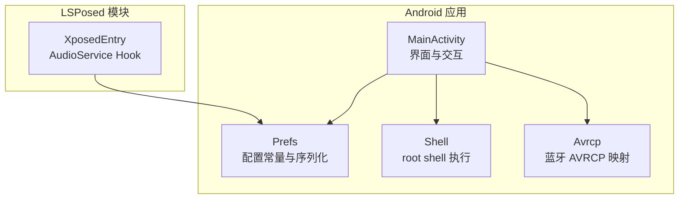
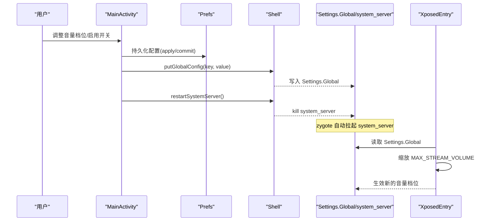
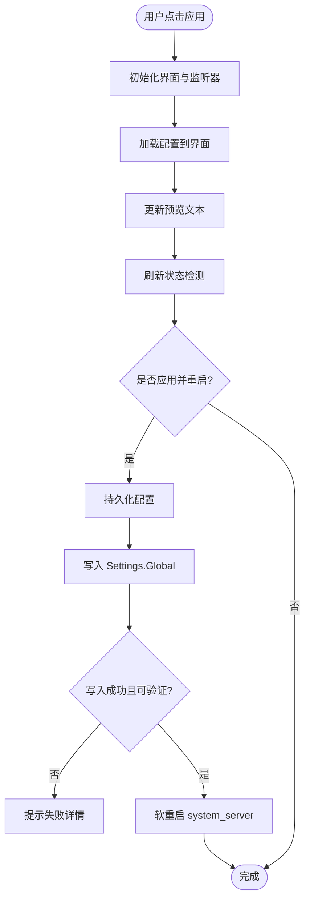
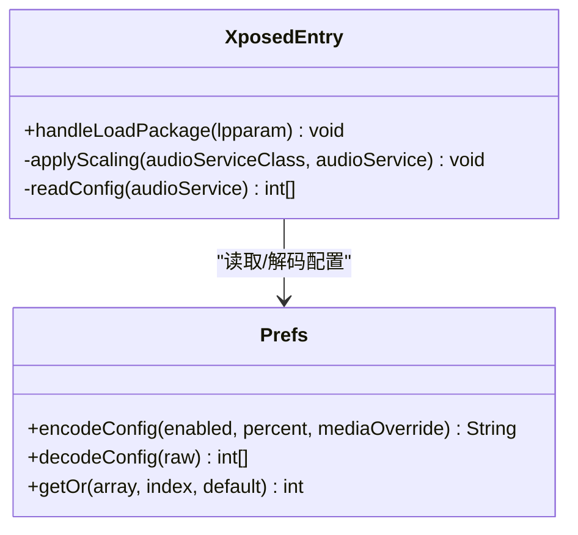
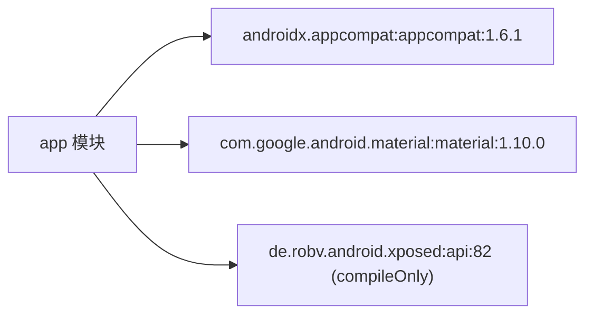

# 贡献指南

<cite>
**本文引用的文件**   
- [MainActivity.java](file://app/src/main/java/com/xiefeihong/volumecontrol/MainActivity.java)
- [XposedEntry.java](file://app/src/main/java/com/xiefeihong/volumecontrol/XposedEntry.java)
- [Shell.java](file://app/src/main/java/com/xiefeihong/volumecontrol/Shell.java)
- [Prefs.java](file://app/src/main/java/com/xiefeihong/volumecontrol/Prefs.java)
- [Avrcp.java](file://app/src/main/java/com/xiefeihong/volumecontrol/Avrcp.java)
- [app/build.gradle](file://app/build.gradle)
- [build.gradle](file://build.gradle)
- [settings.gradle](file://settings.gradle)
- [gradle.properties](file://gradle.properties)
</cite>

## 目录
1. [引言](#引言)
2. [项目结构](#项目结构)
3. [核心组件](#核心组件)
4. [架构总览](#架构总览)
5. [详细组件分析](#详细组件分析)
6. [依赖关系分析](#依赖关系分析)
7. [性能与质量要求](#性能与质量要求)
8. [新功能开发指南](#新功能开发指南)
9. [文档更新要求](#文档更新要求)
10. [社区行为准则](#社区行为准则)
11. [问题报告模板](#问题报告模板)
12. [结论](#结论)

## 引言
本贡献指南面向希望参与音量控制项目的开发者，目标是统一分支管理、提交流程、代码审查与质量标准，并给出新功能开发与文档维护的规范。该项目是一个 Android 应用 + LSPosed 模块的组合：应用负责采集系统基准、展示配置预览、写入 Settings.Global 并触发软重启；LSPosed 模块在 system_server 中拦截 AudioService 初始化过程，按比例缩放各音频流的档位上限，从而实现“音量档位数缩放”和“媒体流固定档位覆盖”。

## 项目结构
仓库采用标准 Android Gradle 工程结构，包含一个 app 模块与根构建脚本。关键目录与职责如下：
- app/src/main/java/com/xiefeihong/volumecontrol：核心 Java 源码，包含界面入口、Hook 入口、Shell 工具、配置常量与 AVRCP 映射计算。
- app/src/main/res：资源文件（布局、字符串、主题等）。
- app/build.gradle：Android 应用模块构建配置，包括命名空间、SDK 版本、编译选项、Lint 策略与依赖。
- build.gradle：根级插件声明。
- settings.gradle：仓库源与模块引入。
- gradle.properties：Gradle 运行参数与 AndroidX 开关。

**图表来源**
- [MainActivity.java:23-50](file://app/src/main/java/com/xiefeihong/volumecontrol/MainActivity.java#L23-L50)
- [Prefs.java:6-12](file://app/src/main/java/com/xiefeihong/volumecontrol/Prefs.java#L6-L12)
- [Shell.java:8-13](file://app/src/main/java/com/xiefeihong/volumecontrol/Shell.java#L8-L13)
- [Avrcp.java:3-19](file://app/src/main/java/com/xiefeihong/volumecontrol/Avrcp.java#L3-L19)
- [XposedEntry.java:16-28](file://app/src/main/java/com/xiefeihong/volumecontrol/XposedEntry.java#L16-L28)

**章节来源**
- [app/build.gradle:5-35](file://app/build.gradle#L5-L35)
- [settings.gradle:1-21](file://settings.gradle#L1-L21)
- [gradle.properties:1-6](file://gradle.properties#L1-L6)

## 核心组件
- MainActivity：主界面逻辑，负责监听用户操作、计算目标档位、持久化配置、写入 Settings.Global、触发软重启，以及刷新状态显示。
- XposedEntry：LSPosed 模块入口，拦截 AudioService.createStreamStates，按比例缩放 MAX_STREAM_VOLUME 数组，实现系统音量档位修改。
- Shell：root shell 执行封装，提供 su/exec、环境检测、Settings.Global 读写与 system_server 软重启能力。
- Prefs：跨进程共享的配置常量与序列化/反序列化工具，同时被 App 与 Hook 端使用。
- Avrcp：蓝牙 AVRCP 绝对音量映射计算与预览生成，帮助评估档位变化对蓝牙设备的影响。

**章节来源**
- [MainActivity.java:23-50](file://app/src/main/java/com/xiefeihong/volumecontrol/MainActivity.java#L23-L50)
- [XposedEntry.java:16-28](file://app/src/main/java/com/xiefeihong/volumecontrol/XposedEntry.java#L16-L28)
- [Shell.java:8-13](file://app/src/main/java/com/xiefeihong/volumecontrol/Shell.java#L8-L13)
- [Prefs.java:6-12](file://app/src/main/java/com/xiefeihong/volumecontrol/Prefs.java#L6-L12)
- [Avrcp.java:3-19](file://app/src/main/java/com/xiefeihong/volumecontrol/Avrcp.java#L3-L19)

## 架构总览
下图展示了从用户操作到系统生效的关键流程：用户在界面调整配置 → 应用持久化并写入 Settings.Global → Hook 端读取配置并缩放档位 → 软重启 system_server 使新档位生效。

**图表来源**
- [MainActivity.java:261-296](file://app/src/main/java/com/xiefeihong/volumecontrol/MainActivity.java#L261-L296)
- [Shell.java:92-112](file://app/src/main/java/com/xiefeihong/volumecontrol/Shell.java#L92-L112)
- [XposedEntry.java:41-65](file://app/src/main/java/com/xiefeihong/volumecontrol/XposedEntry.java#L41-L65)
- [XposedEntry.java:122-146](file://app/src/main/java/com/xiefeihong/volumecontrol/XposedEntry.java#L122-L146)

## 详细组件分析

### MainActivity 分析与流程
- 职责：界面初始化、监听器绑定、配置加载与校验、目标档位计算、预览更新、配置持久化、写入 Settings.Global、软重启、状态检测与渲染。
- 线程模型：使用单线程 Executor 串行执行 root/系统查询，避免并发竞争；通过 Handler 切回主线程更新 UI。
- 关键方法路径：
  - 配置持久化：[MainActivity.java:235-245](file://app/src/main/java/com/xiefeihong/volumecontrol/MainActivity.java#L235-L245)
  - 目标档位计算：[MainActivity.java:175-191](file://app/src/main/java/com/xiefeihong/volumecontrol/MainActivity.java#L175-L191)
  - 应用并重启：[MainActivity.java:261-296](file://app/src/main/java/com/xiefeihong/volumecontrol/MainActivity.java#L261-L296)
  - 状态刷新与渲染：[MainActivity.java:300-366](file://app/src/main/java/com/xiefeihong/volumecontrol/MainActivity.java#L300-L366)

**图表来源**
- [MainActivity.java:60-121](file://app/src/main/java/com/xiefeihong/volumecontrol/MainActivity.java#L60-L121)
- [MainActivity.java:235-296](file://app/src/main/java/com/xiefeihong/volumecontrol/MainActivity.java#L235-L296)

**章节来源**
- [MainActivity.java:23-50](file://app/src/main/java/com/xiefeihong/volumecontrol/MainActivity.java#L23-L50)
- [MainActivity.java:175-191](file://app/src/main/java/com/xiefeihong/volumecontrol/MainActivity.java#L175-L191)
- [MainActivity.java:261-296](file://app/src/main/java/com/xiefeihong/volumecontrol/MainActivity.java#L261-L296)
- [MainActivity.java:300-366](file://app/src/main/java/com/xiefeihong/volumecontrol/MainActivity.java#L300-L366)

### XposedEntry 分析与流程
- 职责：在 system_server 启动时拦截 AudioService.createStreamStates，按配置缩放 MAX_STREAM_VOLUME 数组，实现系统音量档位修改。
- 配置读取优先级：优先读取 Settings.Global（system_server 可访问），失败则回退到模块 SharedPreferences。
- 关键方法路径：
  - Hook 注册与日志：[XposedEntry.java:41-65](file://app/src/main/java/com/xiefeihong/volumecontrol/XposedEntry.java#L41-L65)
  - 缩放算法：[XposedEntry.java:67-114](file://app/src/main/java/com/xiefeihong/volumecontrol/XposedEntry.java#L67-L114)
  - 配置读取：[XposedEntry.java:122-146](file://app/src/main/java/com/xiefeihong/volumecontrol/XposedEntry.java#L122-L146)

**图表来源**
- [XposedEntry.java:41-65](file://app/src/main/java/com/xiefeihong/volumecontrol/XposedEntry.java#L41-L65)
- [XposedEntry.java:67-114](file://app/src/main/java/com/xiefeihong/volumecontrol/XposedEntry.java#L67-L114)
- [XposedEntry.java:122-146](file://app/src/main/java/com/xiefeihong/volumecontrol/XposedEntry.java#L122-L146)
- [Prefs.java:56-82](file://app/src/main/java/com/xiefeihong/volumecontrol/Prefs.java#L56-L82)

**章节来源**
- [XposedEntry.java:16-28](file://app/src/main/java/com/xiefeihong/volumecontrol/XposedEntry.java#L16-L28)
- [XposedEntry.java:41-65](file://app/src/main/java/com/xiefeihong/volumecontrol/XposedEntry.java#L41-L65)
- [XposedEntry.java:67-114](file://app/src/main/java/com/xiefeihong/volumecontrol/XposedEntry.java#L67-L114)
- [XposedEntry.java:122-146](file://app/src/main/java/com/xiefeihong/volumecontrol/XposedEntry.java#L122-L146)

### Shell 工具分析
- 职责：封装 su/exec 命令执行、超时处理、root/LSPosed/Magisk 检测、Settings.Global 读写、system_server 软重启。
- 关键方法路径：
  - exec/su：[Shell.java:35-72](file://app/src/main/java/com/xiefeihong/volumecontrol/Shell.java#L35-L72)
  - 环境检测：[Shell.java:74-90](file://app/src/main/java/com/xiefeihong/volumecontrol/Shell.java#L74-L90)
  - Settings.Global 读写：[Shell.java:92-103](file://app/src/main/java/com/xiefeihong/volumecontrol/Shell.java#L92-L103)
  - 软重启：[Shell.java:105-112](file://app/src/main/java/com/xiefeihong/volumecontrol/Shell.java#L105-L112)

**章节来源**
- [Shell.java:8-13](file://app/src/main/java/com/xiefeihong/volumecontrol/Shell.java#L8-L13)
- [Shell.java:35-72](file://app/src/main/java/com/xiefeihong/volumecontrol/Shell.java#L35-L72)
- [Shell.java:74-90](file://app/src/main/java/com/xiefeihong/volumecontrol/Shell.java#L74-L90)
- [Shell.java:92-112](file://app/src/main/java/com/xiefeihong/volumecontrol/Shell.java#L92-L112)

### Prefs 配置分析
- 职责：定义配置键、常量范围、序列化/反序列化、安全取值工具。
- 关键点：
  - 跨进程共享：App 与 Hook 端共用该类，不能引用 Xposed API。
  - 配置格式：Settings.Global 值以分号分隔的字符串；基准档位以逗号分隔的 CSV。
  - 关键常量：PERCENT_MIN/MAX/STEP/DEFAULT、STREAM_MUSIC_INDEX、AVRCP_MAX_VOLUME、OTHER_STREAM_MAX、STREAM_COUNT。
- 关键方法路径：
  - encode/decode：[Prefs.java:56-82](file://app/src/main/java/com/xiefeihong/volumecontrol/Prefs.java#L56-L82)
  - joinInts/parseInts：[Prefs.java:84-114](file://app/src/main/java/com/xiefeihong/volumecontrol/Prefs.java#L84-L114)
  - getOr：[Prefs.java:116-122](file://app/src/main/java/com/xiefeihong/volumecontrol/Prefs.java#L116-L122)

**章节来源**
- [Prefs.java:6-12](file://app/src/main/java/com/xiefeihong/volumecontrol/Prefs.java#L6-L12)
- [Prefs.java:14-47](file://app/src/main/java/com/xiefeihong/volumecontrol/Prefs.java#L14-L47)
- [Prefs.java:56-122](file://app/src/main/java/com/xiefeihong/volumecontrol/Prefs.java#L56-L122)

### Avrcp 映射分析
- 职责：计算蓝牙 AVRCP 绝对音量映射，统计重复映射对数，生成预览文本。
- 关键点：
  - 公式：absVolume = round(step * 127 / maxSteps)。
  - 当 maxSteps > 127 时会出现相邻档位映射到相同 AVRCP 音量的情况。
- 关键方法路径：
  - toAbsoluteVolume：[Avrcp.java:25-31](file://app/src/main/java/com/xiefeihong/volumecontrol/Avrcp.java#L25-L31)
  - countDuplicatePairs：[Avrcp.java:33-42](file://app/src/main/java/com/xiefeihong/volumecontrol/Avrcp.java#L33-L42)
  - buildPreview：[Avrcp.java:44-88](file://app/src/main/java/com/xiefeihong/volumecontrol/Avrcp.java#L44-L88)

**章节来源**
- [Avrcp.java:3-19](file://app/src/main/java/com/xiefeihong/volumecontrol/Avrcp.java#L3-L19)
- [Avrcp.java:25-88](file://app/src/main/java/com/xiefeihong/volumecontrol/Avrcp.java#L25-L88)

## 依赖关系分析
- 模块依赖：仅包含 app 模块，无多模块耦合。
- 外部依赖：
  - androidx.appcompat:appcompat:1.6.1
  - com.google.android.material:material:1.10.0
  - de.robv.android.xposed:api:82（compileOnly）
- 仓库源：google、mavenCentral、xposed.info。

**图表来源**
- [app/build.gradle:38-43](file://app/build.gradle#L38-L43)
- [settings.gradle:9-17](file://settings.gradle#L9-L17)

**章节来源**
- [app/build.gradle:38-43](file://app/build.gradle#L38-L43)
- [settings.gradle:9-17](file://settings.gradle#L9-L17)

## 性能与质量要求
- 静态检查：
  - Lint 已开启但 abortOnError=false，建议 PR 前确保无新增警告或错误。
  - 建议在 CI 中启用 lint 严格模式，将警告视为失败。
- 代码覆盖率：
  - 当前未集成单元测试框架，建议为 Prefs 与 Avrcp 的核心算法添加单元测试，目标覆盖率不低于 80%。
- 性能基准测试：
  - 针对 Shell.exec 的超时与 I/O 开销进行基准测试，确保在弱网/高延迟环境下不阻塞 UI。
  - 针对 XposedEntry.applyScaling 的数组缩放循环进行性能评估，避免在高频调用场景下产生 GC 压力。
- 构建优化：
  - 已启用 Gradle 并行与缓存，建议保持 org.gradle.parallel=true 与 org.gradle.caching=true。
  - 发布构建未启用混淆，若需减小体积可在 release 类型中启用 minifyEnabled 与 R8。

**章节来源**
- [app/build.gradle:27-35](file://app/build.gradle#L27-L35)
- [gradle.properties:1-3](file://gradle.properties#L1-L3)

## 新功能开发指南

### 分支管理策略
- 主分支保护：
  - main 分支受保护，禁止直接推送，必须通过 Pull Request 合并。
  - 合并前需至少一名 Maintainer 批准，并通过所有 CI 检查。
- 功能分支命名规范：
  - feature/<短横线小写描述>：新功能开发，例如 feature/add-bluetooth-device-list。
  - fix/<短横线小写描述>：缺陷修复，例如 fix/shell-timeout-handling。
  - refactor/<短横线小写描述>：重构改进，例如 refactor/prefs-serialization。
  - docs/<短横线小写描述>：文档更新，例如 docs/contribution-guide-update。
- 提交信息格式：
  - 首行：<类型>(<范围>): <简短描述>
  - 类型：feat/fix/refactor/docs/chore
  - 范围：模块名或影响范围，如 app、hook、shell、prefs
  - 示例：feat(app): add bluetooth device summary display

### 代码提交流程
- 步骤：
  1. 从 main 拉取最新代码。
  2. 创建功能分支并按命名规范命名。
  3. 本地运行构建与 Lint，确保无错误。
  4. 提交变更，遵循提交信息格式。
  5. 推送分支并创建 Pull Request。
  6. 等待 CI 检查与代码审查。
  7. 根据审查意见修改后重新推送。
  8. 获得批准后由 Maintainer 合并到 main。
- PR 模板字段：
  - 变更概述
  - 影响范围
  - 测试步骤
  - 相关 Issue 链接
  - 截图或日志（如有）

### 代码审查要求
- 审查重点：
  - 正确性：逻辑是否符合需求，边界条件是否处理。
  - 安全性：root shell 命令是否注入风险，输入是否校验。
  - 性能：是否存在不必要的 I/O 或阻塞操作。
  - 可维护性：命名是否清晰，复杂度是否合理。
- 审查规则：
  - 所有 PR 必须至少一名 Maintainer 批准。
  - 禁止合并存在 Lint 错误或构建失败的 PR。
  - 涉及系统级变更（如 Hook 逻辑）需额外安全审查。

**章节来源**
- [Shell.java:35-72](file://app/src/main/java/com/xiefeihong/volumecontrol/Shell.java#L35-L72)
- [XposedEntry.java:67-114](file://app/src/main/java/com/xiefeihong/volumecontrol/XposedEntry.java#L67-L114)

## 文档更新要求
- README 维护：
  - 每次功能变更后更新功能列表、安装说明、常见问题。
  - 保持语言简洁，提供中英文对照（可选）。
- API 文档更新：
  - 对外暴露的配置键（如 GLOBAL_KEY）需在文档中说明格式与含义。
  - 新增接口或常量需在 Prefs 与 Hook 端同步更新文档。
- 内部文档：
  - 架构变更需更新架构图与数据流图。
  - 新增组件需补充类图与方法说明。

**章节来源**
- [Prefs.java:14-47](file://app/src/main/java/com/xiefeihong/volumecontrol/Prefs.java#L14-L47)
- [XposedEntry.java:122-146](file://app/src/main/java/com/xiefeihong/volumecontrol/XposedEntry.java#L122-L146)

## 社区行为准则
- 尊重与包容：对所有贡献者保持尊重，避免歧视性言论。
- 建设性反馈：提出问题时附带复现步骤与期望结果。
- 透明沟通：在 Issue 与 PR 中公开讨论设计决策。
- 安全第一：不泄露敏感信息，谨慎处理 root 权限相关代码。

## 问题报告模板
- 标题：[模块] 简短描述问题
- 环境信息：
  - Android 版本
  - ROM 版本
  - LSPosed/Magisk 版本
  - 应用版本
- 复现步骤：
  1. 步骤一
  2. 步骤二
  3. 步骤三
- 期望行为：
  - 描述预期结果
- 实际行为：
  - 描述实际结果
- 日志与截图：
  - 附上 logcat 或 shell 输出
- 附加信息：
  - 相关 Issue 链接
  - 临时解决方案

## 结论
本贡献指南明确了分支管理、提交流程、代码审查与质量标准，并为新功能开发与文档维护提供了规范。请所有贡献者遵循本指南，共同提升项目质量与协作效率。