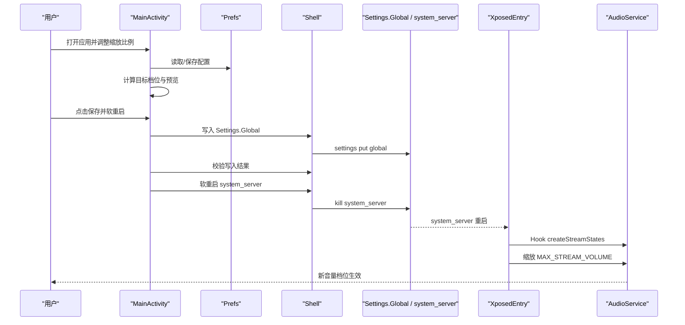

# 快速开始

<cite>
**本文引用的文件**   
- [MainActivity.java](file://app/src/main/java/com/xiefeihong/volumecontrol/MainActivity.java)
- [XposedEntry.java](file://app/src/main/java/com/xiefeihong/volumecontrol/XposedEntry.java)
- [Prefs.java](file://app/src/main/java/com/xiefeihong/volumecontrol/Prefs.java)
- [Shell.java](file://app/src/main/java/com/xiefeihong/volumecontrol/Shell.java)
- [Avrcp.java](file://app/src/main/java/com/xiefeihong/volumecontrol/Avrcp.java)
- [activity_main.xml](file://app/src/main/res/layout/activity_main.xml)
- [strings.xml](file://app/src/main/res/values/strings.xml)
- [arrays.xml](file://app/src/main/res/values/arrays.xml)
- [AndroidManifest.xml](file://app/src/main/AndroidManifest.xml)
</cite>

## 目录
1. [简介](#简介)
2. [环境要求](#环境要求)
3. [安装步骤](#安装步骤)
4. [基本使用方法](#基本使用方法)
5. [界面与功能说明](#界面与功能说明)
6. [工作原理概览](#工作原理概览)
7. [常见问题与解决方案](#常见问题与解决方案)
8. [故障排除建议](#故障排除建议)
9. [联系支持](#联系支持)
10. [结论](#结论)

## 简介
本应用用于调整 Android 系统音量档位数，并改善蓝牙耳机在 AVRCP 绝对音量映射下的听感。核心思路是：通过 LSPosed 模块 Hook 系统框架中的音频服务，按比例缩放各音频流的音量档位；同时提供应用界面，让用户设置缩放比例、媒体档位覆盖值，并在软重启系统框架后生效。

该指南面向初学者，帮助你从零开始完成安装、启用模块、调整音量缩放、查看预览效果，并最终让修改生效。

## 环境要求
- Root 权限的 Android 设备。
- 已安装并正常运行的 LSPosed 框架。
- 能够以 Root 身份执行 shell 命令（su）。
- 可访问系统设置键 Settings.Global（由应用通过 su 写入）。
- 若使用蓝牙耳机，连接后可在界面中查看 AVRCP 映射预览。

这些要求来自应用的 Root 检测、LSPosed 检测、Settings.Global 写入以及蓝牙设备扫描逻辑。

**章节来源**
- [Shell.java:74-90](file://app/src/main/java/com/xiefeihong/volumecontrol/Shell.java#L74-L90)
- [AndroidManifest.xml:21-36](file://app/src/main/AndroidManifest.xml#L21-L36)
- [strings.xml:44-47](file://app/src/main/res/values/strings.xml#L44-L47)

## 安装步骤
请按以下顺序操作：

1. **准备设备**
   - 确保设备已获取 Root 权限。
   - 安装 LSPosed 框架，并确保其正常运行。

2. **安装应用**
   - 下载并安装本应用。
   - 首次打开时，应用会声明自身为 Xposed/LSPosed 模块，作用域包含系统框架包名 android。

3. **授予 Root 权限**
   - 当应用尝试写入系统配置或检测环境时，Root 管理器会弹出授权提示。
   - 请允许 su 授权，否则无法写入 Settings.Global 和软重启 system_server。

4. **在 LSPosed 中启用模块**
   - 打开 LSPosed，找到本模块。
   - 启用模块，并将作用域勾选到“系统框架”（android）。
   - 如果未看到 android，请检查 LSPosed 的作用域列表是否包含系统框架。

5. **重启系统框架**
   - 在应用内点击“保存设置并软重启系统框架”，或在 LSPosed 中触发系统框架重启。
   - 屏幕会短暂黑屏，随后自动恢复；这是 system_server 重启的正常现象。

6. **验证模块状态**
   - 重新打开应用，查看运行状态区域：
     - Root：可用。
     - LSPosed：已安装。
     - 模块配置：根据当前设置显示“已生效”或“未生效”。

**章节来源**
- [AndroidManifest.xml:21-36](file://app/src/main/AndroidManifest.xml#L21-L36)
- [strings.xml:28-38](file://app/src/main/res/values/strings.xml#L28-L38)
- [strings.xml:61-66](file://app/src/main/res/values/strings.xml#L61-L66)
- [MainActivity.java:103-108](file://app/src/main/java/com/xiefeihong/volumecontrol/MainActivity.java#L103-L108)

## 基本使用方法
完成安装与模块启用后，按以下步骤调整音量缩放：

1. **打开应用界面**
   - 启动应用，进入主界面。
   - 界面顶部显示应用名称与副标题，下方依次是运行状态、档位缩放、高级设置、蓝牙映射预览、操作按钮与使用说明。

2. **启用档位缩放**
   - 在“档位缩放”卡片中，打开“启用档位缩放”开关。
   - 拖动“缩放比例”滑块，选择 100%~400% 的缩放比例。
   - 界面会实时显示目标媒体档位数与各音频流“原始 → 目标”的变化。

3. **配置媒体流覆盖**
   - 在“高级：媒体档位精确值”卡片中，拖动滑块设置媒体档位固定值。
   - 设置为 0 表示跟随上面的缩放比例；大于 0 表示将媒体档位固定为该值（上限 127）。
   - 超过 127 可能导致蓝牙相邻档位音量相同，因此不建议随意提高。

4. **查看实时预览效果**
   - “档位缩放”区域会显示媒体档位变化与各音频流预览。
   - “蓝牙 AVRCP 映射预览”区域会显示媒体档位到 AVRCP 绝对音量的映射关系，包括是否存在相邻档位音量相同的情况。

5. **应用设置并软重启**
   - 点击“保存设置并软重启系统框架”。
   - 应用会先写入 Settings.Global，再校验写入结果，最后延迟软重启 system_server。
   - 重启后，AudioService 重新初始化，新的音量档位才会生效。

6. **恢复默认**
   - 点击“恢复系统默认（关闭缩放）”，应用会将缩放比例重置为 100%，并关闭模块效果。
   - 再次点击“保存设置并软重启系统框架”使恢复生效。

**章节来源**
- [activity_main.xml:99-218](file://app/src/main/res/layout/activity_main.xml#L99-L218)
- [activity_main.xml:220-260](file://app/src/main/res/layout/activity_main.xml#L220-L260)
- [activity_main.xml:262-297](file://app/src/main/res/layout/activity_main.xml#L262-L297)
- [activity_main.xml:299-341](file://app/src/main/res/layout/activity_main.xml#L299-L341)
- [MainActivity.java:60-121](file://app/src/main/java/com/xiefeihong/volumecontrol/MainActivity.java#L60-L121)
- [MainActivity.java:193-231](file://app/src/main/java/com/xiefeihong/volumecontrol/MainActivity.java#L193-L231)
- [MainActivity.java:261-296](file://app/src/main/java/com/xiefeihong/volumecontrol/MainActivity.java#L261-L296)

## 界面与功能说明
应用主界面分为多个卡片区域，每个区域对应一项核心功能：

- **运行状态**
  - 显示 Root 是否可用、LSPosed 是否检测到、当前媒体档位、模块配置状态、蓝牙音频设备摘要。
  - 提供“刷新检测”按钮，重新读取环境与配置状态。

- **档位缩放**
  - 启用开关控制模块是否生效。
  - 缩放比例滑块控制各音频流档位的百分比缩放。
  - 预设按钮提供 100%、200%、300%、400% 快捷设置。
  - 预览文本显示各音频流“原始 → 目标”档位变化。
  - “重新采集基准档位”按钮用于重新读取系统原始档位。

- **高级：媒体档位精确值**
  - 媒体档位固定值滑块，范围 0~127。
  - 提示文字说明 0 表示跟随缩放比例，大于 0 表示固定媒体档位。

- **蓝牙 AVRCP 映射预览**
  - 显示媒体档位到 AVRCP 绝对音量的映射结果。
  - 包含是否存在相邻档位音量相同的警告、第 1 档最低 AVRCP 音量、完整映射表。

- **操作**
  - 显示当前设置是否已生效。
  - “保存设置并软重启系统框架”按钮用于应用配置并重启 system_server。
  - “恢复系统默认”按钮用于关闭缩放并恢复系统默认档位。

- **使用说明**
  - 内置引导文本，解释模块作用、启用方式、软重启注意事项、蓝牙低音量无声原因、恢复默认方法等。

**章节来源**
- [activity_main.xml:29-97](file://app/src/main/res/layout/activity_main.xml#L29-L97)
- [activity_main.xml:99-218](file://app/src/main/res/layout/activity_main.xml#L99-L218)
- [activity_main.xml:220-260](file://app/src/main/res/layout/activity_main.xml#L220-L260)
- [activity_main.xml:262-297](file://app/src/main/res/layout/activity_main.xml#L262-L297)
- [activity_main.xml:299-341](file://app/src/main/res/layout/activity_main.xml#L299-L341)
- [activity_main.xml:343-372](file://app/src/main/res/layout/activity_main.xml#L343-L372)
- [strings.xml:7-12](file://app/src/main/res/values/strings.xml#L7-L12)
- [strings.xml:28-38](file://app/src/main/res/values/strings.xml#L28-L38)

## 工作原理概览
应用的工作流程可以分为两条主线：

1. **应用侧配置与预览**
   - MainActivity 负责加载用户配置、计算目标档位、更新界面预览。
   - Prefs 提供配置常量、序列化/反序列化工具、基准档位存储。
   - Avrcp 计算蓝牙 AVRCP 绝对音量映射，生成预览文本。
   - Shell 提供 Root shell 执行能力，用于写入 Settings.Global 与软重启 system_server。

2. **Hook 侧生效机制**
   - XposedEntry 作为 LSPosed 模块入口，Hook 系统框架 AudioService 的 createStreamStates 方法。
   - 在方法执行前，Hook 端读取配置，按比例缩放 MAX_STREAM_VOLUME 数组，并原地写回。
   - 媒体档位会被限制在 AVRCP_MAX_VOLUME（127）以内，避免蓝牙相邻档位音量相同。
   - 由于 AudioService 只在启动时创建流档位，因此必须软重启 system_server 才能生效。

**图表来源**
- [MainActivity.java:261-296](file://app/src/main/java/com/xiefeihong/volumecontrol/MainActivity.java#L261-L296)
- [Shell.java:96-112](file://app/src/main/java/com/xiefeihong/volumecontrol/Shell.java#L96-L112)
- [XposedEntry.java:41-65](file://app/src/main/java/com/xiefeihong/volumecontrol/XposedEntry.java#L41-L65)
- [XposedEntry.java:67-114](file://app/src/main/java/com/xiefeihong/volumecontrol/XposedEntry.java#L67-L114)

**章节来源**
- [MainActivity.java:123-141](file://app/src/main/java/com/xiefeihong/volumecontrol/MainActivity.java#L123-L141)
- [MainActivity.java:175-191](file://app/src/main/java/com/xiefeihong/volumecontrol/MainActivity.java#L175-L191)
- [Prefs.java:56-82](file://app/src/main/java/com/xiefeihong/volumecontrol/Prefs.java#L56-L82)
- [Avrcp.java:25-31](file://app/src/main/java/com/xiefeihong/volumecontrol/Avrcp.java#L25-L31)
- [XposedEntry.java:16-28](file://app/src/main/java/com/xiefeihong/volumecontrol/XposedEntry.java#L16-L28)

## 常见问题与解决方案

### Root 权限不足
- **现象**
  - 运行状态显示 Root 不可用。
  - 写入系统配置失败，提示 su 未授权。
- **解决**
  - 确认设备已 Root，且 Root 管理器允许 su 授权。
  - 重新打开应用，再次尝试写入配置。
  - 如果使用 Magisk 或其他 Root 方案，请检查 su 是否可用。

**章节来源**
- [strings.xml:44-45](file://app/src/main/res/values/strings.xml#L44-L45)
- [strings.xml:72-73](file://app/src/main/res/values/strings.xml#L72-L73)
- [Shell.java:74-78](file://app/src/main/java/com/xiefeihong/volumecontrol/Shell.java#L74-L78)

### LSPosed 未检测到
- **现象**
  - 运行状态显示 LSPosed 未检测到。
  - 模块无法加载，音量档位不会生效。
- **解决**
  - 确认 LSPosed 已安装并正常运行。
  - 在 LSPosed 中启用本模块，并将作用域勾选到“系统框架”（android）。
  - 重启系统框架后再次检测。

**章节来源**
- [strings.xml:46-47](file://app/src/main/res/values/strings.xml#L46-L47)
- [Shell.java:80-84](file://app/src/main/java/com/xiefeihong/volumecontrol/Shell.java#L80-L84)
- [AndroidManifest.xml:21-36](file://app/src/main/AndroidManifest.xml#L21-L36)

### 系统重启失败
- **现象**
  - 点击“保存设置并软重启系统框架”后，system_server 未重启。
  - 屏幕未黑屏或长时间无响应。
- **解决**
  - 确认 su 已授权，且能执行 kill system_server。
  - 手动重启设备或重启 system_server。
  - 检查是否有其他进程阻止 system_server 重启。

**章节来源**
- [strings.xml:61-66](file://app/src/main/res/values/strings.xml#L61-L66)
- [Shell.java:109-112](file://app/src/main/java/com/xiefeihong/volumecontrol/Shell.java#L109-L112)

### 音量档位未生效
- **现象**
  - 调整后音量档位没有变化。
  - 运行状态显示模块配置“未生效”。
- **解决**
  - 确认已点击“保存设置并软重启系统框架”。
  - 确认 LSPosed 模块已启用且作用域正确。
  - 重新采集基准档位，确保原始档位数据准确。

**章节来源**
- [strings.xml:49-52](file://app/src/main/res/values/strings.xml#L49-L52)
- [MainActivity.java:123-128](file://app/src/main/java/com/xiefeihong/volumecontrol/MainActivity.java#L123-L128)
- [MainActivity.java:322-366](file://app/src/main/java/com/xiefeihong/volumecontrol/MainActivity.java#L322-L366)

### 蓝牙耳机低音量无声
- **现象**
  - 蓝牙耳机在低音量时无声或音量过小。
- **解决**
  - 适当提高缩放比例（例如 200%），让低音区更细腻。
  - 检查蓝牙 AVRCP 映射预览，确认第 1 档 AVRCP 音量是否过低。
  - 部分耳机存在自身低音量限制，属硬件特性。

**章节来源**
- [strings.xml:32-35](file://app/src/main/res/values/strings.xml#L32-L35)
- [Avrcp.java:11-18](file://app/src/main/java/com/xiefeihong/volumecontrol/Avrcp.java#L11-L18)

## 故障排除建议
- **优先检查 Root 与 LSPosed**
  - 如果 Root 不可用，所有系统级写入与重启都会失败。
  - 如果 LSPosed 未检测到，模块无法 Hook 系统框架。

- **确认模块作用域**
  - 模块必须作用于“系统框架”（android），否则无法 Hook AudioService。

- **确认软重启成功**
  - 软重启 system_server 后，AudioService 会重新初始化，新的音量档位才会生效。

- **重新采集基准档位**
  - 如果系统已被其他工具修改过音量档位，建议重新采集基准档位，确保计算准确。

- **查看运行状态与预览**
  - 运行状态会显示 Root、LSPosed、媒体档位、模块配置、蓝牙设备等信息。
  - 预览区域会显示各音频流“原始 → 目标”变化与蓝牙 AVRCP 映射结果。

**章节来源**
- [MainActivity.java:300-366](file://app/src/main/java/com/xiefeihong/volumecontrol/MainActivity.java#L300-L366)
- [strings.xml:28-38](file://app/src/main/res/values/strings.xml#L28-L38)

## 联系支持
如果在安装、启用模块或调整音量档位过程中遇到问题，可以按以下方式寻求帮助：

- **提供设备信息**
  - Android 版本、ROM 类型、是否 Root、LSPosed 版本。
- **提供错误信息**
  - 运行状态截图、Toast 提示内容、Shell 输出（如有）。
- **描述操作步骤**
  - 详细说明你执行了哪些操作，以及期望结果与实际结果。

如果你是在开源仓库中提交问题，请附上相关日志与复现步骤；如果是社区支持渠道，请尽量提供清晰的环境信息与错误现象。

[本节为通用支持建议，不直接分析具体代码文件]

## 结论
通过本快速开始指南，你应该已经完成了音量控制应用的安装、LSPosed 模块启用、音量缩放配置与软重启生效。应用的核心价值在于：

- 通过百分比缩放提升或降低系统音量档位数量。
- 改善蓝牙耳机 AVRCP 绝对音量映射的听感。
- 提供实时预览与状态检测，帮助用户理解当前配置效果。

如果遇到 Root、LSPosed 或系统重启相关问题，请参考常见问题与故障排除建议。如仍无法解决，请提供详细环境信息与错误日志以便进一步排查。

[本节为总结性内容，不直接分析具体代码文件]