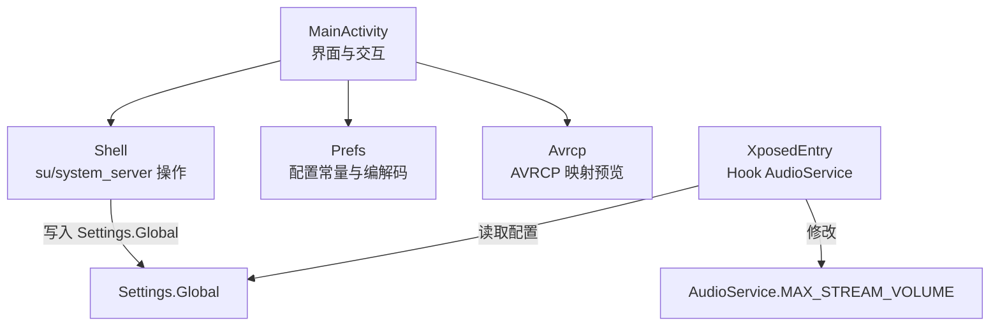
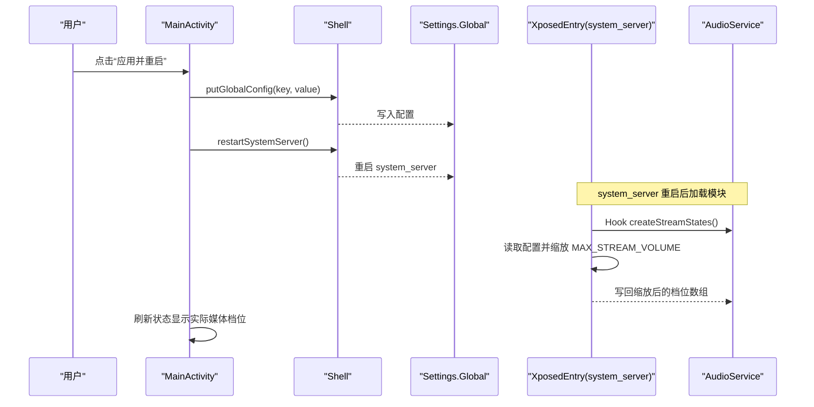
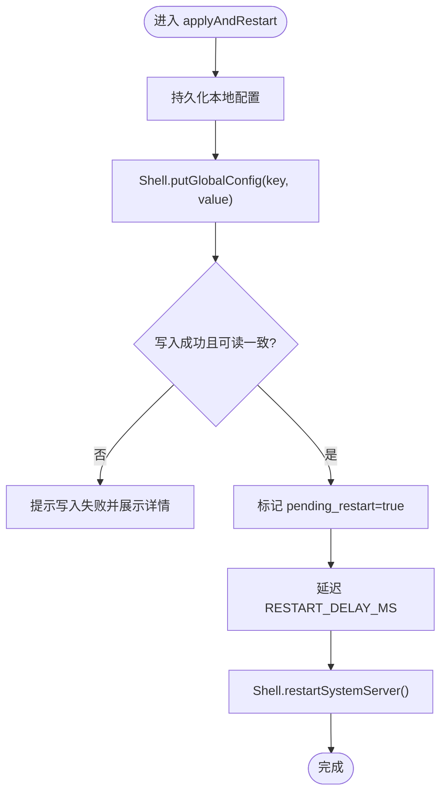
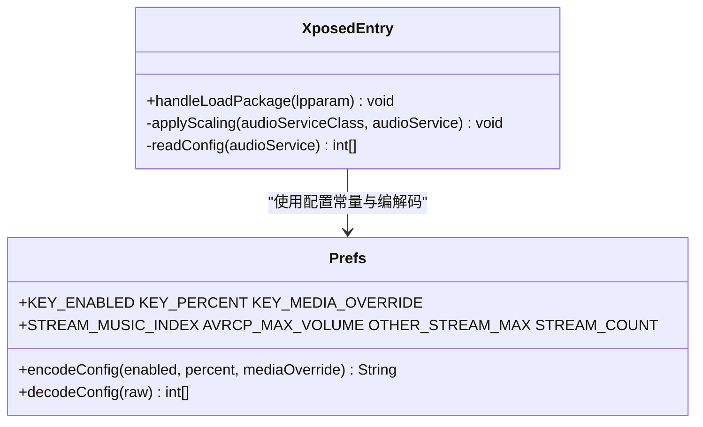
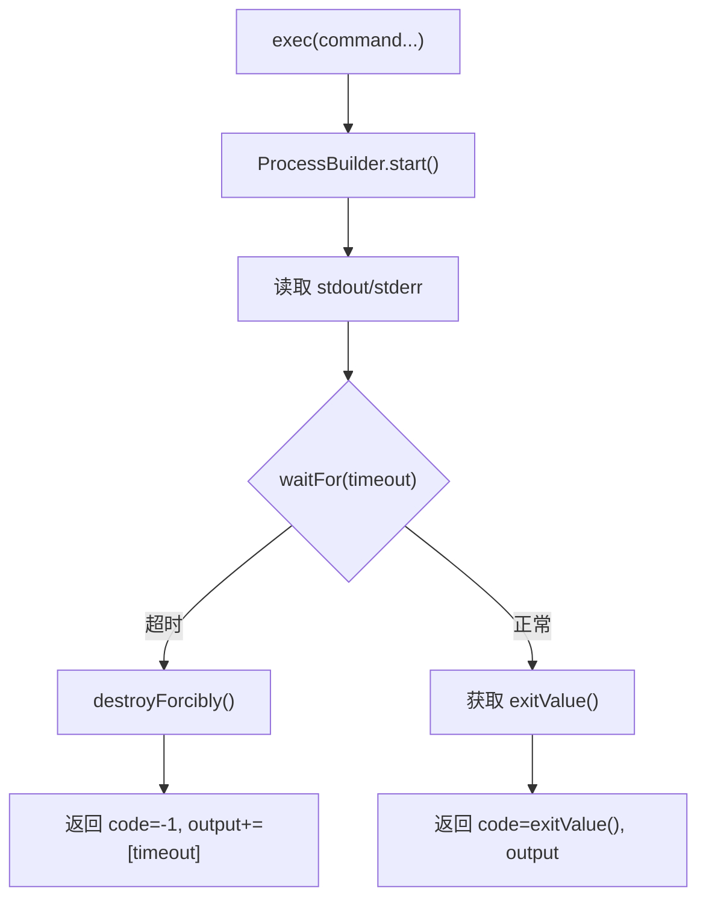
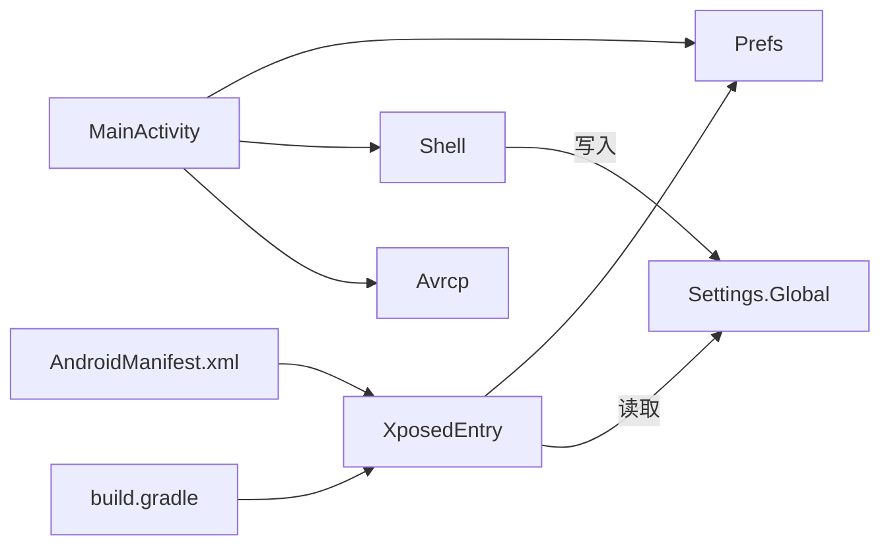

# 故障排除

<cite>
**本文引用的文件**
- [MainActivity.java](file://app/src/main/java/com/xiefeihong/volumecontrol/MainActivity.java)
- [XposedEntry.java](file://app/src/main/java/com/xiefeihong/volumecontrol/XposedEntry.java)
- [Shell.java](file://app/src/main/java/com/xiefeihong/volumecontrol/Shell.java)
- [Avrcp.java](file://app/src/main/java/com/xiefeihong/volumecontrol/Avrcp.java)
- [Prefs.java](file://app/src/main/java/com/xiefeihong/volumecontrol/Prefs.java)
- [AndroidManifest.xml](file://app/src/main/AndroidManifest.xml)
- [build.gradle](file://app/build.gradle)
</cite>

## 目录
1. [简介](#简介)
2. [项目结构](#项目结构)
3. [核心组件](#核心组件)
4. [架构总览](#架构总览)
5. [详细组件分析](#详细组件分析)
6. [依赖关系分析](#依赖关系分析)
7. [性能注意事项](#性能注意事项)
8. [故障排除指南](#故障排除指南)
9. [结论](#结论)
10. [附录](#附录)

## 简介
本指南面向用户与开发者，聚焦音量控制模块在真实设备上的常见问题定位与解决。内容覆盖 Root 权限、LSPosed 框架冲突、系统重启失败、音量不生效、不同 Android 版本兼容性问题、性能问题（内存/CPU/启动速度）、厂商定制系统差异、日志分析方法与社区支持渠道等。所有技术细节均基于代码实现进行说明，确保可追溯与可验证。

## 项目结构
该工程为 Android 应用 + LSPosed 模块：
- 应用层（App）：提供配置界面、状态检测、写入 Settings.Global、触发 system_server 软重启。
- Hook 层（system_server 进程）：拦截 AudioService.createStreamStates，按比例缩放 MAX_STREAM_VOLUME 数组，使系统音量档位按配置生效。
- 工具层：Shell 封装 su 命令执行；Avrcp 计算蓝牙 AVRCP 绝对音量映射；Prefs 统一配置常量与序列化。

图表来源
- [MainActivity.java:262-319](file://app/src/main/java/com/xiefeihong/volumecontrol/MainActivity.java#L262-L319)
- [Shell.java:92-112](file://app/src/main/java/com/xiefeihong/volumecontrol/Shell.java#L92-L112)
- [XposedEntry.java:41-65](file://app/src/main/java/com/xiefeihong/volumecontrol/XposedEntry.java#L41-L65)
- [Prefs.java:56-82](file://app/src/main/java/com/xiefeihong/volumecontrol/Prefs.java#L56-L82)

章节来源
- [AndroidManifest.xml:21-36](file://app/src/main/AndroidManifest.xml#L21-L36)
- [build.gradle:5-15](file://app/build.gradle#L5-L15)

## 核心组件
- MainActivity：负责采集基准音量、计算目标档位、预览 AVRCP 映射、持久化配置、写入 Settings.Global、触发 system_server 软重启、刷新状态显示。
- XposedEntry：在 system_server 中 Hook AudioService.createStreamStates，读取配置并缩放 MAX_STREAM_VOLUME，使音量档位数生效。
- Shell：以 root 身份执行 shell 命令，包括检测 Root/LSPosed/Magisk、读写 Settings.Global、重启 system_server。
- Avrcp：计算媒体档位到蓝牙 AVRCP 绝对音量的映射，生成预览文本，统计相邻档位重复对数。
- Prefs：定义全局键名、范围限制、流索引、序列化工具，供 App 与 Hook 端共享。

章节来源
- [MainActivity.java:23-50](file://app/src/main/java/com/xiefeihong/volumecontrol/MainActivity.java#L23-L50)
- [XposedEntry.java:16-28](file://app/src/main/java/com/xiefeihong/volumecontrol/XposedEntry.java#L16-L28)
- [Shell.java:8-13](file://app/src/main/java/com/xiefeihong/volumecontrol/Shell.java#L8-L13)
- [Avrcp.java:3-19](file://app/src/main/java/com/xiefeihong/volumecontrol/Avrcp.java#L3-L19)
- [Prefs.java:6-11](file://app/src/main/java/com/xiefeihong/volumecontrol/Prefs.java#L6-L11)

## 架构总览
应用通过 Shell 将配置写入 Settings.Global，Hook 端在 system_server 启动时读取该配置，并对 AudioService 的音量档位数组进行缩放。由于 AudioService 仅在初始化时创建流档位，因此需要重启 system_server 使新档位生效。

图表来源
- [MainActivity.java:262-296](file://app/src/main/java/com/xiefeihong/volumecontrol/MainActivity.java#L262-L296)
- [Shell.java:92-112](file://app/src/main/java/com/xiefeihong/volumecontrol/Shell.java#L92-L112)
- [XposedEntry.java:41-65](file://app/src/main/java/com/xiefeihong/volumecontrol/XposedEntry.java#L41-L65)
- [XposedEntry.java:67-114](file://app/src/main/java/com/xiefeihong/volumecontrol/XposedEntry.java#L67-L114)

## 详细组件分析

### 主界面与状态检测（MainActivity）
- 功能要点：
  - 首次启动采集系统原始档位作为基准，用于后续对比与预览。
  - 计算目标档位：媒体流可被固定覆盖或按百分比缩放，其他流有安全上限。
  - 写入配置并校验：通过 Settings.Global 同步配置，再触发 system_server 软重启。
  - 状态检测：检测 Root、LSPosed、当前媒体档位、蓝牙输出设备摘要。
- 关键流程：
  - applyAndRestart：保存本地配置 → 写入 Settings.Global → 校验 → 标记待重启 → 延迟重启 system_server。
  - refreshStatus：后台线程检测环境并渲染状态，包含 Root/LSPosed/音量/模块状态/蓝牙信息。

图表来源
- [MainActivity.java:262-296](file://app/src/main/java/com/xiefeihong/volumecontrol/MainActivity.java#L262-L296)

章节来源
- [MainActivity.java:123-141](file://app/src/main/java/com/xiefeihong/volumecontrol/MainActivity.java#L123-L141)
- [MainActivity.java:175-191](file://app/src/main/java/com/xiefeihong/volumecontrol/MainActivity.java#L175-L191)
- [MainActivity.java:298-366](file://app/src/main/java/com/xiefeihong/volumecontrol/MainActivity.java#L298-L366)

### Hook 入口与档位缩放（XposedEntry）
- 功能要点：
  - 仅针对 android 包（system_server）进行 Hook。
  - 在 createStreamStates 前读取配置，按比例缩放 MAX_STREAM_VOLUME，媒体流可被固定覆盖。
  - 优先从 Settings.Global 读取配置，回退到 XSharedPreferences。
- 异常处理：
  - 捕获 Throwable 并记录日志，避免 Hook 崩溃影响系统稳定性。

图表来源
- [XposedEntry.java:41-65](file://app/src/main/java/com/xiefeihong/volumecontrol/XposedEntry.java#L41-L65)
- [XposedEntry.java:67-114](file://app/src/main/java/com/xiefeihong/volumecontrol/XposedEntry.java#L67-L114)
- [Prefs.java:56-82](file://app/src/main/java/com/xiefeihong/volumecontrol/Prefs.java#L56-L82)

章节来源
- [XposedEntry.java:16-28](file://app/src/main/java/com/xiefeihong/volumecontrol/XposedEntry.java#L16-L28)
- [XposedEntry.java:116-146](file://app/src/main/java/com/xiefeihong/volumecontrol/XposedEntry.java#L116-L146)

### Shell 工具（Root 与系统操作）
- 功能要点：
  - 执行 su 命令并合并 stdout/stderr，超时销毁进程。
  - 检测 Root/LSPosed/Magisk 存在性。
  - 写入/读取 Settings.Global，重启 system_server。
- 错误处理：
  - exec 返回 Result(code, output)，isSuccess 判断是否成功。
  - 超时返回 -1 并附加 “[timeout]”。

图表来源
- [Shell.java:40-72](file://app/src/main/java/com/xiefeihong/volumecontrol/Shell.java#L40-L72)

章节来源
- [Shell.java:74-112](file://app/src/main/java/com/xiefeihong/volumecontrol/Shell.java#L74-L112)

### 蓝牙 AVRCP 映射（Avrcp）
- 功能要点：
  - 使用 AOSP 公式将媒体档位换算为 AVRCP 绝对音量（0~127）。
  - 统计相邻档位重复对数，生成预览文本，帮助评估档位设置合理性。
- 典型问题：
  - 档位过多导致多档映射到同一 AVRCP 音量（耳机听感相同）。
  - 第 1 档 AVRCP 值过低可能导致部分耳机无声。

章节来源
- [Avrcp.java:25-42](file://app/src/main/java/com/xiefeihong/volumecontrol/Avrcp.java#L25-L42)
- [Avrcp.java:44-88](file://app/src/main/java/com/xiefeihong/volumecontrol/Avrcp.java#L44-L88)

### 配置常量与序列化（Prefs）
- 功能要点：
  - 定义启用开关、缩放百分比、媒体覆盖档位、基准音量、待重启标志等键。
  - 提供 encode/decode 配置字符串，以及 CSV 格式的基准音量序列化。
  - 定义安全上限与流索引，保证跨进程一致性。

章节来源
- [Prefs.java:14-47](file://app/src/main/java/com/xiefeihong/volumecontrol/Prefs.java#L14-L47)
- [Prefs.java:56-82](file://app/src/main/java/com/xiefeihong/volumecontrol/Prefs.java#L56-L82)
- [Prefs.java:84-123](file://app/src/main/java/com/xiefeihong/volumecontrol/Prefs.java#L84-L123)

## 依赖关系分析
- 应用与 Hook 的耦合点：
  - Prefs 中的 GLOBAL_KEY、PREFS_NAME、键名与范围限制必须保持一致。
  - 媒体流索引 STREAM_MUSIC_INDEX 需与系统一致。
- 外部依赖：
  - LSPosed 模块元数据声明于清单，最低版本要求与共享偏好开启。
  - 编译期引入 Xposed API（compileOnly），运行期由 LSPosed 提供。

图表来源
- [AndroidManifest.xml:21-36](file://app/src/main/AndroidManifest.xml#L21-L36)
- [build.gradle:38-43](file://app/build.gradle#L38-L43)
- [Prefs.java:14-47](file://app/src/main/java/com/xiefeihong/volumecontrol/Prefs.java#L14-L47)

章节来源
- [AndroidManifest.xml:21-36](file://app/src/main/AndroidManifest.xml#L21-L36)
- [build.gradle:5-15](file://app/build.gradle#L5-L15)
- [build.gradle:38-43](file://app/build.gradle#L38-L43)

## 性能注意事项
- 启动与 UI 响应：
  - 所有 root/系统查询在单线程 Executor 中串行执行，避免 UI 卡顿。
  - 状态刷新与预览更新在主线程 Handler 上 post，保证 UI 线程安全。
- 内存与 CPU：
  - 使用 StringBuilder 构建预览文本，减少频繁对象分配。
  - 蓝牙设备枚举与格式化在后台线程执行，降低主线程压力。
- 建议：
  - 避免在高频回调中执行阻塞 IO。
  - 合理设置超时，防止长时间阻塞导致 ANR。

[本节为通用指导，不直接分析具体文件]

## 故障排除指南

### 一、Root 权限问题
- 现象：
  - 无法写入 Settings.Global，无法重启 system_server，状态显示 Root 不可用。
- 诊断方法：
  - 检查 isRootAvailable：尝试执行 id 命令并判断 uid=0。
  - 查看 Shell.exec 返回值与输出，确认是否有权限错误或超时。
- 解决方案：
  - 授予 su 权限给应用。
  - 检查 Magisk/第三方管理器是否允许该应用获得 root。
  - 若设备无 su，考虑更换 ROM 或使用具备 root 能力的方案。

章节来源
- [Shell.java:74-78](file://app/src/main/java/com/xiefeihong/volumecontrol/Shell.java#L74-L78)
- [Shell.java:40-72](file://app/src/main/java/com/xiefeihong/volumecontrol/Shell.java#L40-L72)

### 二、LSPosed 框架冲突
- 现象：
  - 状态显示未检测到 LSPosed，或 Hook 未生效。
- 诊断方法：
  - 检查 isLsposedPresent：探测 /data/adb/lspd 是否存在。
  - 查看 Hook 日志：XposedBridge.log 输出是否包含 hook 成功/失败信息。
- 解决方案：
  - 确保已安装并启用 LSPosed，且模块作用域包含 android 包。
  - 清理缓存并重启系统框架后再试。
  - 若与其他模块冲突，逐个禁用排查。

章节来源
- [Shell.java:80-84](file://app/src/main/java/com/xiefeihong/volumecontrol/Shell.java#L80-L84)
- [XposedEntry.java:41-65](file://app/src/main/java/com/xiefeihong/volumecontrol/XposedEntry.java#L41-L65)
- [AndroidManifest.xml:21-36](file://app/src/main/AndroidManifest.xml#L21-L36)

### 三、系统重启失败（system_server 软重启）
- 现象：
  - 点击“应用并重启”后无变化，或设备卡死/重启。
- 诊断方法：
  - 检查 restartSystemServer 是否成功执行（shell 命令返回码）。
  - 观察系统是否自动拉起 system_server。
- 解决方案：
  - 确保 Root 可用且命令未被拦截。
  - 若设备不支持 pidof，脚本会回退 killall；如仍失败，手动重启设备。
  - 避免在系统高负载时执行重启。

章节来源
- [Shell.java:105-112](file://app/src/main/java/com/xiefeihong/volumecontrol/Shell.java#L105-L112)
- [MainActivity.java:290-296](file://app/src/main/java/com/xiefeihong/volumecontrol/MainActivity.java#L290-L296)

### 四、音量不生效
- 现象：
  - 调整后媒体音量档位未变化，或蓝牙音量无变化。
- 诊断方法：
  - 检查 readStreamMaxSafe 获取的实际媒体档位是否与目标档位一致。
  - 查看 renderStatus 中 actualMedia 与 targetMedia 的比较结果。
  - 确认 Settings.Global 已写入并校验成功。
- 解决方案：
  - 重新执行“应用并重启”，等待 system_server 重启完成。
  - 检查 Hook 是否成功：XposedEntry 日志应显示 scaled 信息。
  - 若媒体覆盖档位设置不当，调整至合理范围。

章节来源
- [MainActivity.java:162-173](file://app/src/main/java/com/xiefeihong/volumecontrol/MainActivity.java#L162-L173)
- [MainActivity.java:322-366](file://app/src/main/java/com/xiefeihong/volumecontrol/MainActivity.java#L322-L366)
- [XposedEntry.java:67-114](file://app/src/main/java/com/xiefeihong/volumecontrol/XposedEntry.java#L67-L114)

### 五、蓝牙 AVRCP 音量异常
- 现象：
  - 蓝牙设备音量调节不细腻或某些档位无效。
- 诊断方法：
  - 使用 Avrcp.buildPreview 查看档位到 AVRCP 的映射，关注重复对数与第 1 档值。
  - 检查媒体档位是否超过 AVRCP_MAX_VOLUME（127）。
- 解决方案：
  - 降低媒体档位以避免过多重复映射。
  - 若第 1 档过低导致无声，适当提高基础档位或调整百分比。

章节来源
- [Avrcp.java:25-42](file://app/src/main/java/com/xiefeihong/volumecontrol/Avrcp.java#L25-L42)
- [Avrcp.java:44-88](file://app/src/main/java/com/xiefeihong/volumecontrol/Avrcp.java#L44-L88)
- [Prefs.java:35-41](file://app/src/main/java/com/xiefeihong/volumecontrol/Prefs.java#L35-L41)

### 六、不同 Android 版本的兼容性问题
- 现象：
  - 低版本设备上蓝牙类型识别不全或 API 调用异常。
- 诊断方法：
  - 检查 bluetoothTypeName 中对常量字面值的分支，确保兼容低版本。
  - 捕获异常并降级处理（例如返回 null）。
- 解决方案：
  - 使用常量字面值而非 API 常量，避免编译期/运行期差异。
  - 对 getDevices 等 API 调用进行 try-catch，失败时忽略。

章节来源
- [MainActivity.java:407-425](file://app/src/main/java/com/xiefeihong/volumecontrol/MainActivity.java#L407-L425)
- [build.gradle:11-12](file://app/build.gradle#L11-L12)

### 七、性能问题排查与优化
- 内存使用：
  - 避免在循环中创建大量临时对象，使用 StringBuilder 拼接预览文本。
- CPU 占用：
  - 所有耗时操作在后台线程执行，UI 更新通过 Handler.post。
- 启动速度：
  - 首次启动采集基准音量，避免重复读取；必要时可缓存结果。
- 建议：
  - 监控 Executor 队列长度，避免任务堆积。
  - 合理设置 Shell 超时，防止长时间阻塞。

[本节为通用指导，不直接分析具体文件]

### 八、设备特定问题（厂商定制系统）
- 现象：
  - 某些 ROM 对 system_server 重启有限制或权限管控更严格。
- 诊断方法：
  - 检查 Shell.exec 输出是否包含权限拒绝或命令不存在。
  - 查看系统日志中是否有 SELinux 或安全策略拦截。
- 解决方案：
  - 在受控 ROM 上关闭相关安全策略或申请更高权限。
  - 使用设备自带的调试工具辅助定位。

[本节为通用指导，不直接分析具体文件]

### 九、日志分析方法
- 日志位置：
  - LSPosed 模块日志：通过 XposedBridge.log 输出，可在 LSPosed 管理界面或 logcat 中查看。
  - Shell 执行日志：Result.output 包含命令输出与错误信息。
- 关键信息识别：
  - Hook 成功/失败：查找 “hook failed”、“hooked” 等关键字。
  - 配置读取：查找 “no config found”、“read global config failed”、“read shared prefs failed”。
  - 档位缩放：查找 “scaled: ...” 以确认缩放前后值。
- 问题定位技巧：
  - 结合 MainActivity 的状态显示与实际媒体档位对比。
  - 使用 Avrcp 预览评估蓝牙映射合理性。
  - 逐步禁用其他模块，排查冲突。

章节来源
- [XposedEntry.java:52-64](file://app/src/main/java/com/xiefeihong/volumecontrol/XposedEntry.java#L52-L64)
- [XposedEntry.java:67-114](file://app/src/main/java/com/xiefeihong/volumecontrol/XposedEntry.java#L67-L114)
- [Shell.java:40-72](file://app/src/main/java/com/xiefeihong/volumecontrol/Shell.java#L40-L72)

### 十、社区支持与反馈
- 建议渠道：
  - 提交 issue 时附上：设备型号、Android 版本、LSPosed 版本、模块日志、Shell 输出。
  - 描述操作步骤与期望行为，便于复现。
- 更新机制：
  - 定期收集常见问题与解决方案，更新至本指南。
  - 根据用户反馈迭代修复与优化。

[本节为通用指导，不直接分析具体文件]

## 结论
本指南基于代码实现提供了系统化的故障排除路径，涵盖权限、框架、系统重启、音量生效、蓝牙映射、兼容性、性能与设备差异等方面。通过日志分析与状态检测，可快速定位问题并采取相应措施。建议在复杂设备上逐步排查，并结合社区资源持续优化。

## 附录
- 关键配置键：
  - GLOBAL_KEY：Settings.Global 中的配置键。
  - PREFS_NAME：SharedPreferences 文件名。
  - KEY_ENABLED、KEY_PERCENT、KEY_MEDIA_OVERRIDE：启用开关、缩放百分比、媒体覆盖档位。
- 安全上限：
  - AVRCP_MAX_VOLUME：蓝牙 AVRCP 绝对音量上限（127）。
  - OTHER_STREAM_MAX：非媒体流的安全上限（150）。
- 流索引：
  - STREAM_MUSIC_INDEX：媒体流索引（3）。

章节来源
- [Prefs.java:14-47](file://app/src/main/java/com/xiefeihong/volumecontrol/Prefs.java#L14-L47)