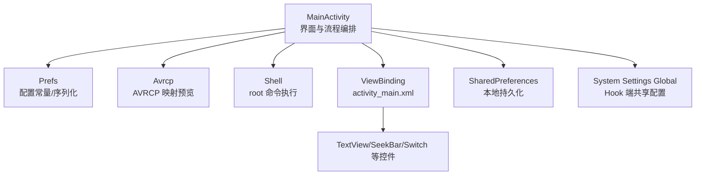
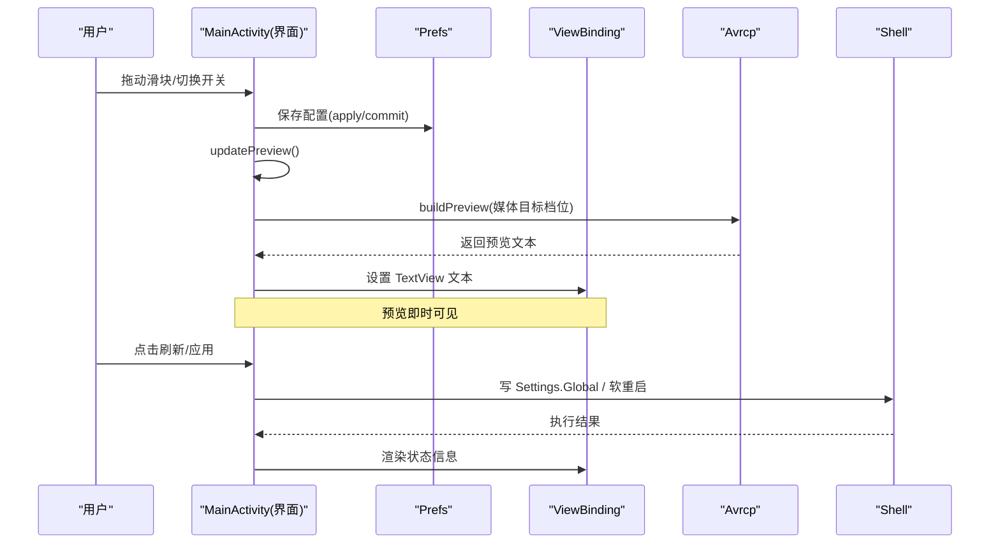
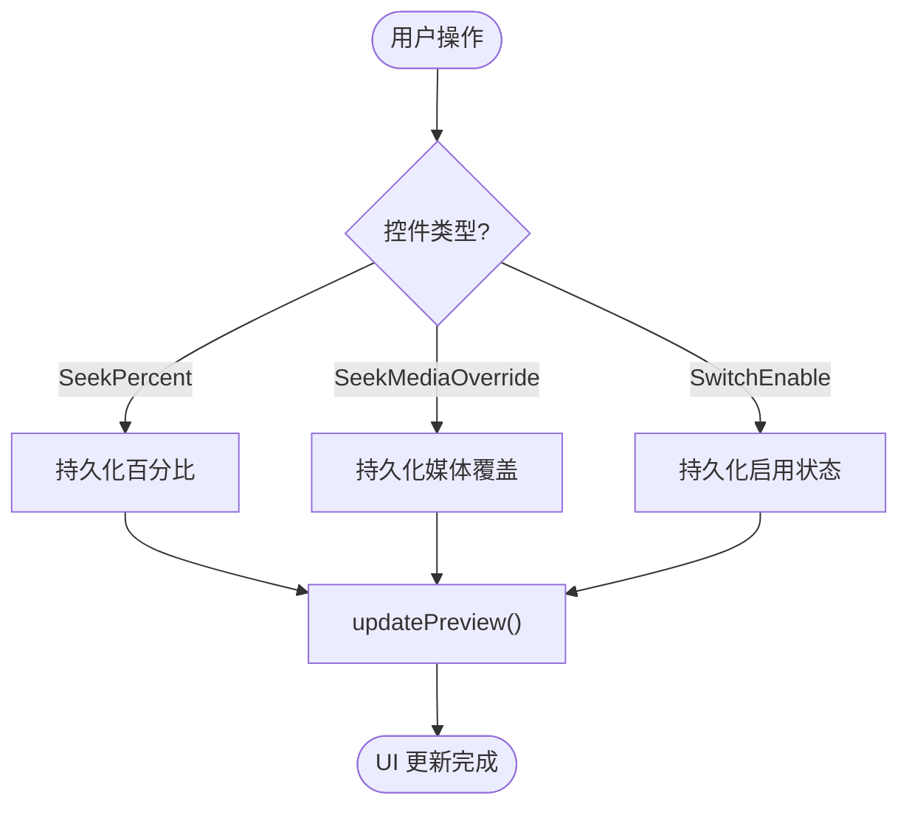
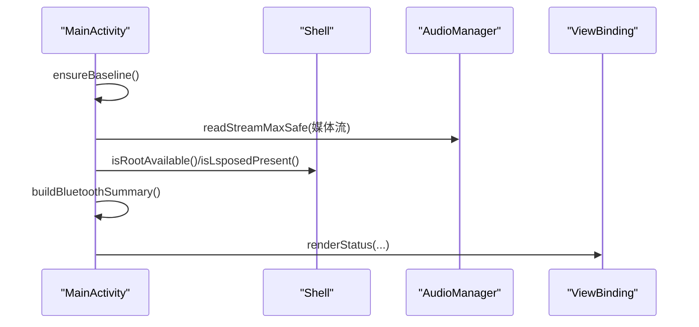
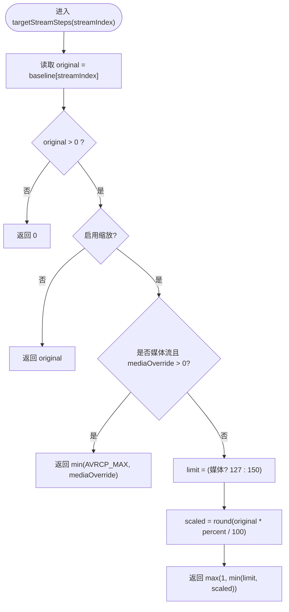
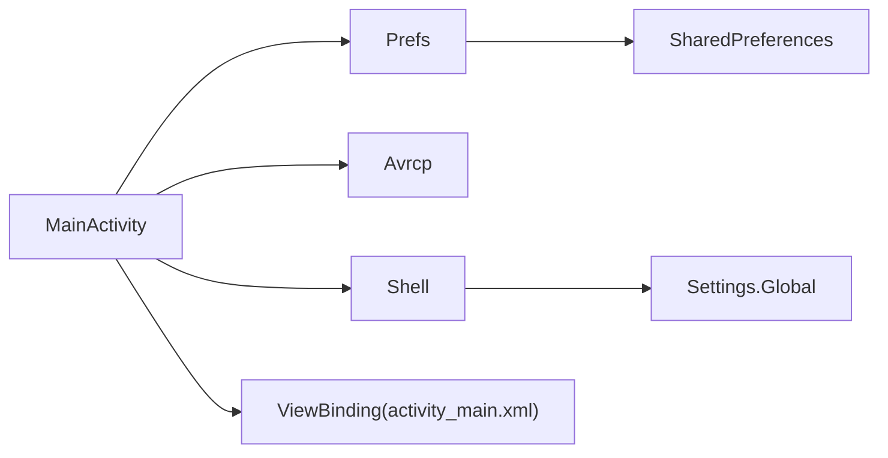

# 实时预览功能

<cite>
**本文引用的文件**
- [MainActivity.java](file://app/src/main/java/com/xiefeihong/volumecontrol/MainActivity.java)
- [Prefs.java](file://app/src/main/java/com/xiefeihong/volumecontrol/Prefs.java)
- [Avrcp.java](file://app/src/main/java/com/xiefeihong/volumecontrol/Avrcp.java)
- [Shell.java](file://app/src/main/java/com/xiefeihong/volumecontrol/Shell.java)
- [activity_main.xml](file://app/src/main/res/layout/activity_main.xml)
- [strings.xml](file://app/src/main/res/values/strings.xml)
- [arrays.xml](file://app/src/main/res/values/arrays.xml)
</cite>

## 目录
1. [简介](#简介)
2. [项目结构](#项目结构)
3. [核心组件](#核心组件)
4. [架构总览](#架构总览)
5. [详细组件分析](#详细组件分析)
6. [依赖关系分析](#依赖关系分析)
7. [性能考虑](#性能考虑)
8. [故障排查指南](#故障排查指南)
9. [结论](#结论)
10. [附录：关键实现路径与示例](#附录关键实现路径与示例)

## 简介
本技术文档聚焦“实时预览”能力，围绕配置变更监听、状态变化检测、UI 更新触发条件、预览数据计算（含 updatePreview() 与 targetStreamSteps()）、蓝牙 AVRCP 映射预览、以及 ViewBinding 驱动的 UI 更新机制进行系统化说明。目标是帮助读者理解从用户交互到系统配置落盘的全链路，并掌握在 Android 环境下安全、高效地实现实时预览的最佳实践。

## 项目结构
本项目采用典型的 Android 应用分层组织方式：
- 界面层：Activity + ViewBinding 管理 UI 控件与事件绑定
- 业务逻辑层：MainActivity 负责配置读取、计算、预览生成与状态刷新
- 工具与常量层：Prefs 提供配置键、范围常量与序列化；Avrcp 提供蓝牙 AVRCP 映射算法；Shell 提供 root shell 执行能力
- 资源层：布局、字符串、数组等

图表来源
- [MainActivity.java:38-50](file://app/src/main/java/com/xiefeihong/volumecontrol/MainActivity.java#L38-L50)
- [activity_main.xml:119-138](file://app/src/main/res/layout/activity_main.xml#L119-L138)
- [strings.xml:40-42](file://app/src/main/res/values/strings.xml#L40-L42)

章节来源
- [MainActivity.java:38-50](file://app/src/main/java/com/xiefeihong/volumecontrol/MainActivity.java#L38-L50)
- [activity_main.xml:1-375](file://app/src/main/res/layout/activity_main.xml#L1-L375)

## 核心组件
- MainActivity：入口与协调者，负责监听用户输入、计算目标档位、生成预览文本、刷新状态、写入系统配置并软重启
- Prefs：集中定义配置键、取值范围、流数量、媒体覆盖上限等常量，并提供配置串与基准档位的序列化工具
- Avrcp：封装 AOSP 蓝牙模块的 AVRCP 绝对音量换算公式，提供重复档位统计与预览文本生成
- Shell：封装 su 命令执行、Settings.Global 读写、system_server 软重启等系统级操作
- activity_main.xml：通过 ViewBinding 将 UI 控件与逻辑解耦，承载缩放滑块、预设按钮、预览区域、状态卡片等

章节来源
- [MainActivity.java:23-50](file://app/src/main/java/com/xiefeihong/volumecontrol/MainActivity.java#L23-L50)
- [Prefs.java:12-47](file://app/src/main/java/com/xiefeihong/volumecontrol/Prefs.java#L12-L47)
- [Avrcp.java:20-89](file://app/src/main/java/com/xiefeihong/volumecontrol/Avrcp.java#L20-L89)
- [Shell.java:13-113](file://app/src/main/java/com/xiefeihong/volumecontrol/Shell.java#L13-L113)
- [activity_main.xml:99-341](file://app/src/main/res/layout/activity_main.xml#L99-L341)

## 架构总览
实时预览的核心流程如下：
- 用户在 SeekBar/Switch 上操作 → 触发监听器 → 持久化配置 → 调用 updatePreview() → 计算各流目标档位 → 生成预览文本 → 更新 TextView
- 点击刷新或应用时，后台线程执行 Shell 操作，结果回调主线程渲染状态

图表来源
- [MainActivity.java:60-121](file://app/src/main/java/com/xiefeihong/volumecontrol/MainActivity.java#L60-L121)
- [MainActivity.java:193-231](file://app/src/main/java/com/xiefeihong/volumecontrol/MainActivity.java#L193-L231)
- [Avrcp.java:49-88](file://app/src/main/java/com/xiefeihong/volumecontrol/Avrcp.java#L49-L88)
- [Shell.java:96-112](file://app/src/main/java/com/xiefeihong/volumecontrol/Shell.java#L96-L112)

## 详细组件分析

### 配置变更监听机制
- SeekBar 监听器：为百分比与媒体覆盖两个滑块注册统一的 OnSeekBarChangeListener，在 onProgressChanged 中执行持久化与预览更新
- Switch 监听器：启用/禁用缩放时同样持久化并更新预览
- 触发时机：任何影响目标档位的 UI 变动都会立即触发 updatePreview()，保证所见即所得

图表来源
- [MainActivity.java:60-83](file://app/src/main/java/com/xiefeihong/volumecontrol/MainActivity.java#L60-L83)
- [MainActivity.java:193-231](file://app/src/main/java/com/xiefeihong/volumecontrol/MainActivity.java#L193-L231)

章节来源
- [MainActivity.java:60-83](file://app/src/main/java/com/xiefeihong/volumecontrol/MainActivity.java#L60-L83)
- [activity_main.xml:134-138](file://app/src/main/res/layout/activity_main.xml#L134-L138)
- [activity_main.xml:247-251](file://app/src/main/res/layout/activity_main.xml#L247-L251)

### 状态变化检测
- 首次启动确保 baselineVolumes 存在，否则采集当前系统各流的原始最大档位
- refreshStatus() 在后台线程检测 Root/LSPosed/当前媒体档位/蓝牙设备列表，再切回主线程渲染
- renderStatus() 根据实际值与目标值对比，输出“生效/待生效/已关闭”等状态提示

图表来源
- [MainActivity.java:123-128](file://app/src/main/java/com/xiefeihong/volumecontrol/MainActivity.java#L123-L128)
- [MainActivity.java:300-366](file://app/src/main/java/com/xiefeihong/volumecontrol/MainActivity.java#L300-L366)
- [MainActivity.java:368-425](file://app/src/main/java/com/xiefeihong/volumecontrol/MainActivity.java#L368-L425)

章节来源
- [MainActivity.java:123-128](file://app/src/main/java/com/xiefeihong/volumecontrol/MainActivity.java#L123-L128)
- [MainActivity.java:300-366](file://app/src/main/java/com/xiefeihong/volumecontrol/MainActivity.java#L300-L366)

### 预览数据计算（updatePreview 与 targetStreamSteps）
- updatePreview() 核心职责：
  - 计算媒体目标档位（优先使用 targetStreamSteps，若为 0 则回退到 baseline）
  - 显示百分比与媒体跟随/固定模式
  - 遍历所有音频流，拼接“原始 → 目标”的预览文本
  - 调用 Avrcp.buildPreview() 生成蓝牙 AVRCP 映射摘要与明细，按分隔符拆分到摘要与详情视图
- targetStreamSteps() 计算规则：
  - 取 baseline 中的原始档位
  - 未启用缩放时直接返回原始档位
  - 媒体流且设置了媒体覆盖值时，直接返回该覆盖值（上限 127）
  - 否则按百分比缩放，并对不同流类型施加上限限制（媒体流上限 127，其他流上限 150），最小值为 1

图表来源
- [MainActivity.java:175-191](file://app/src/main/java/com/xiefeihong/volumecontrol/MainActivity.java#L175-L191)
- [Prefs.java:26-47](file://app/src/main/java/com/xiefeihong/volumecontrol/Prefs.java#L26-L47)

章节来源
- [MainActivity.java:175-191](file://app/src/main/java/com/xiefeihong/volumecontrol/MainActivity.java#L175-L191)
- [MainActivity.java:193-231](file://app/src/main/java/com/xiefeihong/volumecontrol/MainActivity.java#L193-L231)
- [Prefs.java:26-47](file://app/src/main/java/com/xiefeihong/volumecontrol/Prefs.java#L26-L47)

### UI 更新机制（ViewBinding、线程安全、性能优化）
- ViewBinding：通过 ActivityMainBinding 直接访问控件，避免 findViewById 与类型转换，提升可读性与安全性
- 线程安全：
  - 所有耗时操作（Shell 执行、系统查询）均在单线程 ExecutorService 中串行执行，避免并发竞争
  - 主线程更新通过 Handler(Looper.getMainLooper()) 回调，确保 UI 线程安全
- 性能优化：
  - 预览文本使用 StringBuilder 拼接，减少字符串创建开销
  - 预览更新仅在配置变化时触发，避免无谓重绘
  - 蓝牙设备汇总时对异常进行捕获，防止崩溃影响主流程

章节来源
- [MainActivity.java:34-36](file://app/src/main/java/com/xiefeihong/volumecontrol/MainActivity.java#L34-L36)
- [MainActivity.java:261-288](file://app/src/main/java/com/xiefeihong/volumecontrol/MainActivity.java#L261-L288)
- [MainActivity.java:300-366](file://app/src/main/java/com/xiefeihong/volumecontrol/MainActivity.java#L300-L366)
- [activity_main.xml:119-138](file://app/src/main/res/layout/activity_main.xml#L119-L138)

### 预览显示格式
- 音量档位预览：
  - tvPercent：显示“缩放比例%（媒体约 X 档）”
  - tvStreamPreview：逐流展示“原始 → 目标”档位
- 蓝牙映射预览：
  - tvAvrcpSummary：摘要信息（如是否存在相邻档位相同、第 1 档 AVRCP 值等）
  - tvAvrcpDetail：完整映射表（档位 → AVRCP 音量）
- 状态信息展示：
  - Root/LSPosed 检测结果
  - 当前/原始/目标媒体档位
  - 模块生效状态与待生效提示
  - 已连接蓝牙设备列表

章节来源
- [MainActivity.java:193-231](file://app/src/main/java/com/xiefeihong/volumecontrol/MainActivity.java#L193-L231)
- [strings.xml:40-57](file://app/src/main/res/values/strings.xml#L40-L57)
- [arrays.xml:7-21](file://app/src/main/res/values/arrays.xml#L7-L21)

## 依赖关系分析
- MainActivity 依赖：
  - Prefs：常量与序列化
  - Avrcp：AVRCP 映射预览
  - Shell：系统配置写入与软重启
  - ViewBinding：UI 绑定
- 数据流向：
  - 用户输入 → 配置持久化 → 预览计算 → UI 更新
  - 用户操作 → 系统配置写入 → 状态检测 → UI 渲染

图表来源
- [MainActivity.java:38-50](file://app/src/main/java/com/xiefeihong/volumecontrol/MainActivity.java#L38-L50)
- [Prefs.java:52-59](file://app/src/main/java/com/xiefeihong/volumecontrol/Prefs.java#L52-L59)
- [Shell.java:96-112](file://app/src/main/java/com/xiefeihong/volumecontrol/Shell.java#L96-L112)

章节来源
- [MainActivity.java:38-50](file://app/src/main/java/com/xiefeihong/volumecontrol/MainActivity.java#L38-L50)
- [Prefs.java:52-59](file://app/src/main/java/com/xiefeihong/volumecontrol/Prefs.java#L52-L59)
- [Shell.java:96-112](file://app/src/main/java/com/xiefeihong/volumecontrol/Shell.java#L96-L112)

## 性能考虑
- 串行后台任务：使用单线程 ExecutorService 保证 root/系统查询顺序执行，避免竞态
- 主线程更新：通过 Handler 切回主线程更新 UI，避免 ANR
- 字符串构建：预览文本使用 StringBuilder，降低 GC 压力
- 异常保护：系统 API 调用与蓝牙设备枚举均包裹 try-catch，提高鲁棒性
- 阈值控制：媒体流上限 127，避免蓝牙相邻档位重复导致听感问题

[本节为通用性能建议，不直接分析具体文件]

## 故障排查指南
- 无法写入系统配置：
  - 检查 Root 是否可用（su 授权）
  - 查看 Shell 执行结果与日志
- LSPosed 未检测到：
  - 确认模块已安装并在 LSPosed 中启用作用域“系统框架”
- 预览与实际不符：
  - 确认已点击“保存设置并软重启系统框架”，因为 AudioService 只在启动时读取档位
- 蓝牙低音量无声：
  - 可能是耳机自身限制或 AVRCP 映射跨度过大，适当提高缩放比例以细化低音区

章节来源
- [Shell.java:74-84](file://app/src/main/java/com/xiefeihong/volumecontrol/Shell.java#L74-L84)
- [MainActivity.java:261-288](file://app/src/main/java/com/xiefeihong/volumecontrol/MainActivity.java#L261-L288)
- [strings.xml:28-38](file://app/src/main/res/values/strings.xml#L28-L38)

## 结论
本项目的实时预览通过“监听→计算→预览→渲染”的闭环实现了所见即所得的配置体验。核心在于：
- 精确的 targetStreamSteps 计算与阈值控制
- 基于 ViewBinding 的高效 UI 绑定与线程安全的异步更新
- 与系统配置（Settings.Global）和 Hook 端的协同工作
- 对蓝牙 AVRCP 映射的可视化预览，帮助用户理解听感差异

## 附录：关键实现路径与示例
- 事件处理与数据绑定
  - SeekBar 监听器：在进度变化时持久化并更新预览
  - Switch 监听器：启用/禁用缩放时持久化并更新预览
  - 预设按钮：快速设置百分比并更新 UI
- 预览生成与显示
  - updatePreview()：整合百分比、媒体跟随/固定、各流预览、蓝牙映射摘要与明细
  - Avrcp.buildPreview()：生成 AVRCP 映射预览文本
- 系统配置与状态刷新
  - applyAndRestart()：写入 Settings.Global 并软重启 system_server
  - refreshStatus()：检测 Root/LSPosed/当前档位/蓝牙设备并渲染状态

章节来源
- [MainActivity.java:60-121](file://app/src/main/java/com/xiefeihong/volumecontrol/MainActivity.java#L60-L121)
- [MainActivity.java:193-231](file://app/src/main/java/com/xiefeihong/volumecontrol/MainActivity.java#L193-L231)
- [MainActivity.java:261-288](file://app/src/main/java/com/xiefeihong/volumecontrol/MainActivity.java#L261-L288)
- [MainActivity.java:300-366](file://app/src/main/java/com/xiefeihong/volumecontrol/MainActivity.java#L300-L366)
- [Avrcp.java:49-88](file://app/src/main/java/com/xiefeihong/volumecontrol/Avrcp.java#L49-L88)
- [activity_main.xml:119-138](file://app/src/main/res/layout/activity_main.xml#L119-L138)
- [strings.xml:40-57](file://app/src/main/res/values/strings.xml#L40-L57)