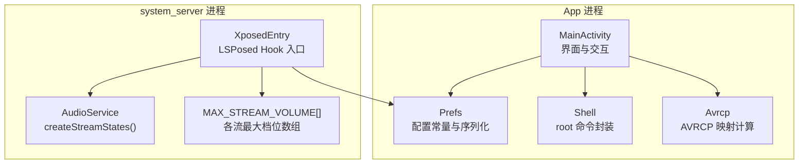
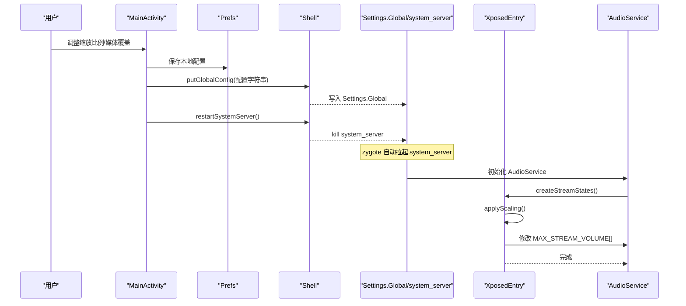
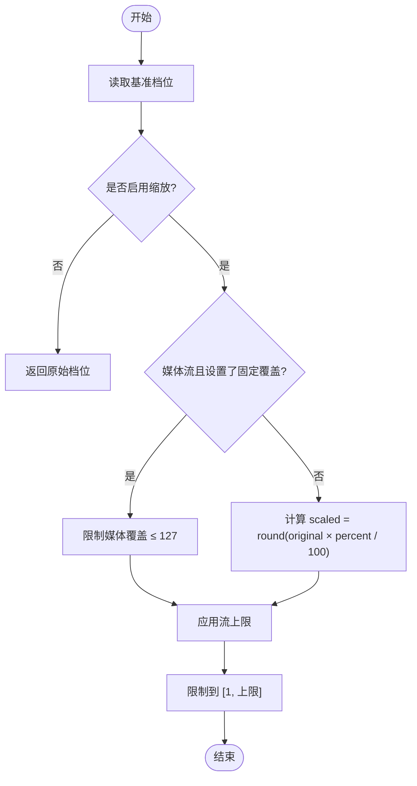
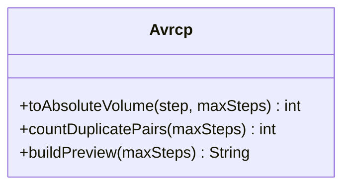
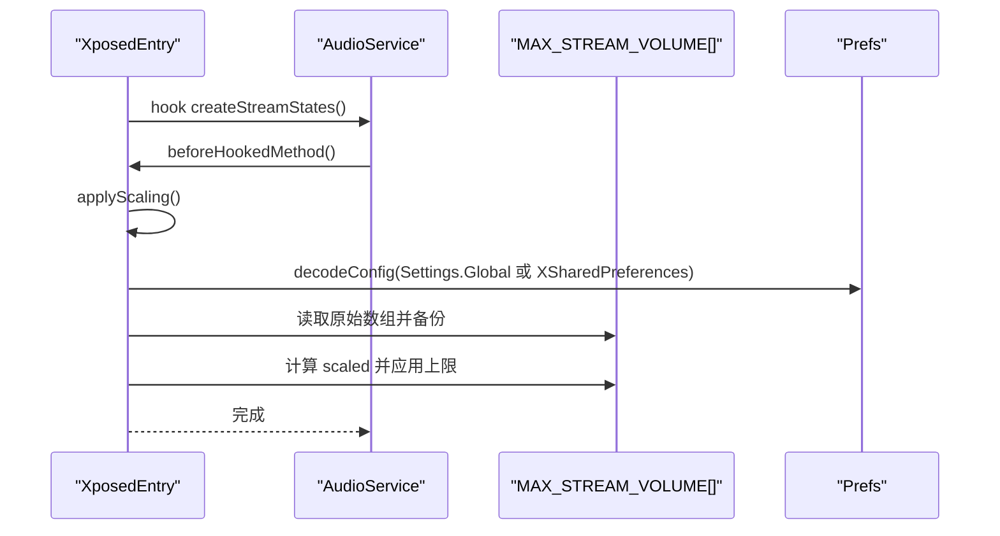
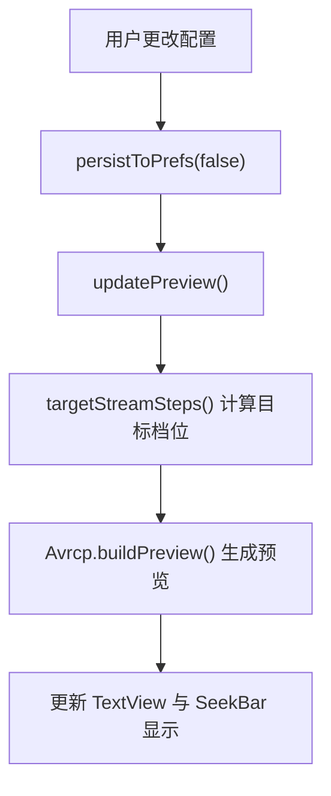
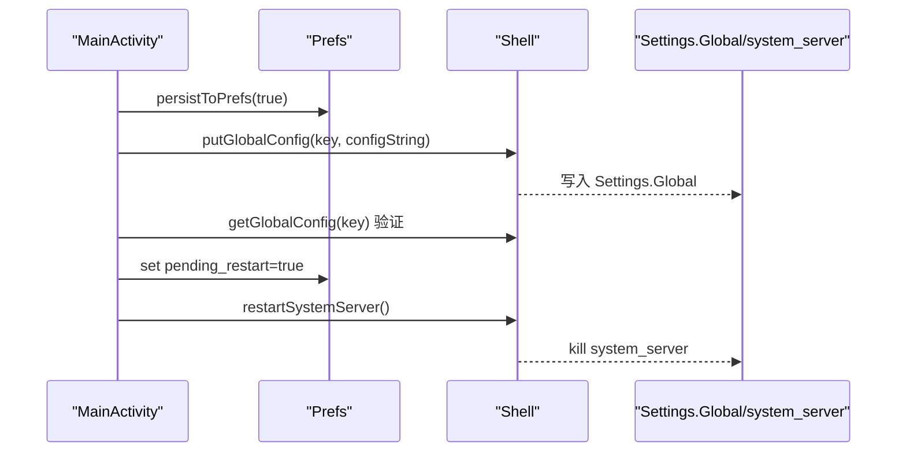
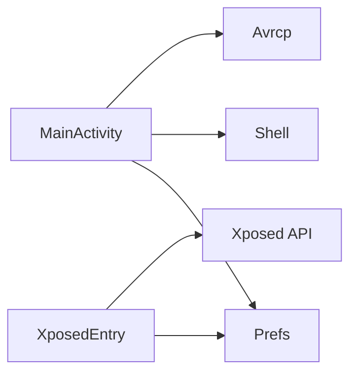

# 核心功能

<cite>
**本文引用的文件**   
- [XposedEntry.java](file://app/src/main/java/com/xiefeihong/volumecontrol/XposedEntry.java)
- [Avrcp.java](file://app/src/main/java/com/xiefeihong/volumecontrol/Avrcp.java)
- [MainActivity.java](file://app/src/main/java/com/xiefeihong/volumecontrol/MainActivity.java)
- [Prefs.java](file://app/src/main/java/com/xiefeihong/volumecontrol/Prefs.java)
- [Shell.java](file://app/src/main/java/com/xiefeihong/volumecontrol/Shell.java)
- [strings.xml](file://app/src/main/res/values/strings.xml)
- [arrays.xml](file://app/src/main/res/values/arrays.xml)
- [activity_main.xml](file://app/src/main/res/layout/activity_main.xml)
</cite>

## 目录
1. [引言](#引言)
2. [项目结构](#项目结构)
3. [核心组件](#核心组件)
4. [架构总览](#架构总览)
5. [详细组件分析](#详细组件分析)
6. [依赖关系分析](#依赖关系分析)
7. [性能与边界处理](#性能与边界处理)
8. [故障排查指南](#故障排查指南)
9. [结论](#结论)
10. [附录：使用场景与示例路径](#附录使用场景与示例路径)

## 引言
本技术文档围绕音量控制模块的核心能力展开，重点解释以下方面：
- 音量档位缩放算法：基准值采集、比例计算逻辑、边界处理机制。
- 蓝牙 AVRCP 优化：绝对音量映射算法、重复档位检测、低音量优化策略。
- 系统级 Hook 机制：XposedEntry 对 AudioService 的 Hook、MAX_STREAM_VOLUME 数组修改、配置读取与应用流程。
- 实时预览：配置变更监听、预览数据计算、UI 更新机制。
- 安全重启：system_server 进程管理、配置持久化、状态同步。

该方案通过 LSPosed 在 system_server 中拦截 AudioService 初始化过程，按比例缩放各音频流的音量档位数；同时提供 App 端 UI 进行配置、预览与软重启，确保媒体档位与蓝牙 AVRCP 映射更稳定、细腻。

## 项目结构
项目为 Android 应用 + LSPosed 模块入口的组合：
- App 层（MainActivity）负责用户交互、配置读写、预览计算、状态检测与安全重启。
- 工具层（Prefs、Shell、Avrcp）提供配置序列化、root shell 执行、AVRCP 映射计算。
- Hook 层（XposedEntry）在 system_server 中拦截 AudioService 初始化并修改 MAX_STREAM_VOLUME。

**图表来源**
- [MainActivity.java:23-50](file://app/src/main/java/com/xiefeihong/volumecontrol/MainActivity.java#L23-L50)
- [XposedEntry.java:16-28](file://app/src/main/java/com/xiefeihong/volumecontrol/XposedEntry.java#L16-L28)
- [Prefs.java:6-11](file://app/src/main/java/com/xiefeihong/volumecontrol/Prefs.java#L6-L11)

**章节来源**
- [MainActivity.java:23-50](file://app/src/main/java/com/xiefeihong/volumecontrol/MainActivity.java#L23-L50)
- [XposedEntry.java:16-28](file://app/src/main/java/com/xiefeihong/volumecontrol/XposedEntry.java#L16-L28)
- [Prefs.java:6-11](file://app/src/main/java/com/xiefeihong/volumecontrol/Prefs.java#L6-L11)

## 核心组件
- XposedEntry：LSPosed 模块入口，Hook AudioService.createStreamStates，按配置缩放 MAX_STREAM_VOLUME。
- MainActivity：主界面，负责配置输入、预览、状态检测、安全重启。
- Prefs：配置常量、序列化/反序列化、基准值存储、全局键名等。
- Shell：root shell 执行封装，包括 Settings.Global 读写与 system_server 软重启。
- Avrcp：蓝牙 AVRCP 绝对音量映射计算、重复档位统计、预览文本生成。

**章节来源**
- [XposedEntry.java:29-65](file://app/src/main/java/com/xiefeihong/volumecontrol/XposedEntry.java#L29-L65)
- [MainActivity.java:23-50](file://app/src/main/java/com/xiefeihong/volumecontrol/MainActivity.java#L23-L50)
- [Prefs.java:12-47](file://app/src/main/java/com/xiefeihong/volumecontrol/Prefs.java#L12-L47)
- [Shell.java:8-13](file://app/src/main/java/com/xiefeihong/volumecontrol/Shell.java#L8-L13)
- [Avrcp.java:3-19](file://app/src/main/java/com/xiefeihong/volumecontrol/Avrcp.java#L3-L19)

## 架构总览
整体流程分为两条主线：
- App 侧：用户设置 → 本地 SharedPreferences 持久化 → 写入 Settings.Global → 软重启 system_server。
- Hook 侧：system_server 启动时 AudioService 创建流状态 → Hook 拦截 → 按比例缩放 MAX_STREAM_VOLUME → 生效。

**图表来源**
- [MainActivity.java:261-296](file://app/src/main/java/com/xiefeihong/volumecontrol/MainActivity.java#L261-L296)
- [Shell.java:92-112](file://app/src/main/java/com/xiefeihong/volumecontrol/Shell.java#L92-L112)
- [XposedEntry.java:41-65](file://app/src/main/java/com/xiefeihong/volumecontrol/XposedEntry.java#L41-L65)
- [XposedEntry.java:67-114](file://app/src/main/java/com/xiefeihong/volumecontrol/XposedEntry.java#L67-L114)

## 详细组件分析

### 音量档位缩放算法
- 基准值采集：
  - 首次启动或用户主动采集时，调用 AudioManager.getStreamMaxVolume 获取各流当前最大值，存入 SharedPreferences（CSV 格式）。
  - 若未采集到有效基准，则回退默认值或显示“暂无数据”。
- 比例计算逻辑：
  - 目标档位 = round(原始档位 × 缩放百分比 / 100)。
  - 媒体流可被固定覆盖（mediaOverride），此时直接取固定值（上限 127）。
  - 非媒体流限制在其他流上限（OTHER_STREAM_MAX）。
- 边界处理机制：
  - 百分比范围限制在 PERCENT_MIN~PERCENT_MAX（25%~400%），步进 PERCENT_STEP（5%）。
  - 媒体流上限为 AVRCP_MAX_VOLUME（127），避免相邻档位映射相同。
  - 其他流上限为 OTHER_STREAM_MAX（150）。
  - 最终档位下限为 1，防止静音或无效档位。

**图表来源**
- [MainActivity.java:175-191](file://app/src/main/java/com/xiefeihong/volumecontrol/MainActivity.java#L175-L191)
- [Prefs.java:26-47](file://app/src/main/java/com/xiefeihong/volumecontrol/Prefs.java#L26-L47)

**章节来源**
- [MainActivity.java:123-128](file://app/src/main/java/com/xiefeihong/volumecontrol/MainActivity.java#L123-L128)
- [MainActivity.java:158-191](file://app/src/main/java/com/xiefeihong/volumecontrol/MainActivity.java#L158-L191)
- [Prefs.java:26-47](file://app/src/main/java/com/xiefeihong/volumecontrol/Prefs.java#L26-L47)

### 蓝牙 AVRCP 优化
- 绝对音量映射算法：
  - AOSP 蓝牙模块将手机媒体档位换算为 AVRCP 绝对音量（0~127）：absVolume = round(档位 × 127 / 最大档位)。
  - 当媒体档位数 > 127 时，必然出现相邻两档映射到同一 AVRCP 音量，表现为耳机音量相同。
  - 当媒体档位数过少时，每档跨度过大，低音量区不够细腻。
  - 第 1 档的 absVolume 很小，部分耳机在极低 AVRCP 音量下无声。
- 重复档位检测：
  - 遍历 2..maxSteps，统计相邻档位映射后相同的对数。
- 低音量优化策略：
  - 建议提高缩放比例（例如 200%），使媒体档位处于更合适的区间，提升低音区细腻度。
  - 媒体档位上限控制在 127，保证 AVRCP 一一对应，避免重复映射。

**图表来源**
- [Avrcp.java:25-42](file://app/src/main/java/com/xiefeihong/volumecontrol/Avrcp.java#L25-L42)
- [Avrcp.java:44-88](file://app/src/main/java/com/xiefeihong/volumecontrol/Avrcp.java#L44-L88)

**章节来源**
- [Avrcp.java:3-19](file://app/src/main/java/com/xiefeihong/volumecontrol/Avrcp.java#L3-L19)
- [Avrcp.java:25-42](file://app/src/main/java/com/xiefeihong/volumecontrol/Avrcp.java#L25-L42)
- [Avrcp.java:44-88](file://app/src/main/java/com/xiefeihong/volumecontrol/Avrcp.java#L44-L88)

### 系统级 Hook 机制
- AudioService Hook：
  - 在 handleLoadPackage 中定位 android 包下的 com.android.server.audio.AudioService，hook createStreamStates 方法。
  - beforeHookedMethod 中调用 applyScaling，在 AudioService 创建流状态前修改 MAX_STREAM_VOLUME。
- MAX_STREAM_VOLUME 数组修改：
  - 读取静态字段 MAX_STREAM_VOLUME，类型校验为 int[]。
  - 备份原始数组 sOriginalMaxStreamVolumes，避免重复缩放。
  - 对每个流计算 scaled，媒体流支持 mediaOverride 覆盖。
  - 应用流上限限制（媒体 127，其他 150），并确保最小值为 1。
- 配置读取与应用流程：
  - 优先从 Settings.Global 读取配置（system_server 可访问），失败回退到 XSharedPreferences。
  - 配置解码为 {enabled, percent, mediaOverride}，再应用到数组。

**图表来源**
- [XposedEntry.java:41-65](file://app/src/main/java/com/xiefeihong/volumecontrol/XposedEntry.java#L41-L65)
- [XposedEntry.java:67-114](file://app/src/main/java/com/xiefeihong/volumecontrol/XposedEntry.java#L67-L114)
- [XposedEntry.java:122-146](file://app/src/main/java/com/xiefeihong/volumecontrol/XposedEntry.java#L122-L146)
- [Prefs.java:56-82](file://app/src/main/java/com/xiefeihong/volumecontrol/Prefs.java#L56-L82)

**章节来源**
- [XposedEntry.java:41-65](file://app/src/main/java/com/xiefeihong/volumecontrol/XposedEntry.java#L41-L65)
- [XposedEntry.java:67-114](file://app/src/main/java/com/xiefeihong/volumecontrol/XposedEntry.java#L67-L114)
- [XposedEntry.java:122-146](file://app/src/main/java/com/xiefeihong/volumecontrol/XposedEntry.java#L122-L146)

### 实时预览功能
- 配置变更监听：
  - Switch 与 SeekBar 的监听器在进度变化时调用 persistToPrefs(false) 与 updatePreview()。
- 预览数据计算：
  - currentPercent() 与 currentMediaOverride() 计算当前配置。
  - targetStreamSteps() 计算各流的目标档位（与 Hook 端一致）。
  - Avrcp.buildPreview(targetMedia) 生成蓝牙 AVRCP 映射预览文本。
- UI 更新机制：
  - 更新百分比、媒体档位提示、各流原始→目标预览、AVRCP 摘要与明细。

**图表来源**
- [MainActivity.java:60-83](file://app/src/main/java/com/xiefeihong/volumecontrol/MainActivity.java#L60-L83)
- [MainActivity.java:145-191](file://app/src/main/java/com/xiefeihong/volumecontrol/MainActivity.java#L145-L191)
- [MainActivity.java:193-231](file://app/src/main/java/com/xiefeihong/volumecontrol/MainActivity.java#L193-L231)
- [Avrcp.java:44-88](file://app/src/main/java/com/xiefeihong/volumecontrol/Avrcp.java#L44-L88)

**章节来源**
- [MainActivity.java:60-83](file://app/src/main/java/com/xiefeihong/volumecontrol/MainActivity.java#L60-L83)
- [MainActivity.java:145-191](file://app/src/main/java/com/xiefeihong/volumecontrol/MainActivity.java#L145-L191)
- [MainActivity.java:193-231](file://app/src/main/java/com/xiefeihong/volumecontrol/MainActivity.java#L193-L231)

### 安全重启机制
- system_server 进程管理：
  - 通过 Shell.restartSystemServer() 执行 root 命令杀死 system_server，zygote 自动拉起。
- 配置持久化：
  - 先调用 persistToPrefs(true) 同步写入 SharedPreferences。
  - 再通过 Shell.putGlobalConfig 写入 Settings.Global，并读回验证。
- 状态同步：
  - 刷新状态时，若 root 可用，主动将当前配置写入 Settings.Global，确保 Hook 端优先读取。
  - 标记 pending_restart 标志位，用于提示用户需软重启。

**图表来源**
- [MainActivity.java:261-296](file://app/src/main/java/com/xiefeihong/volumecontrol/MainActivity.java#L261-L296)
- [Shell.java:92-112](file://app/src/main/java/com/xiefeihong/volumecontrol/Shell.java#L92-L112)

**章节来源**
- [MainActivity.java:261-296](file://app/src/main/java/com/xiefeihong/volumecontrol/MainActivity.java#L261-L296)
- [Shell.java:92-112](file://app/src/main/java/com/xiefeihong/volumecontrol/Shell.java#L92-L112)

## 依赖关系分析
- MainActivity 依赖：
  - Prefs：配置常量、序列化、基准值存取。
  - Shell：root shell 操作、Settings.Global 读写、system_server 重启。
  - Avrcp：蓝牙 AVRCP 映射预览。
- XposedEntry 依赖：
  - Prefs：配置解码、常量定义。
  - Xposed API：Hook AudioService、反射 MAX_STREAM_VOLUME。
- 耦合与内聚：
  - Prefs 作为共享配置中心，被 App 与 Hook 两端复用，保持高内聚。
  - MainActivity 与 Shell 松耦合，便于测试与替换实现。
  - Avrcp 纯函数式工具类，无外部依赖，易于扩展。

**图表来源**
- [MainActivity.java:1-22](file://app/src/main/java/com/xiefeihong/volumecontrol/MainActivity.java#L1-L22)
- [XposedEntry.java:1-15](file://app/src/main/java/com/xiefeihong/volumecontrol/XposedEntry.java#L1-L15)

**章节来源**
- [MainActivity.java:1-22](file://app/src/main/java/com/xiefeihong/volumecontrol/MainActivity.java#L1-L22)
- [XposedEntry.java:1-15](file://app/src/main/java/com/xiefeihong/volumecontrol/XposedEntry.java#L1-L15)

## 性能与边界处理
- 性能考虑：
  - 所有 root 与系统查询操作在单线程 Executor 中串行执行，避免并发竞争。
  - UI 更新通过 Handler 切回主线程，保证线程安全。
  - 配置序列化/反序列化轻量，预览计算 O(n)，n 为媒体档位数（≤127）。
- 边界处理：
  - 百分比范围限制（25%~400%），步进 5%。
  - 媒体流上限 127，其他流上限 150，最小值 1。
  - 基准值缺失时回退默认值或显示“暂无数据”。
  - Settings.Global 写入失败时提示用户并保留本地配置。

[本节为通用指导，不直接分析具体文件]

## 故障排查指南
- Root 不可用：
  - 检查 su 授权与权限，确认 isRootAvailable() 返回 true。
- LSPosed 未安装：
  - 检查 /data/adb/lspd 是否存在，isLsposedPresent() 返回 true。
- 模块未生效：
  - 确认已在 LSPosed 中启用模块并勾选「系统框架」。
  - 检查 Settings.Global 是否已写入配置，readBack 验证是否成功。
  - 确认已软重启 system_server，实际媒体档位等于目标档位。
- 蓝牙音量问题：
  - 检查 AVRCP 映射预览，确认无重复档位。
  - 适当提高缩放比例，避免低音量无声。

**章节来源**
- [Shell.java:74-84](file://app/src/main/java/com/xiefeihong/volumecontrol/Shell.java#L74-L84)
- [MainActivity.java:300-366](file://app/src/main/java/com/xiefeihong/volumecontrol/MainActivity.java#L300-L366)

## 结论
该音量控制模块通过 LSPosed Hook 与 App 端 UI 协同工作，实现了：
- 精确的音量档位缩放算法，支持基准值采集、比例计算与边界保护。
- 蓝牙 AVRCP 优化，避免重复映射与低音量无声问题。
- 安全的系统级配置与重启机制，确保配置持久化与状态同步。
- 实时预览功能，帮助用户直观理解配置效果。

开发者可基于本文档快速理解各功能的实现细节，并在需要时扩展或定制相关逻辑。

[本节为总结性内容，不直接分析具体文件]

## 附录：使用场景与示例路径
- 场景一：用户希望增加媒体档位以提升蓝牙耳机低音细腻度。
  - 操作步骤：启用缩放 → 设置 200% → 预览 AVRCP 映射 → 应用并软重启。
  - 参考路径：
    - [MainActivity.java:84-87](file://app/src/main/java/com/xiefeihong/volumecontrol/MainActivity.java#L84-L87)
    - [MainActivity.java:193-231](file://app/src/main/java/com/xiefeihong/volumecontrol/MainActivity.java#L193-L231)
    - [MainActivity.java:261-296](file://app/src/main/java/com/xiefeihong/volumecontrol/MainActivity.java#L261-L296)

- 场景二：用户希望固定媒体档位为 127，确保 AVRCP 一一对应。
  - 操作步骤：启用媒体覆盖 → 设置为 127 → 预览 → 应用并软重启。
  - 参考路径：
    - [MainActivity.java:149-151](file://app/src/main/java/com/xiefeihong/volumecontrol/MainActivity.java#L149-L151)
    - [MainActivity.java:184-190](file://app/src/main/java/com/xiefeihong/volumecontrol/MainActivity.java#L184-L190)
    - [Prefs.java:41-41](file://app/src/main/java/com/xiefeihong/volumecontrol/Prefs.java#L41-L41)

- 场景三：恢复系统默认档位。
  - 操作步骤：点击恢复默认 → 关闭缩放 → 应用并软重启。
  - 参考路径：
    - [MainActivity.java:110-120](file://app/src/main/java/com/xiefeihong/volumecontrol/MainActivity.java#L110-L120)
    - [MainActivity.java:261-296](file://app/src/main/java/com/xiefeihong/volumecontrol/MainActivity.java#L261-L296)