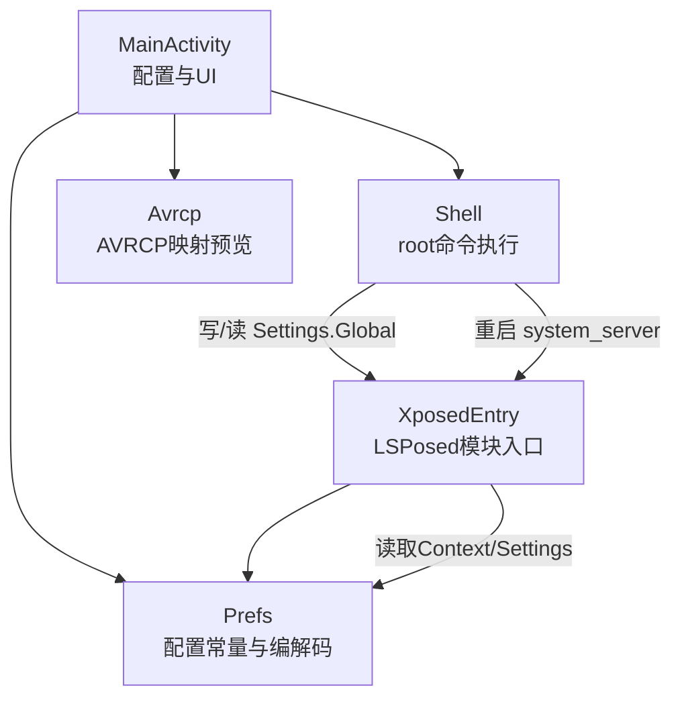
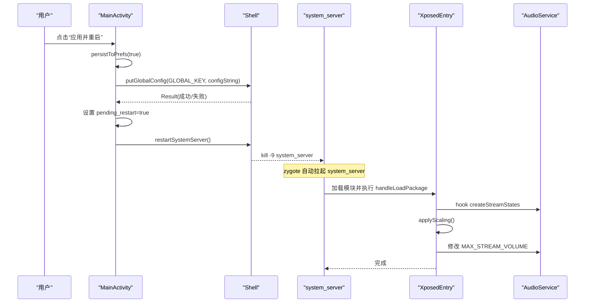
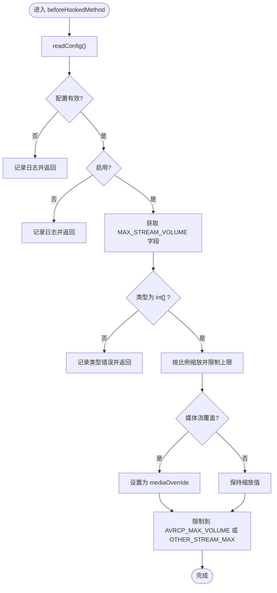
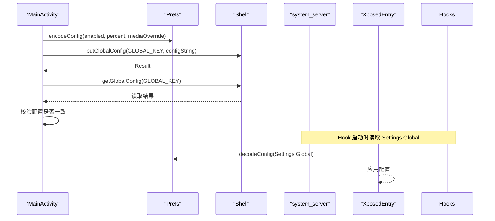
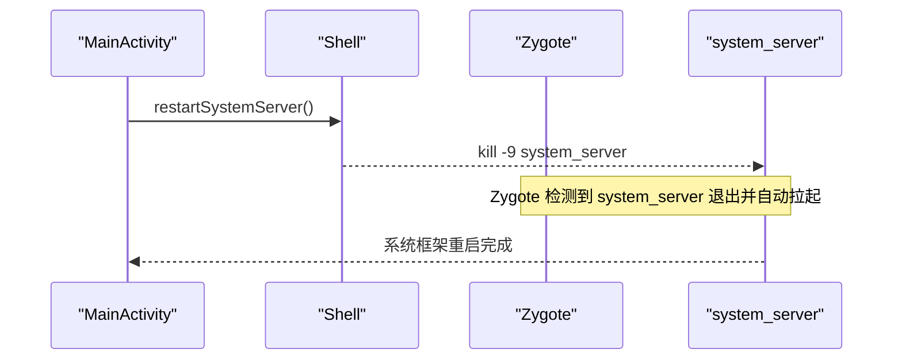
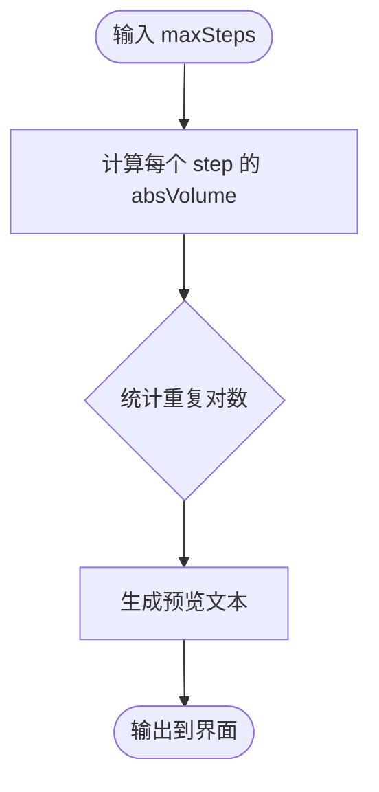
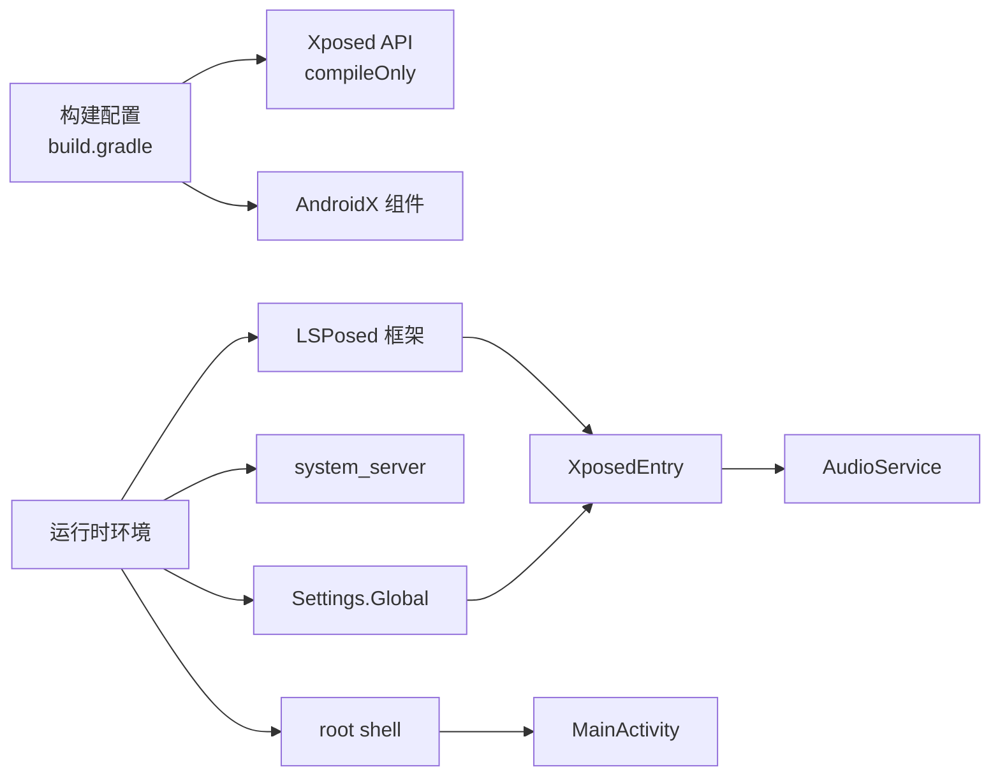

# 系统级Hook机制

<cite>
**本文引用的文件**
- [XposedEntry.java](file://app/src/main/java/com/xiefeihong/volumecontrol/XposedEntry.java)
- [MainActivity.java](file://app/src/main/java/com/xiefeihong/volumecontrol/MainActivity.java)
- [Prefs.java](file://app/src/main/java/com/xiefeihong/volumecontrol/Prefs.java)
- [Shell.java](file://app/src/main/java/com/xiefeihong/volumecontrol/Shell.java)
- [Avrcp.java](file://app/src/main/java/com/xiefeihong/volumecontrol/Avrcp.java)
- [AndroidManifest.xml](file://app/src/main/AndroidManifest.xml)
- [build.gradle](file://app/build.gradle)
</cite>

## 目录
1. [简介](#简介)
2. [项目结构](#项目结构)
3. [核心组件](#核心组件)
4. [架构总览](#架构总览)
5. [详细组件分析](#详细组件分析)
6. [依赖关系分析](#依赖关系分析)
7. [性能考量](#性能考量)
8. [故障排查指南](#故障排查指南)
9. [结论](#结论)
10. [附录](#附录)

## 简介
本技术文档围绕一个基于 Xposed/LSPosed 的系统级 Hook 模块，实现对 Android 系统音频音量档位的动态调整。模块通过 Hook system_server 进程中的 AudioService，拦截其初始化流程并修改内部音量档位数组，从而改变媒体及各类音频流的音量步进数量。同时提供用户界面用于配置、预览与触发系统框架软重启，使新配置生效。

该方案的核心要点包括：
- LSPosed 模块入口与系统服务拦截
- MAX_STREAM_VOLUME 数组的 Hook 点选择与替换逻辑
- 配置持久化（Settings.Global）与多进程同步
- 安全重启 system_server 的策略
- 蓝牙 AVRCP 绝对音量映射分析与预览

## 项目结构
本项目为 Android 应用工程，包含：
- 模块入口类：实现 IXposedHookLoadPackage，在目标包加载时执行 Hook 注册
- 主界面：负责配置采集、预览、写入 Settings.Global 与触发 system_server 软重启
- 配置工具：定义常量、编码/解码配置字符串、基准档位序列化工具
- Shell 工具：封装 root shell 命令，用于读写 Settings.Global 与重启 system_server
- AVRCP 计算：根据 AOSP 蓝牙模块换算公式，生成媒体档位到 AVRCP 音量的映射预览

图表来源
- [XposedEntry.java:41-65](file://app/src/main/java/com/xiefeihong/volumecontrol/XposedEntry.java#L41-L65)
- [MainActivity.java:261-296](file://app/src/main/java/com/xiefeihong/volumecontrol/MainActivity.java#L261-L296)
- [Prefs.java:56-82](file://app/src/main/java/com/xiefeihong/volumecontrol/Prefs.java#L56-L82)
- [Shell.java:96-112](file://app/src/main/java/com/xiefeihong/volumecontrol/Shell.java#L96-L112)

章节来源
- [AndroidManifest.xml:21-36](file://app/src/main/AndroidManifest.xml#L21-L36)
- [build.gradle:38-43](file://app/build.gradle#L38-L43)

## 核心组件
- XposedEntry：LSPosed 模块入口，针对 android 包进行 Hook，拦截 AudioService.createStreamStates，按配置缩放 MAX_STREAM_VOLUME 数组。
- MainActivity：用户界面，负责采集基准档位、计算目标档位、预览 AVRCP 映射、写入 Settings.Global、触发 system_server 软重启。
- Prefs：跨进程共享的配置常量与编解码工具，支持将启用状态、百分比、媒体覆盖档位序列化到 Settings.Global。
- Shell：封装 su 命令执行，提供 isRootAvailable、isLsposedPresent、putGlobalConfig、getGlobalConfig、restartSystemServer 等能力。
- Avrcp：依据 AOSP 蓝牙模块换算公式，计算媒体档位到 AVRCP 绝对音量的映射，并提供重复档位统计与预览文本。

章节来源
- [XposedEntry.java:16-28](file://app/src/main/java/com/xiefeihong/volumecontrol/XposedEntry.java#L16-L28)
- [MainActivity.java:23-25](file://app/src/main/java/com/xiefeihong/volumecontrol/MainActivity.java#L23-L25)
- [Prefs.java:6-11](file://app/src/main/java/com/xiefeihong/volumecontrol/Prefs.java#L6-L11)
- [Shell.java:8-12](file://app/src/main/java/com/xiefeihong/volumecontrol/Shell.java#L8-L12)
- [Avrcp.java:3-19](file://app/src/main/java/com/xiefeihong/volumecontrol/Avrcp.java#L3-L19)

## 架构总览
整体架构分为“用户界面层”、“配置与工具层”、“系统 Hook 层”三部分：
- 用户界面层：MainActivity 提供交互，调用 Shell 写入 Settings.Global，并在必要时触发 system_server 软重启。
- 配置与工具层：Prefs 提供配置编码/解码与常量；Avrcp 提供 AVRCP 映射计算；Shell 提供 root 命令执行。
- 系统 Hook 层：XposedEntry 在 system_server 中运行，Hook AudioService.createStreamStates，读取配置并修改 MAX_STREAM_VOLUME。

图表来源
- [MainActivity.java:261-296](file://app/src/main/java/com/xiefeihong/volumecontrol/MainActivity.java#L261-L296)
- [Shell.java:96-112](file://app/src/main/java/com/xiefeihong/volumecontrol/Shell.java#L96-L112)
- [XposedEntry.java:41-65](file://app/src/main/java/com/xiefeihong/volumecontrol/XposedEntry.java#L41-L65)
- [XposedEntry.java:67-114](file://app/src/main/java/com/xiefeihong/volumecontrol/XposedEntry.java#L67-L114)

## 详细组件分析

### LSPosed 模块入口与系统服务拦截（XposedEntry）
- 模块声明：通过 AndroidManifest 的 xposedmodule、xposeddescription、xposedminversion、xposedscope、xposedsharedprefs 元数据声明为 LSPosed 模块，并指定作用域为 android 包。
- 入口实现：XposedEntry 实现 IXposedHookLoadPackage，在 handleLoadPackage 中判断目标包名，使用 XposedHelpers.findClass 获取 AudioService 类，并使用 XposedBridge.hookAllMethods 对 createStreamStates 方法进行 beforeHookedMethod 拦截。
- Hook 逻辑：在 beforeHookedMethod 中调用 applyScaling，读取配置后对 MAX_STREAM_VOLUME 数组进行原地缩放与限制，确保媒体流可被 AVRCP_MAX_VOLUME 限制，其他流受 OTHER_STREAM_MAX 限制。
- 配置读取：优先从 Context 的 ContentResolver 读取 Settings.Global 中的 GLOBAL_KEY 配置，若失败则回退到 XSharedPreferences 读取本地配置。
- 异常处理：所有关键路径均包裹 try-catch，并通过 XposedBridge.log 记录错误信息，避免 Hook 导致系统崩溃。

图表来源
- [XposedEntry.java:51-59](file://app/src/main/java/com/xiefeihong/volumecontrol/XposedEntry.java#L51-L59)
- [XposedEntry.java:67-114](file://app/src/main/java/com/xiefeihong/volumecontrol/XposedEntry.java#L67-L114)
- [XposedEntry.java:122-146](file://app/src/main/java/com/xiefeihong/volumecontrol/XposedEntry.java#L122-L146)

章节来源
- [AndroidManifest.xml:21-36](file://app/src/main/AndroidManifest.xml#L21-L36)
- [XposedEntry.java:41-65](file://app/src/main/java/com/xiefeihong/volumecontrol/XposedEntry.java#L41-L65)
- [XposedEntry.java:67-114](file://app/src/main/java/com/xiefeihong/volumecontrol/XposedEntry.java#L67-L114)
- [XposedEntry.java:122-146](file://app/src/main/java/com/xiefeihong/volumecontrol/XposedEntry.java#L122-L146)

### 配置持久化与多进程同步（Prefs + Shell + MainActivity）
- 配置结构：启用开关、缩放百分比、媒体覆盖档位三个字段，编码为分号分隔的字符串，便于写入 Settings.Global。
- 持久化策略：
  - App 端：使用 SharedPreferences 保存当前配置与基准档位。
  - 系统端：通过 Shell.putGlobalConfig 写入 Settings.Global，供 system_server 中的 Hook 读取。
- 多进程同步：
  - Hook 端优先读取 Settings.Global，保证 system_server 能访问全局配置。
  - App 端在刷新状态时主动同步配置到 Settings.Global，确保 Hook 端始终读到最新值。
- 校验机制：写入后通过 Shell.getGlobalConfig 读取并校验是否包含期望配置串，提升可靠性。

图表来源
- [Prefs.java:56-82](file://app/src/main/java/com/xiefeihong/volumecontrol/Prefs.java#L56-L82)
- [Shell.java:96-103](file://app/src/main/java/com/xiefeihong/volumecontrol/Shell.java#L96-L103)
- [MainActivity.java:261-288](file://app/src/main/java/com/xiefeihong/volumecontrol/MainActivity.java#L261-L288)
- [XposedEntry.java:122-146](file://app/src/main/java/com/xiefeihong/volumecontrol/XposedEntry.java#L122-L146)

章节来源
- [Prefs.java:56-82](file://app/src/main/java/com/xiefeihong/volumecontrol/Prefs.java#L56-L82)
- [Shell.java:96-103](file://app/src/main/java/com/xiefeihong/volumecontrol/Shell.java#L96-L103)
- [MainActivity.java:261-288](file://app/src/main/java/com/xiefeihong/volumecontrol/MainActivity.java#L261-L288)
- [XposedEntry.java:122-146](file://app/src/main/java/com/xiefeihong/volumecontrol/XposedEntry.java#L122-L146)

### 进程重启机制（restartSystemServer）
- 触发时机：用户在界面确认“应用并重启”，App 先写入 Settings.Global，再延迟一段时间后调用 Shell.restartSystemServer。
- 实现方式：通过 su 执行 if 条件判断，优先使用 pidof 定位 system_server 进程并发送 SIGKILL；若无 pidof，则使用 killall 终止进程。
- 安全策略：
  - 仅在 root 可用且 LSPosed 存在时提示用户操作。
  - 写入配置后进行读取校验，确保配置已落盘。
  - 使用单线程 Executor 串行执行 root 操作，避免并发冲突。
  - 捕获 RuntimeException，防止页面销毁导致的线程池关闭异常。

图表来源
- [Shell.java:109-112](file://app/src/main/java/com/xiefeihong/volumecontrol/Shell.java#L109-L112)
- [MainActivity.java:290-296](file://app/src/main/java/com/xiefeihong/volumecontrol/MainActivity.java#L290-L296)

章节来源
- [Shell.java:109-112](file://app/src/main/java/com/xiefeihong/volumecontrol/Shell.java#L109-L112)
- [MainActivity.java:290-296](file://app/src/main/java/com/xiefeihong/volumecontrol/MainActivity.java#L290-L296)

### 蓝牙 AVRCP 映射与预览（Avrcp + MainActivity）
- 换算公式：依据 AOSP 蓝牙模块，absVolume = round(档位 * 127 / 最大档位)。
- 重复档位统计：当媒体档位数超过 127 时，相邻档位可能映射到相同 AVRCP 音量，导致听感无变化。
- 预览功能：界面显示媒体档位到 AVRCP 的映射表，并提示第 1 档的低音量表现，帮助用户评估配置效果。
- 集成点：MainActivity.updatePreview 调用 Avrcp.buildPreview 生成预览文本并展示。

图表来源
- [Avrcp.java:25-42](file://app/src/main/java/com/xiefeihong/volumecontrol/Avrcp.java#L25-L42)
- [Avrcp.java:49-88](file://app/src/main/java/com/xiefeihong/volumecontrol/Avrcp.java#L49-L88)
- [MainActivity.java:193-231](file://app/src/main/java/com/xiefeihong/volumecontrol/MainActivity.java#L193-L231)

章节来源
- [Avrcp.java:25-42](file://app/src/main/java/com/xiefeihong/volumecontrol/Avrcp.java#L25-L42)
- [Avrcp.java:49-88](file://app/src/main/java/com/xiefeihong/volumecontrol/Avrcp.java#L49-L88)
- [MainActivity.java:193-231](file://app/src/main/java/com/xiefeihong/volumecontrol/MainActivity.java#L193-L231)

### 权限管理与调试技巧
- 权限要求：
  - root 权限：用于执行 su 命令、写入 Settings.Global、重启 system_server。
  - LSPosed 模块：需安装并启用模块，且在 android 包作用域内生效。
- 调试技巧：
  - 使用 XposedBridge.log 记录 Hook 过程与配置读取结果。
  - 在界面中查看“状态检测”区域，确认 root、LSPosed、音量实际值与目标值是否一致。
  - 通过 Shell.getGlobalConfig 校验配置写入是否成功。
  - 观察蓝牙设备连接情况，评估 AVRCP 映射是否符合预期。

章节来源
- [Shell.java:74-84](file://app/src/main/java/com/xiefeihong/volumecontrol/Shell.java#L74-L84)
- [MainActivity.java:300-366](file://app/src/main/java/com/xiefeihong/volumecontrol/MainActivity.java#L300-L366)
- [XposedEntry.java:51-64](file://app/src/main/java/com/xiefeihong/volumecontrol/XposedEntry.java#L51-L64)

## 依赖关系分析
- 编译期依赖：
  - Xposed API：compileOnly 'de.robv.android.xposed:api:82'，仅编译期需要，运行期由 LSPosed 提供。
  - AndroidX 组件：appcompat、material。
- 运行时依赖：
  - LSPosed：提供 Hook 能力与模块加载机制。
  - system_server：被 Hook 的目标进程，AudioService 在其中运行。
  - Settings.Global：作为跨进程配置通道。
  - root shell：用于系统级操作。

图表来源
- [build.gradle:38-43](file://app/build.gradle#L38-L43)
- [XposedEntry.java:41-65](file://app/src/main/java/com/xiefeihong/volumecontrol/XposedEntry.java#L41-L65)
- [Shell.java:96-112](file://app/src/main/java/com/xiefeihong/volumecontrol/Shell.java#L96-L112)

章节来源
- [build.gradle:38-43](file://app/build.gradle#L38-L43)
- [AndroidManifest.xml:21-36](file://app/src/main/AndroidManifest.xml#L21-L36)

## 性能考量
- Hook 开销：仅在 AudioService.createStreamStates 执行前进行一次配置读取与数组缩放，开销极小。
- 配置读取：优先读取 Settings.Global，避免频繁 I/O；回退到 XSharedPreferences 时进行 reload，确保最新值。
- 进程重启：system_server 重启会短暂影响系统服务，建议在用户明确确认后执行，并给出提示。
- 蓝牙映射：AVRCP 计算为 O(n)，n 为媒体档位数，通常较小，不影响性能。

[本节为通用性能讨论，不直接分析具体文件]

## 故障排查指南
- 无法 Hook：
  - 检查 LSPosed 是否安装并启用，模块是否添加到 android 包作用域。
  - 查看 XposedBridge.log 是否有 Hook 失败日志。
- 配置未生效：
  - 确认 Settings.Global 中 GLOBAL_KEY 的值是否正确写入。
  - 检查 Hook 端 readConfig 是否成功解析配置。
  - 确认是否已触发 system_server 软重启。
- 蓝牙音量异常：
  - 查看 Avrcp 预览，确认是否存在大量重复档位。
  - 检查耳机低音量限制，第 1 档 AVRCP 值过低可能导致无声。
- 重启失败：
  - 确认 root 权限可用，su 命令可执行。
  - 检查 Shell.restartSystemServer 返回值，确认 system_server 是否被终止。

章节来源
- [XposedEntry.java:51-64](file://app/src/main/java/com/xiefeihong/volumecontrol/XposedEntry.java#L51-L64)
- [Shell.java:74-112](file://app/src/main/java/com/xiefeihong/volumecontrol/Shell.java#L74-L112)
- [MainActivity.java:300-366](file://app/src/main/java/com/xiefeihong/volumecontrol/MainActivity.java#L300-L366)

## 结论
本模块通过 LSPosed 在 system_server 中 Hook AudioService 的初始化流程，动态修改 MAX_STREAM_VOLUME 数组，实现系统音量档位的自定义调整。结合 Settings.Global 的多进程配置同步与 root shell 的安全重启策略，提供了稳定可靠的系统级音量控制方案。界面提供的 AVRCP 映射预览帮助用户直观评估配置效果，避免蓝牙音量映射带来的体验问题。

[本节为总结性内容，不直接分析具体文件]

## 附录
- 关键常量说明：
  - PERCENT_MIN/MAX/STEP/DEFAULT：缩放比例范围与默认值。
  - STREAM_MUSIC_INDEX：媒体流索引。
  - AVRCP_MAX_VOLUME：蓝牙 AVRCP 绝对音量上限。
  - OTHER_STREAM_MAX：非媒体流的安全上限。
  - STREAM_COUNT：AudioService.MAX_STREAM_VOLUME 数组长度。
- 配置键说明：
  - GLOBAL_KEY：Settings.Global 中的配置键。
  - KEY_ENABLED/KEY_PERCENT/KEY_MEDIA_OVERRIDE：启用开关、缩放百分比、媒体覆盖档位。
  - KEY_BASELINE：基准档位序列化的 CSV 字符串。
  - KEY_PENDING_RESTART：待重启标志。

章节来源
- [Prefs.java:20-47](file://app/src/main/java/com/xiefeihong/volumecontrol/Prefs.java#L20-L47)
- [Prefs.java:56-82](file://app/src/main/java/com/xiefeihong/volumecontrol/Prefs.java#L56-L82)