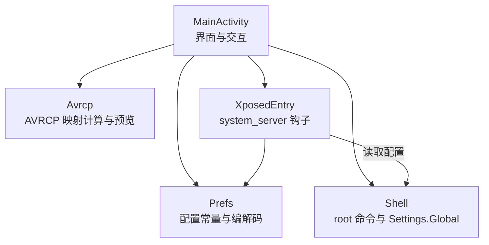
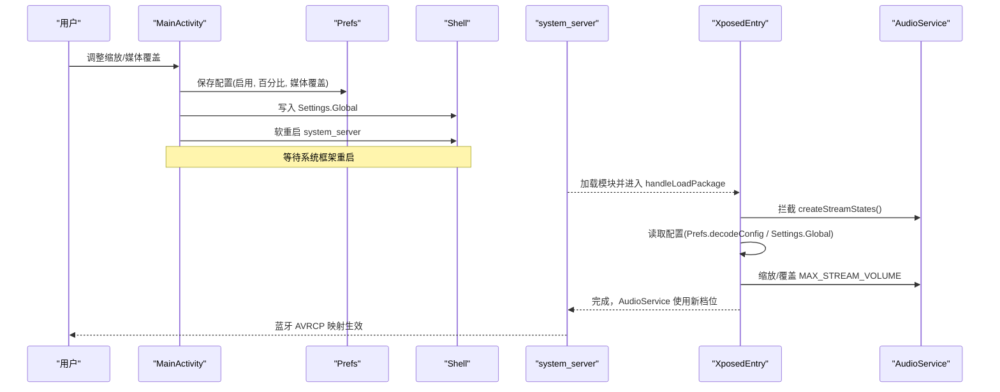
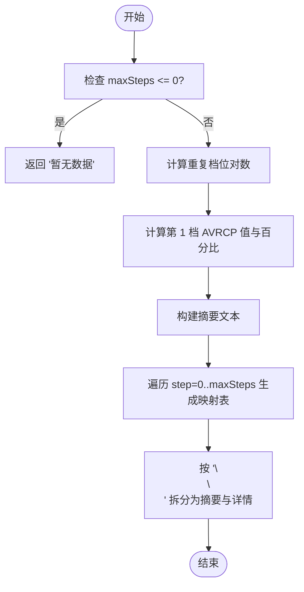
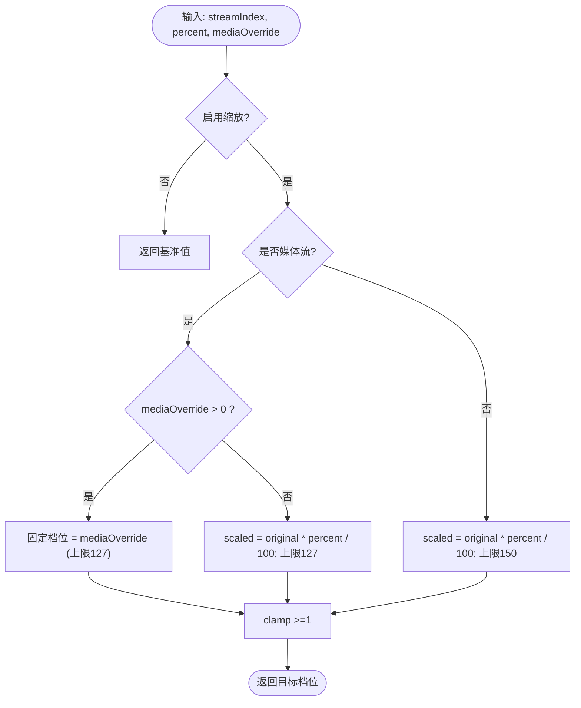
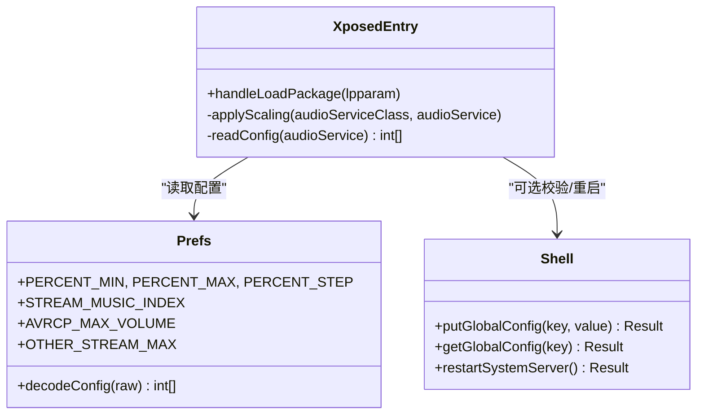
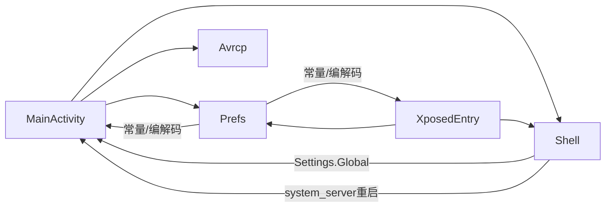

# 蓝牙AVRCP优化

<cite>
**本文引用的文件**
- [Avrcp.java](file://app/src/main/java/com/xiefeihong/volumecontrol/Avrcp.java)
- [MainActivity.java](file://app/src/main/java/com/xiefeihong/volumecontrol/MainActivity.java)
- [Prefs.java](file://app/src/main/java/com/xiefeihong/volumecontrol/Prefs.java)
- [Shell.java](file://app/src/main/java/com/xiefeihong/volumecontrol/Shell.java)
- [XposedEntry.java](file://app/src/main/java/com/xiefeihong/volumecontrol/XposedEntry.java)
- [strings.xml](file://app/src/main/res/values/strings.xml)
- [arrays.xml](file://app/src/main/res/values/arrays.xml)
- [activity_main.xml](file://app/src/main/res/layout/activity_main.xml)
</cite>

## 目录
1. [简介](#简介)
2. [项目结构](#项目结构)
3. [核心组件](#核心组件)
4. [架构总览](#架构总览)
5. [详细组件分析](#详细组件分析)
6. [依赖关系分析](#依赖关系分析)
7. [性能考量](#性能考量)
8. [故障排查指南](#故障排查指南)
9. [结论](#结论)
10. [附录](#附录)

## 简介
本技术文档围绕“蓝牙 AVRCP 绝对音量映射优化”展开，目标是解释 AVRCP 协议原理、AOSP 蓝牙模块的音量换算机制、与本地音量的同步问题，并深入剖析本项目的实现：包括音量映射算法（buildPreview、重复档位检测、低音量优化）、媒体覆盖功能（currentMediaOverride、固定音量模式与缩放模式的切换逻辑）、预览生成机制（输出格式、映射表生成、用户体验优化），以及错误处理、兼容性考虑和性能优化实践。

## 项目结构
本项目由应用层（UI与配置）、系统框架 Hook 层（修改 AudioService 档位数组）与工具层（Shell 执行、配置常量）组成。界面提供可视化调节与预览；Hook 在 system_server 启动时拦截 AudioService 创建流状态的过程，按配置缩放各音频流的档位数；Shell 负责 root 命令执行与 Settings.Global 读写；Prefs 提供跨进程共享的配置编解码与常量定义。

**图表来源**
- [MainActivity.java:38-50](file://app/src/main/java/com/xiefeihong/volumecontrol/MainActivity.java#L38-L50)
- [Prefs.java:12-47](file://app/src/main/java/com/xiefeihong/volumecontrol/Prefs.java#L12-L47)
- [Avrcp.java:20-89](file://app/src/main/java/com/xiefeihong/volumecontrol/Avrcp.java#L20-L89)
- [Shell.java:13-113](file://app/src/main/java/com/xiefeihong/volumecontrol/Shell.java#L13-L113)
- [XposedEntry.java:29-147](file://app/src/main/java/com/xiefeihong/volumecontrol/XposedEntry.java#L29-L147)

**章节来源**
- [MainActivity.java:38-50](file://app/src/main/java/com/xiefeihong/volumecontrol/MainActivity.java#L38-L50)
- [strings.xml:3-38](file://app/src/main/res/values/strings.xml#L3-L38)
- [arrays.xml:7-21](file://app/src/main/res/values/arrays.xml#L7-L21)
- [activity_main.xml:29-375](file://app/src/main/res/layout/activity_main.xml#L29-L375)

## 核心组件
- Avrcp：提供 AVRCP 绝对音量换算、重复档位统计、预览文本生成。
- MainActivity：用户界面、配置计算、预览更新、持久化与系统重启流程。
- Prefs：配置键、范围限制、编解码工具、常量（如 AVRCP_MAX_VOLUME）。
- Shell：root 命令执行、Settings.Global 读写、system_server 软重启。
- XposedEntry：在 system_server 中拦截 AudioService.createStreamStates，按比例缩放 MAX_STREAM_VOLUME 数组，支持媒体档位固定覆盖。

**章节来源**
- [Avrcp.java:20-89](file://app/src/main/java/com/xiefeihong/volumecontrol/Avrcp.java#L20-L89)
- [MainActivity.java:143-231](file://app/src/main/java/com/xiefeihong/volumecontrol/MainActivity.java#L143-L231)
- [Prefs.java:12-47](file://app/src/main/java/com/xiefeihong/volumecontrol/Prefs.java#L12-L47)
- [Shell.java:74-113](file://app/src/main/java/com/xiefeihong/volumecontrol/Shell.java#L74-L113)
- [XposedEntry.java:67-114](file://app/src/main/java/com/xiefeihong/volumecontrol/XposedEntry.java#L67-L114)

## 架构总览
整体流程如下：用户在界面调整缩放比例或媒体固定档位，应用将配置写入 SharedPreferences 与 Settings.Global；Hook 在 system_server 启动时读取配置，对 AudioService.MAX_STREAM_VOLUME 进行缩放或覆盖；媒体档位变化影响蓝牙 A2DP 的 AVRCP 绝对音量映射，从而改善低音量细腻度与相邻档位重复问题。

**图表来源**
- [MainActivity.java:261-296](file://app/src/main/java/com/xiefeihong/volumecontrol/MainActivity.java#L261-L296)
- [Shell.java:96-113](file://app/src/main/java/com/xiefeihong/volumecontrol/Shell.java#L96-L113)
- [XposedEntry.java:41-65](file://app/src/main/java/com/xiefeihong/volumecontrol/XposedEntry.java#L41-L65)
- [XposedEntry.java:67-114](file://app/src/main/java/com/xiefeihong/volumecontrol/XposedEntry.java#L67-L114)

## 详细组件分析

### AVRCP 协议原理与音量映射
- AOSP 蓝牙模块将手机侧媒体档位换算为 AVRCP 绝对音量（0~127）的公式为：absVolume = round(档位 * 127 / 最大档位)。
- 当媒体档位数大于 127 时，必然出现相邻两档映射到同一 AVRCP 音量，表现为耳机音量相同。
- 当媒体档位数过少时，每档跨度过大，低音量区不够细腻；第 1 档的 absVolume 很小，部分耳机在该值以下无声。

这些原理在本项目中通过 Avrcp.toAbsoluteVolume、countDuplicatePairs 与 buildPreview 体现，用于计算、统计与展示映射结果。

**章节来源**
- [Avrcp.java:3-19](file://app/src/main/java/com/xiefeihong/volumecontrol/Avrcp.java#L3-L19)
- [Avrcp.java:25-42](file://app/src/main/java/com/xiefeihong/volumecontrol/Avrcp.java#L25-L42)
- [Prefs.java:35-41](file://app/src/main/java/com/xiefeihong/volumecontrol/Prefs.java#L35-L41)

### 音量映射算法与预览生成
- toAbsoluteVolume(step, maxSteps)：按 AOSP 公式计算绝对音量，maxSteps<=0 返回 0。
- countDuplicatePairs(maxSteps)：统计相邻档位映射后音量相同的对数（不含静音档 0），用于提示“档位偏多导致重复”。
- buildPreview(maxSteps)：生成面向用户的预览文本，包含：
  - 媒体档位数与 AVRCP 范围说明
  - 是否存在重复档位
  - 第 1 档对应的 AVRCP 值及百分比估算
  - 完整映射表（每行最多 8 项）

预览文本被 MainActivity.updatePreview 拆分摘要与详情显示，提升可读性。

**图表来源**
- [Avrcp.java:44-89](file://app/src/main/java/com/xiefeihong/volumecontrol/Avrcp.java#L44-L89)
- [MainActivity.java:193-231](file://app/src/main/java/com/xiefeihong/volumecontrol/MainActivity.java#L193-L231)

**章节来源**
- [Avrcp.java:25-89](file://app/src/main/java/com/xiefeihong/volumecontrol/Avrcp.java#L25-L89)
- [MainActivity.java:193-231](file://app/src/main/java/com/xiefeihong/volumecontrol/MainActivity.java#L193-L231)

### 媒体覆盖功能与缩放模式切换
- currentMediaOverride()：从界面滑块读取媒体固定档位值（0 表示跟随缩放）。
- targetStreamSteps(streamIndex)：计算目标档位数：
  - 若未启用缩放，返回原始基准值
  - 若为媒体流且 mediaOverride > 0，直接取 mediaOverride（上限 127）
  - 否则按百分比缩放原始值，媒体流上限 127，其他流上限 150
- 缩放模式与固定模式切换：
  - 媒体覆盖为 0：媒体档位跟随缩放比例
  - 媒体覆盖 > 0：媒体档位固定为该值，忽略缩放比例

该逻辑确保媒体档位不超过 AVRCP 最大值，避免相邻档位重复；同时为非媒体流提供更宽的安全上限。

**图表来源**
- [MainActivity.java:175-191](file://app/src/main/java/com/xiefeihong/volumecontrol/MainActivity.java#L175-L191)
- [Prefs.java:32-44](file://app/src/main/java/com/xiefeihong/volumecontrol/Prefs.java#L32-L44)

**章节来源**
- [MainActivity.java:149-191](file://app/src/main/java/com/xiefeihong/volumecontrol/MainActivity.java#L149-L191)
- [Prefs.java:32-44](file://app/src/main/java/com/xiefeihong/volumecontrol/Prefs.java#L32-L44)

### 系统框架 Hook 与档位生效
- XposedEntry 在 system_server 包加载时，hook AudioService.createStreamStates，在方法前调用 applyScaling。
- applyScaling 读取配置（优先 Settings.Global，回退到 XSharedPreferences），克隆原始 MAX_STREAM_VOLUME 数组，按百分比缩放，媒体流可被 mediaOverride 覆盖，最终 clamp 到安全上限。
- 由于 AudioService 只在启动时创建流档位，因此修改后需软重启 system_server 才能生效。

**图表来源**
- [XposedEntry.java:41-65](file://app/src/main/java/com/xiefeihong/volumecontrol/XposedEntry.java#L41-L65)
- [XposedEntry.java:67-114](file://app/src/main/java/com/xiefeihong/volumecontrol/XposedEntry.java#L67-L114)
- [XposedEntry.java:122-146](file://app/src/main/java/com/xiefeihong/volumecontrol/XposedEntry.java#L122-L146)
- [Prefs.java:56-82](file://app/src/main/java/com/xiefeihong/volumecontrol/Prefs.java#L56-L82)
- [Shell.java:96-113](file://app/src/main/java/com/xiefeihong/volumecontrol/Shell.java#L96-L113)

**章节来源**
- [XposedEntry.java:41-146](file://app/src/main/java/com/xiefeihong/volumecontrol/XposedEntry.java#L41-L146)
- [MainActivity.java:261-296](file://app/src/main/java/com/xiefeihong/volumecontrol/MainActivity.java#L261-L296)

### 用户体验优化与界面呈现
- 界面提供缩放比例滑块与预设按钮（100%、200%、300%、400%），以及媒体固定档位滑块（0~127）。
- 实时预览：
  - 各音频流“原始 → 目标”档位列表
  - 蓝牙 AVRCP 映射摘要与详细映射表
- 状态检测：Root/LSPosed/当前媒体档位/模块生效状态/蓝牙设备汇总
- 操作：保存设置并软重启、恢复默认、重新采集基准档位

**章节来源**
- [activity_main.xml:99-375](file://app/src/main/res/layout/activity_main.xml#L99-L375)
- [strings.xml:20-75](file://app/src/main/res/values/strings.xml#L20-L75)
- [MainActivity.java:60-121](file://app/src/main/java/com/xiefeihong/volumecontrol/MainActivity.java#L60-L121)
- [MainActivity.java:298-366](file://app/src/main/java/com/xiefeihong/volumecontrol/MainActivity.java#L298-L366)

## 依赖关系分析
- MainActivity 依赖 Prefs 获取/保存配置，依赖 Avrcp 生成预览，依赖 Shell 写入系统与重启。
- XposedEntry 依赖 Prefs 解析配置，依赖 Settings.Global 与 XSharedPreferences 读取配置，依赖 AudioService 字段进行档位修改。
- Shell 提供统一的 root 命令执行封装，保证超时与异常处理。

**图表来源**
- [MainActivity.java:143-231](file://app/src/main/java/com/xiefeihong/volumecontrol/MainActivity.java#L143-L231)
- [XposedEntry.java:67-114](file://app/src/main/java/com/xiefeihong/volumecontrol/XposedEntry.java#L67-L114)
- [Shell.java:96-113](file://app/src/main/java/com/xiefeihong/volumecontrol/Shell.java#L96-L113)

**章节来源**
- [MainActivity.java:143-231](file://app/src/main/java/com/xiefeihong/volumecontrol/MainActivity.java#L143-L231)
- [XposedEntry.java:67-114](file://app/src/main/java/com/xiefeihong/volumecontrol/XposedEntry.java#L67-L114)
- [Shell.java:96-113](file://app/src/main/java/com/xiefeihong/volumecontrol/Shell.java#L96-L113)

## 性能考量
- 预览生成复杂度：buildPreview 遍历 0..maxSteps，时间复杂度 O(N)，N 为媒体档位数；每行最多 8 项，控制 UI 渲染压力。
- 重复档位统计：countDuplicatePairs 同样 O(N)，仅用于提示，不影响主路径性能。
- 后台线程：所有 root/系统查询操作在单线程 ExecutorService 中串行执行，避免并发竞争与 UI 阻塞。
- 超时与异常：Shell.exec 设置默认超时，捕获异常并返回错误信息；restartSystemServer 可能抛出运行时异常，已做忽略处理。
- 内存与对象复用：StringBuilder 用于拼接预览文本，减少频繁分配。

[本节为通用性能讨论，不直接分析具体代码片段]

## 故障排查指南
- Root 不可用：Shell.isRootAvailable 检测失败，无法写入 Settings.Global；需确认 su 授权。
- LSPosed 未安装：Shell.isLsposedPresent 检测失败，模块无法加载；需在 LSPosed 中启用并勾选系统框架。
- 配置写入失败：Shell.putGlobalConfig 返回非成功码，或 readBack 不包含预期内容；检查权限与 shell 命令。
- 档位未生效：需软重启 system_server；应用会在成功后延迟触发重启。
- 蓝牙设备未连接：buildBluetoothSummary 返回 null；连接后可查看映射预览。

**章节来源**
- [Shell.java:74-84](file://app/src/main/java/com/xiefeihong/volumecontrol/Shell.java#L74-L84)
- [MainActivity.java:261-296](file://app/src/main/java/com/xiefeihong/volumecontrol/MainActivity.java#L261-L296)
- [MainActivity.java:368-397](file://app/src/main/java/com/xiefeihong/volumecontrol/MainActivity.java#L368-L397)

## 结论
本项目通过精确控制媒体档位（不超过 AVRCP 最大值 127），有效避免相邻档位重复与低音量无声问题；提供直观的预览与媒体固定档位能力，便于用户在不同场景下选择缩放或固定模式；结合 system_server Hook 与 Settings.Global 配置，实现跨进程一致性与可靠生效；完善的错误处理与后台线程管理保障稳定性与用户体验。

[本节为总结，不直接分析具体代码片段]

## 附录
- 关键常量：
  - AVRCP_MAX_VOLUME = 127（媒体流上限）
  - OTHER_STREAM_MAX = 150（非媒体流上限）
  - STREAM_COUNT = 12（Android 13+ 流数量）
  - PERCENT_MIN/MAX/STEP/DEFAULT（缩放范围与步长）
- 配置键：
  - KEY_ENABLED、KEY_PERCENT、KEY_MEDIA_OVERRIDE、KEY_BASELINE、KEY_PENDING_RESTART
  - GLOBAL_KEY = "volume_steps_hook_config"

**章节来源**
- [Prefs.java:20-47](file://app/src/main/java/com/xiefeihong/volumecontrol/Prefs.java#L20-L47)
- [strings.xml:20-38](file://app/src/main/res/values/strings.xml#L20-L38)