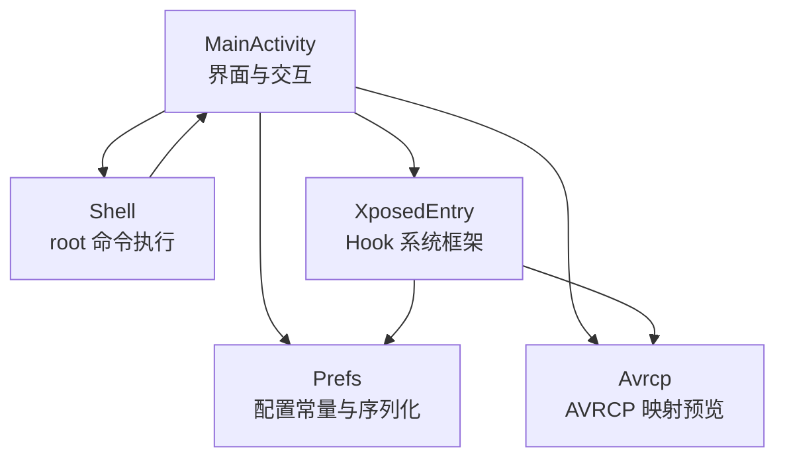
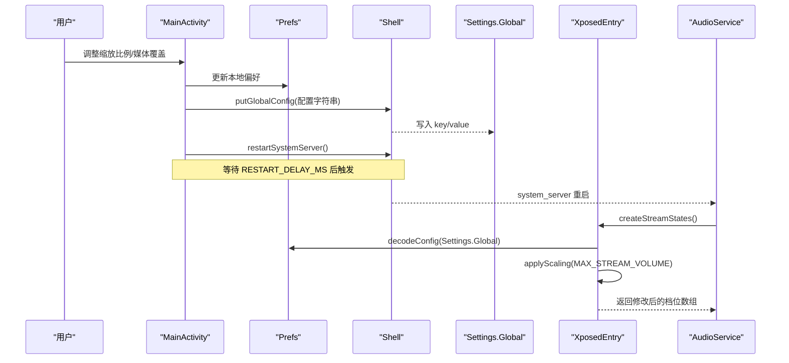
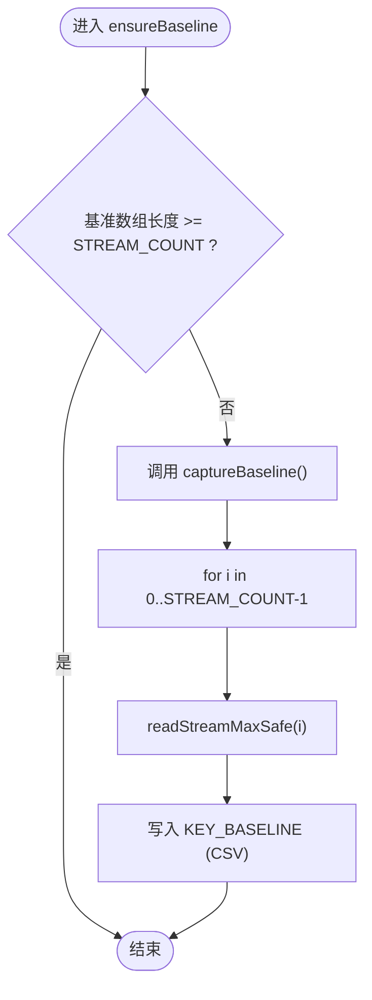
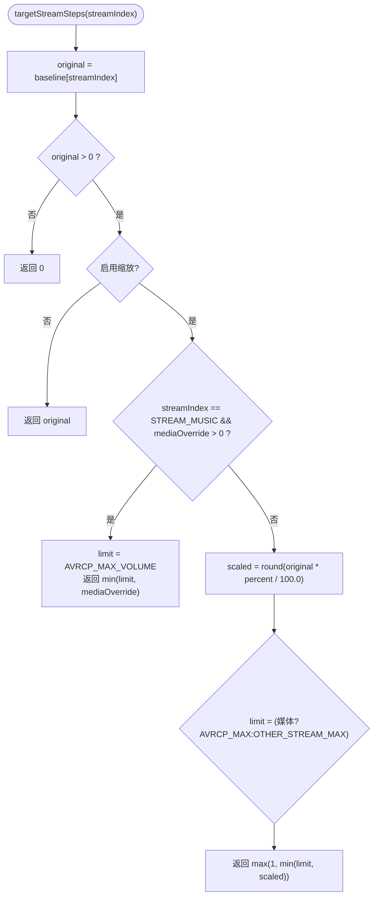
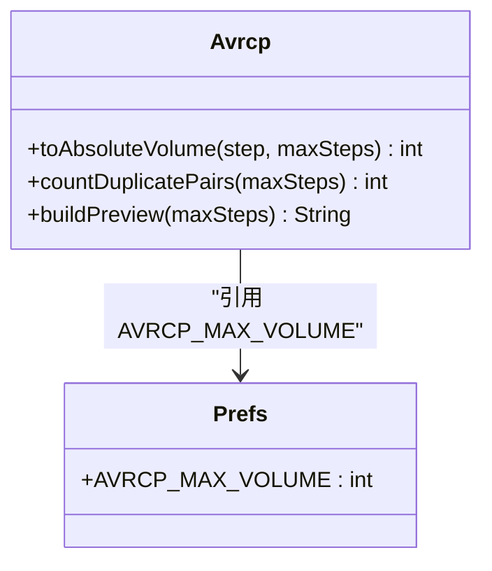
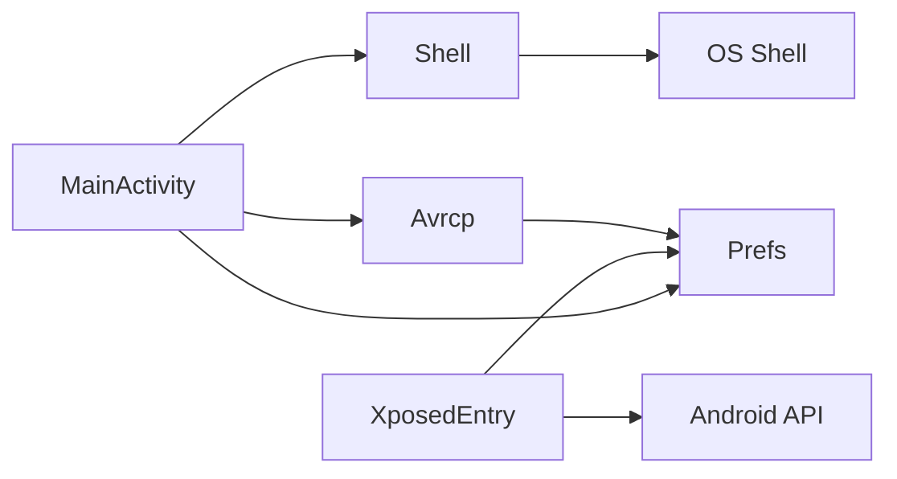

# 音量档位缩放

<cite>
**本文引用的文件**
- [XposedEntry.java](file://app/src/main/java/com/xiefeihong/volumecontrol/XposedEntry.java)
- [MainActivity.java](file://app/src/main/java/com/xiefeihong/volumecontrol/MainActivity.java)
- [Prefs.java](file://app/src/main/java/com/xiefeihong/volumecontrol/Prefs.java)
- [Shell.java](file://app/src/main/java/com/xiefeihong/volumecontrol/Shell.java)
- [Avrcp.java](file://app/src/main/java/com/xiefeihong/volumecontrol/Avrcp.java)
- [strings.xml](file://app/src/main/res/values/strings.xml)
- [arrays.xml](file://app/src/main/res/values/arrays.xml)
</cite>

## 目录
1. [简介](#简介)
2. [项目结构](#项目结构)
3. [核心组件](#核心组件)
4. [架构总览](#架构总览)
5. [详细组件分析](#详细组件分析)
6. [依赖关系分析](#依赖关系分析)
7. [性能与优化](#性能与优化)
8. [故障排查指南](#故障排查指南)
9. [结论](#结论)
10. [附录：配置参数说明](#附录配置参数说明)

## 简介
本模块通过 Xposed 在系统框架层拦截 AudioService 的初始化流程，按比例缩放各音频流的“最大档位数”，从而改变系统音量步进粒度。媒体流（STREAM_MUSIC）同时影响蓝牙 A2DP 的 AVRCP 绝对音量映射，因此对蓝牙耳机低音量无声、相邻档位音量相同等问题有直接改善作用。应用侧提供基准值采集、比例调节、媒体档位覆盖、预览与软重启系统框架等能力。

## 项目结构
- 入口与 Hook：XposedEntry 负责在 system_server 中 hook AudioService.createStreamStates()，读取配置并原地修改 MAX_STREAM_VOLUME 数组。
- 界面与控制：MainActivity 负责采集基准、计算目标档位、预览映射、写入 Settings.Global、触发软重启。
- 配置与常量：Prefs 定义全局键、百分比范围、媒体与非媒体流上限、流数量等。
- Shell 工具：Shell 封装 root shell 执行、检测 root/LSPosed/Magisk、读写 Settings.Global、软重启 system_server。
- 蓝牙 AVRCP：Avrcp 实现与 AOSP 一致的换算公式，用于预览媒体档位到 AVRCP 音量的映射。

图表来源
- [MainActivity.java:38-50](file://app/src/main/java/com/xiefeihong/volumecontrol/MainActivity.java#L38-L50)
- [XposedEntry.java:41-65](file://app/src/main/java/com/xiefeihong/volumecontrol/XposedEntry.java#L41-L65)
- [Prefs.java:12-47](file://app/src/main/java/com/xiefeihong/volumecontrol/Prefs.java#L12-L47)
- [Shell.java:35-112](file://app/src/main/java/com/xiefeihong/volumecontrol/Shell.java#L35-L112)
- [Avrcp.java:20-89](file://app/src/main/java/com/xiefeihong/volumecontrol/Avrcp.java#L20-L89)

章节来源
- [MainActivity.java:23-50](file://app/src/main/java/com/xiefeihong/volumecontrol/MainActivity.java#L23-L50)
- [XposedEntry.java:16-65](file://app/src/main/java/com/xiefeihong/volumecontrol/XposedEntry.java#L16-L65)
- [Prefs.java:6-47](file://app/src/main/java/com/xiefeihong/volumecontrol/Prefs.java#L6-L47)
- [Shell.java:8-112](file://app/src/main/java/com/xiefeihong/volumecontrol/Shell.java#L8-L112)
- [Avrcp.java:3-89](file://app/src/main/java/com/xiefeihong/volumecontrol/Avrcp.java#L3-L89)

## 核心组件
- 基准值采集机制
  - ensureBaseline()：首次启动时判断是否已存在基准数据，不足则触发 captureBaseline()。
  - captureBaseline()：遍历所有音频流索引，调用 readStreamMaxSafe() 获取当前最大音量并持久化到 SharedPreferences。
- 比例计算算法
  - targetStreamSteps()：按启用状态、媒体覆盖、百分比缩放、边界限制（最小 1、不同流的最大限制）计算目标档位。
  - 媒体流特殊处理：当 mediaOverride > 0 时，媒体流目标档位固定为覆盖值，且受 AVRCP_MAX_VOLUME 限制。
- 配置参数
  - PERCENT_MIN/MAX/STEP/DEFAULT：控制缩放比例范围与步长。
  - AVRCP_MAX_VOLUME：媒体流上限，保证蓝牙 AVRCP 一一对应。
  - OTHER_STREAM_MAX：非媒体流安全上限。
  - STREAM_COUNT：AudioService.MAX_STREAM_VOLUME 数组长度。
- 系统生效流程
  - 应用侧将配置写入 Settings.Global；Hook 端优先读取该键，回退到模块 SharedPreferences。
  - 软重启 system_server 使新的档位生效。

章节来源
- [MainActivity.java:123-128](file://app/src/main/java/com/xiefeihong/volumecontrol/MainActivity.java#L123-L128)
- [MainActivity.java:158-191](file://app/src/main/java/com/xiefeihong/volumecontrol/MainActivity.java#L158-L191)
- [Prefs.java:26-47](file://app/src/main/java/com/xiefeihong/volumecontrol/Prefs.java#L26-L47)
- [XposedEntry.java:67-114](file://app/src/main/java/com/xiefeihong/volumecontrol/XposedEntry.java#L67-L114)

## 架构总览
系统在启动时由 XposedEntry 钩住 AudioService.createStreamStates()，在创建各流档位前按比例修改 MAX_STREAM_VOLUME 数组。应用侧提供用户界面与工具方法，完成基准采集、比例设置、媒体覆盖、预览与系统框架软重启。

图表来源
- [MainActivity.java:261-296](file://app/src/main/java/com/xiefeihong/volumecontrol/MainActivity.java#L261-L296)
- [Shell.java:92-112](file://app/src/main/java/com/xiefeihong/volumecontrol/Shell.java#L92-L112)
- [XposedEntry.java:41-65](file://app/src/main/java/com/xiefeihong/volumecontrol/XposedEntry.java#L41-L65)
- [XposedEntry.java:122-146](file://app/src/main/java/com/xiefeihong/volumecontrol/XposedEntry.java#L122-L146)
- [XposedEntry.java:67-114](file://app/src/main/java/com/xiefeihong/volumecontrol/XposedEntry.java#L67-L114)

## 详细组件分析

### 基准值采集机制
- ensureBaseline()
  - 检查本地存储的基准数组长度是否满足 STREAM_COUNT，不足则触发 captureBaseline()。
  - 目的：确保后续计算使用“原始系统档位”作为基准，避免被其他修改干扰。
- captureBaseline()
  - 遍历所有音频流索引，调用 readStreamMaxSafe(i) 获取当前最大音量。
  - 将结果序列化为 CSV 字符串并持久化到 SharedPreferences（KEY_BASELINE）。
- readStreamMaxSafe()
  - 通过 AudioManager.getStreamMaxVolume(streamIndex) 读取当前生效的最大音量。
  - 异常保护：捕获任何 Throwable，失败返回 0，避免崩溃。

图表来源
- [MainActivity.java:123-128](file://app/src/main/java/com/xiefeihong/volumecontrol/MainActivity.java#L123-L128)
- [MainActivity.java:158-173](file://app/src/main/java/com/xiefeihong/volumecontrol/MainActivity.java#L158-L173)
- [MainActivity.java:252-259](file://app/src/main/java/com/xiefeihong/volumecontrol/MainActivity.java#L252-L259)
- [Prefs.java:84-114](file://app/src/main/java/com/xiefeihong/volumecontrol/Prefs.java#L84-L114)

章节来源
- [MainActivity.java:123-128](file://app/src/main/java/com/xiefeihong/volumecontrol/MainActivity.java#L123-L128)
- [MainActivity.java:158-173](file://app/src/main/java/com/xiefeihong/volumecontrol/MainActivity.java#L158-L173)
- [MainActivity.java:252-259](file://app/src/main/java/com/xiefeihong/volumecontrol/MainActivity.java#L252-L259)
- [Prefs.java:84-114](file://app/src/main/java/com/xiefeihong/volumecontrol/Prefs.java#L84-L114)

### 比例计算算法与边界处理
- targetStreamSteps(streamIndex)
  - 从基准数组读取 original 值，若 <=0 则返回 0（无有效基准）。
  - 若未启用缩放，直接返回 original。
  - 媒体流特殊处理：若 mediaOverride > 0，则目标档位固定为 mediaOverride，并受 AVRCP_MAX_VOLUME 限制。
  - 普通缩放：scaled = round(original * percent / 100.0)。
  - 边界处理：
    - 最小值：Math.max(1, ...)，确保至少一档。
    - 最大值：媒体流上限为 AVRCP_MAX_VOLUME，非媒体流上限为 OTHER_STREAM_MAX。
- 与 Hook 端一致性
  - XposedEntry.applyScaling() 使用相同的缩放逻辑与边界限制，保证应用侧预览与系统实际一致。

图表来源
- [MainActivity.java:175-191](file://app/src/main/java/com/xiefeihong/volumecontrol/MainActivity.java#L175-L191)
- [XposedEntry.java:67-114](file://app/src/main/java/com/xiefeihong/volumecontrol/XposedEntry.java#L67-L114)
- [Prefs.java:32-47](file://app/src/main/java/com/xiefeihong/volumecontrol/Prefs.java#L32-L47)

章节来源
- [MainActivity.java:175-191](file://app/src/main/java/com/xiefeihong/volumecontrol/MainActivity.java#L175-L191)
- [XposedEntry.java:67-114](file://app/src/main/java/com/xiefeihong/volumecontrol/XposedEntry.java#L67-L114)
- [Prefs.java:32-47](file://app/src/main/java/com/xiefeihong/volumecontrol/Prefs.java#L32-L47)

### 媒体流特殊处理与蓝牙 AVRCP 映射
- 媒体流（STREAM_MUSIC）与蓝牙 A2DP 共用同一档位，因此媒体档位直接影响 AVRCP 绝对音量。
- Avrcp.toAbsoluteVolume(step, maxSteps) 使用与 AOSP 一致的公式：absVolume = round(step * 127 / maxSteps)。
- 当 maxSteps > 127 时，会出现相邻档位映射到相同 AVRCP 音量的情况；应用侧通过限制媒体流上限为 AVRCP_MAX_VOLUME（127）来避免此问题。
- buildPreview(maxSteps) 生成映射预览文本，统计重复对数量与最低档 AVRCP 值，帮助评估听感差异。

图表来源
- [Avrcp.java:20-89](file://app/src/main/java/com/xiefeihong/volumecontrol/Avrcp.java#L20-L89)
- [Prefs.java:35-41](file://app/src/main/java/com/xiefeihong/volumecontrol/Prefs.java#L35-L41)

章节来源
- [Avrcp.java:3-89](file://app/src/main/java/com/xiefeihong/volumecontrol/Avrcp.java#L3-L89)
- [Prefs.java:35-41](file://app/src/main/java/com/xiefeihong/volumecontrol/Prefs.java#L35-L41)

### 配置参数说明
- 百分比范围控制
  - PERCENT_MIN=25，PERCENT_MAX=400，PERCENT_STEP=5，PERCENT_DEFAULT=100。
  - 100% 表示保持系统默认，不修改；低于或高于该值分别缩小或放大档位。
- 媒体流覆盖
  - mediaOverride 可强制设定媒体档位上限，最大不超过 AVRCP_MAX_VOLUME（127），以避免蓝牙相邻档位音量相同。
- 非媒体流上限
  - OTHER_STREAM_MAX=150，用于限制铃声、闹钟等非媒体流的最大档位，防止过度放大导致体验异常。
- 流数量与名称
  - STREAM_COUNT=12，对应 Android 13+ 的 AudioService.MAX_STREAM_VOLUME 数组长度。
  - 流名称数组用于界面展示，顺序与数组索引一致。

章节来源
- [Prefs.java:26-47](file://app/src/main/java/com/xiefeihong/volumecontrol/Prefs.java#L26-L47)
- [arrays.xml:7-21](file://app/src/main/res/values/arrays.xml#L7-L21)
- [strings.xml:20-38](file://app/src/main/res/values/strings.xml#L20-L38)

### 代码示例路径（算法与异常处理）
- 基准值采集
  - 首次启动与触发采集：[ensureBaseline:123-128](file://app/src/main/java/com/xiefeihong/volumecontrol/MainActivity.java#L123-L128)
  - 读取与持久化：[captureBaseline:252-259](file://app/src/main/java/com/xiefeihong/volumecontrol/MainActivity.java#L252-L259)、[readStreamMaxSafe:162-173](file://app/src/main/java/com/xiefeihong/volumecontrol/MainActivity.java#L162-L173)
- 比例计算与边界处理
  - 目标档位计算：[targetStreamSteps:175-191](file://app/src/main/java/com/xiefeihong/volumecontrol/MainActivity.java#L175-L191)
  - Hook 端缩放逻辑：[applyScaling:67-114](file://app/src/main/java/com/xiefeihong/volumecontrol/XposedEntry.java#L67-L114)
- 蓝牙 AVRCP 映射
  - 换算公式与预览：[Avrcp.toAbsoluteVolume:25-31](file://app/src/main/java/com/xiefeihong/volumecontrol/Avrcp.java#L25-L31)、[Avrcp.buildPreview:49-88](file://app/src/main/java/com/xiefeihong/volumecontrol/Avrcp.java#L49-L88)
- 配置读写与系统生效
  - 配置序列化/解析：[encodeConfig/decodeConfig:56-82](file://app/src/main/java/com/xiefeihong/volumecontrol/Prefs.java#L56-L82)
  - 写入 Settings.Global 与软重启：[applyAndRestart:261-296](file://app/src/main/java/com/xiefeihong/volumecontrol/MainActivity.java#L261-L296)、[Shell.putGlobalConfig:92-98](file://app/src/main/java/com/xiefeihong/volumecontrol/Shell.java#L92-L98)、[Shell.restartSystemServer:109-112](file://app/src/main/java/com/xiefeihong/volumecontrol/Shell.java#L109-L112)

## 依赖关系分析
- MainActivity 依赖 Prefs（常量与序列化）、Shell（root 操作）、Avrcp（预览）、Android 系统 API（AudioManager、SharedPreferences）。
- XposedEntry 依赖 Prefs（常量与解码）、Android 系统 API（Context、ContentResolver、Settings）、Xposed API（hook 与日志）。
- Shell 依赖系统 shell 环境（su、settings、pidof/killall）。
- Avrcp 仅依赖 Prefs 中的常量。

图表来源
- [MainActivity.java:3-21](file://app/src/main/java/com/xiefeihong/volumecontrol/MainActivity.java#L3-L21)
- [XposedEntry.java:3-14](file://app/src/main/java/com/xiefeihong/volumecontrol/XposedEntry.java#L3-L14)
- [Shell.java:3-7](file://app/src/main/java/com/xiefeihong/volumecontrol/Shell.java#L3-L7)
- [Avrcp.java:1-5](file://app/src/main/java/com/xiefeihong/volumecontrol/Avrcp.java#L1-L5)

章节来源
- [MainActivity.java:3-21](file://app/src/main/java/com/xiefeihong/volumecontrol/MainActivity.java#L3-L21)
- [XposedEntry.java:3-14](file://app/src/main/java/com/xiefeihong/volumecontrol/XposedEntry.java#L3-L14)
- [Shell.java:3-7](file://app/src/main/java/com/xiefeihong/volumecontrol/Shell.java#L3-L7)
- [Avrcp.java:1-5](file://app/src/main/java/com/xiefeihong/volumecontrol/Avrcp.java#L1-L5)

## 性能与优化
- 基准值缓存：sOriginalMaxStreamVolumes 仅在首次备份一次，避免重复缩放导致的累积误差。
- 批量计算：对 MAX_STREAM_VOLUME 数组进行一次性遍历缩放，时间复杂度 O(N)，N 为流数量（12）。
- 异常保护：readStreamMaxSafe() 与 readConfig() 均捕获异常并降级处理，避免崩溃。
- 异步与串行：MainActivity 使用单线程 Executor 串行执行 root 操作，避免并发竞争；主线程 Handler 更新 UI。
- 预览与校验：applyAndRestart() 写入后读回验证，减少无效重启。

[本节为通用性能讨论，不直接分析具体文件]

## 故障排查指南
- 无法写入系统配置
  - 现象：提示“写入系统配置失败”。
  - 可能原因：未授予 su 权限或 settings 命令不可用。
  - 处理：确认 root 可用（isRootAvailable），重试写入；查看 Shell 输出详情。
- LSPosed 未检测到
  - 现象：提示“LSPosed：未检测到”。
  - 可能原因：未安装或未启用模块，或作用域未勾选“系统框架”。
  - 处理：安装/启用模块并在 LSPosed 中添加 android 包名到作用域。
- 基准值不正确
  - 现象：预览与实际不一致。
  - 可能原因：当前系统已被其他修改影响，或基准未重新采集。
  - 处理：点击“重新采集基准档位”，并确保无其他音量修改后再采集。
- 媒体档位与蓝牙映射不符
  - 现象：耳机音量跨度过大或相邻档位相同。
  - 可能原因：媒体档位超过 127，或耳机低音量限制。
  - 处理：降低媒体档位至 ≤127；提高缩放比例以细化低音区；参考 Avrcp 预览信息。

章节来源
- [Shell.java:74-84](file://app/src/main/java/com/xiefeihong/volumecontrol/Shell.java#L74-L84)
- [MainActivity.java:261-296](file://app/src/main/java/com/xiefeihong/volumecontrol/MainActivity.java#L261-L296)
- [strings.xml:44-57](file://app/src/main/res/values/strings.xml#L44-L57)

## 结论
本模块通过系统级 Hook 与应用侧配置协同，实现对各音频流档位的精确缩放与媒体流蓝牙映射优化。基准值采集保障计算准确性，比例算法兼顾边界与流差异化策略，配置参数提供灵活控制。结合预览与软重启机制，用户可在不影响数据的前提下快速验证与生效配置。

[本节为总结性内容，不直接分析具体文件]

## 附录：配置参数说明
- 百分比范围
  - PERCENT_MIN=25，PERCENT_MAX=400，PERCENT_STEP=5，PERCENT_DEFAULT=100。
  - 100% 表示不修改；低于 100% 缩小档位，高于 100% 放大档位。
- 媒体覆盖
  - mediaOverride：媒体流固定档位上限，最大 127（AVRCP_MAX_VOLUME），避免蓝牙相邻档位音量相同。
- 非媒体流上限
  - OTHER_STREAM_MAX=150，限制铃声、闹钟等流的最大档位。
- 流数量与名称
  - STREAM_COUNT=12，对应 Android 13+ 的流数组长度。
  - stream_names 数组用于界面显示，顺序与索引一致。

章节来源
- [Prefs.java:26-47](file://app/src/main/java/com/xiefeihong/volumecontrol/Prefs.java#L26-L47)
- [arrays.xml:7-21](file://app/src/main/res/values/arrays.xml#L7-L21)
- [strings.xml:20-38](file://app/src/main/res/values/strings.xml#L20-L38)