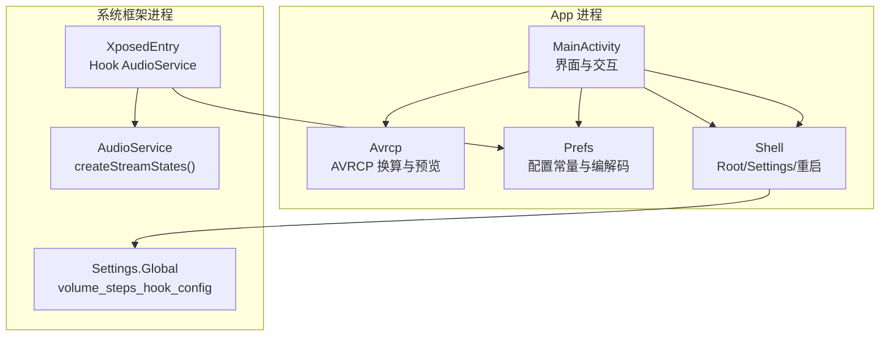
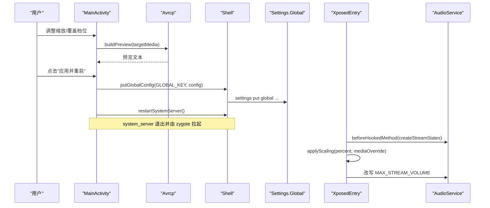
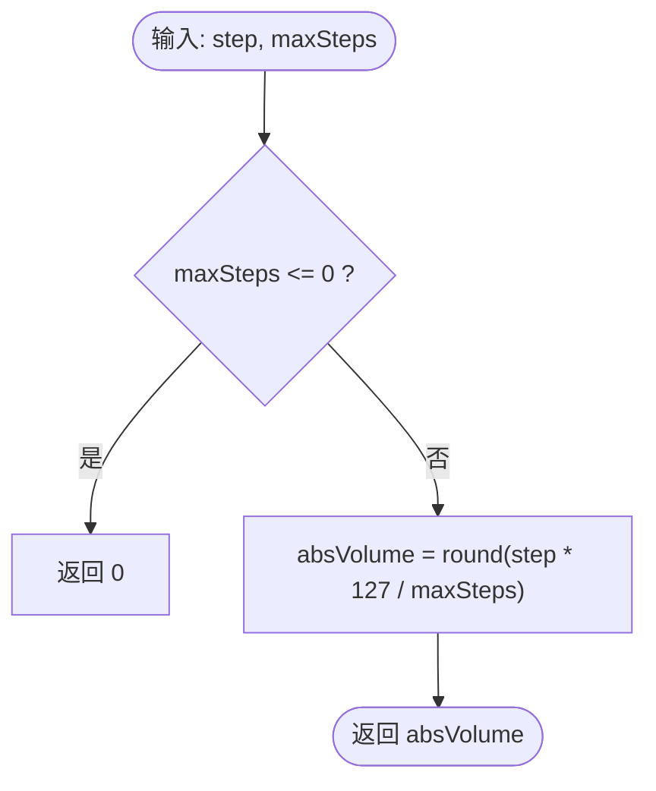
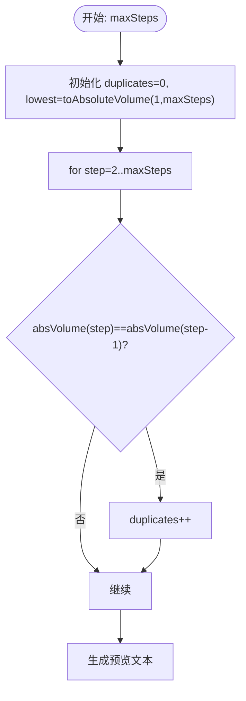
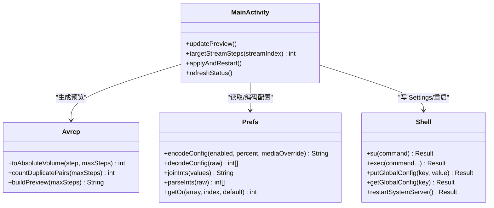
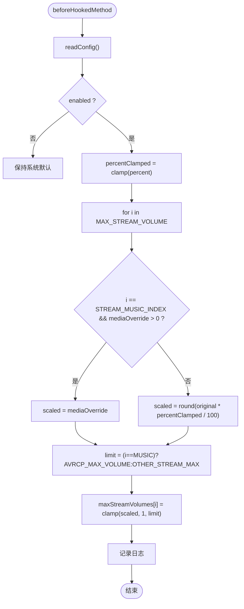
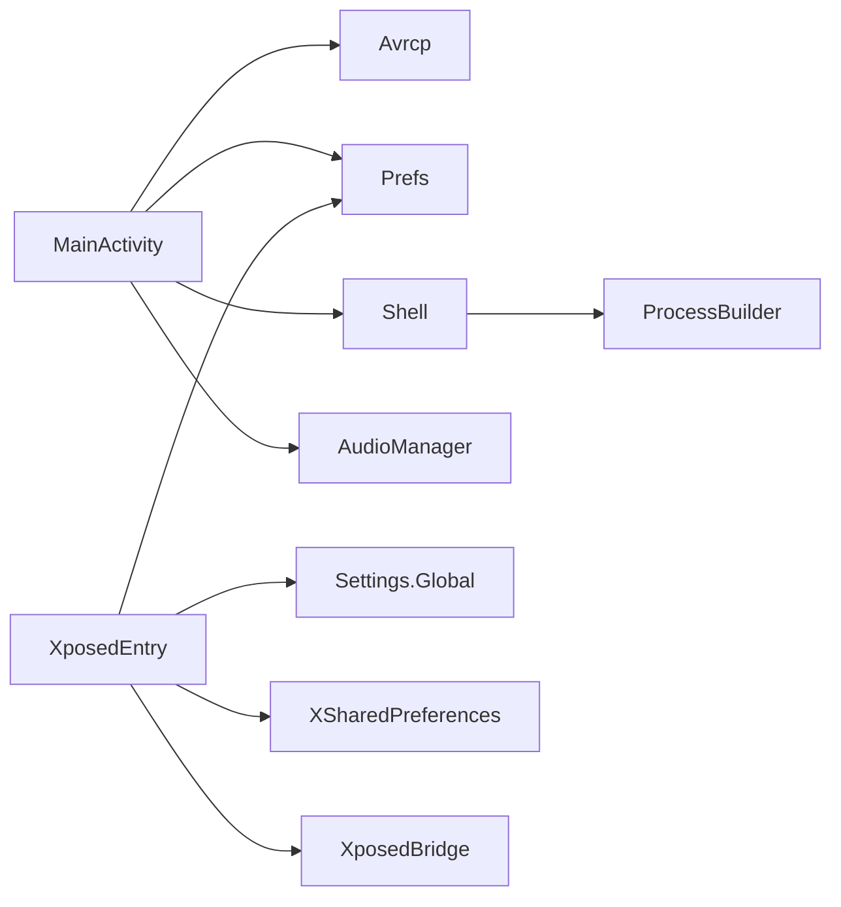

# Avrcp 模块

<cite>
**本文引用的文件**   
- [Avrcp.java](file://app/src/main/java/com/xiefeihong/volumecontrol/Avrcp.java)
- [MainActivity.java](file://app/src/main/java/com/xiefeihong/volumecontrol/MainActivity.java)
- [Prefs.java](file://app/src/main/java/com/xiefeihong/volumecontrol/Prefs.java)
- [Shell.java](file://app/src/main/java/com/xiefeihong/volumecontrol/Shell.java)
- [XposedEntry.java](file://app/src/main/java/com/xiefeihong/volumecontrol/XposedEntry.java)
</cite>

## 目录
1. [简介](#简介)
2. [项目结构](#项目结构)
3. [核心组件](#核心组件)
4. [架构总览](#架构总览)
5. [详细组件分析](#详细组件分析)
6. [依赖关系分析](#依赖关系分析)
7. [性能与精度考量](#性能与精度考量)
8. [故障排查指南](#故障排查指南)
9. [结论](#结论)
10. [附录：使用示例与测试方法](#附录使用示例与测试方法)

## 简介
本模块围绕蓝牙 AVRCP 绝对音量映射展开，提供从“媒体档位”到“AVRCP 绝对音量（0~127）”的换算、重复档位检测、预览生成，以及与系统框架集成的 Hook 实现。其目标是：
- 解释 AOSP 蓝牙模块中媒体档位到 AVRCP 音量的换算逻辑；
- 在应用层提供可配置的缩放策略、冲突检测与优化建议；
- 通过 LSPosed Hook 修改系统 AudioService 的流档位上限，使蓝牙 A2DP 音量更细腻可控；
- 提供根权限工具链，完成配置写入、回读校验与 system_server 软重启。

## 项目结构
该工程为 Android 应用 + Xposed 模块组合：
- app 进程负责 UI、配置持久化、预览计算、状态检测与 root shell 调用；
- XposedEntry 作为系统框架侧 Hook 入口，拦截 AudioService 初始化流程并改写 MAX_STREAM_VOLUME；
- Prefs 是 App 与 Hook 共享的配置常量与编解码工具；
- Shell 封装 su 命令执行、root/LSPosed/Magisk 检测、Settings.Global 读写与 system_server 重启；
- MainActivity 串联用户交互、预览更新、配置落盘与状态渲染；
- Avrcp 提供 AVRCP 绝对音量换算与预览文本构建。

图表来源
- [MainActivity.java:38-50](file://app/src/main/java/com/xiefeihong/volumecontrol/MainActivity.java#L38-L50)
- [Avrcp.java:25-88](file://app/src/main/java/com/xiefeihong/volumecontrol/Avrcp.java#L25-L88)
- [Prefs.java:56-82](file://app/src/main/java/com/xiefeihong/volumecontrol/Prefs.java#L56-L82)
- [Shell.java:96-112](file://app/src/main/java/com/xiefeihong/volumecontrol/Shell.java#L96-L112)
- [XposedEntry.java:41-65](file://app/src/main/java/com/xiefeihong/volumecontrol/XposedEntry.java#L41-L65)

章节来源
- [MainActivity.java:23-50](file://app/src/main/java/com/xiefeihong/volumecontrol/MainActivity.java#L23-L50)
- [Prefs.java:6-47](file://app/src/main/java/com/xiefeihong/volumecontrol/Prefs.java#L6-L47)

## 核心组件
- Avrcp：提供 toAbsoluteVolume、countDuplicatePairs、buildPreview，用于 AVRCP 绝对音量换算、重复档位统计与预览文本生成。
- MainActivity：负责 UI 绑定、配置读取、目标档位计算、预览更新、配置持久化、状态检测与 system_server 软重启。
- Prefs：定义全局键、范围常量、配置序列化/反序列化、基准档位数组处理等。
- Shell：封装 su 命令执行、root/LSPosed/Magisk 检测、Settings.Global 读写、system_server 重启。
- XposedEntry：在 system_server 启动时 Hook AudioService.createStreamStates，按比例缩放 MAX_STREAM_VOLUME，支持媒体流覆盖。

章节来源
- [Avrcp.java:25-88](file://app/src/main/java/com/xiefeihong/volumecontrol/Avrcp.java#L25-L88)
- [MainActivity.java:143-231](file://app/src/main/java/com/xiefeihong/volumecontrol/MainActivity.java#L143-L231)
- [Prefs.java:56-122](file://app/src/main/java/com/xiefeihong/volumecontrol/Prefs.java#L56-L122)
- [Shell.java:35-112](file://app/src/main/java/com/xiefeihong/volumecontrol/Shell.java#L35-L112)
- [XposedEntry.java:41-114](file://app/src/main/java/com/xiefeihong/volumecontrol/XposedEntry.java#L41-L114)

## 架构总览
整体数据与控制流如下：
- 用户在 MainActivity 调整缩放比例或媒体覆盖档位；
- 应用层根据当前配置计算各音频流的“目标档位数”，并调用 Avrcp.buildPreview 生成 AVRCP 映射预览；
- 点击“应用并重启”后，应用通过 Shell 将配置写入 Settings.Global，并触发 system_server 软重启；
- XposedEntry 在 AudioService 初始化前 Hook，读取配置并按比例缩放 MAX_STREAM_VOLUME，媒体流可被固定覆盖；
- 重启后，系统以新的档位上限运行，蓝牙 A2DP 音量步进随之变化。

图表来源
- [MainActivity.java:261-296](file://app/src/main/java/com/xiefeihong/volumecontrol/MainActivity.java#L261-L296)
- [Avrcp.java:49-88](file://app/src/main/java/com/xiefeihong/volumecontrol/Avrcp.java#L49-L88)
- [Shell.java:96-112](file://app/src/main/java/com/xiefeihong/volumecontrol/Shell.java#L96-L112)
- [XposedEntry.java:41-114](file://app/src/main/java/com/xiefeihong/volumecontrol/XposedEntry.java#L41-L114)

## 详细组件分析

### AVRCP 基础与音量映射算法
- 换算公式：AOSP 蓝牙模块将媒体档位换算为 AVRCP 绝对音量（0~127），公式为 round(档位 × 127 / 最大档位)。
- 边界条件：
  - 当 maxSteps <= 0 时，toAbsoluteVolume 返回 0；
  - 第 1 档对应的 AVRCP 值可能很小，部分耳机在该值以下无声；
  - 当媒体档位数 > 127 时，相邻档位会映射到相同 AVRCP 音量，表现为“重复档位”。
- 重复档位检测：countDuplicatePairs 遍历 step=2..maxSteps，比较相邻两档的绝对音量是否相等，统计对数。
- 预览生成：buildPreview 输出媒体档位与 AVRCP 音量的映射表，包含：
  - 是否存在重复档位；
  - 第 1 档 AVRCP 值及其百分比；
  - 每档到 AVRCP 的映射明细（按行显示）。

图表来源
- [Avrcp.java:25-31](file://app/src/main/java/com/xiefeihong/volumecontrol/Avrcp.java#L25-L31)

章节来源
- [Avrcp.java:25-42](file://app/src/main/java/com/xiefeihong/volumecontrol/Avrcp.java#L25-L42)
- [Prefs.java:35-41](file://app/src/main/java/com/xiefeihong/volumecontrol/Prefs.java#L35-L41)

### 音量映射预览与冲突检测
- 预览摘要：
  - 若 duplicates == 0，提示“每档独立”；
  - 否则提示存在多少对相邻档位映射到相同音量；
  - 显示第 1 档 AVRCP 值及近似百分比，说明极低音量下可能无声的设备限制；
  - 显示最大档对应 AVRCP 127。
- 映射明细：
  - 逐档输出 step → absVolume，每行最多 8 项，便于阅读。
- 冲突检测：
  - countDuplicatePairs 基于 toAbsoluteVolume 的单调性进行相邻比较，复杂度 O(n)，n 为 maxSteps。

图表来源
- [Avrcp.java:33-42](file://app/src/main/java/com/xiefeihong/volumecontrol/Avrcp.java#L33-L42)
- [Avrcp.java:49-88](file://app/src/main/java/com/xiefeihong/volumecontrol/Avrcp.java#L49-L88)

章节来源
- [Avrcp.java:33-88](file://app/src/main/java/com/xiefeihong/volumecontrol/Avrcp.java#L33-L88)

### 低音量优化策略与非线性映射
- 现状与问题：
  - 线性换算导致低音量区不够细腻；
  - 第 1 档 AVRCP 值过小，部分耳机直接无声；
  - 档位数过多时出现重复档位，降低用户体验。
- 现有机制：
  - 通过缩放比例（PERCENT_MIN~PERCENT_MAX）控制目标档位数，从而间接影响低音量区的细腻度；
  - 媒体流支持“固定覆盖档位”（mediaOverride），可直接设定媒体流的最大档位，避免过大导致的重复档位；
  - 非媒体流设置安全上限 OTHER_STREAM_MAX，防止异常高值。
- 非线性映射建议（概念性）：
  - 可在应用层引入非线性映射函数（如指数或对数曲线），使低音量区分配更多步长，提升细腻度；
  - 结合设备特性（耳机最低可用 AVRCP 阈值）动态调整起点与曲线斜率；
  - 注意保持与系统 Hook 端的一致性，避免 UI 预览与实际生效不一致。

[本节为概念性讨论，不直接分析具体代码文件]

### 与主应用的集成方式
- 配置参数传递：
  - MainActivity 读取 SharedPreferences 中的 enabled、percent、mediaOverride；
  - 计算 targetStreamSteps(streamIndex) 得到各流的目标档位数；
  - 调用 Avrcp.buildPreview 生成预览文本并展示。
- 预览数据返回：
  - Avrcp.buildPreview 返回字符串，MainActivity 将其拆分为摘要与明细两部分分别显示。
- 错误信息处理：
  - readStreamMaxSafe 捕获异常返回 0；
  - Shell.exec 统一封装 Result(code, output)，isSuccess 判断成功与否；
  - applyAndRestart 在写 Settings.Global 后进行回读校验，失败则 Toast 提示并附带 detail。

图表来源
- [MainActivity.java:143-231](file://app/src/main/java/com/xiefeihong/volumecontrol/MainActivity.java#L143-L231)
- [Avrcp.java:25-88](file://app/src/main/java/com/xiefeihong/volumecontrol/Avrcp.java#L25-L88)
- [Prefs.java:56-122](file://app/src/main/java/com/xiefeihong/volumecontrol/Prefs.java#L56-L122)
- [Shell.java:35-112](file://app/src/main/java/com/xiefeihong/volumecontrol/Shell.java#L35-L112)

章节来源
- [MainActivity.java:143-231](file://app/src/main/java/com/xiefeihong/volumecontrol/MainActivity.java#L143-L231)
- [MainActivity.java:261-296](file://app/src/main/java/com/xiefeihong/volumecontrol/MainActivity.java#L261-L296)
- [Prefs.java:56-122](file://app/src/main/java/com/xiefeihong/volumecontrol/Prefs.java#L56-L122)
- [Shell.java:96-112](file://app/src/main/java/com/xiefeihong/volumecontrol/Shell.java#L96-L112)

### Hook 端实现细节（XposedEntry）
- Hook 点：拦截 com.android.server.audio.AudioService.createStreamStates；
- 配置读取：优先从 Settings.Global 读取 volume_steps_hook_config，失败回退到 XSharedPreferences；
- 缩放逻辑：
  - 备份原始 MAX_STREAM_VOLUME 数组；
  - 对每个流计算 scaled = round(original * percent / 100)；
  - 媒体流（STREAM_MUSIC_INDEX）若 mediaOverride > 0，则强制使用 mediaOverride；
  - 限制上限：媒体流不超过 AVRCP_MAX_VOLUME，其他流不超过 OTHER_STREAM_MAX；
  - 最小值为 1，避免无效档位。
- 日志记录：打印原始数组、缩放结果、percent 与 mediaOverride。

图表来源
- [XposedEntry.java:41-114](file://app/src/main/java/com/xiefeihong/volumecontrol/XposedEntry.java#L41-L114)

章节来源
- [XposedEntry.java:41-114](file://app/src/main/java/com/xiefeihong/volumecontrol/XposedEntry.java#L41-L114)

## 依赖关系分析
- MainActivity 依赖：
  - Avrcp：生成 AVRCP 预览；
  - Prefs：读取/编码配置、获取常量；
  - Shell：写 Settings.Global、重启 system_server；
  - AudioManager：查询当前媒体流最大档位与蓝牙设备列表。
- XposedEntry 依赖：
  - Prefs：解码配置；
  - Settings.Global：读取配置；
  - XSharedPreferences：回退读取；
  - XposedBridge/XposedHelpers：反射与 Hook。
- Shell 依赖：
  - ProcessBuilder：执行 su 命令；
  - System 命令：settings、pidof、killall。

图表来源
- [MainActivity.java:158-173](file://app/src/main/java/com/xiefeihong/volumecontrol/MainActivity.java#L158-L173)
- [XposedEntry.java:116-146](file://app/src/main/java/com/xiefeihong/volumecontrol/XposedEntry.java#L116-L146)
- [Shell.java:41-72](file://app/src/main/java/com/xiefeihong/volumecontrol/Shell.java#L41-L72)

章节来源
- [MainActivity.java:158-173](file://app/src/main/java/com/xiefeihong/volumecontrol/MainActivity.java#L158-L173)
- [XposedEntry.java:116-146](file://app/src/main/java/com/xiefeihong/volumecontrol/XposedEntry.java#L116-L146)
- [Shell.java:41-72](file://app/src/main/java/com/xiefeihong/volumecontrol/Shell.java#L41-L72)

## 性能与精度考量
- 时间复杂度：
  - toAbsoluteVolume：O(1)；
  - countDuplicatePairs：O(n)，n 为 maxSteps；
  - buildPreview：O(n)，含字符串拼接与格式化。
- 空间复杂度：
  - buildPreview 使用 StringBuilder 累积预览文本，内存占用与 n 成正比；
  - XposedEntry 的 applyScaling 原地修改 MAX_STREAM_VOLUME，额外空间为备份数组长度。
- 精度与数值稳定性：
  - 使用 Math.round 与 double 中间类型减少整数除法误差；
  - 所有缩放结果均 clamp 至 [1, limit]，避免 0 或越界；
  - 媒体流覆盖档位直接取 mediaOverride，避免缩放带来的偏差。
- 性能优化技巧：
  - 预览文本分摘要与明细两段，避免一次性大字符串操作；
  - 后台线程执行 Shell 操作，避免阻塞 UI；
  - 首次启动采集 baseline 并缓存，避免频繁查询系统 API。

[本节为通用性能讨论，不直接分析具体代码文件]

## 故障排查指南
- Root 不可用：
  - Shell.isRootAvailable 检查 su 授权与 uid=0；
  - 若失败，应用状态栏会显示 root 检测失败。
- LSPosed 未安装：
  - Shell.isLsposedPresent 检查 /data/adb/lspd；
  - 若失败，Hook 不会生效，需安装并启用 LSPosed。
- Settings.Global 写入失败：
  - applyAndRestart 先写后读校验，失败则 Toast 提示并附带 detail；
  - 检查 su 权限、SELinux 策略与 ROM 限制。
- 重启后未生效：
  - 确认已触发 restartSystemServer；
  - 检查 AudioService 是否重新创建流状态；
  - 查看 XposedEntry 日志确认 applyScaling 是否执行。
- 蓝牙设备未识别：
  - buildBluetoothSummary 枚举输出设备类型，若为空则显示“无蓝牙设备”；
  - 检查蓝牙连接状态与设备类型常量兼容性。

章节来源
- [Shell.java:74-90](file://app/src/main/java/com/xiefeihong/volumecontrol/Shell.java#L74-L90)
- [MainActivity.java:261-296](file://app/src/main/java/com/xiefeihong/volumecontrol/MainActivity.java#L261-L296)
- [MainActivity.java:368-397](file://app/src/main/java/com/xiefeihong/volumecontrol/MainActivity.java#L368-L397)

## 结论
本模块通过应用层预览与系统框架 Hook 的结合，实现了蓝牙 AVRCP 绝对音量的精细化控制。核心贡献包括：
- 明确 AOSP 蓝牙模块的换算公式与边界条件；
- 提供重复档位检测与预览生成，帮助用户理解映射效果；
- 通过缩放比例与媒体流覆盖档位，平衡细腻度与兼容性；
- 借助 Shell 与 XposedEntry，完成配置下发与系统级生效。

[本节为总结性内容，不直接分析具体代码文件]

## 附录：使用示例与测试方法
- 基本用法：
  - 打开应用，启用功能并调整缩放比例；
  - 观察预览文本中的重复档位提示与第 1 档 AVRCP 值；
  - 点击“应用并重启”，等待 system_server 重启后验证音量步进变化。
- 兼容性测试：
  - 不同品牌耳机：验证极低 AVRCP 值下的声音表现；
  - 不同 Android 版本：确认 AudioManager 与蓝牙设备枚举行为一致；
  - 不同 ROM：检查 Settings.Global 写入与 SELinux 策略。
- 算法验证：
  - 手动计算 toAbsoluteVolume(step, maxSteps) 并与预览明细对比；
  - 调整 mediaOverride，验证媒体流覆盖是否生效；
  - 在非媒体流上验证 OTHER_STREAM_MAX 限制。
- 问题诊断：
  - 查看 Shell 返回的 code 与 output，定位 root/Settings 写入失败原因；
  - 检查 XposedEntry 日志，确认 Hook 是否命中与 applyScaling 是否执行；
  - 若重启后未生效，再次触发 refreshStatus 并比对 actualMedia 与 targetMedia。

[本节为通用指导，不直接分析具体代码文件]