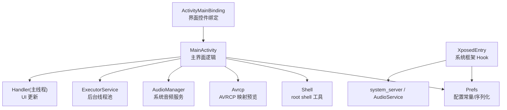
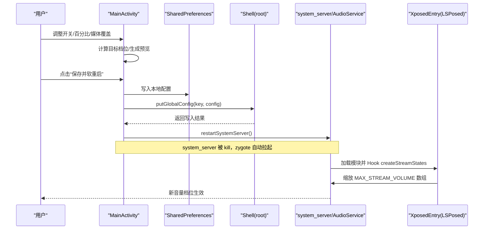
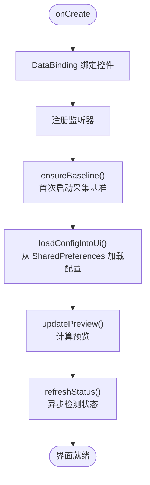
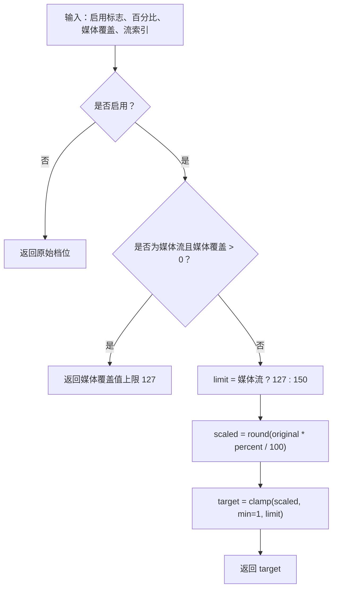
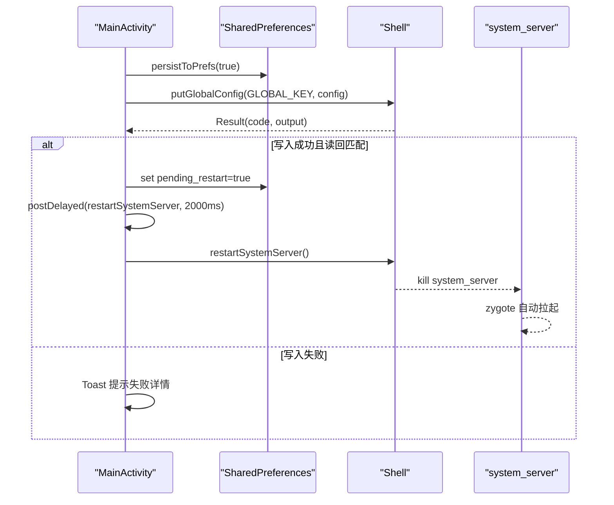
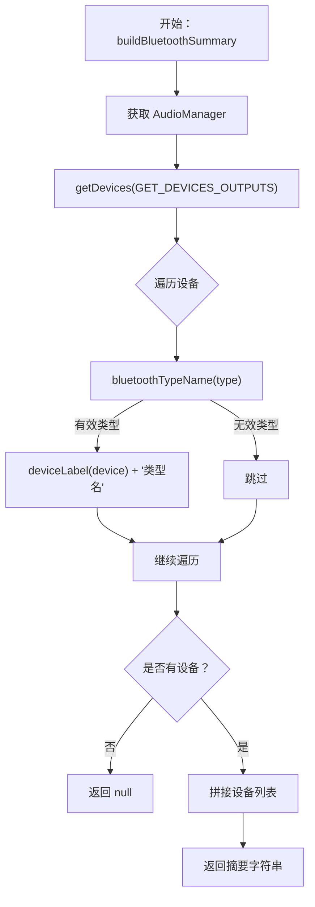
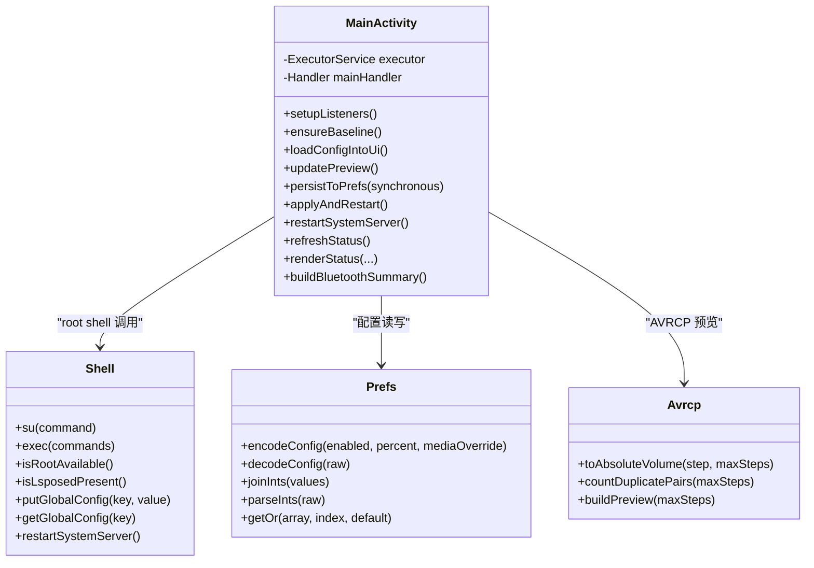
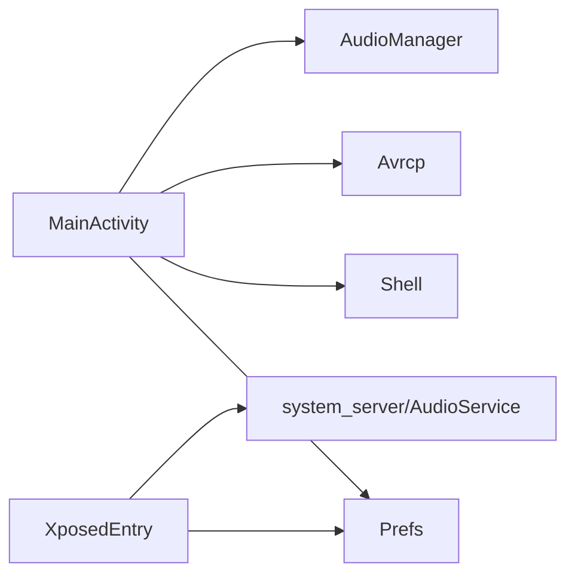
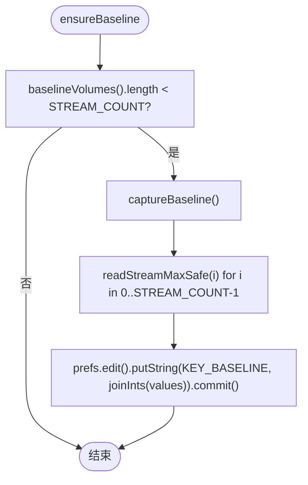
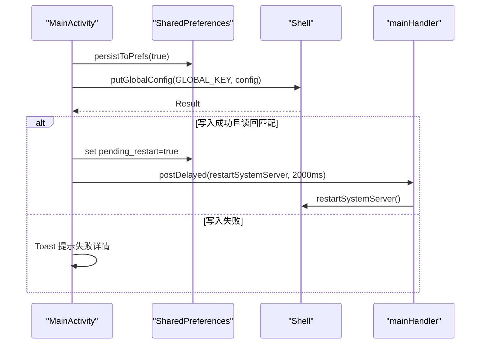

# MainActivity 模块

<cite>
**本文引用的文件**   
- [MainActivity.java](file://app/src/main/java/com/xiefeihong/volumecontrol/MainActivity.java)
- [activity_main.xml](file://app/src/main/res/layout/activity_main.xml)
- [Prefs.java](file://app/src/main/java/com/xiefeihong/volumecontrol/Prefs.java)
- [Shell.java](file://app/src/main/java/com/xiefeihong/volumecontrol/Shell.java)
- [XposedEntry.java](file://app/src/main/java/com/xiefeihong/volumecontrol/XposedEntry.java)
- [Avrcp.java](file://app/src/main/java/com/xiefeihong/volumecontrol/Avrcp.java)
- [strings.xml](file://app/src/main/res/values/strings.xml)
- [arrays.xml](file://app/src/main/res/values/arrays.xml)
</cite>

## 目录
1. [简介](#简介)
2. [项目结构](#项目结构)
3. [核心组件](#核心组件)
4. [架构总览](#架构总览)
5. [详细组件分析](#详细组件分析)
6. [依赖关系分析](#依赖关系分析)
7. [性能与并发特性](#性能与并发特性)
8. [故障排查指南](#故障排查指南)
9. [结论](#结论)
10. [附录：关键流程与时序图](#附录关键流程与时序图)

## 简介
本模块为“音量阶数”控制应用的主界面与系统配置入口，负责：
- 提供用户界面以设置音量档位缩放比例、媒体档位精确值。
- 计算并预览各音频流的原始档位与目标档位映射。
- 将配置持久化到 SharedPreferences，并通过 root shell 写入 Settings.Global。
- 检测 Root、LSPosed、蓝牙设备状态，并在必要时软重启 system_server 使配置生效。
- 通过 LSPosed 模块在系统框架层修改 AudioService 的音量档位数数组，实现全局音量步进调整。

该文档面向开发者与维护者，既提供高层架构说明，也深入到具体实现细节、算法与最佳实践。

## 项目结构
主界面由 Activity + DataBinding 布局构成，配合 Prefs（配置常量与序列化）、Shell（root shell 工具）、Avrcp（蓝牙 AVRCP 映射预览）以及 XposedEntry（系统框架 Hook 入口）共同完成功能闭环。

**图表来源**
- [MainActivity.java:26-50](file://app/src/main/java/com/xiefeihong/volumecontrol/MainActivity.java#L26-L50)
- [Prefs.java:12-48](file://app/src/main/java/com/xiefeihong/volumecontrol/Prefs.java#L12-L48)
- [Shell.java:13-113](file://app/src/main/java/com/xiefeihong/volumecontrol/Shell.java#L13-L113)
- [Avrcp.java:20-89](file://app/src/main/java/com/xiefeihong/volumecontrol/Avrcp.java#L20-L89)
- [XposedEntry.java:29-65](file://app/src/main/java/com/xiefeihong/volumecontrol/XposedEntry.java#L29-L65)

**章节来源**
- [MainActivity.java:26-50](file://app/src/main/java/com/xiefeihong/volumecontrol/MainActivity.java#L26-L50)
- [activity_main.xml:1-375](file://app/src/main/res/layout/activity_main.xml#L1-L375)

## 核心组件
- MainActivity：主界面控制器，处理 UI 初始化、事件监听、配置计算、预览生成、状态检测、异步任务与系统重启。
- Prefs：配置常量、SharedPreferences 访问、Settings.Global 键名、配置字符串编解码、基准档位 CSV 序列化。
- Shell：root shell 执行封装，包含命令超时、输出合并、Root/LSPosed/Magisk 检测、Settings.Global 读写、system_server 软重启。
- Avrcp：蓝牙 AVRCP 绝对音量换算与映射预览文本生成。
- XposedEntry：LSPosed 模块入口，Hook AudioService.createStreamStates，按比例缩放 MAX_STREAM_VOLUME 数组。
- activity_main.xml：Material Design 卡片式布局，包含运行状态、档位缩放、高级媒体档位、蓝牙映射预览、操作区与使用说明。

**章节来源**
- [MainActivity.java:26-426](file://app/src/main/java/com/xiefeihong/volumecontrol/MainActivity.java#L26-L426)
- [Prefs.java:12-124](file://app/src/main/java/com/xiefeihong/volumecontrol/Prefs.java#L12-L124)
- [Shell.java:13-114](file://app/src/main/java/com/xiefeihong/volumecontrol/Shell.java#L13-L114)
- [Avrcp.java:20-90](file://app/src/main/java/com/xiefeihong/volumecontrol/Avrcp.java#L20-L90)
- [XposedEntry.java:29-148](file://app/src/main/java/com/xiefeihong/volumecontrol/XposedEntry.java#L29-L148)
- [activity_main.xml:1-375](file://app/src/main/res/layout/activity_main.xml#L1-L375)

## 架构总览
整体交互链路如下：
- 用户在 MainActivity 中调整开关、百分比滑块、媒体覆盖档位。
- MainActivity 实时计算目标档位并生成预览（包括各流映射与 AVRCP 映射）。
- 用户点击“保存并软重启”，MainActivity 将配置写入 SharedPreferences 与 Settings.Global，随后触发 system_server 软重启。
- XposedEntry 在 system_server 启动时读取配置，Hook AudioService.createStreamStates，按比例缩放 MAX_STREAM_VOLUME 数组，使新档位生效。

**图表来源**
- [MainActivity.java:262-296](file://app/src/main/java/com/xiefeihong/volumecontrol/MainActivity.java#L262-L296)
- [Shell.java:96-112](file://app/src/main/java/com/xiefeihong/volumecontrol/Shell.java#L96-L112)
- [XposedEntry.java:42-65](file://app/src/main/java/com/xiefeihong/volumecontrol/XposedEntry.java#L42-L65)
- [XposedEntry.java:67-114](file://app/src/main/java/com/xiefeihong/volumecontrol/XposedEntry.java#L67-L114)

## 详细组件分析

### 主界面与用户交互逻辑（MainActivity）
- 生命周期与初始化：
  - onCreate 中完成 DataBinding 绑定、监听器注册、基准值确保、配置加载、预览更新与状态刷新。
  - onDestroy 关闭后台线程池。
- 事件监听：
  - 启用开关变更：持久化并更新预览。
  - SeekBar 进度变化：统一监听器，持久化并更新预览。
  - 预设按钮：快速设置百分比（100%/200%/300%/400%）。
  - 刷新状态：异步检测 Root、LSPosed、当前媒体档位、蓝牙设备摘要。
  - 采集基准：弹窗确认后采集各音频流最大档位并持久化。
  - 应用并重启：弹窗确认后写入配置、校验 Settings.Global、标记 pending_restart 并延迟软重启。
  - 恢复默认：关闭开关、重置百分比与媒体覆盖，然后应用并重启。
- UI 状态同步：
  - loadConfigIntoUi 从 SharedPreferences 加载开关、百分比、媒体覆盖，并进行边界钳制后设置到控件。
  - refreshStatus 异步检测后将结果渲染到 UI，包括 Root/LSPosed/音量/模块状态/蓝牙设备摘要/是否 pending。

**图表来源**
- [MainActivity.java:38-50](file://app/src/main/java/com/xiefeihong/volumecontrol/MainActivity.java#L38-L50)
- [MainActivity.java:60-121](file://app/src/main/java/com/xiefeihong/volumecontrol/MainActivity.java#L60-L121)
- [MainActivity.java:123-141](file://app/src/main/java/com/xiefeihong/volumecontrol/MainActivity.java#L123-L141)
- [MainActivity.java:193-231](file://app/src/main/java/com/xiefeihong/volumecontrol/MainActivity.java#L193-L231)
- [MainActivity.java:300-320](file://app/src/main/java/com/xiefeihong/volumecontrol/MainActivity.java#L300-L320)

**章节来源**
- [MainActivity.java:38-121](file://app/src/main/java/com/xiefeihong/volumecontrol/MainActivity.java#L38-L121)
- [MainActivity.java:123-141](file://app/src/main/java/com/xiefeihong/volumecontrol/MainActivity.java#L123-L141)
- [MainActivity.java:193-231](file://app/src/main/java/com/xiefeihong/volumecontrol/MainActivity.java#L193-L231)
- [MainActivity.java:300-320](file://app/src/main/java/com/xiefeihong/volumecontrol/MainActivity.java#L300-L320)

### 音量档位缩放算法
- 基准值采集：
  - ensureBaseline 检查已保存的基准数组长度，不足则调用 captureBaseline。
  - captureBaseline 遍历所有音频流索引，调用 readStreamMaxSafe 获取当前最大档位，并以 CSV 形式写入 SharedPreferences。
- 目标档位计算：
  - targetStreamSteps 根据流索引、是否启用、媒体覆盖、缩放比例与上限限制计算目标档位。
  - 媒体流特殊处理：若开启媒体覆盖且大于 0，则直接返回覆盖值；否则按百分比缩放并限制上限。
  - 非媒体流：按百分比缩放并限制 OTHER_STREAM_MAX。
- 实时预览生成：
  - updatePreview 计算当前百分比与媒体目标档位，构建各流“原始 → 目标”预览文本，并调用 Avrcp.buildPreview 生成蓝牙 AVRCP 映射预览。

**图表来源**
- [MainActivity.java:175-191](file://app/src/main/java/com/xiefeihong/volumecontrol/MainActivity.java#L175-L191)
- [Prefs.java:26-48](file://app/src/main/java/com/xiefeihong/volumecontrol/Prefs.java#L26-L48)

**章节来源**
- [MainActivity.java:158-191](file://app/src/main/java/com/xiefeihong/volumecontrol/MainActivity.java#L158-L191)
- [MainActivity.java:193-231](file://app/src/main/java/com/xiefeihong/volumecontrol/MainActivity.java#L193-L231)
- [Prefs.java:26-48](file://app/src/main/java/com/xiefeihong/volumecontrol/Prefs.java#L26-L48)

### 配置持久化机制
- SharedPreferences 读写：
  - persistToPrefs 将开关、百分比、媒体覆盖写入 SharedPreferences，支持同步 commit 或异步 apply。
  - loadConfigIntoUi 从 SharedPreferences 读取并设置到 UI，进行范围钳制。
- Settings.Global 同步：
  - currentConfigString 使用 Prefs.encodeConfig 将配置序列化为字符串。
  - applyAndRestart 先持久化到 SharedPreferences，再通过 Shell.putGlobalConfig 写入 Settings.Global，并读回校验。
  - refreshStatus 在检测到 Root 可用时主动同步 Settings.Global 与本地配置。
- 系统重启流程：
  - applyAndRestart 成功后标记 pending_restart，延迟 RESTART_DELAY_MS 后调用 restartSystemServer。
  - restartSystemServer 通过 Shell.restartSystemServer 发送信号杀死 system_server，由 zygote 自动拉起。

**图表来源**
- [MainActivity.java:235-296](file://app/src/main/java/com/xiefeihong/volumecontrol/MainActivity.java#L235-L296)
- [Prefs.java:56-59](file://app/src/main/java/com/xiefeihong/volumecontrol/Prefs.java#L56-L59)
- [Shell.java:96-112](file://app/src/main/java/com/xiefeihong/volumecontrol/Shell.java#L96-L112)

**章节来源**
- [MainActivity.java:235-296](file://app/src/main/java/com/xiefeihong/volumecontrol/MainActivity.java#L235-L296)
- [Prefs.java:52-59](file://app/src/main/java/com/xiefeihong/volumecontrol/Prefs.java#L52-L59)
- [Shell.java:96-112](file://app/src/main/java/com/xiefeihong/volumecontrol/Shell.java#L96-L112)

### 蓝牙设备检测功能
- 设备扫描：
  - buildBluetoothSummary 通过 AudioManager.getDevices(GET_DEVICES_OUTPUTS) 获取输出设备列表。
  - 对每个设备，使用 bluetoothTypeName 判断是否为蓝牙相关类型（SCO/A2DP/助听器/LE 耳机/音箱/广播），并拼接设备标签与类型名。
- 连接状态显示：
  - renderStatus 中将蓝牙摘要渲染到 tvStatusBt；若无设备则显示未连接提示。
- 兼容性与容错：
  - 使用常量字面值代替低版本 API 枚举，避免编译期不兼容。
  - 捕获 Throwable 并返回 null，保证异常不影响主流程。

**图表来源**
- [MainActivity.java:368-425](file://app/src/main/java/com/xiefeihong/volumecontrol/MainActivity.java#L368-L425)

**章节来源**
- [MainActivity.java:368-425](file://app/src/main/java/com/xiefeihong/volumecontrol/MainActivity.java#L368-L425)

### 异步任务处理与错误策略
- 线程模型：
  - 单线程 ExecutorService 串行执行所有 root/系统查询操作，避免并发竞争。
  - Handler(Looper.getMainLooper()) 用于将结果回调到主线程更新 UI。
- 错误处理：
  - readStreamMaxSafe 捕获 Throwable 并返回 0，避免崩溃。
  - Shell.exec 统一封装 ProcessBuilder，合并 stdout/stderr，超时销毁进程并返回错误码。
  - applyAndRestart 在 Shell 写入失败时展示 Toast，包含详细输出；成功则标记 pending_restart 并延迟重启。
  - restartSystemServer 捕获 RuntimeException（页面已销毁等）并忽略。

**图表来源**
- [MainActivity.java:26-426](file://app/src/main/java/com/xiefeihong/volumecontrol/MainActivity.java#L26-L426)
- [Shell.java:13-114](file://app/src/main/java/com/xiefeihong/volumecontrol/Shell.java#L13-L114)
- [Prefs.java:12-124](file://app/src/main/java/com/xiefeihong/volumecontrol/Prefs.java#L12-L124)
- [Avrcp.java:20-90](file://app/src/main/java/com/xiefeihong/volumecontrol/Avrcp.java#L20-L90)

**章节来源**
- [MainActivity.java:34-36](file://app/src/main/java/com/xiefeihong/volumecontrol/MainActivity.java#L34-L36)
- [MainActivity.java:162-173](file://app/src/main/java/com/xiefeihong/volumecontrol/MainActivity.java#L162-L173)
- [MainActivity.java:262-296](file://app/src/main/java/com/xiefeihong/volumecontrol/MainActivity.java#L262-L296)
- [Shell.java:41-72](file://app/src/main/java/com/xiefeihong/volumecontrol/Shell.java#L41-L72)

### 界面设计与数据绑定
- 布局结构：
  - ScrollView + LinearLayout 垂直排列多个 MaterialCardView 区块：运行状态、档位缩放、高级媒体档位、蓝牙映射预览、操作、使用说明。
  - 控件 ID 与 MainActivity 中的 binding 引用一一对应（如 switchEnable、seekPercent、seekMediaOverride、btnPreset*、btnRefresh、btnBaseline、btnApplyRestart、btnReset、tvStatus*、tvAvrcp* 等）。
- 文本资源：
  - strings.xml 定义标题、提示、状态文案、对话框文案、Toast 文案等。
  - arrays.xml 定义 stream_names，与 AudioService.MAX_STREAM_VOLUME 数组索引一致，用于预览显示。

**章节来源**
- [activity_main.xml:1-375](file://app/src/main/res/layout/activity_main.xml#L1-L375)
- [strings.xml:1-77](file://app/src/main/res/values/strings.xml#L1-L77)
- [arrays.xml:1-23](file://app/src/main/res/values/arrays.xml#L1-L23)

## 依赖关系分析
- MainActivity 依赖：
  - Prefs：配置常量、SharedPreferences 访问、配置序列化。
  - Shell：root shell 执行、系统检测、Settings.Global 读写、system_server 重启。
  - Avrcp：蓝牙 AVRCP 映射预览。
  - Android 系统服务：AudioManager（获取设备、音频流最大档位）。
  - Android UI：DataBinding、SeekBar、Switch、Button、TextView、AlertDialog、Toast。
- XposedEntry 依赖：
  - Prefs：配置常量与解码。
  - Xposed API：Hook AudioService.createStreamStates，反射修改 MAX_STREAM_VOLUME。
  - Settings.Global：优先读取配置。

**图表来源**
- [MainActivity.java:26-426](file://app/src/main/java/com/xiefeihong/volumecontrol/MainActivity.java#L26-L426)
- [XposedEntry.java:29-148](file://app/src/main/java/com/xiefeihong/volumecontrol/XposedEntry.java#L29-L148)

**章节来源**
- [MainActivity.java:26-426](file://app/src/main/java/com/xiefeihong/volumecontrol/MainActivity.java#L26-L426)
- [XposedEntry.java:29-148](file://app/src/main/java/com/xiefeihong/volumecontrol/XposedEntry.java#L29-L148)

## 性能与并发特性
- 单线程 ExecutorService：
  - 所有耗时操作（root shell、系统查询）串行执行，避免竞态条件与重复 IO。
  - 降低多线程复杂度，便于调试与日志追踪。
- Handler 主线程更新：
  - 所有 UI 更新在主线程执行，避免跨线程更新导致的异常。
- 超时与健壮性：
  - Shell.exec 设置默认超时 20 秒，超时后强制销毁进程并返回错误。
  - 多处 try-catch 捕获 Throwable，保证异常不会导致应用崩溃。
- 内存与对象复用：
  - StringBuilder 用于拼接预览文本，减少频繁字符串创建开销。
  - baselineVolumes 缓存基准数组，避免重复解析。

[本节为通用性能讨论，不直接分析具体文件]

## 故障排查指南
- Root 不可用：
  - 现象：status_root_fail，无法写入 Settings.Global。
  - 排查：确认 su 已授权；检查 Shell.isRootAvailable 返回值。
- LSPosed 未安装或未启用模块：
  - 现象：status_lsposed_fail，模块无法加载。
  - 排查：在 LSPosed 中启用模块并勾选作用域“系统框架”。
- 设置未生效：
  - 现象：pending_yes_fmt，当前档位 ≠ 目标档位。
  - 排查：点击“保存并软重启”，等待 system_server 重启后再次查看。
- 蓝牙相邻档位音量相同：
  - 现象：Avrcp 预览提示存在重复映射。
  - 排查：适当提高缩放比例或降低媒体覆盖值，使媒体档位 ≤ 127。
- 低音量无声：
  - 现象：第 1 档 AVRCP 值过小，部分耳机在该值以下无声。
  - 排查：提高缩放比例（例如 200%），增加低音区细腻度。

**章节来源**
- [strings.xml:44-74](file://app/src/main/res/values/strings.xml#L44-L74)
- [MainActivity.java:300-366](file://app/src/main/java/com/xiefeihong/volumecontrol/MainActivity.java#L300-L366)
- [Avrcp.java:49-88](file://app/src/main/java/com/xiefeihong/volumecontrol/Avrcp.java#L49-L88)

## 结论
MainActivity 模块通过清晰的 UI 交互、稳健的异步任务处理、可靠的配置持久化与系统级 Hook，实现了系统音量档位的灵活控制与蓝牙 AVRCP 映射优化。其设计兼顾了用户体验与系统稳定性，适合在具备 root 与 LSPosed 的设备上使用。建议在生产环境中进一步增加更细粒度的错误分类与用户引导，以提升可维护性与可观测性。

[本节为总结性内容，不直接分析具体文件]

## 附录：关键流程与时序图

### 基准值采集流程

**图表来源**
- [MainActivity.java:123-128](file://app/src/main/java/com/xiefeihong/volumecontrol/MainActivity.java#L123-L128)
- [MainActivity.java:252-259](file://app/src/main/java/com/xiefeihong/volumecontrol/MainActivity.java#L252-L259)
- [MainActivity.java:162-173](file://app/src/main/java/com/xiefeihong/volumecontrol/MainActivity.java#L162-L173)

### 应用并重启流程

**图表来源**
- [MainActivity.java:262-296](file://app/src/main/java/com/xiefeihong/volumecontrol/MainActivity.java#L262-L296)
- [Shell.java:96-112](file://app/src/main/java/com/xiefeihong/volumecontrol/Shell.java#L96-L112)