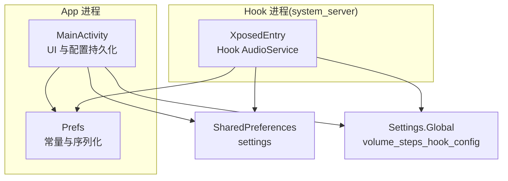
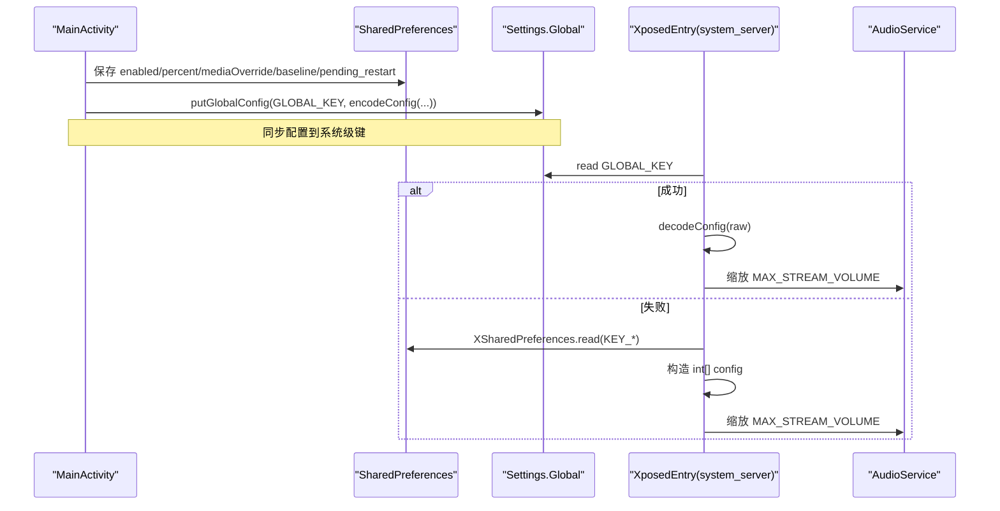
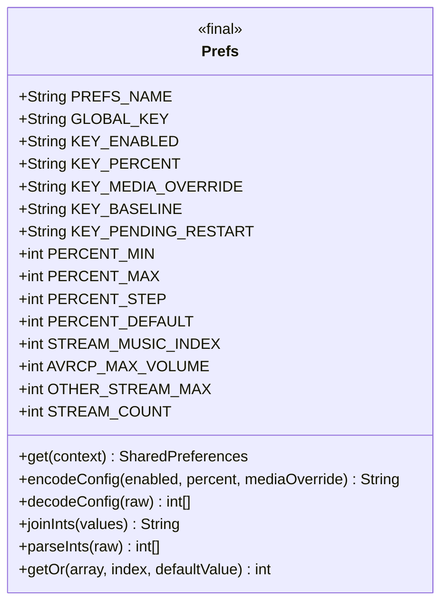
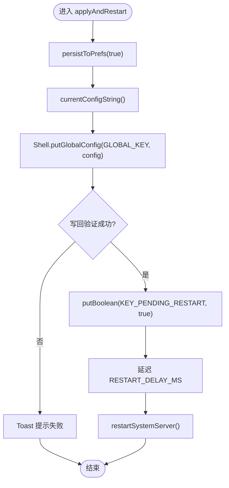
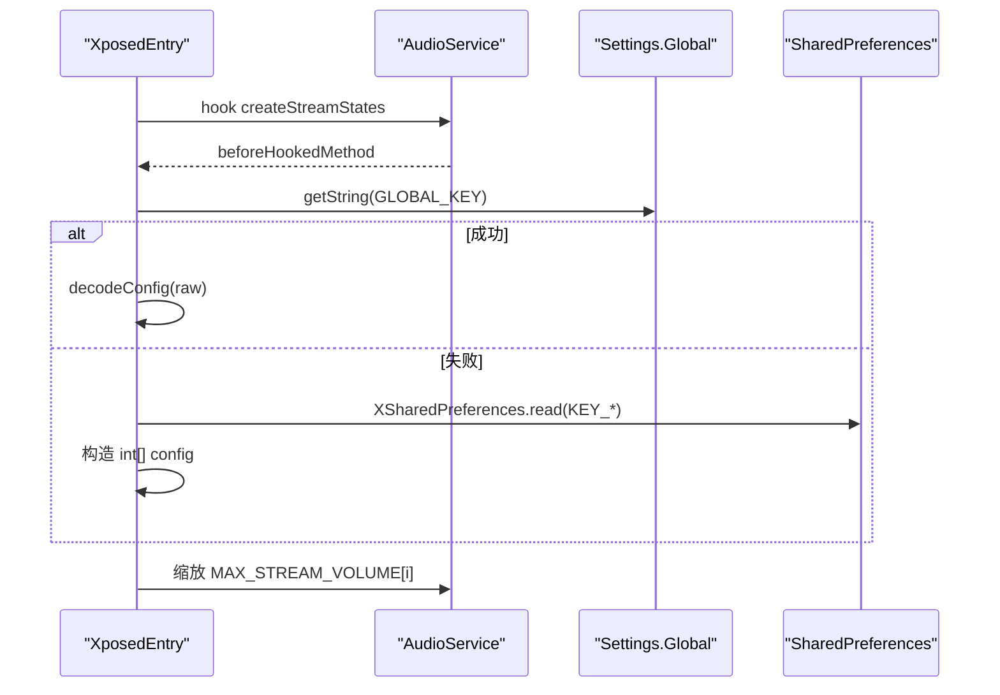
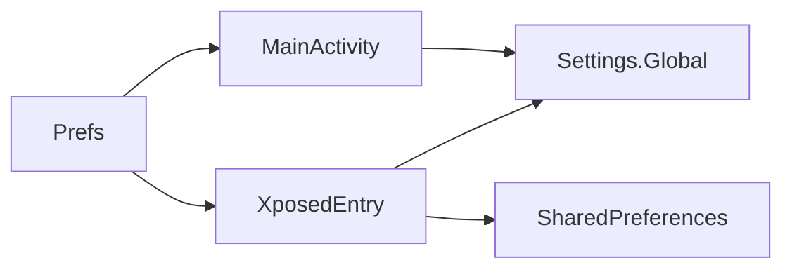

# Prefs 模块

<cite>
**本文引用的文件**   
- [Prefs.java](file://app/src/main/java/com/xiefeihong/volumecontrol/Prefs.java)
- [MainActivity.java](file://app/src/main/java/com/xiefeihong/volumecontrol/MainActivity.java)
- [XposedEntry.java](file://app/src/main/java/com/xiefeihong/volumecontrol/XposedEntry.java)
- [strings.xml](file://app/src/main/res/values/strings.xml)
- [arrays.xml](file://app/src/main/res/values/arrays.xml)
</cite>

## 目录
1. [简介](#简介)
2. [项目结构](#项目结构)
3. [核心组件](#核心组件)
4. [架构总览](#架构总览)
5. [详细组件分析](#详细组件分析)
6. [依赖关系分析](#依赖关系分析)
7. [性能与可靠性](#性能与可靠性)
8. [故障排查指南](#故障排查指南)
9. [结论](#结论)
10. [附录：配置使用示例与最佳实践](#附录配置使用示例与最佳实践)

## 简介
本技术文档聚焦于音量控制应用中的 Prefs 模块，系统性说明其配置管理架构设计、SharedPreferences 使用模式、配置数据的序列化与反序列化机制、数据安全策略，以及与 App 进程和 Hook 端（system_server）的协作关系。文档同时提供配置迁移、数据备份、错误恢复等开发指南，帮助开发者在复杂系统环境下稳定地读写配置并保证版本兼容。

## 项目结构
- Prefs 模块位于 app 模块的 Java 源码中，作为配置常量与读写工具类，被主界面 Activity 与 LSPosed Hook 入口共同使用。
- MainActivity 负责 UI 交互、配置读取与持久化、预览计算、触发系统框架软重启。
- XposedEntry 在 system_server 进程中通过反射修改 AudioService 的音频流档位数组，优先从 Settings.Global 读取配置，回退到模块 SharedPreferences。
- strings.xml 与 arrays.xml 提供用户可见文案与音频流名称映射，辅助配置展示与状态提示。

图表来源
- [MainActivity.java:44-49](file://app/src/main/java/com/xiefeihong/volumecontrol/MainActivity.java#L44-L49)
- [MainActivity.java:235-288](file://app/src/main/java/com/xiefeihong/volumecontrol/MainActivity.java#L235-L288)
- [XposedEntry.java:122-146](file://app/src/main/java/com/xiefeihong/volumecontrol/XposedEntry.java#L122-L146)
- [Prefs.java:52-59](file://app/src/main/java/com/xiefeihong/volumecontrol/Prefs.java#L52-L59)

章节来源
- [MainActivity.java:23-50](file://app/src/main/java/com/xiefeihong/volumecontrol/MainActivity.java#L23-L50)
- [XposedEntry.java:16-29](file://app/src/main/java/com/xiefeihong/volumecontrol/XposedEntry.java#L16-L29)
- [strings.xml:28-38](file://app/src/main/res/values/strings.xml#L28-L38)

## 核心组件
- Prefs：定义 SharedPreferences 文件名、全局键名、配置键名、数值范围常量；提供 get(Context)、encodeConfig/decodeConfig、joinInts/parseInts、getOr 等工具方法。
- MainActivity：封装配置读取、校验、持久化、预览计算、写入 Settings.Global、触发软重启；维护基准档位数组（原始系统档位）。
- XposedEntry：在 system_server 中 Hook AudioService.createStreamStates，按配置缩放 MAX_STREAM_VOLUME 数组；优先读 Settings.Global，回退到模块 SharedPreferences。

章节来源
- [Prefs.java:12-50](file://app/src/main/java/com/xiefeihong/volumecontrol/Prefs.java#L12-L50)
- [MainActivity.java:130-141](file://app/src/main/java/com/xiefeihong/volumecontrol/MainActivity.java#L130-L141)
- [XposedEntry.java:67-114](file://app/src/main/java/com/xiefeihong/volumecontrol/XposedEntry.java#L67-L114)

## 架构总览
配置管理采用“双通道 + 回退”的设计：
- App 进程通过 SharedPreferences 持久化用户设置，并通过 Shell 写入 Settings.Global。
- Hook 端优先从 Settings.Global 读取配置字符串，解析后应用到 AudioService 的静态数组；若失败则回退到模块 SharedPreferences。
- 配置字符串格式为“启用标志;百分比;媒体覆盖”，基准档位以 CSV 形式存储于 SharedPreferences。

图表来源
- [MainActivity.java:261-288](file://app/src/main/java/com/xiefeihong/volumecontrol/MainActivity.java#L261-L288)
- [XposedEntry.java:122-146](file://app/src/main/java/com/xiefeihong/volumecontrol/XposedEntry.java#L122-L146)
- [Prefs.java:56-82](file://app/src/main/java/com/xiefeihong/volumecontrol/Prefs.java#L56-L82)

## 详细组件分析

### Prefs 组件
- 常量定义
  - PREFS_NAME：SharedPreferences 文件名，必须与 Hook 端一致。
  - GLOBAL_KEY：Settings.Global 备用配置键，Hook 端优先读取。
  - KEY_*：enabled、scale_percent、media_steps_override、baseline_max_volumes、pending_restart。
  - PERCENT_MIN/MAX/STEP/DEFAULT：缩放比例范围与默认值。
  - STREAM_MUSIC_INDEX：媒体流索引。
  - AVRCP_MAX_VOLUME：蓝牙 AVRCP 绝对音量上限（127）。
  - OTHER_STREAM_MAX：非媒体流安全上限。
  - STREAM_COUNT：AudioService.MAX_STREAM_VOLUME 数组长度（Android 13+ 为 12）。
- SharedPreferences 访问
  - get(Context)：返回私有模式的 SharedPreferences 实例。
- 序列化与反序列化
  - encodeConfig(enabled, percent, mediaOverride)：生成“启用;百分比;媒体覆盖”字符串。
  - decodeConfig(raw)：解析字符串为 int[]{enabled, percent, mediaOverride}，非法内容返回 null。
  - joinInts(values)/parseInts(raw)：CSV 形式的 int 数组序列化工具。
  - getOr(array, index, defaultValue)：越界保护的安全取值。
- 数据类型转换与边界检查
  - 所有数值均进行范围限制（如 percent 在 PERCENT_MIN~PERCENT_MAX，媒体覆盖不超过 AVRCP_MAX_VOLUME）。
  - 解析异常时返回空或默认值，避免崩溃。

图表来源
- [Prefs.java:12-50](file://app/src/main/java/com/xiefeihong/volumecontrol/Prefs.java#L12-L50)
- [Prefs.java:52-122](file://app/src/main/java/com/xiefeihong/volumecontrol/Prefs.java#L52-L122)

章节来源
- [Prefs.java:12-122](file://app/src/main/java/com/xiefeihong/volumecontrol/Prefs.java#L12-L122)

### MainActivity 组件
- 配置读取与 UI 绑定
  - loadConfigIntoUi：从 SharedPreferences 读取 enabled、percent、mediaOverride，并进行边界钳制。
  - ensureBaseline：首次启动采集系统原始档位，不足 STREAM_COUNT 时触发 captureBaseline。
- 配置持久化
  - persistToPrefs：将当前 UI 状态写入 SharedPreferences，支持同步 commit 或异步 apply。
  - currentConfigString：调用 Prefs.encodeConfig 生成配置字符串。
  - captureBaseline：读取各音频流最大档位数，并以 CSV 形式存入 SharedPreferences。
- 系统配置同步与软重启
  - applyAndRestart：持久化 → 写入 Settings.Global → 验证写回 → 标记 pending_restart → 延迟软重启。
  - restartSystemServer：执行系统框架重启命令。
- 状态检测与渲染
  - refreshStatus：检测 root/LSPosed/实际媒体档位/蓝牙设备，并与目标档位对比显示。
  - renderStatus：根据 actualMedia 与 targetMedia 的关系更新状态文案，并在生效时清除 pending_restart。

图表来源
- [MainActivity.java:261-296](file://app/src/main/java/com/xiefeihong/volumecontrol/MainActivity.java#L261-L296)

章节来源
- [MainActivity.java:123-141](file://app/src/main/java/com/xiefeihong/volumecontrol/MainActivity.java#L123-L141)
- [MainActivity.java:235-296](file://app/src/main/java/com/xiefeihong/volumecontrol/MainActivity.java#L235-L296)
- [MainActivity.java:300-366](file://app/src/main/java/com/xiefeihong/volumecontrol/MainActivity.java#L300-L366)

### XposedEntry 组件
- Hook 流程
  - handleLoadPackage：定位 android 包下的 AudioService，hook createStreamStates 方法。
  - beforeHookedMethod：在创建音频流状态前调用 applyScaling。
- 配置读取
  - readConfig：优先从 Settings.Global 读取并解码；失败则回退到模块 SharedPreferences。
- 档位缩放
  - applyScaling：克隆原始 MAX_STREAM_VOLUME 数组，按百分比缩放，媒体流可固定为 mediaOverride，并对每个流进行上下限约束。

图表来源
- [XposedEntry.java:42-65](file://app/src/main/java/com/xiefeihong/volumecontrol/XposedEntry.java#L42-L65)
- [XposedEntry.java:67-114](file://app/src/main/java/com/xiefeihong/volumecontrol/XposedEntry.java#L67-L114)
- [XposedEntry.java:122-146](file://app/src/main/java/com/xiefeihong/volumecontrol/XposedEntry.java#L122-L146)

章节来源
- [XposedEntry.java:42-114](file://app/src/main/java/com/xiefeihong/volumecontrol/XposedEntry.java#L42-L114)
- [XposedEntry.java:122-146](file://app/src/main/java/com/xiefeihong/volumecontrol/XposedEntry.java#L122-L146)

## 依赖关系分析
- Prefs 不依赖任何外部库，仅使用 Android 基础 API（Context、SharedPreferences），确保可在 App 与 Hook 两端共享。
- MainActivity 依赖 Prefs 提供的常量与序列化方法，以及系统服务（AudioManager）、Shell 工具（未在本仓库中展示）用于写入 Settings.Global 与重启。
- XposedEntry 依赖 Xposed/LSPosed API 与 Android 系统反射能力，通过 ContentResolver 访问 Settings.Global，并回退到模块 SharedPreferences。

图表来源
- [MainActivity.java:44-49](file://app/src/main/java/com/xiefeihong/volumecontrol/MainActivity.java#L44-L49)
- [XposedEntry.java:122-146](file://app/src/main/java/com/xiefeihong/volumecontrol/XposedEntry.java#L122-L146)
- [Prefs.java:52-59](file://app/src/main/java/com/xiefeihong/volumecontrol/Prefs.java#L52-L59)

章节来源
- [MainActivity.java:44-49](file://app/src/main/java/com/xiefeihong/volumecontrol/MainActivity.java#L44-L49)
- [XposedEntry.java:122-146](file://app/src/main/java/com/xiefeihong/volumecontrol/XposedEntry.java#L122-L146)
- [Prefs.java:52-59](file://app/src/main/java/com/xiefeihong/volumecontrol/Prefs.java#L52-L59)

## 性能与可靠性
- SharedPreferences 读写
  - 常规 UI 操作使用 apply（异步），减少主线程阻塞；关键路径（applyAndRestart）使用 commit（同步）确保落盘后再进行后续操作。
- 配置校验与容错
  - 所有数值输入均进行边界钳制（percent、mediaOverride），防止超出 AVRCP 或非媒体流安全上限。
  - 解析失败返回空或默认值，避免异常传播导致崩溃。
- 系统级配置同步
  - 写入 Settings.Global 后进行读回验证，失败时提示用户并保留本地配置，便于重试。
- 基准档位缓存
  - baseline_max_volumes 以 CSV 形式缓存，避免每次启动都查询系统，提升性能与稳定性。

[本节为通用性能讨论，不直接分析具体文件]

## 故障排查指南
- 无法写入 Settings.Global
  - 现象：提示“写入系统配置失败”。
  - 排查：确认已授予 su 权限；检查 Shell 工具是否可用；查看 Toast 输出详情。
- 配置未生效
  - 现象：实际媒体档位与目标不一致。
  - 排查：确认已点击“保存设置并软重启系统框架”；检查 pending_restart 标志是否被清除；确认 LSPosed 模块已启用且作用域包含系统框架。
- 基准档位异常
  - 现象：预览显示异常或档位计算不正确。
  - 排查：重新采集基准档位；确保当前无其他音量修改；检查 baseline_max_volumes 是否为空或长度不足。
- Hook 端读取失败
  - 现象：Hook 日志显示“read global config failed”或“read shared prefs failed”。
  - 排查：检查 Settings.Global 键是否存在；确认模块 SharedPreferences 可读；必要时清理并重建配置。

章节来源
- [MainActivity.java:261-296](file://app/src/main/java/com/xiefeihong/volumecontrol/MainActivity.java#L261-L296)
- [XposedEntry.java:122-146](file://app/src/main/java/com/xiefeihong/volumecontrol/XposedEntry.java#L122-L146)

## 结论
Prefs 模块通过统一的常量定义、健壮的序列化/反序列化方法与严格的边界检查，实现了跨进程的配置管理与数据一致性。结合 MainActivity 的 UI 交互与系统配置同步，以及 XposedEntry 的系统级 Hook 能力，形成了稳定可靠的音量档位缩放方案。建议在扩展新功能时遵循现有模式：新增配置项需同时更新常量、序列化逻辑、UI 绑定与 Hook 端读取逻辑，并确保版本兼容与错误恢复。

[本节为总结性内容，不直接分析具体文件]

## 附录：配置使用示例与最佳实践

- 配置键与用途
  - enabled：是否启用档位缩放。
  - scale_percent：缩放比例（25%~400%，步长 5%）。
  - media_steps_override：媒体流固定档位（0 表示跟随缩放，上限 127）。
  - baseline_max_volumes：各音频流原始档位数（CSV）。
  - pending_restart：是否需要软重启系统框架。
- 配置迁移
  - 当新增配置字段时，保持 decodeConfig 向后兼容：忽略未知字段或使用默认值。
  - 对 baseline_max_volumes 的长度变化做兼容处理：使用 getOr 安全取值。
- 数据备份
  - 建议定期导出 SharedPreferences 与 Settings.Global 对应键，以便恢复。
  - 在重置或升级前，先采集并备份 baseline_max_volumes。
- 错误恢复
  - 若 Settings.Global 写入失败，保留本地 SharedPreferences 配置，允许用户重试。
  - 若 Hook 端读取失败，自动回退到模块 SharedPreferences，保证基本功能可用。
- 开发规范
  - 所有数值输入必须经过边界检查与类型转换。
  - 新增配置需在 Prefs 中定义常量，并提供序列化/反序列化支持。
  - UI 层与 Hook 层保持一致的计算逻辑，避免差异导致的状态不一致。

章节来源
- [Prefs.java:14-47](file://app/src/main/java/com/xiefeihong/volumecontrol/Prefs.java#L14-L47)
- [Prefs.java:56-122](file://app/src/main/java/com/xiefeihong/volumecontrol/Prefs.java#L56-L122)
- [MainActivity.java:130-141](file://app/src/main/java/com/xiefeihong/volumecontrol/MainActivity.java#L130-L141)
- [MainActivity.java:235-296](file://app/src/main/java/com/xiefeihong/volumecontrol/MainActivity.java#L235-L296)
- [XposedEntry.java:122-146](file://app/src/main/java/com/xiefeihong/volumecontrol/XposedEntry.java#L122-L146)