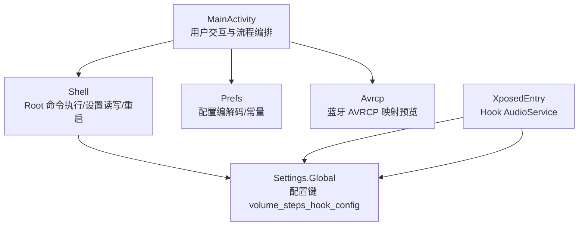
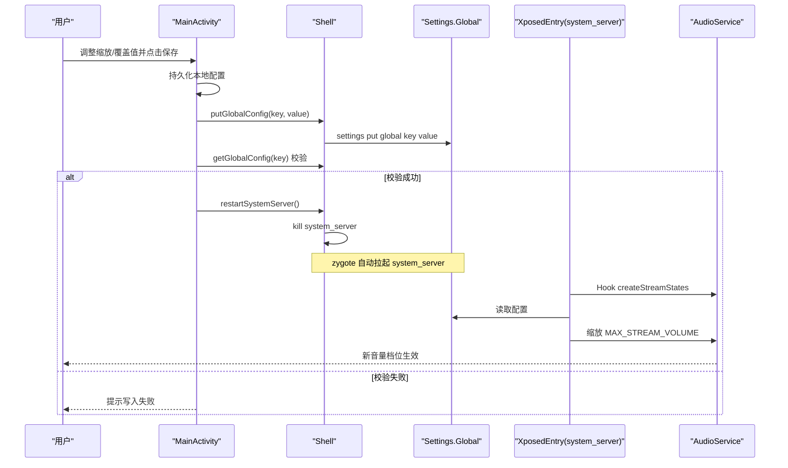
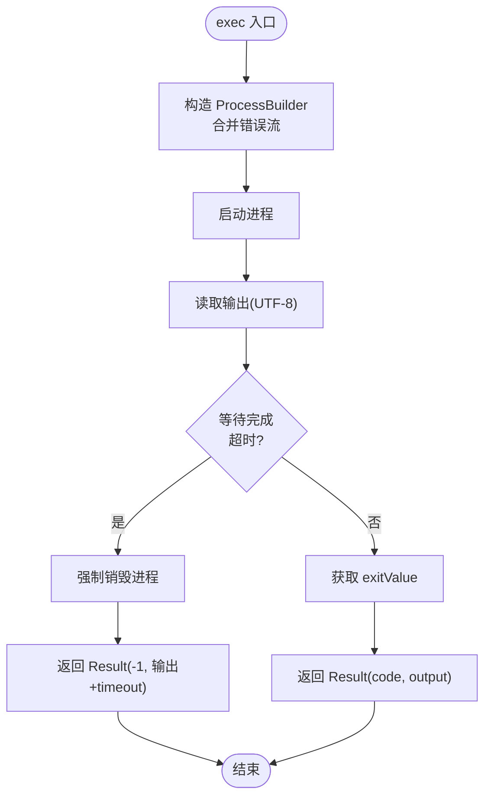
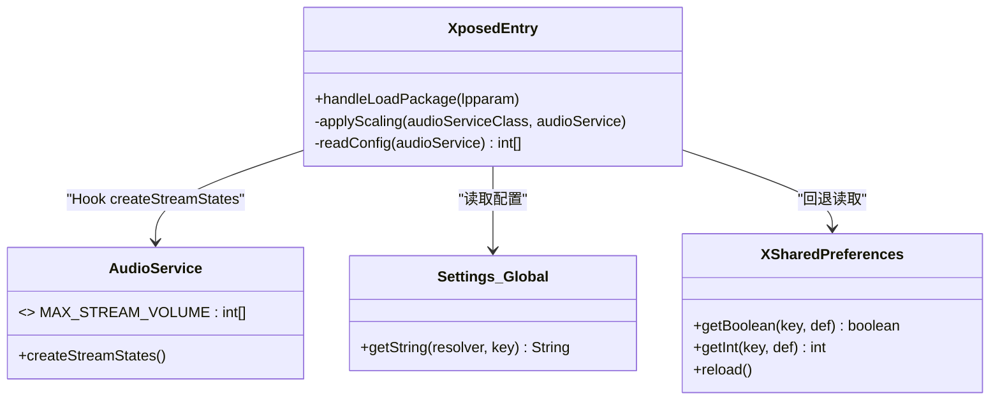
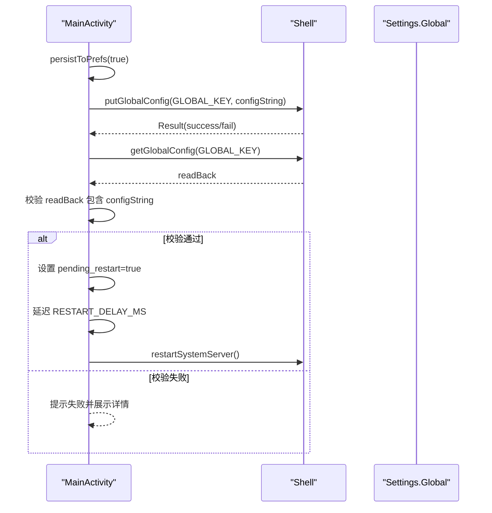
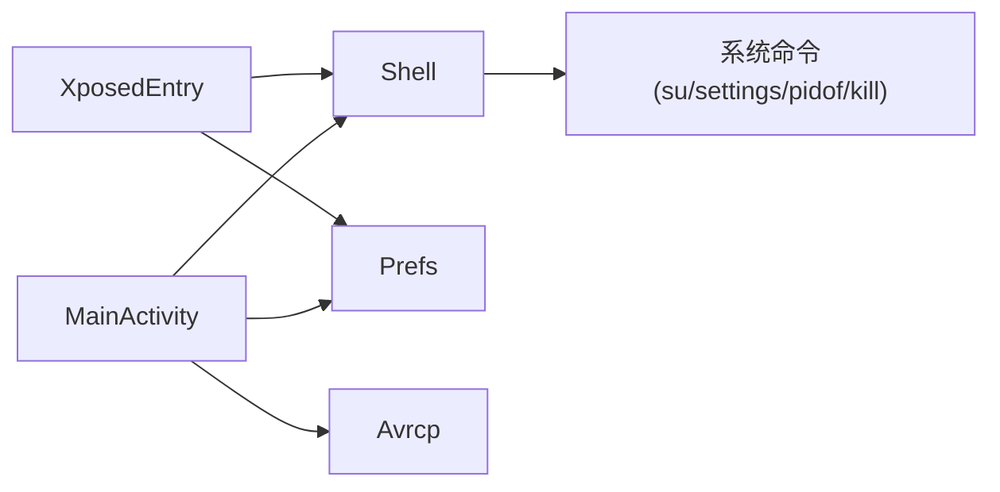

# Shell 模块

<cite>
**本文引用的文件**
- [Shell.java](file://app/src/main/java/com/xiefeihong/volumecontrol/Shell.java)
- [XposedEntry.java](file://app/src/main/java/com/xiefeihong/volumecontrol/XposedEntry.java)
- [MainActivity.java](file://app/src/main/java/com/xiefeihong/volumecontrol/MainActivity.java)
- [Prefs.java](file://app/src/main/java/com/xiefeihong/volumecontrol/Prefs.java)
- [Avrcp.java](file://app/src/main/java/com/xiefeihong/volumecontrol/Avrcp.java)
- [strings.xml](file://app/src/main/res/values/strings.xml)
- [build.gradle](file://app/build.gradle)
</cite>

## 目录
1. [简介](#简介)
2. [项目结构](#项目结构)
3. [核心组件](#核心组件)
4. [架构总览](#架构总览)
5. [详细组件分析](#详细组件分析)
6. [依赖关系分析](#依赖关系分析)
7. [性能与资源管理](#性能与资源管理)
8. [故障排除指南](#故障排除指南)
9. [结论](#结论)
10. [附录：命令调用示例](#附录命令调用示例)

## 简介
本模块通过 Root 权限在系统框架层对音量档位进行缩放，并通过 LSPosed Hook AudioService 的初始化流程，将配置写入 Settings.Global，再由 system_server 中的 Hook 端读取并生效。Shell 子模块负责所有需要 root 的系统级操作：su 命令执行、权限检测、Settings.Global 读写、system_server 软重启等。

## 项目结构
- app/src/main/java/com/xiefeihong/volumecontrol
  - Shell.java：Root Shell 工具类，封装 su/exec、权限检测、Settings.Global 读写、system_server 重启。
  - XposedEntry.java：LSPosed 模块入口，Hook AudioService.createStreamStates，按配置缩放 MAX_STREAM_VOLUME。
  - MainActivity.java：UI 与业务流程编排，协调 Prefs、Shell、系统状态检测与 UI 更新。
  - Prefs.java：配置常量与序列化/反序列化工具（App 与 Hook 共享）。
  - Avrcp.java：蓝牙 AVRCP 绝对音量映射计算与预览生成。
- app/src/main/res/values/strings.xml：界面文案与提示。
- app/build.gradle：构建配置与依赖声明（含 Xposed API 编译期依赖）。

图表来源
- [MainActivity.java:261-296](file://app/src/main/java/com/xiefeihong/volumecontrol/MainActivity.java#L261-L296)
- [Shell.java:92-112](file://app/src/main/java/com/xiefeihong/volumecontrol/Shell.java#L92-L112)
- [XposedEntry.java:116-146](file://app/src/main/java/com/xiefeihong/volumecontrol/XposedEntry.java#L116-L146)
- [Prefs.java:14-47](file://app/src/main/java/com/xiefeihong/volumecontrol/Prefs.java#L14-L47)

章节来源
- [MainActivity.java:23-50](file://app/src/main/java/com/xiefeihong/volumecontrol/MainActivity.java#L23-L50)
- [Shell.java:8-18](file://app/src/main/java/com/xiefeihong/volumecontrol/Shell.java#L8-L18)
- [XposedEntry.java:16-28](file://app/src/main/java/com/xiefeihong/volumecontrol/XposedEntry.java#L16-L28)
- [Prefs.java:6-11](file://app/src/main/java/com/xiefeihong/volumecontrol/Prefs.java#L6-L11)

## 核心组件
- Shell：提供阻塞式 Root 命令执行、超时控制、错误处理；封装 isRootAvailable、isLsposedPresent、isMagiskPresent；提供 Settings.Global 读写；提供 system_server 软重启。
- XposedEntry：在 system_server 中 Hook AudioService.createStreamStates，按比例缩放 MAX_STREAM_VOLUME，支持媒体流覆盖值；优先从 Settings.Global 读取配置，回退到 XSharedPreferences。
- MainActivity：采集基准档位、计算目标档位、持久化本地配置、写入 Settings.Global、校验写入结果、触发软重启、刷新状态显示。
- Prefs：定义全局配置键、范围限制、编码/解码、CSV 工具方法。
- Avrcp：实现与 AOSP 一致的 AVRCP 绝对音量换算，统计重复映射对数，生成预览文本。

章节来源
- [Shell.java:21-112](file://app/src/main/java/com/xiefeihong/volumecontrol/Shell.java#L21-L112)
- [XposedEntry.java:41-146](file://app/src/main/java/com/xiefeihong/volumecontrol/XposedEntry.java#L41-L146)
- [MainActivity.java:123-296](file://app/src/main/java/com/xiefeihong/volumecontrol/MainActivity.java#L123-L296)
- [Prefs.java:14-124](file://app/src/main/java/com/xiefeihong/volumecontrol/Prefs.java#L14-L124)
- [Avrcp.java:20-90](file://app/src/main/java/com/xiefeihong/volumecontrol/Avrcp.java#L20-L90)

## 架构总览
整体流程分为“应用侧”和“系统框架侧”两部分：
- 应用侧（App 进程）：用户在界面调整缩放比例或媒体覆盖值，应用将配置序列化后通过 Shell.putGlobalConfig 写入 Settings.Global，并可选触发 system_server 软重启。
- 系统框架侧（system_server 进程）：XposedEntry 在 AudioService 初始化前 Hook createStreamStates，读取 Settings.Global 的配置，按比例缩放 MAX_STREAM_VOLUME 数组，使新的音量档位数生效。

图表来源
- [MainActivity.java:261-296](file://app/src/main/java/com/xiefeihong/volumecontrol/MainActivity.java#L261-L296)
- [Shell.java:92-112](file://app/src/main/java/com/xiefeihong/volumecontrol/Shell.java#L92-L112)
- [XposedEntry.java:116-146](file://app/src/main/java/com/xiefeihong/volumecontrol/XposedEntry.java#L116-L146)

## 详细组件分析

### Shell 组件：Root 权限与系统命令封装
- 命令执行与超时
  - exec(command...)：使用 ProcessBuilder 启动进程，合并 stdout/stderr，读取 UTF-8 输出，默认超时 20 秒；超时则强制销毁进程并返回超时标记。
  - su(command)：以 su -c 方式执行命令，统一走 exec 流程。
- 权限与环境检测
  - isRootAvailable()：执行 id 并检查 uid=0。
  - isLsposedPresent() / isMagiskPresent()：通过 ls 探测目录存在性。
- Settings.Global 读写
  - putGlobalConfig(key, value)：通过 settings put global 写入，value 用单引号包裹避免 shell 解析异常。
  - getGlobalConfig(key)：通过 settings get global 读取，用于写后校验。
- 系统进程管理
  - restartSystemServer()：尝试使用 pidof + kill -9 或 killall 终止 system_server，由 zygote 自动重启。

图表来源
- [Shell.java:40-72](file://app/src/main/java/com/xiefeihong/volumecontrol/Shell.java#L40-L72)

章节来源
- [Shell.java:15-112](file://app/src/main/java/com/xiefeihong/volumecontrol/Shell.java#L15-L112)

### XposedEntry 组件：系统进程 Hook 与配置读取
- Hook 点：在 android 包（系统框架）加载时，Hook AudioService.createStreamStates，在 beforeHookedMethod 中执行 applyScaling。
- 配置读取优先级：
  - 优先从 Settings.Global 读取 GLOBAL_KEY 对应的配置字符串，解码为 {enabled, percent, mediaOverride}。
  - 若失败，回退到 XSharedPreferences 读取模块配置。
- 缩放逻辑：
  - 备份原始 MAX_STREAM_VOLUME 数组，按比例缩放，媒体流可被 mediaOverride 覆盖。
  - 限制上限：媒体流不超过 AVRCP_MAX_VOLUME（127），其他流不超过 OTHER_STREAM_MAX（150），最小值为 1。

图表来源
- [XposedEntry.java:41-146](file://app/src/main/java/com/xiefeihong/volumecontrol/XposedEntry.java#L41-L146)

章节来源
- [XposedEntry.java:16-146](file://app/src/main/java/com/xiefeihong/volumecontrol/XposedEntry.java#L16-L146)

### MainActivity 组件：流程编排与状态检测
- 配置持久化：将启用开关、缩放比例、媒体覆盖值写入 SharedPreferences。
- 写入系统配置：调用 Shell.putGlobalConfig 写入 Settings.Global，并立即 getGlobalConfig 校验是否落盘成功。
- 软重启策略：校验成功后设置 pending 标志，延迟一段时间后执行 Shell.restartSystemServer。
- 状态检测：检测 root/LSPosed/当前媒体档位/蓝牙设备，渲染界面状态与待生效提示。

图表来源
- [MainActivity.java:261-296](file://app/src/main/java/com/xiefeihong/volumecontrol/MainActivity.java#L261-L296)
- [Shell.java:92-112](file://app/src/main/java/com/xiefeihong/volumecontrol/Shell.java#L92-L112)

章节来源
- [MainActivity.java:123-296](file://app/src/main/java/com/xiefeihong/volumecontrol/MainActivity.java#L123-L296)

### Prefs 组件：配置模型与验证
- 全局键：GLOBAL_KEY = "volume_steps_hook_config"。
- 配置格式：{enabled};{percent};{mediaOverride}，encode/decode 保证两端一致。
- 范围限制：PERCENT_MIN=25，PERCENT_MAX=400，PERCENT_STEP=5，PERCENT_DEFAULT=100。
- 安全上限：AVRCP_MAX_VOLUME=127，OTHER_STREAM_MAX=150，STREAM_COUNT=12。
- 工具方法：joinInts/parseInts/getOr 用于基准档位 CSV 存储与安全取值。

章节来源
- [Prefs.java:14-124](file://app/src/main/java/com/xiefeihong/volumecontrol/Prefs.java#L14-L124)

### Avrcp 组件：蓝牙 AVRCP 映射与预览
- toAbsoluteVolume(step, maxSteps)：与 AOSP 一致的换算公式。
- countDuplicatePairs(maxSteps)：统计相邻档位映射到相同 AVRCP 音量的对数。
- buildPreview(maxSteps)：生成可读的映射预览，便于用户理解档位变化对蓝牙的影响。

章节来源
- [Avrcp.java:20-90](file://app/src/main/java/com/xiefeihong/volumecontrol/Avrcp.java#L20-L90)

## 依赖关系分析
- 构建依赖：XposedBridge API 仅作为 compileOnly 依赖，运行期由 LSPosed 提供。
- 运行时依赖：
  - MainActivity 依赖 Shell、Prefs、Avrcp 以及 Android 系统服务（AudioManager、ContentResolver）。
  - XposedEntry 依赖 XposedHelpers/XSharedPreferences 及系统框架内部类（AudioService）。
  - Shell 依赖系统 su/settings/pidof/kill 等命令。

图表来源
- [build.gradle:38-43](file://app/build.gradle#L38-L43)
- [MainActivity.java:261-296](file://app/src/main/java/com/xiefeihong/volumecontrol/MainActivity.java#L261-L296)
- [XposedEntry.java:116-146](file://app/src/main/java/com/xiefeihong/volumecontrol/XposedEntry.java#L116-L146)
- [Shell.java:40-112](file://app/src/main/java/com/xiefeihong/volumecontrol/Shell.java#L40-L112)

章节来源
- [build.gradle:38-43](file://app/build.gradle#L38-L43)

## 性能与资源管理
- 线程模型
  - MainActivity 使用单线程 Executor 串行执行所有 root/系统查询操作，避免并发竞争与 UI 卡顿。
  - Shell.exec 为阻塞调用，必须在后台线程执行。
- 超时与资源清理
  - Shell.exec 默认超时 20 秒，超时后强制销毁进程，防止僵尸进程。
  - finally 块确保 process.destroy() 被调用，释放进程句柄。
- I/O 优化
  - 使用 BufferedReader 逐行读取输出，减少内存占用。
  - 合并 stdout/stderr，简化错误处理。
- 配置缓存
  - XposedEntry 首次备份原始 MAX_STREAM_VOLUME 数组，避免重复缩放导致的累积误差。

章节来源
- [MainActivity.java:34-36](file://app/src/main/java/com/xiefeihong/volumecontrol/MainActivity.java#L34-L36)
- [Shell.java:40-72](file://app/src/main/java/com/xiefeihong/volumecontrol/Shell.java#L40-L72)
- [XposedEntry.java:94-97](file://app/src/main/java/com/xiefeihong/volumecontrol/XposedEntry.java#L94-L97)

## 故障排除指南
- Root 不可用
  - 现象：isRootAvailable 返回 false。
  - 排查：确认已授予 su 权限；检查 su 是否可用；查看 Shell.isRootAvailable 调用结果。
- LSPosed/Magisk 未检测到
  - 现象：isLsposedPresent/isMagiskPresent 返回 false。
  - 排查：确认安装路径存在；检查 SELinux 与 Magisk 模块状态。
- Settings.Global 写入失败
  - 现象：putGlobalConfig 返回失败或 getGlobalConfig 读不到预期值。
  - 排查：检查 su 授权；确认 value 使用单引号包裹；查看 Shell.getGlobalConfig 的输出详情。
- system_server 重启无效
  - 现象：重启后档位未变化。
  - 排查：确认 XposedEntry 已 Hook；检查 Settings.Global 配置是否正确；确认重启后 AudioService 重新初始化。
- 蓝牙低音量无声
  - 现象：第 1 档 AVRCP 音量过低导致耳机无声。
  - 排查：提高缩放比例或设置媒体覆盖值；参考 Avrcp.buildPreview 的最低档信息。

章节来源
- [Shell.java:74-103](file://app/src/main/java/com/xiefeihong/volumecontrol/Shell.java#L74-L103)
- [MainActivity.java:300-366](file://app/src/main/java/com/xiefeihong/volumecontrol/MainActivity.java#L300-L366)
- [Avrcp.java:44-88](file://app/src/main/java/com/xiefeihong/volumecontrol/Avrcp.java#L44-L88)
- [strings.xml:44-74](file://app/src/main/res/values/strings.xml#L44-L74)

## 结论
Shell 模块通过统一的 Root 命令执行封装，实现了安全的权限检测、可靠的 Settings.Global 读写与稳健的 system_server 软重启流程。配合 XposedEntry 的系统级 Hook，可在不修改系统源码的前提下动态调整音量档位，兼顾蓝牙 AVRCP 映射体验。建议在生产环境中严格遵循最小权限原则、完善错误日志记录与资源清理机制，并在变更配置后进行充分验证。

## 附录：命令调用示例
以下示例仅描述调用路径与参数含义，不包含具体代码内容。

- 执行 su 命令
  - 调用：Shell.su("command")
  - 说明：以 su -c 方式执行命令，返回 Result(code, output)。
  - 参考路径：[Shell.java:35-38](file://app/src/main/java/com/xiefeihong/volumecontrol/Shell.java#L35-L38)
- 通用命令执行
  - 调用：Shell.exec("cmd", "arg1", "arg2")
  - 说明：合并错误流，UTF-8 读取输出，默认超时 20 秒。
  - 参考路径：[Shell.java:40-72](file://app/src/main/java/com/xiefeihong/volumecontrol/Shell.java#L40-L72)
- 权限检测
  - 调用：Shell.isRootAvailable()
  - 说明：执行 id 并检查 uid=0。
  - 参考路径：[Shell.java:74-78](file://app/src/main/java/com/xiefeihong/volumecontrol/Shell.java#L74-L78)
- 环境检测
  - 调用：Shell.isLsposedPresent() / Shell.isMagiskPresent()
  - 说明：ls 探测目录是否存在。
  - 参考路径：[Shell.java:80-90](file://app/src/main/java/com/xiefeihong/volumecontrol/Shell.java#L80-L90)
- Settings.Global 写入与读取
  - 写入：Shell.putGlobalConfig(Prefs.GLOBAL_KEY, Prefs.encodeConfig(enabled, percent, mediaOverride))
  - 读取：Shell.getGlobalConfig(Prefs.GLOBAL_KEY)
  - 参考路径：[Shell.java:92-103](file://app/src/main/java/com/xiefeihong/volumecontrol/Shell.java#L92-L103)
- system_server 软重启
  - 调用：Shell.restartSystemServer()
  - 说明：尝试 pidof + kill -9 或 killall 终止 system_server。
  - 参考路径：[Shell.java:105-112](file://app/src/main/java/com/xiefeihong/volumecontrol/Shell.java#L105-L112)
- 配置编解码
  - 编码：Prefs.encodeConfig(enabled, percent, mediaOverride)
  - 解码：Prefs.decodeConfig(raw)
  - 参考路径：[Prefs.java:56-82](file://app/src/main/java/com/xiefeihong/volumecontrol/Prefs.java#L56-L82)
- 蓝牙 AVRCP 映射预览
  - 调用：Avrcp.buildPreview(maxSteps)
  - 说明：生成可读的映射预览文本。
  - 参考路径：[Avrcp.java:44-88](file://app/src/main/java/com/xiefeihong/volumecontrol/Avrcp.java#L44-L88)