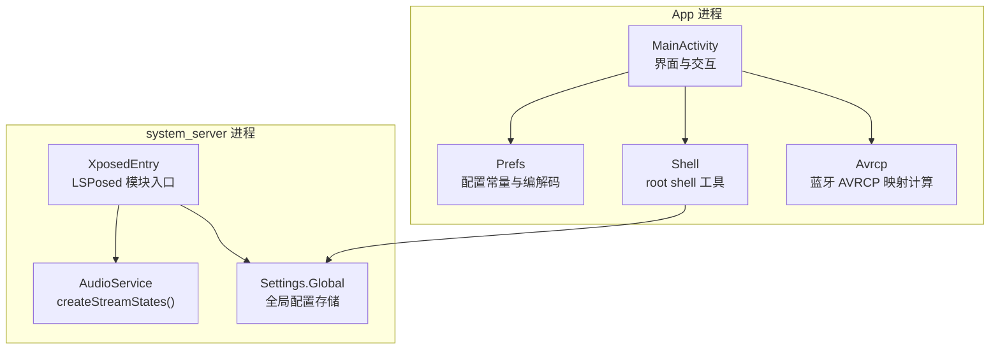
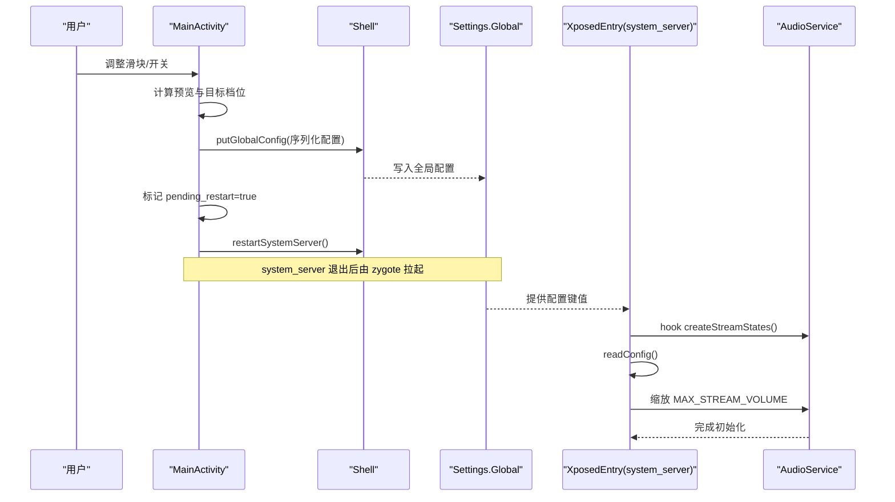
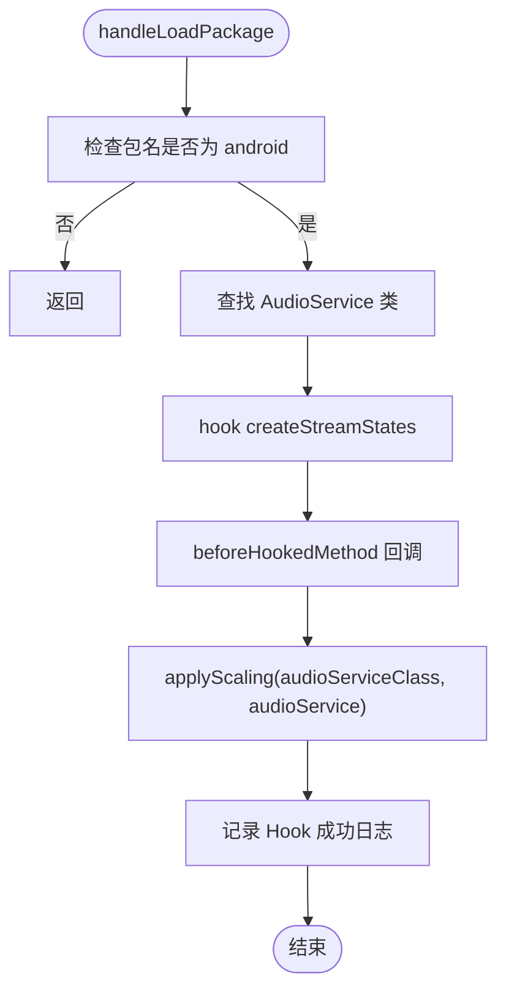
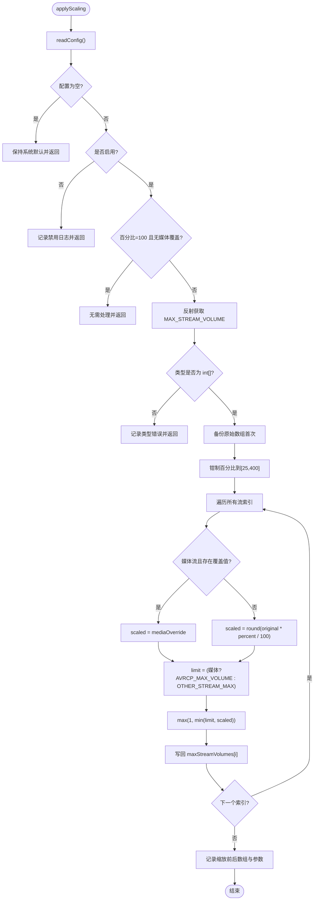
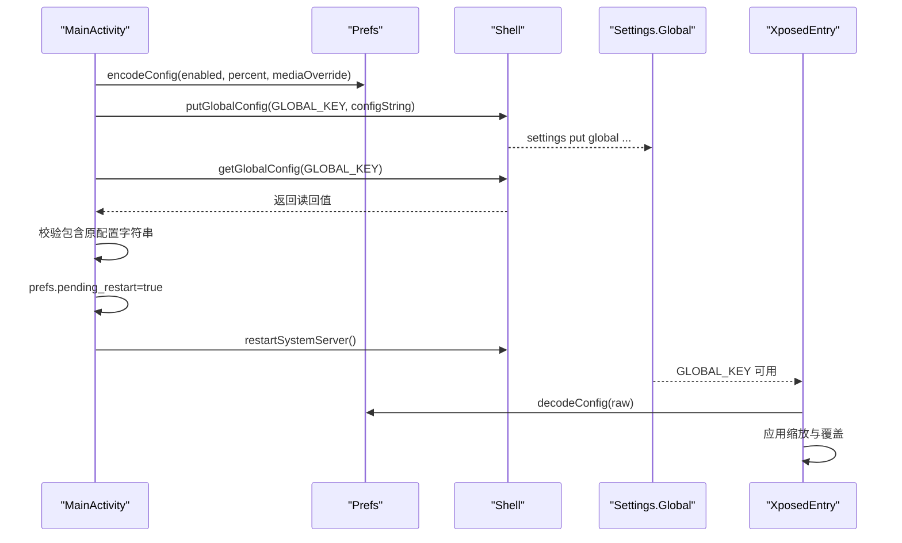
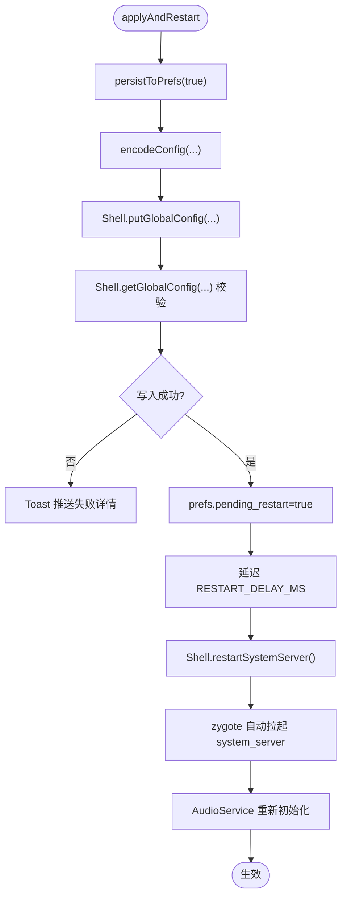
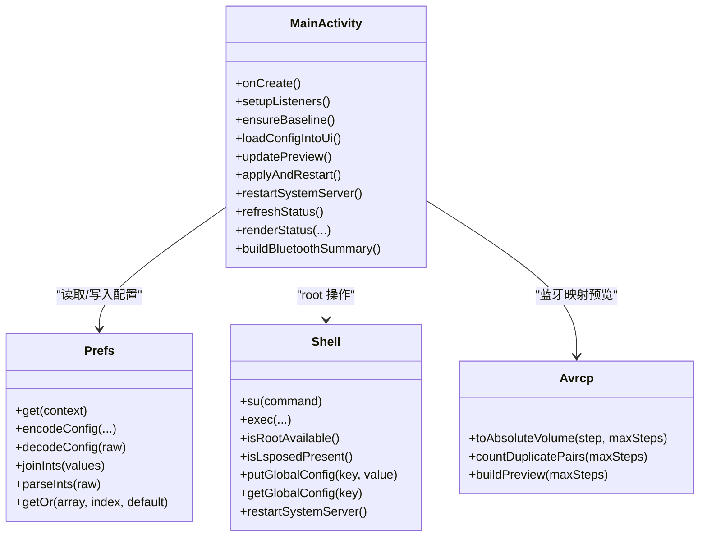
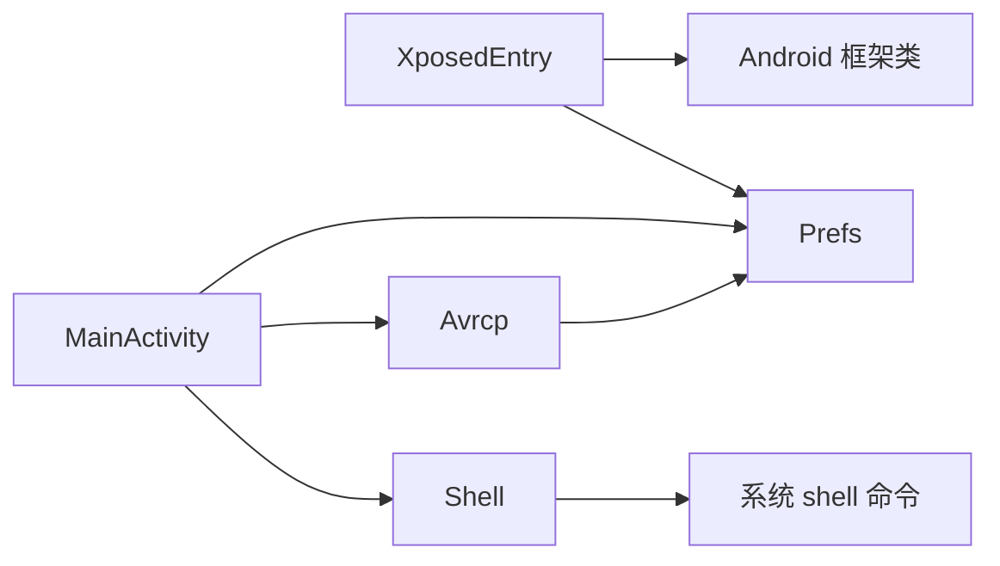

# XposedEntry 模块

<cite>
**本文引用的文件**   
- [XposedEntry.java](file://app/src/main/java/com/xiefeihong/volumecontrol/XposedEntry.java)
- [MainActivity.java](file://app/src/main/java/com/xiefeihong/volumecontrol/MainActivity.java)
- [Prefs.java](file://app/src/main/java/com/xiefeihong/volumecontrol/Prefs.java)
- [Shell.java](file://app/src/main/java/com/xiefeihong/volumecontrol/Shell.java)
- [Avrcp.java](file://app/src/main/java/com/xiefeihong/volumecontrol/Avrcp.java)
</cite>

## 目录
1. [简介](#简介)
2. [项目结构](#项目结构)
3. [核心组件](#核心组件)
4. [架构总览](#架构总览)
5. [详细组件分析](#详细组件分析)
6. [依赖关系分析](#依赖关系分析)
7. [性能与稳定性考虑](#性能与稳定性考虑)
8. [故障排查指南](#故障排查指南)
9. [结论](#结论)
10. [附录：Hook 实现示例与调试技巧](#附录hook-实现示例与调试技巧)

## 简介
本模块是一个 LSPosed 系统级音量控制方案，目标是在 system_server 进程中拦截 AudioService 的初始化流程，按比例缩放各音频流的档位上限数组，从而改变系统音量步进粒度。App 端提供可视化配置、预览蓝牙 AVRCP 映射效果、写入系统设置并触发 system_server 软重启，使新档位生效。

该方案的核心思想是：在 AudioService 创建流状态时，替换其内部静态数组 MAX_STREAM_VOLUME，使其按用户配置的百分比缩放；媒体流可额外指定固定档位以适配蓝牙 AVRCP 绝对音量范围（0~127）。

## 项目结构
本项目为 Android 应用 + LSPosed 模块入口的组合：
- App 进程：提供 UI、配置持久化、系统参数读写、system_server 软重启。
- Hook 进程（system_server）：通过 LSPosed 注入，拦截 AudioService 初始化逻辑，修改音量数组。

**图表来源**
- [MainActivity.java:23-50](file://app/src/main/java/com/xiefeihong/volumecontrol/MainActivity.java#L23-L50)
- [Prefs.java:6-47](file://app/src/main/java/com/xiefeihong/volumecontrol/Prefs.java#L6-L47)
- [Shell.java:8-112](file://app/src/main/java/com/xiefeihong/volumecontrol/Shell.java#L8-L112)
- [Avrcp.java:3-19](file://app/src/main/java/com/xiefeihong/volumecontrol/Avrcp.java#L3-L19)
- [XposedEntry.java:16-39](file://app/src/main/java/com/xiefeihong/volumecontrol/XposedEntry.java#L16-L39)

**章节来源**
- [MainActivity.java:23-50](file://app/src/main/java/com/xiefeihong/volumecontrol/MainActivity.java#L23-L50)
- [Prefs.java:6-47](file://app/src/main/java/com/xiefeihong/volumecontrol/Prefs.java#L6-L47)
- [Shell.java:8-112](file://app/src/main/java/com/xiefeihong/volumecontrol/Shell.java#L8-L112)
- [Avrcp.java:3-19](file://app/src/main/java/com/xiefeihong/volumecontrol/Avrcp.java#L3-L19)
- [XposedEntry.java:16-39](file://app/src/main/java/com/xiefeihong/volumecontrol/XposedEntry.java#L16-L39)

## 核心组件
- XposedEntry：LSPosed 模块入口，负责在 system_server 中 Hook AudioService 的 createStreamStates，读取配置并缩放 MAX_STREAM_VOLUME。
- MainActivity：App 主界面，负责采集基准档位、显示预览、保存配置、写入 Settings.Global、触发 system_server 软重启。
- Prefs：跨进程共享的配置常量与编解码工具，定义配置键、默认值、安全上限等。
- Shell：root shell 执行封装，用于检测 root/LSPosed/Magisk、读写 Settings.Global、软重启 system_server。
- Avrcp：蓝牙 AVRCP 绝对音量映射计算与预览生成。

**章节来源**
- [XposedEntry.java:16-147](file://app/src/main/java/com/xiefeihong/volumecontrol/XposedEntry.java#L16-L147)
- [MainActivity.java:23-426](file://app/src/main/java/com/xiefeihong/volumecontrol/MainActivity.java#L23-L426)
- [Prefs.java:6-123](file://app/src/main/java/com/xiefeihong/volumecontrol/Prefs.java#L6-L123)
- [Shell.java:8-112](file://app/src/main/java/com/xiefeihong/volumecontrol/Shell.java#L8-L112)
- [Avrcp.java:3-89](file://app/src/main/java/com/xiefeihong/volumecontrol/Avrcp.java#L3-L89)

## 架构总览
整体数据与控制流如下：
- App 端将用户配置序列化为字符串，通过 Shell 写入 Settings.Global。
- Hook 端优先从 Settings.Global 读取配置，若不可用则回退到模块 SharedPreferences。
- Hook 端在 AudioService 初始化前按比例缩放 MAX_STREAM_VOLUME，媒体流支持覆盖为固定档位。
- 配置生效后需重启 system_server，因为 AudioService 只在启动时创建流状态。

**图表来源**
- [MainActivity.java:261-296](file://app/src/main/java/com/xiefeihong/volumecontrol/MainActivity.java#L261-L296)
- [Shell.java:92-112](file://app/src/main/java/com/xiefeihong/volumecontrol/Shell.java#L92-L112)
- [XposedEntry.java:41-65](file://app/src/main/java/com/xiefeihong/volumecontrol/XposedEntry.java#L41-L65)
- [XposedEntry.java:122-146](file://app/src/main/java/com/xiefeihong/volumecontrol/XposedEntry.java#L122-L146)

## 详细组件分析

### LSPosed 模块入口与 Hook 初始化
XposedEntry 实现了 IXposedHookLoadPackage，仅对 android 包名生效，避免对其他进程造成干扰。它使用 XposedHelpers.findClass 定位 AudioService，并通过 XposedBridge.hookAllMethods 拦截 createStreamStates。beforeHookedMethod 中调用 applyScaling，先读取配置，再对 MAX_STREAM_VOLUME 进行原地缩放。

关键点：
- 目标包名严格限定为 android，确保仅在 system_server 中执行。
- Hook 方法为 createStreamStates，这是 AudioService 初始化流状态的入口。
- 异常被捕获并记录日志，避免 Hook 失败导致系统崩溃。

**图表来源**
- [XposedEntry.java:41-65](file://app/src/main/java/com/xiefeihong/volumecontrol/XposedEntry.java#L41-L65)

**章节来源**
- [XposedEntry.java:16-65](file://app/src/main/java/com/xiefeihong/volumecontrol/XposedEntry.java#L16-L65)

### AudioService 拦截与音量数组修改机制
applyScaling 的职责：
- 读取配置（启用标志、缩放百分比、媒体流覆盖档位）。
- 获取 AudioService 中的静态字段 MAX_STREAM_VOLUME。
- 首次调用时备份原始数组，避免重复缩放。
- 对每个流档位按比例缩放，媒体流可被覆盖为固定值。
- 限制最终值不超过安全上限（媒体流使用 AVRCP_MAX_VOLUME，其他流使用 OTHER_STREAM_MAX），最小值为 1。

**图表来源**
- [XposedEntry.java:67-114](file://app/src/main/java/com/xiefeihong/volumecontrol/XposedEntry.java#L67-L114)
- [Prefs.java:26-47](file://app/src/main/java/com/xiefeihong/volumecontrol/Prefs.java#L26-L47)

**章节来源**
- [XposedEntry.java:67-114](file://app/src/main/java/com/xiefeihong/volumecontrol/XposedEntry.java#L67-L114)
- [Prefs.java:26-47](file://app/src/main/java/com/xiefeihong/volumecontrol/Prefs.java#L26-L47)

### 配置加载与应用流程
配置读取优先级：
- 优先从 Settings.Global 读取全局配置键，解析为 {enabled, percent, mediaOverride}。
- 若失败或不存在，回退到模块 SharedPreferences（XSharedPreferences）。

App 端配置流程：
- 用户操作更新 UI 并保存到 SharedPreferences。
- 将配置序列化为字符串，通过 Shell.putGlobalConfig 写入 Settings.Global。
- 校验写入结果，成功后标记 pending_restart=true，延迟触发 system_server 软重启。

**图表来源**
- [MainActivity.java:261-296](file://app/src/main/java/com/xiefeihong/volumecontrol/MainActivity.java#L261-L296)
- [Shell.java:92-112](file://app/src/main/java/com/xiefeihong/volumecontrol/Shell.java#L92-L112)
- [Prefs.java:56-82](file://app/src/main/java/com/xiefeihong/volumecontrol/Prefs.java#L56-L82)
- [XposedEntry.java:122-146](file://app/src/main/java/com/xiefeihong/volumecontrol/XposedEntry.java#L122-L146)

**章节来源**
- [MainActivity.java:261-296](file://app/src/main/java/com/xiefeihong/volumecontrol/MainActivity.java#L261-L296)
- [Prefs.java:56-82](file://app/src/main/java/com/xiefeihong/volumecontrol/Prefs.java#L56-L82)
- [Shell.java:92-112](file://app/src/main/java/com/xiefeihong/volumecontrol/Shell.java#L92-L112)
- [XposedEntry.java:122-146](file://app/src/main/java/com/xiefeihong/volumecontrol/XposedEntry.java#L122-L146)

### 进程重启机制与异常处理
system_server 软重启通过 Shell.restartSystemServer 执行 kill -9 或 killall system_server。zygote 会在 system_server 退出后自动拉起，从而重新执行 AudioService 初始化流程，使新的音量数组生效。

异常处理策略：
- Hook 阶段捕获 Throwable 并记录日志，避免影响系统稳定性。
- 配置读取失败时回退到 SharedPreferences，保证基本可用性。
- App 端在重启前校验 Settings.Global 写入结果，失败时提示用户。
- 页面销毁后线程池关闭，重启调用捕获 RuntimeException 忽略。

**图表来源**
- [MainActivity.java:261-296](file://app/src/main/java/com/xiefeihong/volumecontrol/MainActivity.java#L261-L296)
- [Shell.java:105-112](file://app/src/main/java/com/xiefeihong/volumecontrol/Shell.java#L105-L112)

**章节来源**
- [MainActivity.java:261-296](file://app/src/main/java/com/xiefeihong/volumecontrol/MainActivity.java#L261-L296)
- [Shell.java:105-112](file://app/src/main/java/com/xiefeihong/volumecontrol/Shell.java#L105-L112)

### 与 MainActivity 的协作关系
MainActivity 负责：
- 采集基准档位（baseline_max_volumes），作为“原始档位”参考。
- 根据当前 UI 状态计算目标档位，并与实际系统档位对比，展示模块是否生效。
- 同步本地配置到 Settings.Global，确保 Hook 端能读取最新配置。
- 检测蓝牙设备并生成 AVRCP 映射预览，帮助用户理解档位变化对蓝牙音量的影响。

**图表来源**
- [MainActivity.java:23-426](file://app/src/main/java/com/xiefeihong/volumecontrol/MainActivity.java#L23-L426)
- [Prefs.java:52-123](file://app/src/main/java/com/xiefeihong/volumecontrol/Prefs.java#L52-L123)
- [Shell.java:35-112](file://app/src/main/java/com/xiefeihong/volumecontrol/Shell.java#L35-L112)
- [Avrcp.java:25-89](file://app/src/main/java/com/xiefeihong/volumecontrol/Avrcp.java#L25-L89)

**章节来源**
- [MainActivity.java:23-426](file://app/src/main/java/com/xiefeihong/volumecontrol/MainActivity.java#L23-L426)
- [Prefs.java:52-123](file://app/src/main/java/com/xiefeihong/volumecontrol/Prefs.java#L52-L123)
- [Shell.java:35-112](file://app/src/main/java/com/xiefeihong/volumecontrol/Shell.java#L35-L112)
- [Avrcp.java:25-89](file://app/src/main/java/com/xiefeihong/volumecontrol/Avrcp.java#L25-L89)

## 依赖关系分析
- XposedEntry 依赖 Prefs（配置常量与编解码）、Android 框架类（AudioService、Settings.Global）。
- MainActivity 依赖 Prefs、Shell、Avrcp 以及 Android API（AudioManager、SharedPreferences）。
- Shell 依赖系统 shell 命令（su、settings、pidof/killall）。
- Avrcp 依赖 Prefs 常量（AVRCP_MAX_VOLUME）。

**图表来源**
- [XposedEntry.java:1-147](file://app/src/main/java/com/xiefeihong/volumecontrol/XposedEntry.java#L1-L147)
- [MainActivity.java:1-426](file://app/src/main/java/com/xiefeihong/volumecontrol/MainActivity.java#L1-L426)
- [Prefs.java:1-123](file://app/src/main/java/com/xiefeihong/volumecontrol/Prefs.java#L1-L123)
- [Shell.java:1-114](file://app/src/main/java/com/xiefeihong/volumecontrol/Shell.java#L1-L114)
- [Avrcp.java:1-90](file://app/src/main/java/com/xiefeihong/volumecontrol/Avrcp.java#L1-L90)

**章节来源**
- [XposedEntry.java:1-147](file://app/src/main/java/com/xiefeihong/volumecontrol/XposedEntry.java#L1-L147)
- [MainActivity.java:1-426](file://app/src/main/java/com/xiefeihong/volumecontrol/MainActivity.java#L1-L426)
- [Prefs.java:1-123](file://app/src/main/java/com/xiefeihong/volumecontrol/Prefs.java#L1-L123)
- [Shell.java:1-114](file://app/src/main/java/com/xiefeihong/volumecontrol/Shell.java#L1-L114)
- [Avrcp.java:1-90](file://app/src/main/java/com/xiefeihong/volumecontrol/Avrcp.java#L1-L90)

## 性能与稳定性考虑
- Hook 开销：仅在 AudioService 初始化时执行一次缩放，后续不再重复计算，性能影响极小。
- 配置读取：优先读取 Settings.Global，避免频繁访问 SharedPreferences，降低 I/O 压力。
- 数组备份：首次调用时备份原始数组，避免多次缩放导致数值累积误差。
- 安全上限：媒体流与非媒体流分别设置上限，防止过度放大导致系统不稳定。
- 异常隔离：Hook 与配置读取均捕获异常并记录日志，不影响系统正常运行。

[本节为通用指导，不直接分析具体文件]

## 故障排查指南
常见问题与定位建议：
- Hook 未生效：检查是否安装并启用 LSPosed，确认模块已勾选 android 包名。查看日志中是否有 Hook 成功信息。
- 配置未生效：确认 Settings.Global 是否写入成功，App 端会校验写入结果；若失败，检查 root 权限与 Magisk/LSPosed 环境。
- 重启无效：确认 system_server 是否被正确杀死并重启；可通过 logcat 观察 AudioService 是否重新初始化。
- 蓝牙音量异常：使用 Avrcp.buildPreview 查看映射表，确认媒体档位数是否超过 127，导致相邻档位映射相同。

**章节来源**
- [XposedEntry.java:41-65](file://app/src/main/java/com/xiefeihong/volumecontrol/XposedEntry.java#L41-L65)
- [MainActivity.java:261-296](file://app/src/main/java/com/xiefeihong/volumecontrol/MainActivity.java#L261-L296)
- [Shell.java:74-112](file://app/src/main/java/com/xiefeihong/volumecontrol/Shell.java#L74-L112)
- [Avrcp.java:49-89](file://app/src/main/java/com/xiefeihong/volumecontrol/Avrcp.java#L49-L89)

## 结论
本模块通过 LSPosed 在 system_server 中拦截 AudioService 初始化，按比例缩放音量数组，实现系统级音量步进控制。App 端提供直观配置与预览，并通过 Settings.Global 与 system_server 通信，最终通过软重启使配置生效。整体设计兼顾安全性、可维护性与用户体验，适合需要精细控制音量的场景。

[本节为总结性内容，不直接分析具体文件]

## 附录：Hook 实现示例与调试技巧

### Hook 实现要点
- 使用 IXposedHookLoadPackage 限定目标包名为 android。
- 通过 XposedHelpers.findClass 定位 AudioService。
- 使用 XposedBridge.hookAllMethods 拦截 createStreamStates。
- 在 beforeHookedMethod 中读取配置并缩放 MAX_STREAM_VOLUME。
- 媒体流支持覆盖为固定档位，以适配蓝牙 AVRCP 绝对音量范围。

**章节来源**
- [XposedEntry.java:41-114](file://app/src/main/java/com/xiefeihong/volumecontrol/XposedEntry.java#L41-L114)

### 调试技巧
- 日志输出：使用 XposedBridge.log 记录 Hook 状态、配置读取结果、缩放前后数组。
- 断点调试：在 applyScaling 与 readConfig 处设置断点，观察配置与数组变化。
- 性能监控：统计 Hook 执行耗时，确保仅在初始化时执行。
- 蓝牙预览：使用 Avrcp.buildPreview 验证档位映射是否符合预期。

**章节来源**
- [XposedEntry.java:67-114](file://app/src/main/java/com/xiefeihong/volumecontrol/XposedEntry.java#L67-L114)
- [Avrcp.java:49-89](file://app/src/main/java/com/xiefeihong/volumecontrol/Avrcp.java#L49-L89)