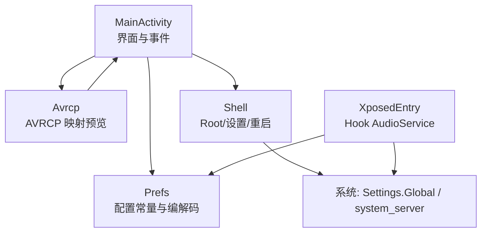
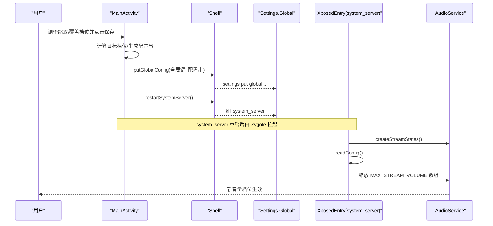
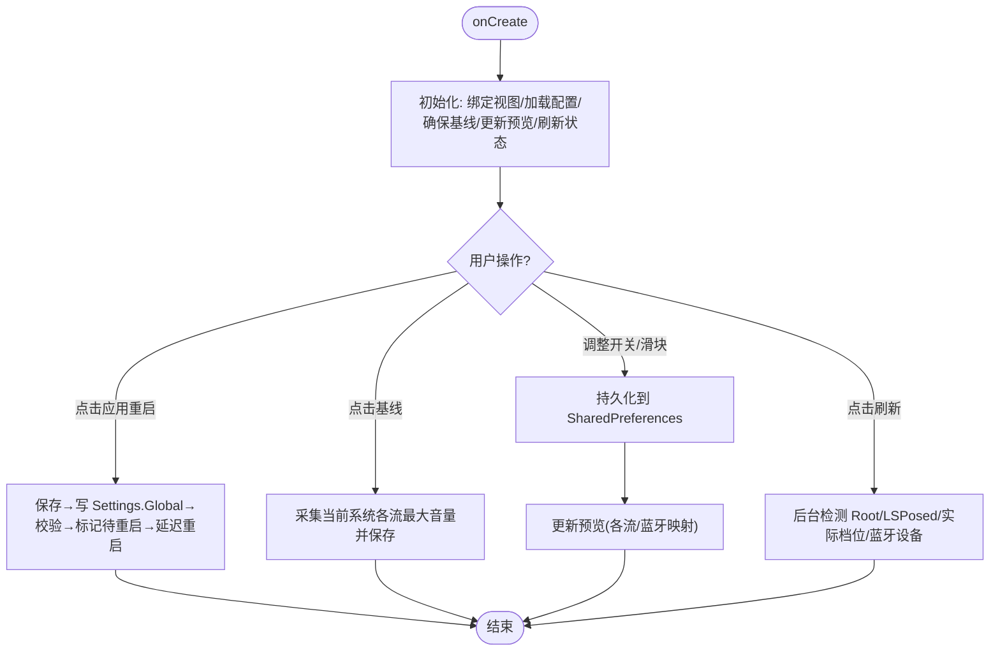
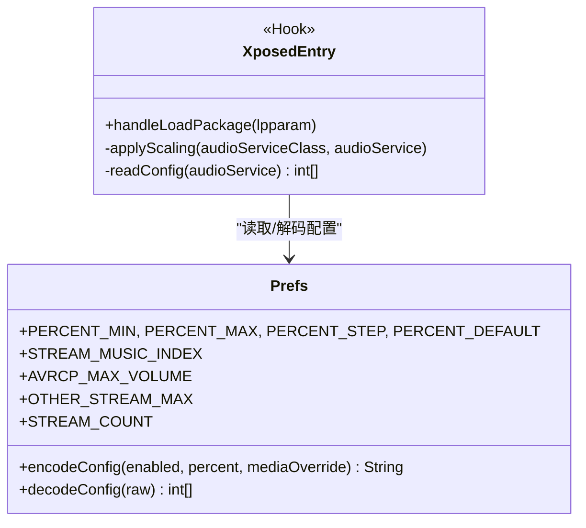
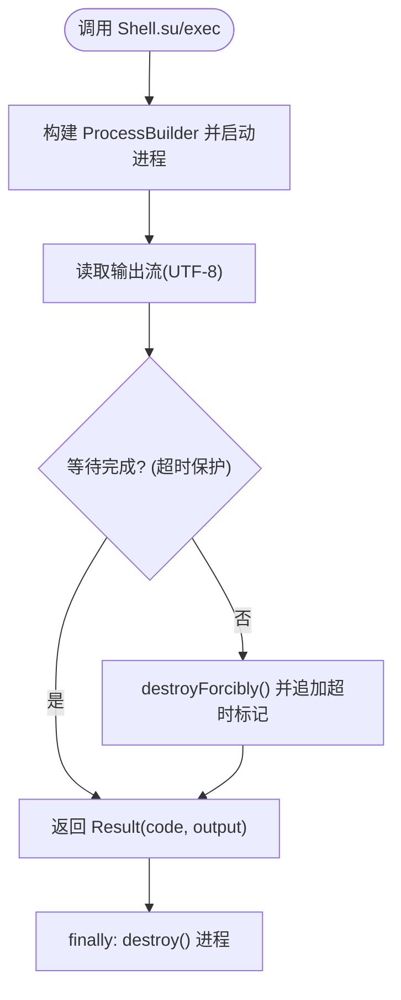
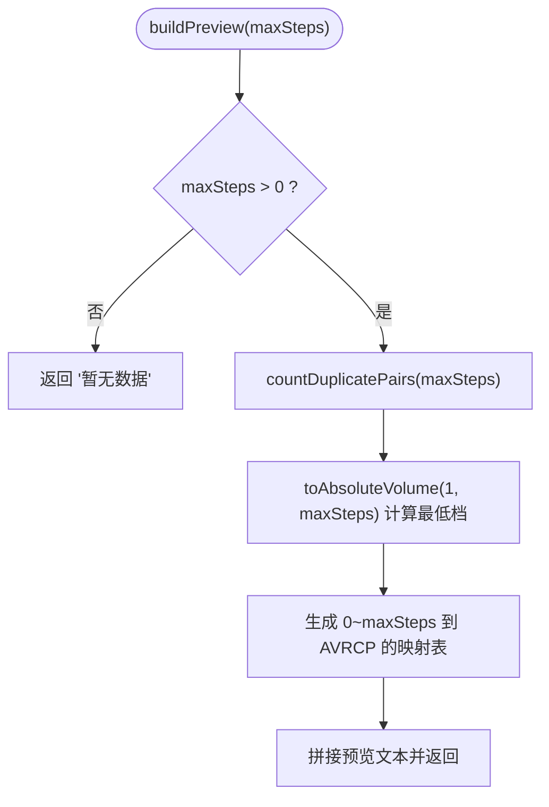
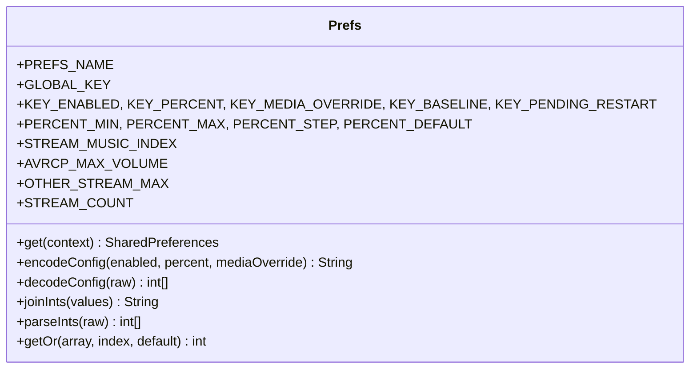
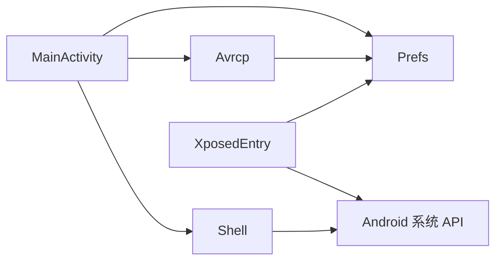

# 模块详解

<cite>
**本文引用的文件**
- [MainActivity.java](file://app/src/main/java/com/xiefeihong/volumecontrol/MainActivity.java)
- [XposedEntry.java](file://app/src/main/java/com/xiefeihong/volumecontrol/XposedEntry.java)
- [Shell.java](file://app/src/main/java/com/xiefeihong/volumecontrol/Shell.java)
- [Avrcp.java](file://app/src/main/java/com/xiefeihong/volumecontrol/Avrcp.java)
- [Prefs.java](file://app/src/main/java/com/xiefeihong/volumecontrol/Prefs.java)
- [activity_main.xml](file://app/src/main/res/layout/activity_main.xml)
- [strings.xml](file://app/src/main/res/values/strings.xml)
- [arrays.xml](file://app/src/main/res/values/arrays.xml)
</cite>

## 目录
1. [简介](#简介)
2. [项目结构](#项目结构)
3. [核心组件](#核心组件)
4. [架构总览](#架构总览)
5. [详细组件分析](#详细组件分析)
6. [依赖关系分析](#依赖关系分析)
7. [性能与稳定性](#性能与稳定性)
8. [故障排查指南](#故障排查指南)
9. [结论](#结论)
10. [附录：API 接口与扩展点](#附录api-接口与扩展点)

## 简介
本项目通过“应用层配置 + 系统级 Hook + Shell 工具 + 蓝牙 AVRCP 映射计算 + 统一配置管理”的组合，实现对 Android 系统各音频流音量档位的缩放控制，并优化蓝牙耳机 A2DP 的绝对音量映射体验。用户可在界面中调整缩放比例、预览媒体档位对蓝牙 AVRCP 的影响，并在具备 Root 权限时写入系统配置并软重启 system_server，使修改生效。

## 项目结构
- 应用入口与 UI：MainActivity 负责界面交互、状态检测、配置持久化、触发系统配置写入与重启流程。
- 系统级 Hook：XposedEntry 在系统框架进程内拦截 AudioService 初始化过程，按配置缩放 MAX_STREAM_VOLUME 数组。
- Shell 工具：Shell 封装 su 命令执行、Root/LSPosed/Magisk 检测、Settings.Global 读写、system_server 软重启。
- 蓝牙 AVRCP：Avrcp 提供与 AOSP 一致的绝对音量换算、重复映射统计与预览文本生成。
- 配置中心：Prefs 定义常量、序列化/反序列化配置、安全取值工具，被 App 与 Hook 两端共用。

图表来源
- [MainActivity.java:38-50](file://app/src/main/java/com/xiefeihong/volumecontrol/MainActivity.java#L38-L50)
- [XposedEntry.java:41-65](file://app/src/main/java/com/xiefeihong/volumecontrol/XposedEntry.java#L41-L65)
- [Shell.java:92-112](file://app/src/main/java/com/xiefeihong/volumecontrol/Shell.java#L92-L112)
- [Avrcp.java:25-88](file://app/src/main/java/com/xiefeihong/volumecontrol/Avrcp.java#L25-L88)
- [Prefs.java:56-82](file://app/src/main/java/com/xiefeihong/volumecontrol/Prefs.java#L56-L82)

章节来源
- [MainActivity.java:38-50](file://app/src/main/java/com/xiefeihong/volumecontrol/MainActivity.java#L38-L50)
- [activity_main.xml:1-375](file://app/src/main/res/layout/activity_main.xml#L1-L375)
- [strings.xml:1-77](file://app/src/main/res/values/strings.xml#L1-L77)
- [arrays.xml:1-23](file://app/src/main/res/values/arrays.xml#L1-L23)

## 核心组件
- MainActivity：UI 绑定、事件处理、基准采集、目标档位计算、预览更新、配置持久化、系统配置写入与重启调度、状态检测与渲染。
- XposedEntry：在系统框架加载 android 包时，hook AudioService.createStreamStates，读取配置并缩放 MAX_STREAM_VOLUME 数组。
- Shell：以阻塞方式执行 su 命令，封装 Root 可用性检测、LSPosed/Magisk 检测、Settings.Global 读写、system_server 软重启。
- Avrcp：实现 AOSP 一致的绝对音量换算公式，统计相邻档位重复映射数量，生成可读的映射预览。
- Prefs：集中定义键名、范围、默认值、常量；提供配置字符串与 CSV 的编解码；提供安全取值工具。

章节来源
- [MainActivity.java:60-121](file://app/src/main/java/com/xiefeihong/volumecontrol/MainActivity.java#L60-L121)
- [XposedEntry.java:67-146](file://app/src/main/java/com/xiefeihong/volumecontrol/XposedEntry.java#L67-L146)
- [Shell.java:35-112](file://app/src/main/java/com/xiefeihong/volumecontrol/Shell.java#L35-L112)
- [Avrcp.java:25-88](file://app/src/main/java/com/xiefeihong/volumecontrol/Avrcp.java#L25-L88)
- [Prefs.java:14-47](file://app/src/main/java/com/xiefeihong/volumecontrol/Prefs.java#L14-L47)

## 架构总览
本项目的运行流程分为“用户操作 → 应用层计算与持久化 → 系统配置写入 → 系统框架重启 → Hook 端读取配置并生效”。

图表来源
- [MainActivity.java:261-296](file://app/src/main/java/com/xiefeihong/volumecontrol/MainActivity.java#L261-L296)
- [Shell.java:92-112](file://app/src/main/java/com/xiefeihong/volumecontrol/Shell.java#L92-L112)
- [XposedEntry.java:41-65](file://app/src/main/java/com/xiefeihong/volumecontrol/XposedEntry.java#L41-L65)
- [XposedEntry.java:67-146](file://app/src/main/java/com/xiefeihong/volumecontrol/XposedEntry.java#L67-L146)

## 详细组件分析

### MainActivity 模块
- 界面设计
  - 使用 Material Design 卡片分区展示“运行状态、档位缩放、高级媒体档位、蓝牙映射预览、操作区、使用说明”。
  - 关键控件：启用开关、百分比滑块、媒体覆盖滑块、预设按钮、刷新/基线/应用重启/重置按钮、多行状态文本。
  - 资源绑定：布局文件 activity_main.xml 定义了全部 UI 结构与文案占位，strings.xml 提供文案，arrays.xml 提供音频流名称。
- 事件处理
  - 监听开关与滑块变化，实时持久化并更新预览。
  - 预设按钮快速设置百分比。
  - 基线采集弹窗确认后读取当前系统各流最大音量并保存。
  - 应用重启弹窗确认后执行保存→写 Settings.Global→校验→标记待重启→延迟重启 system_server。
  - 重置弹窗将关闭缩放、恢复默认百分比与媒体覆盖，然后触发重启流程。
- 状态管理
  - 首次启动确保 baselineVolumes 存在，否则采集。
  - 后台串行线程执行 Root/LSPosed 检测、Settings.Global 同步、实际媒体档位读取、蓝牙设备汇总。
  - 主线程渲染状态：Root/LSPosed 状态、当前/原始/目标媒体档位、模块生效状态、蓝牙设备摘要、是否 pending。
- 业务逻辑
  - 目标档位计算：根据启用状态、百分比、媒体覆盖、流类型限制（媒体上限 127，其他上限 150）计算目标档位。
  - 预览生成：显示各流“原始→目标”，以及调用 Avrcp.buildPreview 生成蓝牙映射预览。
  - 配置持久化：SharedPreferences 异步/同步写入；应用时先 commit 再写全局配置。
  - 系统配置写入与校验：通过 Shell.putGlobalConfig 写入，再 getGlobalConfig 校验内容包含期望配置串。
  - 软重启：延迟 2 秒后执行 Shell.restartSystemServer，等待 system_server 退出并由 Zygote 拉起。

图表来源
- [MainActivity.java:38-50](file://app/src/main/java/com/xiefeihong/volumecontrol/MainActivity.java#L38-L50)
- [MainActivity.java:60-121](file://app/src/main/java/com/xiefeihong/volumecontrol/MainActivity.java#L60-L121)
- [MainActivity.java:123-191](file://app/src/main/java/com/xiefeihong/volumecontrol/MainActivity.java#L123-L191)
- [MainActivity.java:235-296](file://app/src/main/java/com/xiefeihong/volumecontrol/MainActivity.java#L235-L296)
- [MainActivity.java:300-366](file://app/src/main/java/com/xiefeihong/volumecontrol/MainActivity.java#L300-L366)

章节来源
- [MainActivity.java:38-50](file://app/src/main/java/com/xiefeihong/volumecontrol/MainActivity.java#L38-L50)
- [MainActivity.java:60-121](file://app/src/main/java/com/xiefeihong/volumecontrol/MainActivity.java#L60-L121)
- [MainActivity.java:123-191](file://app/src/main/java/com/xiefeihong/volumecontrol/MainActivity.java#L123-L191)
- [MainActivity.java:193-231](file://app/src/main/java/com/xiefeihong/volumecontrol/MainActivity.java#L193-L231)
- [MainActivity.java:235-296](file://app/src/main/java/com/xiefeihong/volumecontrol/MainActivity.java#L235-L296)
- [MainActivity.java:300-366](file://app/src/main/java/com/xiefeihong/volumecontrol/MainActivity.java#L300-L366)
- [activity_main.xml:1-375](file://app/src/main/res/layout/activity_main.xml#L1-L375)
- [strings.xml:1-77](file://app/src/main/res/values/strings.xml#L1-L77)
- [arrays.xml:1-23](file://app/src/main/res/values/arrays.xml#L1-L23)

### XposedEntry 模块（系统级 Hook）
- 作用域与目标
  - 仅对 android 包（系统框架）进行 Hook。
  - 拦截 AudioService.createStreamStates，在该方法执行前缩放 MAX_STREAM_VOLUME 数组。
- 配置读取策略
  - 优先从 Settings.Global 读取配置串（system_server 可访问），解析为 {enabled, percent, mediaOverride}。
  - 若失败则回退到模块的 XSharedPreferences，读取相同键名。
- 缩放算法
  - 备份 ROM 原始数组长度与内容，避免重复缩放。
  - 对每个流：original * percent / 100，媒体流支持 mediaOverride 覆盖；结果限制在各自上限（媒体 127，其他 150），最小值为 1。
- 日志与异常
  - 使用 XposedBridge.log 记录 hook 成功、跳过原因、错误信息。
  - 捕获异常避免影响系统框架启动。

图表来源
- [XposedEntry.java:41-65](file://app/src/main/java/com/xiefeihong/volumecontrol/XposedEntry.java#L41-L65)
- [XposedEntry.java:67-146](file://app/src/main/java/com/xiefeihong/volumecontrol/XposedEntry.java#L67-L146)
- [Prefs.java:56-82](file://app/src/main/java/com/xiefeihong/volumecontrol/Prefs.java#L56-L82)
- [Prefs.java:26-47](file://app/src/main/java/com/xiefeihong/volumecontrol/Prefs.java#L26-L47)

章节来源
- [XposedEntry.java:16-28](file://app/src/main/java/com/xiefeihong/volumecontrol/XposedEntry.java#L16-L28)
- [XposedEntry.java:41-65](file://app/src/main/java/com/xiefeihong/volumecontrol/XposedEntry.java#L41-L65)
- [XposedEntry.java:67-146](file://app/src/main/java/com/xiefeihong/volumecontrol/XposedEntry.java#L67-L146)

### Shell 模块（Root 权限操作封装）
- 能力清单
  - su/exec：阻塞式执行 shell 命令，合并 stdout/stderr，超时保护与强制销毁。
  - 环境检测：isRootAvailable、isLsposedPresent、isMagiskPresent。
  - 系统配置：putGlobalConfig/getGlobalConfig，用于跨进程共享配置。
  - 系统重启：restartSystemServer，通过 pidof/killall 终止 system_server，交由 Zygote 自动拉起。
- 错误处理
  - 超时返回带标记的输出；异常捕获返回错误码与堆栈信息；finally 确保进程销毁。
- 注意事项
  - 所有方法均阻塞当前线程，必须在后台线程调用。
  - 写入 Settings.Global 的值需单引号包裹以避免分号被 shell 解析。

图表来源
- [Shell.java:35-72](file://app/src/main/java/com/xiefeihong/volumecontrol/Shell.java#L35-L72)
- [Shell.java:74-112](file://app/src/main/java/com/xiefeihong/volumecontrol/Shell.java#L74-L112)

章节来源
- [Shell.java:8-12](file://app/src/main/java/com/xiefeihong/volumecontrol/Shell.java#L8-L12)
- [Shell.java:35-72](file://app/src/main/java/com/xiefeihong/volumecontrol/Shell.java#L35-L72)
- [Shell.java:74-112](file://app/src/main/java/com/xiefeihong/volumecontrol/Shell.java#L74-L112)

### Avrcp 模块（蓝牙音量计算）
- 算法说明
  - toAbsoluteVolume(step, maxSteps)：按照 AOSP 公式 round(step * 127 / maxSteps) 计算绝对音量。
  - countDuplicatePairs(maxSteps)：统计相邻两档映射到同一 AVRCP 音量的对数，用于评估“档位偏多导致听感无差异”的问题。
  - buildPreview(maxSteps)：生成人类可读的映射预览，包括重复对数量、第 1 档 AVRCP 值与近似百分比、每档映射表。
- 兼容性处理
  - 当 maxSteps <= 0 时返回“暂无数据”。
  - 低音量无声问题提示：部分耳机在极低 AVRCP 值下无声，属耳机自身限制。
- 错误处理
  - 输入边界检查（maxSteps <= 0）。
  - 计算过程中使用 double 中间值避免整型溢出。

图表来源
- [Avrcp.java:25-88](file://app/src/main/java/com/xiefeihong/volumecontrol/Avrcp.java#L25-L88)

章节来源
- [Avrcp.java:3-19](file://app/src/main/java/com/xiefeihong/volumecontrol/Avrcp.java#L3-L19)
- [Avrcp.java:25-88](file://app/src/main/java/com/xiefeihong/volumecontrol/Avrcp.java#L25-L88)

### Prefs 模块（配置管理）
- 架构要点
  - 常量集中：启用标志、百分比范围与步长、媒体与非媒体流上限、流索引与数量、全局键名等。
  - 序列化机制：encodeConfig/decodeConfig 使用分号分隔的三字段字符串；joinInts/parseInts 使用逗号分隔的 CSV 存储基准档位。
  - 数据安全：decodeConfig 对非法格式返回 null；parseInts 对越界或格式错误返回空数组；getOr 提供安全取值。
  - 跨进程共享：App 与 Hook 端共用同一常量与编解码规则，保证一致性。
- 同步策略
  - App 侧：SharedPreferences 异步/同步写入；应用时立即写入 Settings.Global 并校验。
  - Hook 端：优先读 Settings.Global，失败回退到 XSharedPreferences。
  - 状态同步：refreshStatus 中主动将本地配置写入 Settings.Global，确保 Hook 端能读到最新值。

图表来源
- [Prefs.java:14-47](file://app/src/main/java/com/xiefeihong/volumecontrol/Prefs.java#L14-L47)
- [Prefs.java:52-122](file://app/src/main/java/com/xiefeihong/volumecontrol/Prefs.java#L52-L122)

章节来源
- [Prefs.java:6-11](file://app/src/main/java/com/xiefeihong/volumecontrol/Prefs.java#L6-L11)
- [Prefs.java:14-47](file://app/src/main/java/com/xiefeihong/volumecontrol/Prefs.java#L14-L47)
- [Prefs.java:52-122](file://app/src/main/java/com/xiefeihong/volumecontrol/Prefs.java#L52-L122)

## 依赖关系分析
- MainActivity 依赖
  - Prefs：常量、编解码、安全取值。
  - Avrcp：生成蓝牙映射预览。
  - Shell：Root/LSPosed/Magisk 检测、Settings.Global 读写、system_server 重启。
  - Android 系统 API：AudioManager、AudioDeviceInfo、SharedPreferences、Handler/ExecutorService。
- XposedEntry 依赖
  - Prefs：常量与编解码。
  - Xposed 框架：类查找、方法 Hook、静态字段读写、日志。
  - Android 系统 API：Context、ContentResolver、Settings.Global。
- Shell 依赖
  - Android 系统 API：ProcessBuilder、IO、TimeUnit。
- Avrcp 依赖
  - Prefs：AVRCP_MAX_VOLUME 常量。

图表来源
- [MainActivity.java:3-21](file://app/src/main/java/com/xiefeihong/volumecontrol/MainActivity.java#L3-L21)
- [XposedEntry.java:3-14](file://app/src/main/java/com/xiefeihong/volumecontrol/XposedEntry.java#L3-L14)
- [Shell.java:3-7](file://app/src/main/java/com/xiefeihong/volumecontrol/Shell.java#L3-L7)
- [Avrcp.java:1-5](file://app/src/main/java/com/xiefeihong/volumecontrol/Avrcp.java#L1-L5)

章节来源
- [MainActivity.java:3-21](file://app/src/main/java/com/xiefeihong/volumecontrol/MainActivity.java#L3-L21)
- [XposedEntry.java:3-14](file://app/src/main/java/com/xiefeihong/volumecontrol/XposedEntry.java#L3-L14)
- [Shell.java:3-7](file://app/src/main/java/com/xiefeihong/volumecontrol/Shell.java#L3-L7)
- [Avrcp.java:1-5](file://app/src/main/java/com/xiefeihong/volumecontrol/Avrcp.java#L1-L5)

## 性能与稳定性
- 并发与线程
  - MainActivity 使用单线程 Executor 串行执行耗时操作，避免并发竞争；主线程仅做 UI 渲染。
  - Shell 命令执行阻塞且带超时，防止长时间挂起；异常与 finally 确保进程释放。
- I/O 与网络
  - 无网络请求；I/O 主要为 Settings.Global 读写与进程 IO，开销较小。
- 内存与计算
  - 配置串与 CSV 轻量；Avrcp 预览生成 O(n) 遍历，n 为媒体档位数（通常 ≤127），开销可忽略。
- 稳定性
  - Hook 端异常捕获不中断系统框架启动；偏好解析失败走安全回退；阈值限制避免极端配置导致系统异常。

[本节为通用指导，无需特定文件引用]

## 故障排查指南
- Root 不可用
  - 现象：状态显示 Root 不可用，无法写入系统配置。
  - 排查：确认已授予 su 权限；检查 isRootAvailable 返回值；尝试手动执行 id 命令验证 uid=0。
  - 参考路径：[Shell.isRootAvailable:74-78](file://app/src/main/java/com/xiefeihong/volumecontrol/Shell.java#L74-L78)
- LSPosed 未安装或未启用
  - 现象：状态显示未检测到 LSPosed；模块无法加载。
  - 排查：确认已安装 LSPosed；在模块设置中将作用域勾选至“系统框架”；重启 system_server。
  - 参考路径：[Shell.isLsposedPresent:80-84](file://app/src/main/java/com/xiefeihong/volumecontrol/Shell.java#L80-L84)、[XposedEntry.handleLoadPackage:41-65](file://app/src/main/java/com/xiefeihong/volumecontrol/XposedEntry.java#L41-L65)
- 配置写入失败
  - 现象：提示写入失败；可能由于 su 授权失效或权限不足。
  - 排查：重新授权 su；检查 Shell.putGlobalConfig 输出；确认 GLOBAL_KEY 未被第三方清理。
  - 参考路径：[MainActivity.applyAndRestart:261-288](file://app/src/main/java/com/xiefeihong/volumecontrol/MainActivity.java#L261-L288)、[Shell.putGlobalConfig:92-98](file://app/src/main/java/com/xiefeihong/volumecontrol/Shell.java#L92-L98)
- 重启后未生效
  - 现象：当前档位与目标不一致。
  - 排查：确认已执行软重启；检查 Hook 端日志；核对 Settings.Global 中的配置串是否正确。
  - 参考路径：[XposedEntry.readConfig:122-146](file://app/src/main/java/com/xiefeihong/volumecontrol/XposedEntry.java#L122-L146)、[MainActivity.refreshStatus:300-319](file://app/src/main/java/com/xiefeihong/volumecontrol/MainActivity.java#L300-L319)
- 蓝牙低音量无声
  - 现象：第 1 档几乎无声。
  - 排查：查看 Avrcp 预览中第 1 档 AVRCP 值；适当提高缩放比例或固定媒体档位；确认耳机低音量限制。
  - 参考路径：[Avrcp.buildPreview:49-88](file://app/src/main/java/com/xiefeihong/volumecontrol/Avrcp.java#L49-L88)

章节来源
- [Shell.java:74-112](file://app/src/main/java/com/xiefeihong/volumecontrol/Shell.java#L74-L112)
- [XposedEntry.java:41-65](file://app/src/main/java/com/xiefeihong/volumecontrol/XposedEntry.java#L41-L65)
- [XposedEntry.java:122-146](file://app/src/main/java/com/xiefeihong/volumecontrol/XposedEntry.java#L122-L146)
- [MainActivity.java:261-288](file://app/src/main/java/com/xiefeihong/volumecontrol/MainActivity.java#L261-L288)
- [MainActivity.java:300-319](file://app/src/main/java/com/xiefeihong/volumecontrol/MainActivity.java#L300-L319)
- [Avrcp.java:49-88](file://app/src/main/java/com/xiefeihong/volumecontrol/Avrcp.java#L49-L88)

## 结论
本项目通过清晰的模块划分与职责分离，实现了从用户界面到系统框架的全链路音量档位控制。MainActivity 提供直观的配置与反馈；XposedEntry 在系统框架层精准干预；Shell 提供可靠的系统级操作；Avrcp 保障蓝牙体验；Prefs 统一配置契约。整体方案兼顾了易用性、可维护性与稳定性。

[本节为总结性内容，无需特定文件引用]

## 附录：API 接口与扩展点

### MainActivity 对外行为（面向用户与测试）
- 功能入口
  - 设置启用/禁用档位缩放。
  - 调整缩放比例与媒体覆盖档位。
  - 采集基准档位。
  - 保存并软重启系统框架。
  - 刷新状态检测。
- 关键方法与职责
  - setupListeners：绑定 UI 事件。
  - ensureBaseline/loadConfigIntoUi/updatePreview：初始化与预览。
  - targetStreamSteps：计算目标档位。
  - persistToPrefs/currentConfigString：持久化与配置串生成。
  - applyAndRestart/restartSystemServer：写入系统配置并重启。
  - refreshStatus/renderStatus/buildBluetoothSummary：状态检测与渲染。
- 扩展点
  - 新增流类型或上限：在 Prefs 中扩展常量，并在 targetStreamSteps 中增加分支。
  - 新增蓝牙设备类型：在 bluetoothTypeName 中增加 case。
  - 新增预设：在 setupListeners 中添加按钮与 setPercent 调用。

章节来源
- [MainActivity.java:60-121](file://app/src/main/java/com/xiefeihong/volumecontrol/MainActivity.java#L60-L121)
- [MainActivity.java:123-191](file://app/src/main/java/com/xiefeihong/volumecontrol/MainActivity.java#L123-L191)
- [MainActivity.java:193-231](file://app/src/main/java/com/xiefeihong/volumecontrol/MainActivity.java#L193-L231)
- [MainActivity.java:235-296](file://app/src/main/java/com/xiefeihong/volumecontrol/MainActivity.java#L235-L296)
- [MainActivity.java:300-366](file://app/src/main/java/com/xiefeihong/volumecontrol/MainActivity.java#L300-L366)

### XposedEntry 钩子与配置
- 钩子位置
  - 目标类：com.android.server.audio.AudioService
  - 方法：createStreamStates
  - 时机：beforeHookedMethod
- 配置读取
  - 优先 Settings.Global（key 见 Prefs.GLOBAL_KEY），失败回退到 XSharedPreferences。
- 扩展点
  - 新增流类型处理：在 applyScaling 循环中增加分支。
  - 新增限制策略：在 limit 计算处扩展。
  - 新增日志维度：在关键路径添加 XposedBridge.log。

章节来源
- [XposedEntry.java:41-65](file://app/src/main/java/com/xiefeihong/volumecontrol/XposedEntry.java#L41-L65)
- [XposedEntry.java:67-146](file://app/src/src/main/java/com/xiefeihong/volumecontrol/XposedEntry.java#L67-L146)

### Shell 工具接口
- 命令执行
  - su(command)：以 root 身份执行命令。
  - exec(...command)：执行任意命令并返回结果。
- 环境检测
  - isRootAvailable/isLsposedPresent/isMagiskPresent。
- 系统配置
  - putGlobalConfig/getGlobalConfig。
- 系统重启
  - restartSystemServer。
- 扩展点
  - 新增命令封装：参照 exec 模式新增便捷方法。
  - 自定义超时：调整 DEFAULT_TIMEOUT_MS。

章节来源
- [Shell.java:35-72](file://app/src/main/java/com/xiefeihong/volumecontrol/Shell.java#L35-L72)
- [Shell.java:74-112](file://app/src/main/java/com/xiefeihong/volumecontrol/Shell.java#L74-L112)

### Avrcp 算法接口
- 核心方法
  - toAbsoluteVolume(step, maxSteps)：计算绝对音量。
  - countDuplicatePairs(maxSteps)：统计重复映射对数。
  - buildPreview(maxSteps)：生成预览文本。
- 扩展点
  - 自定义映射公式：修改 toAbsoluteVolume。
  - 自定义预览格式：修改 buildPreview 输出结构。

章节来源
- [Avrcp.java:25-88](file://app/src/main/java/com/xiefeihong/volumecontrol/Avrcp.java#L25-L88)

### Prefs 配置接口
- 常量与范围
  - 启用标志、百分比范围与步长、媒体与非媒体流上限、流索引与数量、全局键名。
- 编解码
  - encodeConfig/decodeConfig：配置串。
  - joinInts/parseInts：CSV 基准档位。
  - getOr：安全取值。
- 扩展点
  - 新增配置项：在 KEY_* 与编解码中扩展。
  - 新增流类型：在 STREAM_COUNT 与 arrays.stream_names 中扩展。

章节来源
- [Prefs.java:14-47](file://app/src/main/java/com/xiefeihong/volumecontrol/Prefs.java#L14-L47)
- [Prefs.java:52-122](file://app/src/main/java/com/xiefeihong/volumecontrol/Prefs.java#L52-L122)
- [arrays.xml:7-21](file://app/src/main/res/values/arrays.xml#L7-L21)