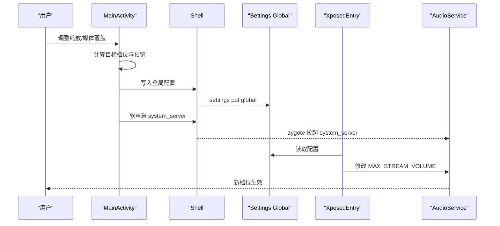
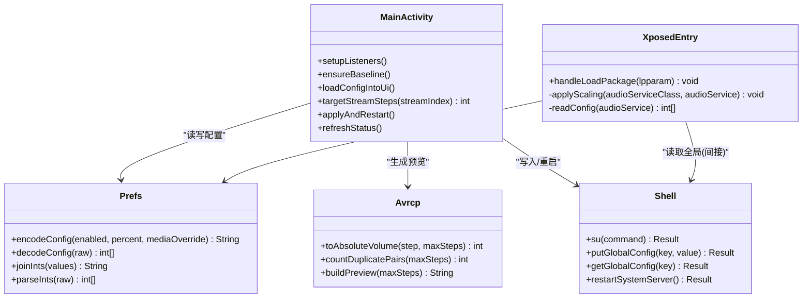

# 场景化配置

<cite>
**本文引用的文件**
- [MainActivity.java](file://app/src/main/java/com/xiefeihong/volumecontrol/MainActivity.java)
- [Prefs.java](file://app/src/main/java/com/xiefeihong/volumecontrol/Prefs.java)
- [Avrcp.java](file://app/src/main/java/com/xiefeihong/volumecontrol/Avrcp.java)
- [XposedEntry.java](file://app/src/main/java/com/xiefeihong/volumecontrol/XposedEntry.java)
- [Shell.java](file://app/src/main/java/com/xiefeihong/volumecontrol/Shell.java)
- [activity_main.xml](file://app/src/main/res/layout/activity_main.xml)
- [strings.xml](file://app/src/main/res/values/strings.xml)
- [arrays.xml](file://app/src/main/res/values/arrays.xml)
</cite>

## 目录
1. [简介](#简介)
2. [项目结构](#项目结构)
3. [核心组件](#核心组件)
4. [架构总览](#架构总览)
5. [详细组件分析](#详细组件分析)
6. [依赖关系分析](#依赖关系分析)
7. [性能与稳定性考量](#性能与稳定性考量)
8. [故障排查指南](#故障排查指南)
9. [结论](#结论)
10. [附录：场景化配置模板与迁移指南](#附录：场景化配置模板与迁移指南)

## 简介
本场景化配置文档面向不同使用需求，提供可操作的推荐配置方案。该音量控制模块通过 LSPosed Hook 系统框架的 AudioService，按比例缩放各音频流的档位上限，并结合蓝牙 AVRCP 绝对音量映射规则，优化媒体音量体验。应用侧负责采集基准、计算目标档位、预览映射效果、写入系统配置并触发软重启使配置生效。

## 项目结构
- 应用层（App）：提供用户界面、配置读写、状态检测、蓝牙设备识别、AVRCP 映射预览。
- 系统层（Hook）：在 system_server 中拦截 AudioService 初始化流程，按配置修改 MAX_STREAM_VOLUME 数组，从而改变系统音量档位数。
- 工具层：Root Shell 执行、Settings.Global 读写、系统框架软重启。

```mermaid
graph TB
UI["主界面<br/>MainActivity"] --> Prefs["配置常量与序列化<br/>Prefs"]
UI --> Avrcp["AVRCP 映射预览<br/>Avrcp"]
UI --> Shell["Root 工具<br/>Shell"]
Shell --> System["系统设置/进程管理"]
Xposed["LSPosed 入口<br/>XposedEntry"] --> System
Prefs < --> Xposed
```

图表来源
- [MainActivity.java:38-50](file://app/src/main/java/com/xiefeihong/volumecontrol/MainActivity.java#L38-L50)
- [Prefs.java:14-47](file://app/src/main/java/com/xiefeihong/volumecontrol/Prefs.java#L14-L47)
- [Avrcp.java:25-88](file://app/src/main/java/com/xiefeihong/volumecontrol/Avrcp.java#L25-L88)
- [Shell.java:92-112](file://app/src/main/java/com/xiefeihong/volumecontrol/Shell.java#L92-L112)
- [XposedEntry.java:41-65](file://app/src/main/java/com/xiefeihong/volumecontrol/XposedEntry.java#L41-L65)

章节来源
- [MainActivity.java:38-50](file://app/src/main/java/com/xiefeihong/volumecontrol/MainActivity.java#L38-L50)
- [activity_main.xml:29-375](file://app/src/main/res/layout/activity_main.xml#L29-L375)

## 核心组件
- 主界面与交互：启用开关、缩放比例滑块、媒体档位精确值滑块、预设按钮、刷新与重启操作。
- 配置中心：定义范围、默认值、流索引、全局键名、序列化工具。
- 蓝牙 AVRCP 映射：将媒体档位换算为 0~127 绝对音量，统计重复对数，生成预览文本。
- Hook 入口：拦截 AudioService 创建流状态过程，按比例缩放 MAX_STREAM_VOLUME，支持媒体覆盖。
- Root 工具：执行 su 命令、写入 Settings.Global、读取校验、软重启 system_server。

章节来源
- [MainActivity.java:60-121](file://app/src/main/java/com/xiefeihong/volumecontrol/MainActivity.java#L60-L121)
- [Prefs.java:14-47](file://app/src/main/java/com/xiefeihong/volumecontrol/Prefs.java#L14-L47)
- [Avrcp.java:25-88](file://app/src/main/java/com/xiefeihong/volumecontrol/Avrcp.java#L25-L88)
- [XposedEntry.java:67-114](file://app/src/main/java/com/xiefeihong/volumecontrol/XposedEntry.java#L67-L114)
- [Shell.java:74-112](file://app/src/main/java/com/xiefeihong/volumecontrol/Shell.java#L74-L112)

## 架构总览
整体工作流：用户在界面调整缩放比例或媒体档位覆盖 → 应用计算目标档位并预览 AVRCP 映射 → 写入 Settings.Global → 触发软重启 system_server → Hook 端在系统启动时读取配置并修改 AudioService 的档位数组 → 系统音量档位生效。



图表来源
- [MainActivity.java:261-296](file://app/src/main/java/com/xiefeihong/volumecontrol/MainActivity.java#L261-L296)
- [Shell.java:92-112](file://app/src/main/java/com/xiefeihong/volumecontrol/Shell.java#L92-L112)
- [XposedEntry.java:116-146](file://app/src/main/java/com/xiefeihong/volumecontrol/XposedEntry.java#L116-L146)

## 详细组件分析

### 主界面与交互（MainActivity）
- 功能要点：
  - 首次启动采集基准档位，后续以共享偏好备份为准。
  - 根据启用状态、缩放比例、媒体覆盖计算各流目标档位。
  - 显示当前媒体档位、原始档位、目标档位以及模块生效状态。
  - 汇总已连接的蓝牙输出设备类型，辅助判断 AVRCP 映射影响。
  - 保存设置后写入 Settings.Global，并在验证成功后软重启 system_server。
- 关键路径：
  - 配置持久化与加载：[MainActivity.java:130-141](file://app/src/main/java/com/xiefeihong/volumecontrol/MainActivity.java#L130-L141)
  - 目标档位计算：[MainActivity.java:175-191](file://app/src/main/java/com/xiefeihong/volumecontrol/MainActivity.java#L175-L191)
  - 应用与重启：[MainActivity.java:261-296](file://app/src/main/java/com/xiefeihong/volumecontrol/MainActivity.java#L261-L296)
  - 状态刷新与渲染：[MainActivity.java:300-366](file://app/src/main/java/com/xiefeihong/volumecontrol/MainActivity.java#L300-L366)

章节来源
- [MainActivity.java:123-191](file://app/src/main/java/com/xiefeihong/volumecontrol/MainActivity.java#L123-L191)
- [MainActivity.java:261-366](file://app/src/main/java/com/xiefeihong/volumecontrol/MainActivity.java#L261-L366)

### 配置中心（Prefs）
- 作用：集中定义配置键、范围限制、流索引、全局键名、序列化/反序列化方法。
- 关键点：
  - 缩放范围：最小 25%，最大 400%，步长 5%。
  - 媒体覆盖上限：127（与 AVRCP 绝对音量上限一致）。
  - 非媒体流安全上限：150。
  - 流数量：12（兼容 Android 13+）。
  - 配置字符串格式：{启用};{百分比};{媒体覆盖}。
- 参考：
  - 常量与范围：[Prefs.java:14-47](file://app/src/main/java/com/xiefeihong/volumecontrol/Prefs.java#L14-L47)
  - 序列化/解析：[Prefs.java:56-82](file://app/src/main/java/com/xiefeihong/volumecontrol/Prefs.java#L56-L82)
  - 基准档位 CSV 工具：[Prefs.java:84-114](file://app/src/main/java/com/xiefeihong/volumecontrol/Prefs.java#L84-L114)

章节来源
- [Prefs.java:14-124](file://app/src/main/java/com/xiefeihong/volumecontrol/Prefs.java#L14-L124)

### 蓝牙 AVRCP 映射（Avrcp）
- 原理：依据 AOSP 蓝牙模块公式将媒体档位换算为 0~127 绝对音量；当媒体档位过多时会出现相邻档位映射到相同 AVRCP 音量的情况。
- 能力：
  - 计算绝对音量：[Avrcp.java:25-31](file://app/src/main/java/com/xiefeihong/volumecontrol/Avrcp.java#L25-L31)
  - 统计重复对数：[Avrcp.java:33-42](file://app/src/main/java/com/xiefeihong/volumecontrol/Avrcp.java#L33-L42)
  - 生成预览文本（含第 1 档最低值与每档映射表）：[Avrcp.java:44-88](file://app/src/main/java/com/xiefeihong/volumecontrol/Avrcp.java#L44-L88)
- 建议：
  - 若耳机低音量无声或相邻档位听感相同，可将媒体档位控制在 127 以内，避免重复映射。
  - 提高缩放比例可增加低音区细腻度（例如 200% 将媒体从 15 档提升到约 30 档）。

章节来源
- [Avrcp.java:25-88](file://app/src/main/java/com/xiefeihong/volumecontrol/Avrcp.java#L25-L88)

### Hook 入口（XposedEntry）
- 机制：拦截 AudioService 的 createStreamStates 方法，按比例缩放 MAX_STREAM_VOLUME 数组，媒体流可被覆盖为固定值。
- 行为：
  - 仅在系统框架加载包时执行一次 Hook。
  - 优先读取 Settings.Global 中的配置，回退到模块 SharedPreferences。
  - 缩放后需重启 system_server 才能生效。
- 参考：
  - Hook 注册与方法拦截：[XposedEntry.java:41-65](file://app/src/main/java/com/xiefeihong/volumecontrol/XposedEntry.java#L41-L65)
  - 缩放逻辑与媒体覆盖：[XposedEntry.java:67-114](file://app/src/main/java/com/xiefeihong/volumecontrol/XposedEntry.java#L67-L114)
  - 配置读取优先级：[XposedEntry.java:116-146](file://app/src/main/java/com/xiefeihong/volumecontrol/XposedEntry.java#L116-L146)

章节来源
- [XposedEntry.java:41-146](file://app/src/main/java/com/xiefeihong/volumecontrol/XposedEntry.java#L41-L146)

### Root 工具（Shell）
- 能力：
  - 执行 su 命令并合并输出。
  - 检测 root/LSPosed/Magisk 存在性。
  - 写入/读取 Settings.Global。
  - 软重启 system_server。
- 参考：
  - 命令执行与超时处理：[Shell.java:35-72](file://app/src/main/java/com/xiefeihong/volumecontrol/Shell.java#L35-L72)
  - 环境检测：[Shell.java:74-90](file://app/src/main/java/com/xiefeihong/volumecontrol/Shell.java#L74-L90)
  - 全局配置写入/读取：[Shell.java:92-103](file://app/src/main/java/com/xiefeihong/volumecontrol/Shell.java#L92-L103)
  - 软重启：[Shell.java:105-112](file://app/src/main/java/com/xiefeihong/volumecontrol/Shell.java#L105-L112)

章节来源
- [Shell.java:35-112](file://app/src/main/java/com/xiefeihong/volumecontrol/Shell.java#L35-L112)

## 依赖关系分析
- MainActivity 依赖：
  - Prefs：读取/写入配置常量与序列化。
  - Avrcp：生成 AVRCP 映射预览。
  - Shell：执行 root 命令、写入 Settings.Global、软重启。
- XposedEntry 依赖：
  - Prefs：解码配置字符串。
  - Settings.Global：读取全局配置。
  - Xposed API：Hook AudioService。
- 耦合与内聚：
  - 配置集中在 Prefs，便于 App 与 Hook 端保持一致。
  - 蓝牙映射逻辑独立于系统调用，便于预览与调试。
  - Root 工具封装了系统交互细节，降低上层复杂度。



图表来源
- [MainActivity.java:60-121](file://app/src/main/java/com/xiefeihong/volumecontrol/MainActivity.java#L60-L121)
- [Prefs.java:56-114](file://app/src/main/java/com/xiefeihong/volumecontrol/Prefs.java#L56-L114)
- [Avrcp.java:25-88](file://app/src/main/java/com/xiefeihong/volumecontrol/Avrcp.java#L25-L88)
- [XposedEntry.java:41-146](file://app/src/main/java/com/xiefeihong/volumecontrol/XposedEntry.java#L41-L146)
- [Shell.java:35-112](file://app/src/main/java/com/xiefeihong/volumecontrol/Shell.java#L35-L112)

## 性能与稳定性考量
- 后台串行执行：所有 root/系统查询操作在单线程执行器中进行，避免并发冲突。
- 超时保护：shell 命令执行带超时，防止阻塞。
- 软重启策略：仅重启 system_server，不丢失数据，但会中断正在播放的声音。
- 档位上限保护：媒体流限制在 127 以内，非媒体流限制在 150，避免异常值导致系统不稳定。
- 基准采集：首次启动自动采集基准，减少误判。

章节来源
- [MainActivity.java:34-36](file://app/src/main/java/com/xiefeihong/volumecontrol/MainActivity.java#L34-L36)
- [Shell.java:60-72](file://app/src/main/java/com/xiefeihong/volumecontrol/Shell.java#L60-L72)
- [Prefs.java:26-47](file://app/src/main/java/com/xiefeihong/volumecontrol/Prefs.java#L26-L47)

## 故障排查指南
- Root 不可用：
  - 现象：无法写入系统配置，提示“Root：不可用”。
  - 处理：确认 su 已授权且可用。
  - 参考：[Shell.java:74-78](file://app/src/main/java/com/xiefeihong/volumecontrol/Shell.java#L74-L78)
- LSPosed 未检测到：
  - 现象：提示“LSPosed：未检测到”。
  - 处理：安装并启用模块，勾选作用域“系统框架”，然后软重启。
  - 参考：[Shell.java:80-84](file://app/src/main/java/com/xiefeihong/volumecontrol/Shell.java#L80-L84)
- 配置未生效：
  - 现象：当前档位 ≠ 目标档位，提示需要软重启。
  - 处理：点击“保存设置并软重启系统框架”。
  - 参考：[MainActivity.java:358-366](file://app/src/main/java/com/xiefeihong/volumecontrol/MainActivity.java#L358-L366)
- 写入失败：
  - 现象：提示“写入系统配置失败”。
  - 处理：检查 su 权限、重试写入并查看输出详情。
  - 参考：[MainActivity.java:267-286](file://app/src/main/java/com/xiefeihong/volumecontrol/MainActivity.java#L267-L286)
- 蓝牙低音量无声：
  - 现象：第 1 档几乎无声。
  - 处理：提高缩放比例或设置媒体覆盖至合适档位，避免 AVRCP 过低值。
  - 参考：[Avrcp.java:44-88](file://app/src/main/java/com/xiefeihong/volumecontrol/Avrcp.java#L44-L88)

章节来源
- [MainActivity.java:267-366](file://app/src/main/java/com/xiefeihong/volumecontrol/MainActivity.java#L267-L366)
- [Shell.java:74-84](file://app/src/main/java/com/xiefeihong/volumecontrol/Shell.java#L74-L84)
- [Avrcp.java:44-88](file://app/src/main/java/com/xiefeihong/volumecontrol/Avrcp.java#L44-L88)

## 结论
本模块通过系统级 Hook 实现音量档位的灵活缩放与蓝牙 AVRCP 映射优化，适用于多种使用场景。结合界面预览与状态检测，用户可以快速定位问题并调整到合适的配置。建议在专业场景中采用精确媒体覆盖，在日常场景中采用适度缩放比例以获得更细腻的音量调节体验。

## 附录：场景化配置模板与迁移指南

### 日常使用场景（普通用户）
- 目标：提升音量调节细腻度，改善蓝牙耳机低音量表现。
- 推荐参数：
  - 启用档位缩放：是
  - 缩放比例：100%–200%（从系统默认逐步上调）
  - 媒体覆盖：0（跟随缩放）
- 预期效果：
  - 媒体档位适中增加，低音区更细腻。
  - 蓝牙 AVRCP 映射更稳定，减少相邻档位音量相同。
- 操作步骤：
  - 打开“启用档位缩放”，选择 100% 或 200% 预设。
  - 点击“保存设置并软重启系统框架”。
  - 连接蓝牙耳机后查看“蓝牙 AVRCP 映射预览”，确保无重复对或重复较少。
- 参考：
  - 预设按钮与滑块：[activity_main.xml:140-191](file://app/src/main/res/layout/activity_main.xml#L140-L191)
  - 缩放范围与默认值：[Prefs.java:26-30](file://app/src/main/java/com/xiefeihong/volumecontrol/Prefs.java#L26-L30)
  - 预览与状态：[MainActivity.java:193-231](file://app/src/main/java/com/xiefeihong/volumecontrol/MainActivity.java#L193-L231)

章节来源
- [activity_main.xml:140-191](file://app/src/main/res/layout/activity_main.xml#L140-L191)
- [Prefs.java:26-30](file://app/src/main/java/com/xiefeihong/volumecontrol/Prefs.java#L26-L30)
- [MainActivity.java:193-231](file://app/src/main/java/com/xiefeihong/volumecontrol/MainActivity.java#L193-L231)

### 专业音频编辑场景（专业级）
- 目标：精确控制媒体档位，保证音质与一致性。
- 推荐参数：
  - 启用档位缩放：是
  - 缩放比例：100%（保持系统默认）
  - 媒体覆盖：设定固定档位（建议 30–60），不超过 127
- 预期效果：
  - 媒体档位固定，避免缩放带来的不确定性。
  - 蓝牙 AVRCP 映射稳定，适合监听与回放。
- 操作步骤：
  - 在“高级：媒体档位精确值”中拖动滑块至目标档位。
  - 点击“保存设置并软重启系统框架”。
  - 通过“蓝牙 AVRCP 映射预览”确认无重复对。
- 参考：
  - 媒体覆盖滑块与上限：[activity_main.xml:247-251](file://app/src/main/res/layout/activity_main.xml#L247-L251)
  - 媒体覆盖逻辑：[MainActivity.java:184-190](file://app/src/main/java/com/xiefeihong/volumecontrol/MainActivity.java#L184-L190)
  - AVRCP 上限与预览：[Prefs.java:35-41](file://app/src/main/java/com/xiefeihong/volumecontrol/Prefs.java#L35-L41), [Avrcp.java:25-88](file://app/src/main/java/com/xiefeihong/volumecontrol/Avrcp.java#L25-L88)

章节来源
- [activity_main.xml:247-251](file://app/src/main/res/layout/activity_main.xml#L247-L251)
- [MainActivity.java:184-190](file://app/src/main/java/com/xiefeihong/volumecontrol/MainActivity.java#L184-L190)
- [Prefs.java:35-41](file://app/src/main/java/com/xiefeihong/volumecontrol/Prefs.java#L35-L41)
- [Avrcp.java:25-88](file://app/src/main/java/com/xiefeihong/volumecontrol/Avrcp.java#L25-L88)

### 蓝牙设备连接场景（AVRCP 适配）
- 目标：解决相邻档位音量相同、低音量无声等问题。
- 推荐参数：
  - 启用档位缩放：是
  - 缩放比例：100%–200%
  - 媒体覆盖：0（跟随缩放）或固定 30–60（视耳机特性）
- 兼容性处理：
  - 观察“蓝牙 AVRCP 映射预览”，若出现重复对，适当降低媒体档位或提高缩放比例。
  - 连接不同蓝牙设备后重新预览，必要时微调。
- 参考：
  - 蓝牙设备识别与类型：[MainActivity.java:368-425](file://app/src/main/java/com/xiefeihong/volumecontrol/MainActivity.java#L368-L425)
  - AVRCP 映射预览：[Avrcp.java:44-88](file://app/src/main/java/com/xiefeihong/volumecontrol/Avrcp.java#L44-L88)

章节来源
- [MainActivity.java:368-425](file://app/src/main/java/com/xiefeihong/volumecontrol/MainActivity.java#L368-L425)
- [Avrcp.java:44-88](file://app/src/main/java/com/xiefeihong/volumecontrol/Avrcp.java#L44-L88)

### 游戏、音乐欣赏、通话等场景预设模板
- 游戏：
  - 启用：是
  - 缩放比例：150%–200%
  - 媒体覆盖：0（跟随缩放）
  - 说明：提升调节细腻度，便于快速调整音量。
- 音乐欣赏：
  - 启用：是
  - 缩放比例：100%–150%
  - 媒体覆盖：0（跟随缩放）或固定 40–60
  - 说明：平衡低音细腻度与动态范围。
- 通话：
  - 启用：是
  - 缩放比例：100%–150%
  - 媒体覆盖：0（跟随缩放）
  - 说明：通话音与其他流同步缩放，保持统一体验。
- 参考：
  - 流名称与索引：[arrays.xml:7-21](file://app/src/main/res/values/arrays.xml#L7-L21)
  - 各流缩放逻辑：[MainActivity.java:175-191](file://app/src/main/java/com/xiefeihong/volumecontrol/MainActivity.java#L175-L191)

章节来源
- [arrays.xml:7-21](file://app/src/main/res/values/arrays.xml#L7-L21)
- [MainActivity.java:175-191](file://app/src/main/java/com/xiefeihong/volumecontrol/MainActivity.java#L175-L191)

### 配置迁移与版本兼容性处理
- 迁移步骤：
  - 在新设备上安装模块并启用，勾选作用域“系统框架”。
  - 在旧设备上记录当前缩放比例与媒体覆盖值。
  - 在新设备上输入相同参数，点击“保存设置并软重启系统框架”。
  - 如需恢复原始档位，点击“恢复系统默认”并软重启。
- 兼容性注意：
  - 流数量在不同 Android 版本可能变化（如 Android 13+ 为 12），模块已做兼容处理。
  - 蓝牙设备类型常量使用字面值以避免低版本 API 缺失。
- 参考：
  - 流数量常量：[Prefs.java:46-47](file://app/src/main/java/com/xiefeihong/volumecontrol/Prefs.java#L46-L47)
  - 蓝牙类型兼容：[MainActivity.java:407-425](file://app/src/main/java/com/xiefeihong/volumecontrol/MainActivity.java#L407-L425)
  - 恢复默认与重启：[MainActivity.java:110-121](file://app/src/main/java/com/xiefeihong/volumecontrol/MainActivity.java#L110-L121), [Shell.java:105-112](file://app/src/main/java/com/xiefeihong/volumecontrol/Shell.java#L105-L112)

章节来源
- [Prefs.java:46-47](file://app/src/main/java/com/xiefeihong/volumecontrol/Prefs.java#L46-L47)
- [MainActivity.java:110-121](file://app/src/main/java/com/xiefeihong/volumecontrol/MainActivity.java#L110-L121)
- [MainActivity.java:407-425](file://app/src/main/java/com/xiefeihong/volumecontrol/MainActivity.java#L407-L425)
- [Shell.java:105-112](file://app/src/main/java/com/xiefeihong/volumecontrol/Shell.java#L105-L112)