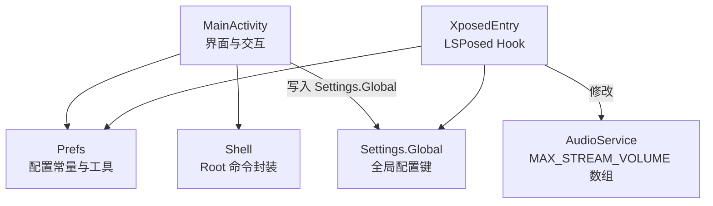
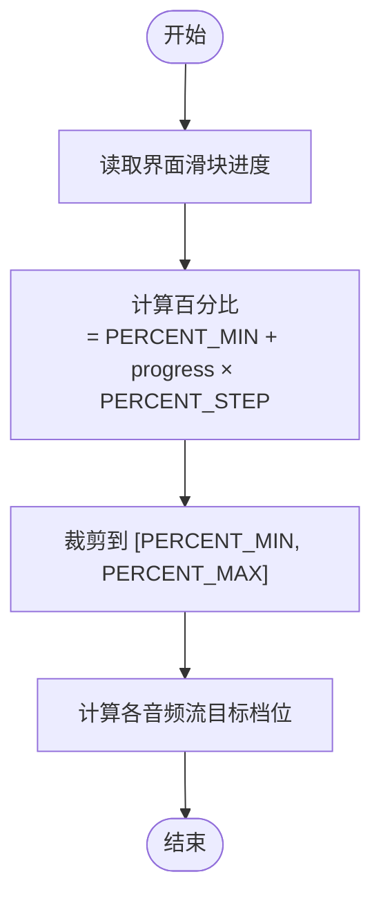
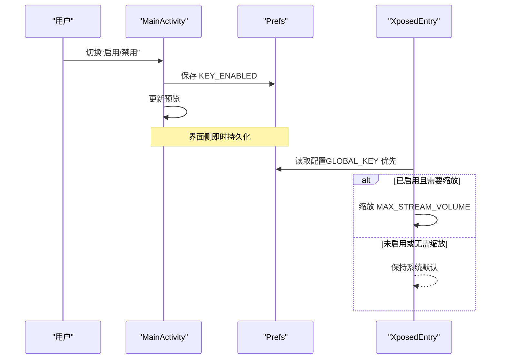
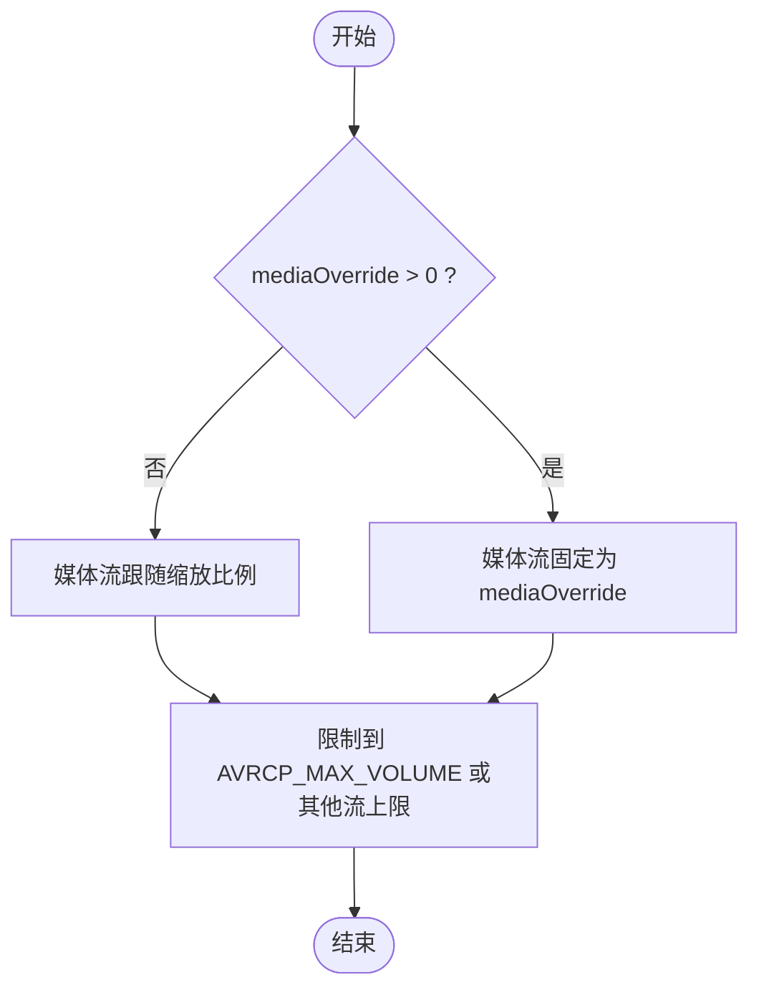
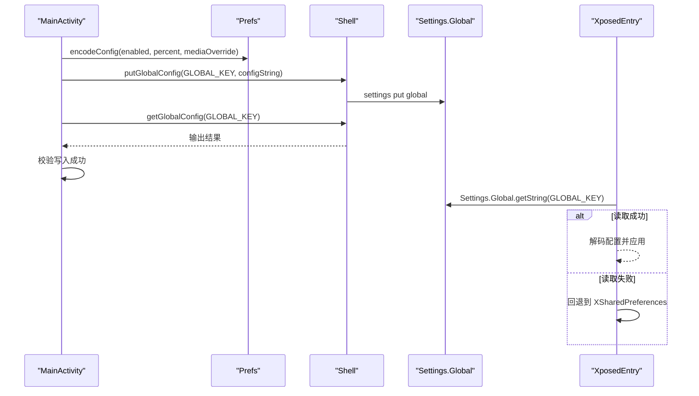
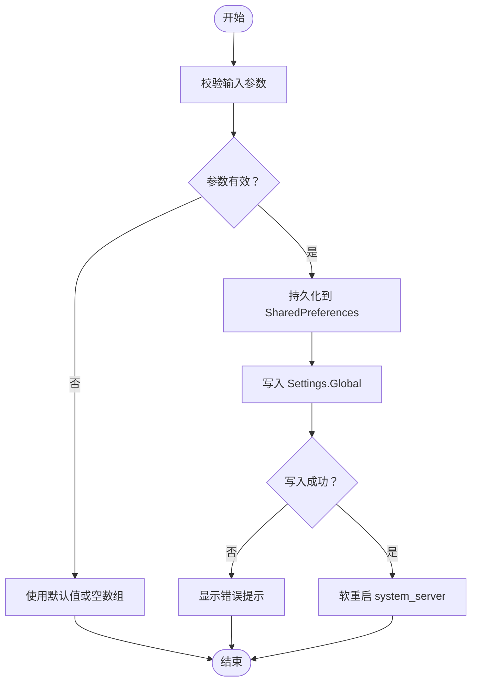
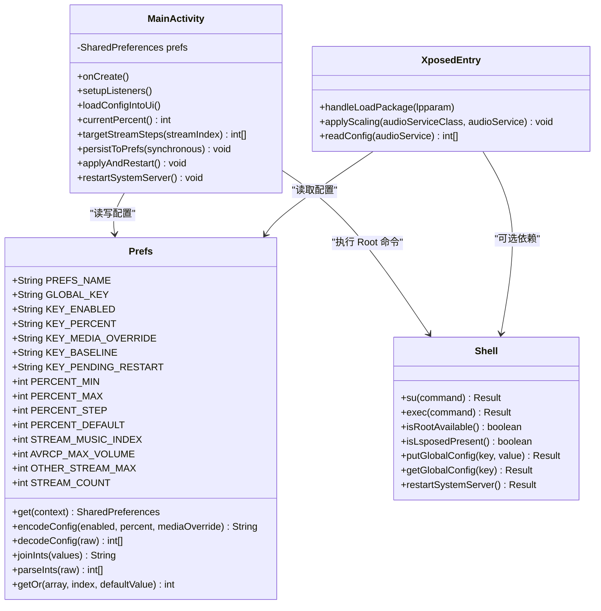
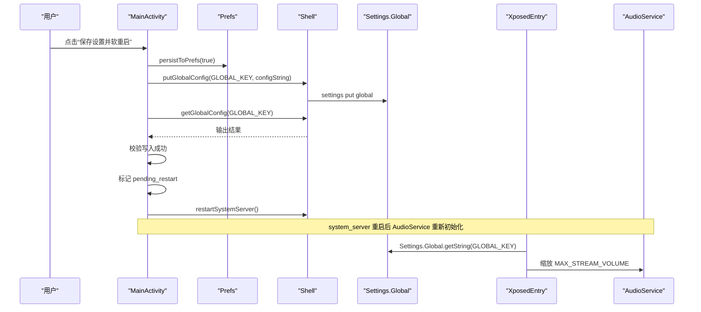

# 基础配置

<cite>
**本文引用的文件**   
- [Prefs.java](file://app/src/main/java/com/xiefeihong/volumecontrol/Prefs.java)
- [MainActivity.java](file://app/src/main/java/com/xiefeihong/volumecontrol/MainActivity.java)
- [XposedEntry.java](file://app/src/main/java/com/xiefeihong/volumecontrol/XposedEntry.java)
- [Shell.java](file://app/src/main/java/com/xiefeihong/volumecontrol/Shell.java)
- [strings.xml](file://app/src/main/res/values/strings.xml)
- [arrays.xml](file://app/src/main/res/values/arrays.xml)
- [activity_main.xml](file://app/src/main/res/layout/activity_main.xml)
</cite>

## 目录
1. [简介](#简介)
2. [项目结构](#项目结构)
3. [核心配置项总览](#核心配置项总览)
4. [音量缩放比例详解](#音量缩放比例详解)
5. [启用与禁用开关机制](#启用与禁用开关机制)
6. [媒体流覆盖设置](#媒体流覆盖设置)
7. [配置持久化与全局同步](#配置持久化与全局同步)
8. [配置验证规则与错误处理](#配置验证规则与错误处理)
9. [最佳实践建议](#最佳实践建议)
10. [架构与数据流概览](#架构与数据流概览)
11. [常见问题排查](#常见问题排查)
12. [结论](#结论)

## 简介
本基础配置文档面向首次使用音量控制应用的用户，重点说明以下能力：
- 如何通过“档位缩放”调整系统各音频流的音量档位数。
- 如何理解并设置音量缩放比例（25%–400%），以及 PERCENT_MIN、PERCENT_MAX、PERCENT_STEP 等常量的含义。
- 如何理解“启用/禁用”开关对系统音量行为的影响。
- 如何使用“媒体流覆盖”功能，将媒体档位固定为特定值，以改善蓝牙 AVRCP 映射体验。
- 配置如何在本地 SharedPreferences 与 Settings.Global 之间持久化和同步。
- 配置的校验规则、异常回退策略和常见错误提示。

该应用通过 LSPosed Hook 修改系统 AudioService 的音量档位数组，从而改变系统音量步进；同时提供界面预览、基准档位采集、软重启 system_server 等功能，使配置在系统框架层生效。

## 项目结构
从配置相关角度看，本项目主要涉及以下文件：
- Prefs：集中定义配置常量、SharedPreferences 键名、配置序列化与解析工具方法。
- MainActivity：界面逻辑，负责读取/写入 SharedPreferences、计算预览、调用 Shell 写入 Settings.Global 并触发软重启。
- XposedEntry：LSPosed 模块入口，Hook AudioService 创建音量档位流程，按配置缩放 MAX_STREAM_VOLUME 数组。
- Shell：root shell 执行封装，用于检测 root/LSPosed/Magisk、读写 Settings.Global、重启 system_server。
- strings.xml、arrays.xml、activity_main.xml：界面文案、音频流名称数组、主界面布局。

**图表来源**
- [MainActivity.java:235-288](file://app/src/main/java/com/xiefeihong/volumecontrol/MainActivity.java#L235-L288)
- [Prefs.java:14-47](file://app/src/main/java/com/xiefeihong/volumecontrol/Prefs.java#L14-L47)
- [XposedEntry.java:41-114](file://app/src/main/java/com/xiefeihong/volumecontrol/XposedEntry.java#L41-L114)
- [Shell.java:92-112](file://app/src/main/java/com/xiefeihong/volumecontrol/Shell.java#L92-L112)

**章节来源**
- [MainActivity.java:23-50](file://app/src/main/java/com/xiefeihong/volumecontrol/MainActivity.java#L23-L50)
- [Prefs.java:6-47](file://app/src/main/java/com/xiefeihong/volumecontrol/Prefs.java#L6-L47)
- [XposedEntry.java:16-28](file://app/src/main/java/com/xiefeihong/volumecontrol/XposedEntry.java#L16-L28)
- [Shell.java:8-12](file://app/src/main/java/com/xiefeihong/volumecontrol/Shell.java#L8-L12)

## 核心配置项总览
应用的核心配置由以下键组成，均定义在 Prefs 中：
- KEY_ENABLED：是否启用档位缩放。
- KEY_PERCENT：音量缩放百分比（25%-400%）。
- KEY_MEDIA_OVERRIDE：媒体流覆盖档位（0 表示跟随缩放，大于 0 表示固定为该值）。
- KEY_BASELINE：原始基准档位数组（CSV 字符串），用于计算目标档位。
- KEY_PENDING_RESTART：标记是否需要软重启 system_server。
- GLOBAL_KEY：Settings.Global 中的配置键，供 Hook 端优先读取。

此外，PREFS_NAME 是 SharedPreferences 文件名，必须与 Hook 端的 XSharedPreferences 一致。

这些键在 MainActivity 中用于界面加载、保存与预览；在 XposedEntry 中用于 Hook 时读取并应用缩放。

**章节来源**
- [Prefs.java:14-24](file://app/src/main/java/com/xiefeihong/volumecontrol/Prefs.java#L14-L24)
- [MainActivity.java:130-141](file://app/src/main/java/com/xiefeihong/volumecontrol/MainActivity.java#L130-L141)
- [XposedEntry.java:122-146](file://app/src/main/java/com/xiefeihong/volumecontrol/XposedEntry.java#L122-L146)

## 音量缩放比例详解
### 常量含义
- PERCENT_MIN：最小缩放比例，默认 25%。
- PERCENT_MAX：最大缩放比例，默认 400%。
- PERCENT_STEP：滑块步长，默认 5%。
- PERCENT_DEFAULT：默认缩放比例，100% 表示不修改系统默认档位。

这些常量定义了用户可调节的范围与精度，并在界面滑块与计算逻辑中被严格限制。

### 使用方法
- 界面通过 SeekBar 调节进度，实际百分比 = PERCENT_MIN + progress × PERCENT_STEP。
- 所有设置都会先进行边界裁剪，确保最终百分比落在 [PERCENT_MIN, PERCENT_MAX] 范围内。
- 当 PERCENT_DEFAULT（100%）且未设置媒体覆盖时，Hook 端会跳过缩放，保持系统默认。

**图表来源**
- [MainActivity.java:145-156](file://app/src/main/java/com/xiefeihong/volumecontrol/MainActivity.java#L145-L156)
- [Prefs.java:26-30](file://app/src/main/java/com/xiefeihong/volumecontrol/Prefs.java#L26-L30)

**章节来源**
- [Prefs.java:26-30](file://app/src/main/java/com/xiefeihong/volumecontrol/Prefs.java#L26-L30)
- [MainActivity.java:145-156](file://app/src/main/java/com/xiefeihong/volumecontrol/MainActivity.java#L145-L156)

## 启用与禁用开关机制
- 启用（KEY_ENABLED=true）：应用会对所有音频流按比例缩放档位上限，媒体流还会受媒体覆盖影响。
- 禁用（KEY_ENABLED=false）：不应用缩放，保持系统原始档位。

在 MainActivity 中，切换开关会立即更新预览，并将当前状态保存到 SharedPreferences。在 XposedEntry 中，如果检测到未启用或比例为 100% 且无媒体覆盖，则直接返回，不做任何修改。

**图表来源**
- [MainActivity.java:60-64](file://app/src/main/java/com/xiefeihong/volumecontrol/MainActivity.java#L60-L64)
- [XposedEntry.java:67-84](file://app/src/main/java/com/xiefeihong/volumecontrol/XposedEntry.java#L67-L84)

**章节来源**
- [MainActivity.java:60-64](file://app/src/main/java/com/xiefeihong/volumecontrol/MainActivity.java#L60-L64)
- [XposedEntry.java:67-84](file://app/src/main/java/com/xiefeihong/volumecontrol/XposedEntry.java#L67-L84)

## 媒体流覆盖设置
媒体流覆盖（KEY_MEDIA_OVERRIDE）用于将媒体流（STREAM_MUSIC_INDEX）的目标档位固定为一个具体值：
- 值为 0：媒体流跟随缩放比例计算。
- 值大于 0：媒体流固定为该值，上限不超过 AVRCP_MAX_VOLUME（127），以避免蓝牙相邻档位音量相同。

适用场景：
- 蓝牙耳机低音量无声或相邻档位音量相同，可通过固定媒体档位（例如 20-30 档）让低音区更细腻。
- 希望媒体音量与蓝牙 AVRCP 一一对应，避免跨度过大导致听感跳跃。

在 MainActivity 中，媒体覆盖滑块最大值为 127；在 XposedEntry 中，若 mediaOverride > 0，则直接将媒体流档位设置为该值，不再参与缩放。

**图表来源**
- [MainActivity.java:175-191](file://app/src/main/java/com/xiefeihong/volumecontrol/MainActivity.java#L175-L191)
- [XposedEntry.java:99-110](file://app/src/main/java/com/xiefeihong/volumecontrol/XposedEntry.java#L99-L110)
- [Prefs.java:32-44](file://app/src/main/java/com/xiefeihong/volumecontrol/Prefs.java#L32-L44)

**章节来源**
- [MainActivity.java:175-191](file://app/src/main/java/com/xiefeihong/volumecontrol/MainActivity.java#L175-L191)
- [XposedEntry.java:99-110](file://app/src/main/java/com/xiefeihong/volumecontrol/XposedEntry.java#L99-L110)
- [strings.xml:26-34](file://app/src/main/res/values/strings.xml#L26-L34)

## 配置持久化与全局同步
### SharedPreferences 使用方式
- PREFS_NAME：SharedPreferences 文件名，必须与 Hook 端一致。
- 主要键：
  - KEY_ENABLED：布尔值，是否启用缩放。
  - KEY_PERCENT：整型，缩放百分比。
  - KEY_MEDIA_OVERRIDE：整型，媒体覆盖档位。
  - KEY_BASELINE：字符串，基准档位 CSV。
  - KEY_PENDING_RESTART：布尔值，标记是否需要软重启。

MainActivity 在用户操作时调用 persistToPrefs 保存配置；首次启动时若基准档位不足，会采集系统原始档位并存储。

### Settings.Global 同步机制
- GLOBAL_KEY：Settings.Global 中的配置键，Hook 端优先从这里读取。
- MainActivity 在“保存设置并软重启”时，通过 Shell.putGlobalConfig 写入配置字符串，并尝试读回校验。
- XposedEntry 在 Hook 时优先读取 Settings.Global，失败则回退到 XSharedPreferences。

**图表来源**
- [MainActivity.java:247-288](file://app/src/main/java/com/xiefeihong/volumecontrol/MainActivity.java#L247-L288)
- [Shell.java:92-103](file://app/src/main/java/com/xiefeihong/volumecontrol/Shell.java#L92-L103)
- [XposedEntry.java:122-146](file://app/src/main/java/com/xiefeihong/volumecontrol/XposedEntry.java#L122-L146)
- [Prefs.java:56-82](file://app/src/main/java/com/xiefeihong/volumecontrol/Prefs.java#L56-L82)

**章节来源**
- [MainActivity.java:235-288](file://app/src/main/java/com/xiefeihong/volumecontrol/MainActivity.java#L235-L288)
- [Shell.java:92-112](file://app/src/main/java/com/xiefeihong/volumecontrol/Shell.java#L92-L112)
- [XposedEntry.java:116-146](file://app/src/main/java/com/xiefeihong/volumecontrol/XposedEntry.java#L116-L146)
- [Prefs.java:14-24](file://app/src/main/java/com/xiefeihong/volumecontrol/Prefs.java#L14-L24)

## 配置验证规则与错误处理
### 验证规则
- 缩放比例范围：[PERCENT_MIN, PERCENT_MAX]，即 25%-400%。
- 媒体覆盖范围：[0, AVRCP_MAX_VOLUME]，即 0-127。
- 非媒体流上限：OTHER_STREAM_MAX，防止其他音频流档位过高。
- 基准档位数组长度：STREAM_COUNT，Android 13+ 为 12 个流。

### 错误处理
- 解析配置字符串失败：decodeConfig 返回 null，Hook 端记录日志并保持系统默认。
- 解析基准档位 CSV 失败：parseInts 返回空数组，getOr 提供默认值。
- 读取系统当前档位失败：readStreamMaxSafe 捕获异常并返回 0，预览中使用基准值兜底。
- 写入 Settings.Global 失败：Toast 提示失败原因，可能包含 shell 输出详情。
- 软重启失败：restartSystemServer 抛出异常被忽略，避免页面销毁后崩溃。

**图表来源**
- [Prefs.java:66-82](file://app/src/main/java/com/xiefeihong/volumecontrol/Prefs.java#L66-L82)
- [Prefs.java:100-114](file://app/src/main/java/com/xiefeihong/volumecontrol/Prefs.java#L100-L114)
- [MainActivity.java:162-173](file://app/src/main/java/com/xiefeihong/volumecontrol/MainActivity.java#L162-L173)
- [MainActivity.java:262-288](file://app/src/main/java/com/xiefeihong/volumecontrol/MainActivity.java#L262-L288)

**章节来源**
- [Prefs.java:66-82](file://app/src/main/java/com/xiefeihong/volumecontrol/Prefs.java#L66-L82)
- [Prefs.java:100-114](file://app/src/main/java/com/xiefeihong/volumecontrol/Prefs.java#L100-L114)
- [MainActivity.java:162-173](file://app/src/main/java/com/xiefeihong/volumecontrol/MainActivity.java#L162-L173)
- [MainActivity.java:262-288](file://app/src/main/java/com/xiefeihong/volumecontrol/MainActivity.java#L262-L288)

## 最佳实践建议
- 初次使用：
  - 先在 LSPosed 中启用本模块，作用域勾选“系统框架”，然后点击“保存设置并软重启系统框架”。
  - 首次打开应用会自动采集基准档位；若已有第三方音量修改，请先恢复系统默认再采集。
- 推荐缩放比例：
  - 蓝牙耳机低音量无声：尝试 200%-300%，让低音区更细腻。
  - 普通手机扬声器：100%-200% 通常足够。
- 媒体覆盖设置：
  - 若蓝牙 AVRCP 映射跨度过大，可将媒体覆盖设为 20-30 档，避免相邻档位音量相同。
  - 不建议超过 127，否则可能导致蓝牙相邻档位音量相同。
- 配置恢复：
  - 点击“恢复系统默认”并软重启，可关闭缩放并恢复原始档位。
  - 或在 LSPosed 中停用模块后重启手机。
- 注意事项：
  - 修改档位后必须重启 system_server 才能生效。
  - 软重启期间屏幕会短暂黑屏，属正常现象。

**章节来源**
- [strings.xml:28-38](file://app/src/main/res/values/strings.xml#L28-L38)
- [MainActivity.java:91-121](file://app/src/main/java/com/xiefeihong/volumecontrol/MainActivity.java#L91-L121)

## 架构与数据流概览
### 类关系图

**图表来源**
- [Prefs.java:12-123](file://app/src/main/java/com/xiefeihong/volumecontrol/Prefs.java#L12-L123)
- [MainActivity.java:26-427](file://app/src/main/java/com/xiefeihong/volumecontrol/MainActivity.java#L26-L427)
- [XposedEntry.java:29-148](file://app/src/main/java/com/xiefeihong/volumecontrol/XposedEntry.java#L29-L148)
- [Shell.java:13-114](file://app/src/main/java/com/xiefeihong/volumecontrol/Shell.java#L13-L114)

### 配置写入与生效时序

**图表来源**
- [MainActivity.java:262-296](file://app/src/main/java/com/xiefeihong/volumecontrol/MainActivity.java#L262-L296)
- [Shell.java:92-112](file://app/src/main/java/com/xiefeihong/volumecontrol/Shell.java#L92-L112)
- [XposedEntry.java:41-114](file://app/src/main/java/com/xiefeihong/volumecontrol/XposedEntry.java#L41-L114)

## 常见问题排查
- Root 不可用：
  - 检查 su 是否授权，Shell.isRootAvailable 会检测 uid=0。
  - 若无法写入 Settings.Global，会提示“Root：不可用，无法写入系统配置”。
- LSPosed 未安装：
  - Shell.isLsposedPresent 检测 /data/adb/lspd 是否存在。
  - 若未检测到，模块将无法加载。
- 设置未生效：
  - 确认已点击“保存设置并软重启系统框架”。
  - 检查“模块配置”状态是否为“已生效”或“未生效，需软重启”。
- 蓝牙音量问题：
  - 调整媒体覆盖值（0-127），避免相邻档位音量相同。
  - 连接蓝牙设备后查看“蓝牙 AVRCP 映射预览”。

**章节来源**
- [strings.xml:44-57](file://app/src/main/res/values/strings.xml#L44-L57)
- [Shell.java:74-84](file://app/src/main/java/com/xiefeihong/volumecontrol/Shell.java#L74-L84)
- [MainActivity.java:300-366](file://app/src/main/java/com/xiefeihong/volumecontrol/MainActivity.java#L300-L366)

## 结论
本基础配置文档详细说明了音量控制应用的核心配置选项，包括：
- 音量缩放比例（25%-400%）及其常量 PERCENT_MIN、PERCENT_MAX、PERCENT_STEP 的含义和使用方法。
- 启用/禁用开关的作用机制，以及对系统音量的影响。
- 媒体流覆盖设置的功能和适用场景，特别是蓝牙 AVRCP 映射优化。
- 配置的持久化存储机制，包括 SharedPreferences 的使用方式和 Settings.Global 的全局同步。
- 配置验证规则和错误处理机制，帮助用户快速上手并稳定使用应用的基本功能。

通过合理设置缩放比例和媒体覆盖，用户可以显著改善系统音量步进体验和蓝牙音频设备的听感表现。