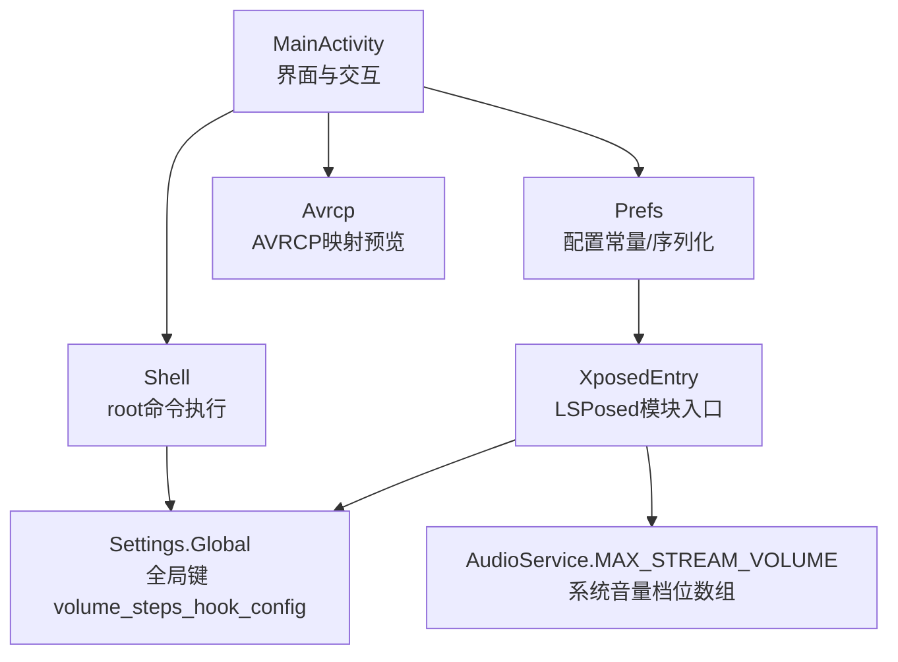
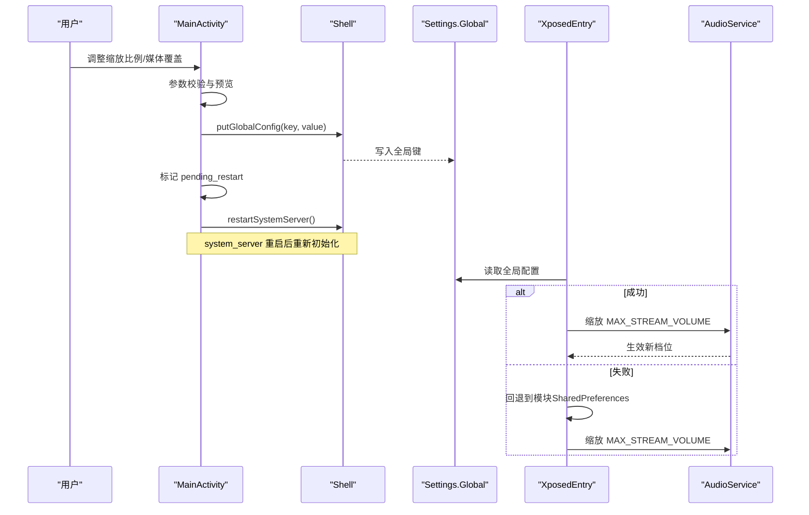
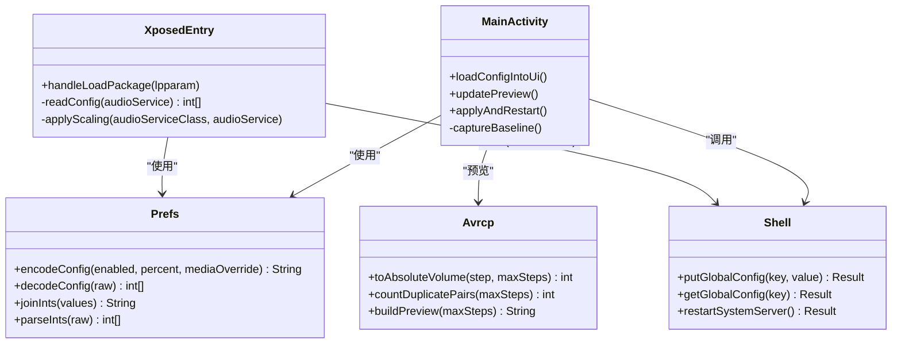

# 配置指南

<cite>
**本文引用的文件**
- [Prefs.java](file://app/src/main/java/com/xiefeihong/volumecontrol/Prefs.java)
- [MainActivity.java](file://app/src/main/java/com/xiefeihong/volumecontrol/MainActivity.java)
- [XposedEntry.java](file://app/src/main/java/com/xiefeihong/volumecontrol/XposedEntry.java)
- [Shell.java](file://app/src/main/java/com/xiefeihong/volumecontrol/Shell.java)
- [Avrcp.java](file://app/src/main/java/com/xiefeihong/volumecontrol/Avrcp.java)
- [arrays.xml](file://app/src/main/res/values/arrays.xml)
- [strings.xml](file://app/src/main/res/values/strings.xml)
- [activity_main.xml](file://app/src/main/res/layout/activity_main.xml)
- [build.gradle](file://app/build.gradle)
</cite>

## 目录
1. [简介](#简介)
2. [项目结构](#项目结构)
3. [核心组件](#核心组件)
4. [架构总览](#架构总览)
5. [详细组件分析](#详细组件分析)
6. [依赖关系分析](#依赖关系分析)
7. [性能与稳定性建议](#性能与稳定性建议)
8. [故障排除指南](#故障排除指南)
9. [结论](#结论)
10. [附录：配置项与格式说明](#附录：配置项与格式说明)

## 简介
本指南面向使用“音量阶数”应用的用户与高级用户，系统性地说明如何配置音量缩放、媒体流覆盖、基准值管理、持久化存储、备份恢复、版本兼容与迁移，以及不同场景下的推荐配置。该应用通过 LSPosed Hook 系统框架的 AudioService，在系统启动时按比例缩放各音频流的音量档位数，从而改善蓝牙 AVRCP 映射与低音量细腻度等问题。

## 项目结构
- 应用层（App）：提供 UI、参数校验、预览、写入 Settings.Global、触发软重启等能力。
- Hook 层（XposedEntry）：在 system_server 进程内拦截 AudioService 初始化流程，读取配置并改写 MAX_STREAM_VOLUME 数组。
- 工具层：Shell 负责 root shell 执行；Avrcp 计算蓝牙绝对音量映射；Prefs 统一配置常量与序列化。

图表来源
- [MainActivity.java:235-288](file://app/src/main/java/com/xiefeihong/volumecontrol/MainActivity.java#L235-L288)
- [Shell.java:92-112](file://app/src/main/java/com/xiefeihong/volumecontrol/Shell.java#L92-L112)
- [XposedEntry.java:67-146](file://app/src/main/java/com/xiefeihong/volumecontrol/XposedEntry.java#L67-L146)
- [Prefs.java:14-47](file://app/src/main/java/com/xiefeihong/volumecontrol/Prefs.java#L14-L47)

章节来源
- [MainActivity.java:23-50](file://app/src/main/java/com/xiefeihong/volumecontrol/MainActivity.java#L23-L50)
- [XposedEntry.java:16-28](file://app/src/main/java/com/xiefeihong/volumecontrol/XposedEntry.java#L16-L28)
- [build.gradle:5-15](file://app/build.gradle#L5-L15)

## 核心组件
- Prefs：定义所有配置键、取值范围、默认值与序列化/反序列化方法，供 App 与 Hook 端共用。
- MainActivity：UI 逻辑、参数校验、预览、持久化到 SharedPreferences、写入 Settings.Global、触发软重启。
- XposedEntry：Hook 系统框架，读取配置并改写系统音量档位数组。
- Shell：封装 su 命令执行、检测 Root/LSPosed/Magisk、读写 Settings.Global、软重启 system_server。
- Avrcp：计算蓝牙 AVRCP 绝对音量映射，生成预览文本。

章节来源
- [Prefs.java:12-47](file://app/src/main/java/com/xiefeihong/volumecontrol/Prefs.java#L12-L47)
- [MainActivity.java:58-141](file://app/src/main/java/com/xiefeihong/volumecontrol/MainActivity.java#L58-L141)
- [XposedEntry.java:67-146](file://app/src/main/java/com/xiefeihong/volumecontrol/XposedEntry.java#L67-L146)
- [Shell.java:74-112](file://app/src/main/java/com/xiefeihong/volumecontrol/Shell.java#L74-L112)
- [Avrcp.java:20-89](file://app/src/main/java/com/xiefeihong/volumecontrol/Avrcp.java#L20-L89)

## 架构总览
应用通过 UI 收集用户设置，持久化到本地 SharedPreferences，并通过 root 将配置写入 Settings.Global。Hook 端在系统框架初始化时优先从 Settings.Global 读取配置，若不可用则回退到模块的 SharedPreferences。随后按百分比缩放各音频流的最大档位数，并对媒体流支持固定覆盖值，最终实现音量阶数的整体调整。

图表来源
- [MainActivity.java:261-296](file://app/src/main/java/com/xiefeihong/volumecontrol/MainActivity.java#L261-L296)
- [Shell.java:92-112](file://app/src/main/java/com/xiefeihong/volumecontrol/Shell.java#L92-L112)
- [XposedEntry.java:122-146](file://app/src/main/java/com/xiefeihong/volumecontrol/XposedEntry.java#L122-L146)

## 详细组件分析

### 配置项与取值范围
- 启用开关（enabled）：布尔值，控制是否启用音量缩放。
- 缩放比例（scale_percent）：整数，范围 25%-400%，步长 5%，默认 100%（保持系统默认）。
- 媒体流覆盖（media_steps_override）：整数，范围 0-127；0 表示跟随缩放比例，>0 表示媒体流固定为该档位数。
- 基准值（baseline_max_volumes）：CSV 字符串，保存各音频流的原始最大档位数，用于计算目标档位。
- 待重启标志（pending_restart）：布尔值，用于提示或清理状态。

章节来源
- [Prefs.java:20-47](file://app/src/main/java/com/xiefeihong/volumecontrol/Prefs.java#L20-L47)
- [MainActivity.java:130-141](file://app/src/main/java/com/xiefeihong/volumecontrol/MainActivity.java#L130-L141)

### 配置持久化与全局同步
- 本地持久化：使用 SharedPreferences 存储 enabled、scale_percent、media_steps_override、baseline_max_volumes、pending_restart。
- 全局同步：通过 root 将配置序列化为字符串写入 Settings.Global 的 key（volume_steps_hook_config），Hook 端优先读取该键。
- 读取优先级：Hook 端先读 Settings.Global，失败则回退到模块的 SharedPreferences。

章节来源
- [MainActivity.java:235-288](file://app/src/main/java/com/xiefeihong/volumecontrol/MainActivity.java#L235-L288)
- [XposedEntry.java:122-146](file://app/src/main/java/com/xiefeihong/volumecontrol/XposedEntry.java#L122-L146)
- [Shell.java:92-103](file://app/src/main/java/com/xiefeihong/volumecontrol/Shell.java#L92-L103)

### 基准值管理与采集
- 首次启动或检测到缺失时，自动采集当前系统各音频流的原始最大档位数，并以 CSV 形式保存到本地。
- 后续计算目标档位基于该基准值进行缩放或覆盖。
- 支持手动重新采集，确保基准值为“未受本模块影响”的原始值。

章节来源
- [MainActivity.java:123-128](file://app/src/main/java/com/xiefeihong/volumecontrol/MainActivity.java#L123-L128)
- [MainActivity.java:252-259](file://app/src/main/java/com/xiefeihong/volumecontrol/MainActivity.java#L252-L259)
- [arrays.xml:7-21](file://app/src/main/res/values/arrays.xml#L7-L21)

### 媒体流覆盖与蓝牙 AVRCP 映射
- 媒体流索引为固定值，对应系统媒体音量。
- 当媒体覆盖值 > 0 时，媒体流目标档位数固定为该值，上限 127，避免相邻档位映射到相同 AVRCP 音量。
- 非媒体流的安全上限为 150，防止过度放大导致异常。
- 提供 AVRCP 映射预览，显示每档对应的绝对音量及重复对数量。

章节来源
- [Prefs.java:32-44](file://app/src/main/java/com/xiefeihong/volumecontrol/Prefs.java#L32-L44)
- [MainActivity.java:175-191](file://app/src/main/java/com/xiefeihong/volumecontrol/MainActivity.java#L175-L191)
- [Avrcp.java:25-89](file://app/src/main/java/com/xiefeihong/volumecontrol/Avrcp.java#L25-L89)

### 配置验证与错误处理
- 参数校验：缩放比例限制在 25%-400%，媒体覆盖限制在 0-127，越界值会被裁剪到合法范围。
- 解析容错：配置字符串或 CSV 解析失败时返回空或默认值，避免崩溃。
- 异常恢复：读取系统服务或 Shell 命令失败时返回安全默认值，保证界面可用。
- 写回校验：写入 Settings.Global 后进行读回校验，失败时提示用户并保留原配置。

章节来源
- [MainActivity.java:130-141](file://app/src/main/java/com/xiefeihong/volumecontrol/MainActivity.java#L130-L141)
- [Prefs.java:66-122](file://app/src/main/java/com/xiefeihong/volumecontrol/Prefs.java#L66-L122)
- [MainActivity.java:261-288](file://app/src/main/java/com/xiefeihong/volumecontrol/MainActivity.java#L261-L288)

### 软重启机制
- 修改配置后需软重启 system_server 以生效，因为 AudioService 仅在启动时创建音量档位。
- 应用通过 Shell 发送 kill 信号重启 system_server，期间屏幕短暂黑屏属正常现象。
- 重启完成后，Hook 端重新读取配置并应用新的档位。

章节来源
- [XposedEntry.java:19-27](file://app/src/main/java/com/xiefeihong/volumecontrol/XposedEntry.java#L19-L27)
- [Shell.java:105-112](file://app/src/main/java/com/xiefeihong/volumecontrol/Shell.java#L105-L112)
- [MainActivity.java:290-296](file://app/src/main/java/com/xiefeihong/volumecontrol/MainActivity.java#L290-L296)

## 依赖关系分析
- MainActivity 依赖 Prefs 获取配置常量与序列化方法，依赖 Shell 执行 root 命令，依赖 Avrcp 生成蓝牙映射预览。
- XposedEntry 依赖 Prefs 的常量与解码方法，依赖系统 API 读取 Context 与 Settings.Global，并 Hook AudioService。
- Shell 依赖 Android 进程管理能力，通过 su 执行命令。
- 资源文件 arrays.xml 提供音频流名称映射，strings.xml 提供界面文案。

图表来源
- [MainActivity.java:130-296](file://app/src/main/java/com/xiefeihong/volumecontrol/MainActivity.java#L130-L296)
- [Prefs.java:52-122](file://app/src/main/java/com/xiefeihong/volumecontrol/Prefs.java#L52-L122)
- [Shell.java:74-112](file://app/src/main/java/com/xiefeihong/volumecontrol/Shell.java#L74-L112)
- [XposedEntry.java:67-146](file://app/src/main/java/com/xiefeihong/volumecontrol/XposedEntry.java#L67-L146)
- [Avrcp.java:25-89](file://app/src/main/java/com/xiefeihong/volumecontrol/Avrcp.java#L25-L89)

章节来源
- [MainActivity.java:130-296](file://app/src/main/java/com/xiefeihong/volumecontrol/MainActivity.java#L130-L296)
- [XposedEntry.java:67-146](file://app/src/main/java/com/xiefeihong/volumecontrol/XposedEntry.java#L67-L146)

## 性能与稳定性建议
- 避免频繁写入：批量更新配置后再提交，减少 SharedPreferences 与 Settings.Global 的写入次数。
- 后台线程执行：所有 root 命令与系统查询均在单线程池中串行执行，避免阻塞主线程。
- 超时保护：Shell 命令设置超时时间，防止卡死。
- 最小化日志：生产环境可关闭冗余日志，降低 I/O 开销。
- 谨慎设置高倍率：超过 200% 可能导致低音量区过于细腻但操作不便，建议根据耳机特性调优。

[本节为通用指导，不直接分析具体文件]

## 故障排除指南
- Root 不可用：确认已授予 su 权限，检查 Shell.isRootAvailable 检测结果。
- LSPosed 未安装或未启用：在 LSPosed 中启用本模块并将作用域设置为“系统框架”。
- 配置未生效：确认已点击“保存设置并软重启系统框架”，等待 system_server 重启完成。
- 蓝牙音量无变化：检查媒体覆盖值是否合理（≤127），查看 AVRCP 映射预览是否有重复对。
- 基准值异常：重新采集基准值，确保当前没有其它音量修改工具干扰。
- 写回失败：检查 Shell 输出详情，确认 settings 命令执行成功。

章节来源
- [MainActivity.java:300-366](file://app/src/main/java/com/xiefeihong/volumecontrol/MainActivity.java#L300-L366)
- [Shell.java:74-103](file://app/src/main/java/com/xiefeihong/volumecontrol/Shell.java#L74-L103)
- [strings.xml:44-74](file://app/src/main/res/values/strings.xml#L44-L74)

## 结论
本应用通过清晰的配置模型、健壮的校验与回退机制、以及可靠的 Hook 实现，提供了灵活的音量阶数调节能力。合理设置缩放比例与媒体覆盖值，可显著改善蓝牙耳机的音量体验。建议在不同场景下采用推荐的配置方案，并定期维护基准值以确保准确性。

[本节为总结性内容，不直接分析具体文件]

## 附录：配置项与格式说明

### 配置项清单
- enabled：布尔，是否启用缩放。
- scale_percent：整数，25%-400%，步长 5%，默认 100%。
- media_steps_override：整数，0-127，0 表示跟随缩放，>0 表示媒体流固定档位数。
- baseline_max_volumes：CSV 字符串，保存各音频流原始最大档位数。
- pending_restart：布尔，标记是否需要软重启。

章节来源
- [Prefs.java:20-47](file://app/src/main/java/com/xiefeihong/volumecontrol/Prefs.java#L20-L47)
- [MainActivity.java:130-141](file://app/src/main/java/com/xiefeihong/volumecontrol/MainActivity.java#L130-L141)

### 全局配置字符串格式
- 格式：{启用};{百分比};{媒体覆盖}
- 示例：1;200;30 表示启用、200% 缩放、媒体覆盖 30 档。
- 解析失败时 Hook 端会回退到模块 SharedPreferences。

章节来源
- [Prefs.java:56-82](file://app/src/main/java/com/xiefeihong/volumecontrol/Prefs.java#L56-L82)
- [XposedEntry.java:122-146](file://app/src/main/java/com/xiefeihong/volumecontrol/XposedEntry.java#L122-L146)

### 基准值 CSV 格式
- 格式：逗号分隔的整数数组，长度应与音频流数量一致（Android 13+ 为 12）。
- 解析失败时返回空数组，计算时使用默认值。

章节来源
- [Prefs.java:84-114](file://app/src/main/java/com/xiefeihong/volumecontrol/Prefs.java#L84-L114)
- [MainActivity.java:158-160](file://app/src/main/java/com/xiefeihong/volumecontrol/MainActivity.java#L158-L160)

### 手动编辑指南
- 可通过 root shell 直接修改 Settings.Global 的全局键，或使用应用内“重新采集基准档位”功能。
- 修改后需软重启 system_server 使配置生效。

章节来源
- [Shell.java:92-103](file://app/src/main/java/com/xiefeihong/volumecontrol/Shell.java#L92-L103)
- [MainActivity.java:290-296](file://app/src/main/java/com/xiefeihong/volumecontrol/MainActivity.java#L290-L296)

### 版本兼容与迁移
- 最低 SDK 26，目标 SDK 35，兼容较新版本 Android。
- 音频流数量在 Android 13+ 为 12，基准值数组长度应与之匹配。
- 若设备 ROM 自定义了 ro.config.media_vol_steps 等属性，Hook 端仍会按配置缩放，确保一致性。

章节来源
- [build.gradle:7-15](file://app/build.gradle#L7-L15)
- [Prefs.java:46-47](file://app/src/main/java/com/xiefeihong/volumecontrol/Prefs.java#L46-L47)
- [XposedEntry.java:19-27](file://app/src/main/java/com/xiefeihong/volumecontrol/XposedEntry.java#L19-L27)

### 不同场景推荐配置
- 日常使用：启用缩放，比例 100%-200%，媒体覆盖 0（跟随缩放），适合大多数手机扬声器与有线耳机。
- 专业音频编辑：启用缩放，比例 200%-300%，媒体覆盖 0，提升低音区细腻度，便于精细调节。
- 蓝牙设备连接：启用缩放，比例 200%-400%，媒体覆盖 ≤127，避免相邻档位映射到相同 AVRCP 音量，解决低音量无声问题。
- 通话/通知：不建议大幅放大，保持 100%-150%，避免过响造成不适。

[本节为通用指导，不直接分析具体文件]

### 备份与恢复
- 备份：导出 SharedPreferences 中的 baseline_max_volumes 与当前配置字符串，以便跨设备迁移。
- 恢复：导入基准值与配置字符串，重启系统框架后生效。
- 注意：不同设备的原始档位可能不同，建议在目标设备上重新采集基准值以获得最佳效果。

[本节为通用指导，不直接分析具体文件]