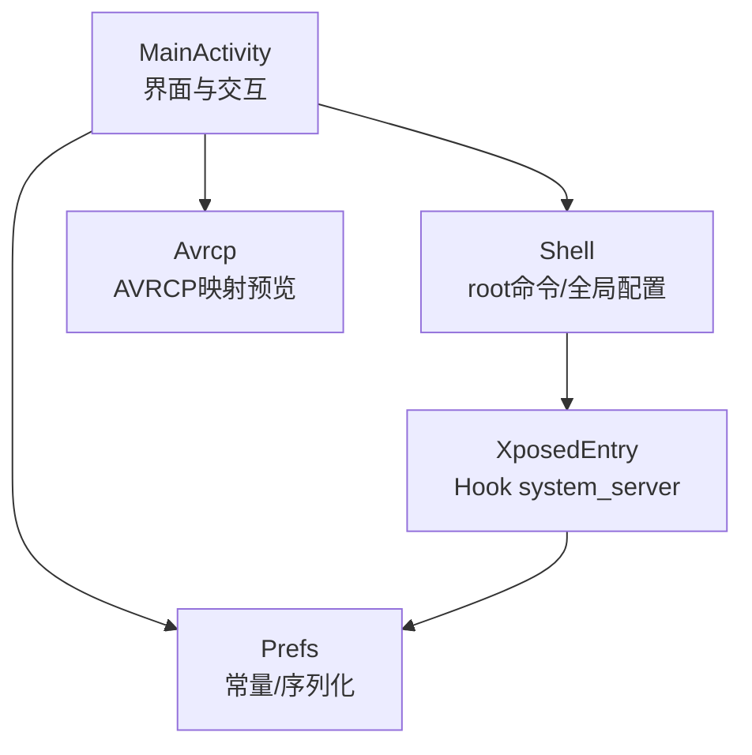
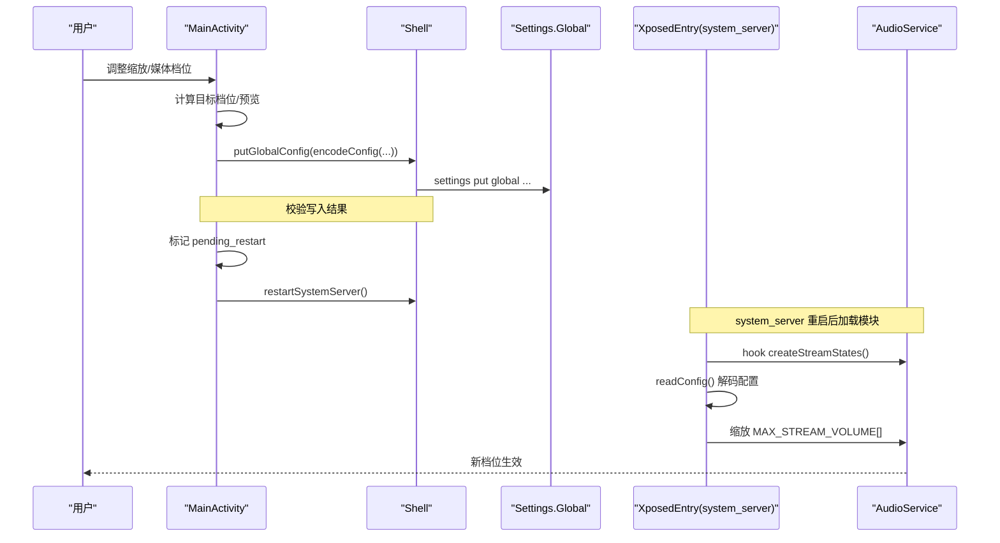
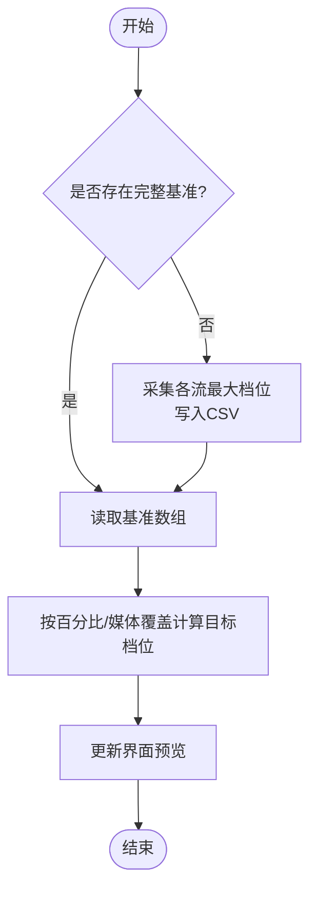
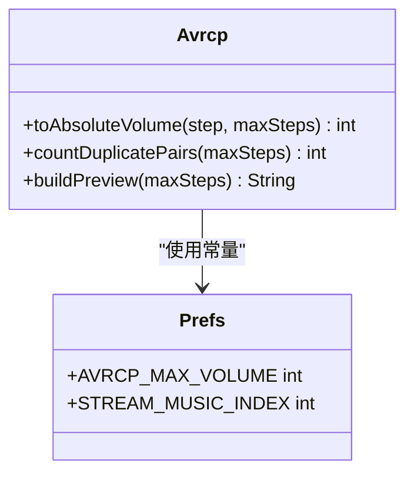
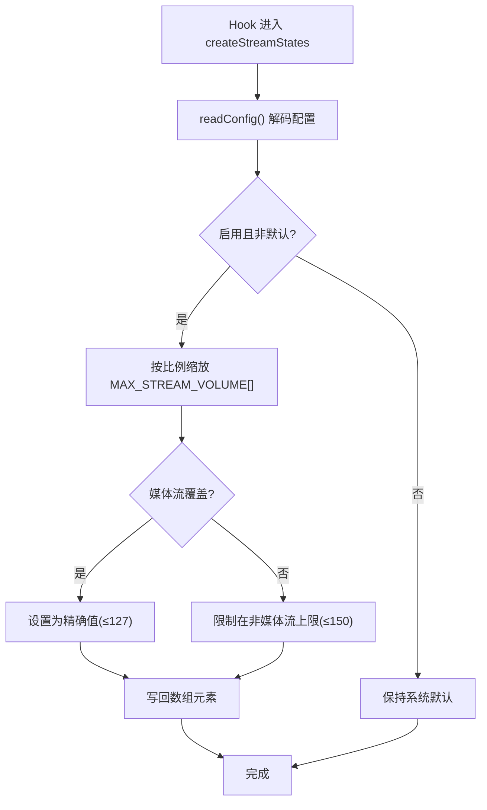
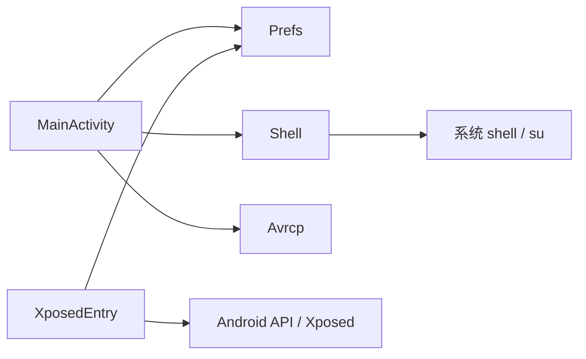

# 高级设置

<cite>
**本文引用的文件**
- [Avrcp.java](file://app/src/main/java/com/xiefeihong/volumecontrol/Avrcp.java)
- [Prefs.java](file://app/src/main/java/com/xiefeihong/volumecontrol/Prefs.java)
- [MainActivity.java](file://app/src/main/java/com/xiefeihong/volumecontrol/MainActivity.java)
- [XposedEntry.java](file://app/src/main/java/com/xiefeihong/volumecontrol/XposedEntry.java)
- [Shell.java](file://app/src/main/java/com/xiefeihong/volumecontrol/Shell.java)
- [strings.xml](file://app/src/main/res/values/strings.xml)
- [arrays.xml](file://app/src/main/res/values/arrays.xml)
- [activity_main.xml](file://app/src/main/res/layout/activity_main.xml)
</cite>

## 目录
1. [简介](#简介)
2. [项目结构](#项目结构)
3. [核心组件](#核心组件)
4. [架构总览](#架构总览)
5. [详细组件分析](#详细组件分析)
6. [依赖关系分析](#依赖关系分析)
7. [性能与调优](#性能与调优)
8. [故障排除指南](#故障排除指南)
9. [结论](#结论)
10. [附录](#附录)

## 简介
本高级设置文档面向进阶用户，聚焦音量控制应用中的“基准值管理”“AVRCP 映射原理”“系统音频流配置参数”“配置序列化/反序列化机制”，并提供复杂场景下的配置策略、优化建议与故障排除方法。目标是帮助用户在蓝牙设备与多音频流环境下，获得更细腻、可控的音量体验。

## 项目结构
该工程由 Android 应用层（UI、配置读写、Shell 工具）与 LSPosed Hook 端（system_server 进程内修改 AudioService 的档位数组）组成：
- UI 与配置：MainActivity、Prefs、Shell
- 蓝牙 AVRCP 映射预览：Avrcp
- Hook 入口与系统级修改：XposedEntry
- 资源：strings.xml、arrays.xml、activity_main.xml



图表来源
- [MainActivity.java:23-50](file://app/src/main/java/com/xiefeihong/volumecontrol/MainActivity.java#L23-L50)
- [Prefs.java:56-82](file://app/src/main/java/com/xiefeihong/volumecontrol/Prefs.java#L56-L82)
- [Shell.java:92-112](file://app/src/main/java/com/xiefeihong/volumecontrol/Shell.java#L92-L112)
- [XposedEntry.java:41-65](file://app/src/main/java/com/xiefeihong/volumecontrol/XposedEntry.java#L41-L65)

章节来源
- [MainActivity.java:23-50](file://app/src/main/java/com/xiefeihong/volumecontrol/MainActivity.java#L23-L50)
- [arrays.xml:7-21](file://app/src/main/res/values/arrays.xml#L7-L21)

## 核心组件
- 配置与常量（Prefs）
  - 定义 SharedPreferences 文件名、全局键、各开关与范围常量。
  - 提供 encodeConfig/decodeConfig 用于将启用状态、缩放比例、媒体覆盖档位序列化为字符串；提供 joinInts/parseInts 用于基准档位的 CSV 存取。
  - 关键常量：STREAM_MUSIC_INDEX、AVRCP_MAX_VOLUME、STREAM_COUNT、OTHER_STREAM_MAX。
- 蓝牙 AVRCP 映射（Avrcp）
  - 实现与 AOSP 一致的换算公式，计算绝对音量并统计相邻档位重复对数量，生成预览文本。
- 主界面逻辑（MainActivity）
  - 采集并维护基准值（baseline_max_volumes），计算目标档位，更新预览，写入 Settings.Global，触发软重启。
- Hook 端（XposedEntry）
  - 在 AudioService.createStreamStates 前读取配置，按比例缩放 MAX_STREAM_VOLUME 数组，媒体流可被固定为精确值。
- Shell 工具（Shell）
  - 执行 su 命令、读写 Settings.Global、检测 root/LSPosed/Magisk、软重启 system_server。

章节来源
- [Prefs.java:14-47](file://app/src/main/java/com/xiefeihong/volumecontrol/Prefs.java#L14-L47)
- [Avrcp.java:25-42](file://app/src/main/java/com/xiefeihong/volumecontrol/Avrcp.java#L25-L42)
- [MainActivity.java:158-191](file://app/src/main/java/com/xiefeihong/volumecontrol/MainActivity.java#L158-L191)
- [XposedEntry.java:67-114](file://app/src/main/java/com/xiefeihong/volumecontrol/XposedEntry.java#L67-L114)
- [Shell.java:74-112](file://app/src/main/java/com/xiefeihong/volumecontrol/Shell.java#L74-L112)

## 架构总览
整体流程：用户在界面调整缩放比例或媒体档位精确值 → 应用持久化到本地 SharedPreferences → 通过 Shell 写入 Settings.Global → Hook 端在 system_server 启动时读取配置并修改 AudioService 的档位数组 → 生效。



图表来源
- [MainActivity.java:235-296](file://app/src/main/java/com/xiefeihong/volumecontrol/MainActivity.java#L235-L296)
- [Shell.java:92-112](file://app/src/main/java/com/xiefeihong/volumecontrol/Shell.java#L92-L112)
- [XposedEntry.java:116-146](file://app/src/main/java/com/xiefeihong/volumecontrol/XposedEntry.java#L116-L146)

## 详细组件分析

### 基准值管理（baseline_max_volumes）
- 作用
  - 记录系统原始各音频流的档位上限，作为后续缩放计算的基准。首次启动若未采集则自动触发采集；也可手动重新采集。
- 存储格式
  - 以逗号分隔的整数序列（CSV），对应 STREAM_COUNT 个音频流索引顺序。
  - 使用 joinInts/parseInts 进行序列化与反序列化，越界或缺失时按默认值处理。
- 采集与使用
  - 通过 AudioManager.getStreamMaxVolume 读取各流当前最大值，写入 SharedPreferences 的 KEY_BASELINE。
  - 计算目标档位时，优先使用 baseline 中对应流的原始值，再根据缩放比例或媒体覆盖值计算最终档位。
- 注意事项
  - 若系统中已有其他音量修改手段，需先恢复默认再采集，否则基准不真实。
  - 当 baseline 缺失某流数据时，会回退到默认值（如媒体流默认 15）。



图表来源
- [MainActivity.java:123-128](file://app/src/main/java/com/xiefeihong/volumecontrol/MainActivity.java#L123-L128)
- [MainActivity.java:158-191](file://app/src/main/java/com/xiefeihong/volumecontrol/MainActivity.java#L158-L191)
- [Prefs.java:84-114](file://app/src/main/java/com/xiefeihong/volumecontrol/Prefs.java#L84-L114)

章节来源
- [MainActivity.java:123-128](file://app/src/main/java/com/xiefeihong/volumecontrol/MainActivity.java#L123-L128)
- [MainActivity.java:158-191](file://app/src/main/java/com/xiefeihong/volumecontrol/MainActivity.java#L158-L191)
- [Prefs.java:84-114](file://app/src/main/java/com/xiefeihong/volumecontrol/Prefs.java#L84-L114)

### AVRCP_MAX_VOLUME 与蓝牙音量映射原理
- 意义
  - AVRCP_MAX_VOLUME=127 表示蓝牙 AVRCP 绝对音量范围为 0~127。当媒体档位数超过该值时，相邻档位可能映射到同一 AVRCP 音量，导致听感相同。
- 映射公式
  - 与 AOSP 一致：absVolume = round(档位 * 127 / 最大档位)。
  - 低档位映射值较小，部分耳机在极低 AVRCP 音量下无声。
- 预览与诊断
  - 统计相邻档位重复对数量，提示档位偏多导致的“音量相同”问题。
  - 显示第 1 档对应的 AVRCP 值及近似百分比，帮助判断是否过低。
- 优化建议
  - 将媒体档位控制在 127 以内，避免相邻档位重复。
  - 若低音区不够细腻，可适当提高缩放比例（例如 200%），使低音量区间更平滑。



图表来源
- [Avrcp.java:25-42](file://app/src/main/java/com/xiefeihong/volumecontrol/Avrcp.java#L25-L42)
- [Prefs.java:32-47](file://app/src/main/java/com/xiefeihong/volumecontrol/Prefs.java#L32-L47)

章节来源
- [Avrcp.java:25-42](file://app/src/main/java/com/xiefeihong/volumecontrol/Avrcp.java#L25-L42)
- [MainActivity.java:193-231](file://app/src/main/java/com/xiefeihong/volumecontrol/MainActivity.java#L193-L231)

### STREAM_COUNT 与 STREAM_MUSIC_INDEX
- STREAM_COUNT
  - 表示系统音频流数量（Android 13+ 为 12），用于确定基准数组长度与遍历范围。
- STREAM_MUSIC_INDEX
  - 媒体流索引（稳定取值 3），用于区分媒体与其他流的限制与覆盖策略。
- 影响范围
  - 所有流均受缩放影响；媒体流支持额外“精确值覆盖”，上限为 AVRCP_MAX_VOLUME。
  - 非媒体流的安全上限为 OTHER_STREAM_MAX，防止过度放大导致异常。

章节来源
- [Prefs.java:32-47](file://app/src/main/java/com/xiefeihong/volumecontrol/Prefs.java#L32-L47)
- [MainActivity.java:175-191](file://app/src/main/java/com/xiefeihong/volumecontrol/MainActivity.java#L175-L191)

### 配置序列化与反序列化（encodeConfig/decodeConfig）
- 编码
  - encodeConfig(enabled, percent, mediaOverride) 输出形如 “{启用};{百分比};{媒体覆盖}” 的字符串，便于写入 Settings.Global。
- 解码
  - decodeConfig(raw) 解析上述字符串，返回 int[]{enabled, percent, mediaOverride}；非法内容返回 null。
- 用途
  - 应用侧写入 Settings.Global；Hook 端优先从 Settings.Global 读取，失败回退到模块的 SharedPreferences。
- 健壮性
  - 解码时对空白字符进行 trim，捕获 NumberFormatException 并安全返回空结果。

```mermaid
sequenceDiagram
participant App as "MainActivity"
participant P as "Prefs"
participant S as "Shell"
participant G as "Settings.Global"
participant H as "XposedEntry"
App->>P : encodeConfig(enabled, percent, mediaOverride)
P-->>App : "enabled;percent;mediaOverride"
App->>S : putGlobalConfig(key, value)
S->>G : settings put global key 'value'
Note over H,G : Hook 端读取
H->>G : Settings.Global.getString(key)
H->>P : decodeConfig(value)
P-->>H : int[]{enabled, percent, mediaOverride}
```

图表来源
- [Prefs.java:56-82](file://app/src/main/java/com/xiefeihong/volumecontrol/Prefs.java#L56-L82)
- [MainActivity.java:247-250](file://app/src/main/java/com/xiefeihong/volumecontrol/MainActivity.java#L247-L250)
- [Shell.java:92-103](file://app/src/main/java/com/xiefeihong/volumecontrol/Shell.java#L92-L103)
- [XposedEntry.java:116-146](file://app/src/main/java/com/xiefeihong/volumecontrol/XposedEntry.java#L116-L146)

章节来源
- [Prefs.java:56-82](file://app/src/main/java/com/xiefeihong/volumecontrol/Prefs.java#L56-L82)
- [MainActivity.java:247-250](file://app/src/main/java/com/xiefeihong/volumecontrol/MainActivity.java#L247-L250)
- [XposedEntry.java:116-146](file://app/src/main/java/com/xiefeihong/volumecontrol/XposedEntry.java#L116-L146)

### 系统级修改与生效流程（Hook 端）
- Hook 点
  - 拦截 AudioService.createStreamStates，在创建各流状态前读取配置并缩放 MAX_STREAM_VOLUME 数组。
- 缩放策略
  - 对所有流按百分比缩放；媒体流可被精确覆盖为指定值（不超过 AVRCP_MAX_VOLUME）。
  - 非媒体流上限为 OTHER_STREAM_MAX，最小值为 1。
- 生效条件
  - 必须重启 system_server（软重启），因为 AudioService 仅在启动时初始化档位。



图表来源
- [XposedEntry.java:67-114](file://app/src/main/java/com/xiefeihong/volumecontrol/XposedEntry.java#L67-L114)
- [Prefs.java:32-47](file://app/src/main/java/com/xiefeihong/volumecontrol/Prefs.java#L32-L47)

章节来源
- [XposedEntry.java:67-114](file://app/src/main/java/com/xiefeihong/volumecontrol/XposedEntry.java#L67-L114)

## 依赖关系分析
- MainActivity 依赖
  - Prefs：常量、序列化、基准值存取
  - Shell：root 命令、Settings.Global 读写、软重启
  - Avrcp：蓝牙映射预览
- XposedEntry 依赖
  - Prefs：解码配置、常量
  - Android 系统 API：Settings.Global、Xposed 框架
- Shell 依赖
  - Android 进程执行能力，su 权限



图表来源
- [MainActivity.java:23-50](file://app/src/main/java/com/xiefeihong/volumecontrol/MainActivity.java#L23-L50)
- [XposedEntry.java:41-65](file://app/src/main/java/com/xiefeihong/volumecontrol/XposedEntry.java#L41-L65)
- [Shell.java:35-72](file://app/src/main/java/com/xiefeihong/volumecontrol/Shell.java#L35-L72)

章节来源
- [MainActivity.java:23-50](file://app/src/main/java/com/xiefeihong/volumecontrol/MainActivity.java#L23-L50)
- [XposedEntry.java:41-65](file://app/src/main/java/com/xiefeihong/volumecontrol/XposedEntry.java#L41-L65)
- [Shell.java:35-72](file://app/src/main/java/com/xiefeihong/volumecontrol/Shell.java#L35-L72)

## 性能与调优
- 档位范围选择
  - 媒体流建议控制在 127 以内，避免蓝牙相邻档位重复；非媒体流上限 150。
- 低音量优化
  - 若蓝牙耳机低音量无声，适当提高缩放比例（如 200%），让低音量区间更细腻。
- 基准值准确性
  - 确保无其他音量修改手段后再采集基准，保证后续缩放计算正确。
- 配置写入与验证
  - 写入 Settings.Global 后进行读回校验，失败时提示并保留原配置。
- 软重启时机
  - 修改后需软重启 system_server 才能生效；页面会在成功后延迟触发重启，避免竞态。

[本节为通用指导，不直接分析具体文件]

## 故障排除指南
- Root 不可用
  - 现象：无法写入 Settings.Global，提示授权失败。
  - 排查：确认 su 已授权；检查 Shell.isRootAvailable 检测结果。
- LSPosed 未安装或未启用
  - 现象：模块未加载，档位不生效。
  - 排查：确认已安装 LSPosed，并在模块设置中勾选“系统框架”。
- 配置未生效
  - 现象：当前档位与目标不一致。
  - 排查：点击“保存设置并软重启系统框架”；确认 Settings.Global 写入成功；查看 pending 提示。
- 基准值异常
  - 现象：缩放后档位不符合预期。
  - 排查：重新采集基准；确保无第三方音量修改；检查 baseline 数组长度与数值。
- 蓝牙低音量无声
  - 现象：第 1 档几乎无声。
  - 排查：提高缩放比例；或使用媒体精确值覆盖至合适档位；参考 AVRCP 预览信息。

章节来源
- [MainActivity.java:298-366](file://app/src/main/java/com/xiefeihong/volumecontrol/MainActivity.java#L298-L366)
- [Shell.java:74-112](file://app/src/main/java/com/xiefeihong/volumecontrol/Shell.java#L74-L112)
- [strings.xml:44-74](file://app/src/main/res/values/strings.xml#L44-L74)

## 结论
通过基准值管理、AVRCP 映射理解、系统音频流参数配置以及可靠的序列化/反序列化机制，本应用能够在多流与蓝牙环境下提供精细可控的音量体验。合理设置缩放比例与媒体精确值，结合软重启生效流程，可有效解决相邻档位重复与低音量无声等问题。建议在复杂场景中优先保证基准值准确，并将媒体档位控制在 127 以内以获得最佳蓝牙映射效果。

[本节为总结，不直接分析具体文件]

## 附录
- 界面布局与文案
  - activity_main.xml 定义了各功能区块与控件；strings.xml 提供状态提示与操作说明；arrays.xml 定义音频流名称与模块作用域。
- 常用常量速查
  - STREAM_MUSIC_INDEX=3，AVRCP_MAX_VOLUME=127，STREAM_COUNT=12，OTHER_STREAM_MAX=150，PERCENT_MIN=25，PERCENT_MAX=400，PERCENT_STEP=5，PERCENT_DEFAULT=100。

章节来源
- [activity_main.xml:29-372](file://app/src/main/res/layout/activity_main.xml#L29-L372)
- [strings.xml:7-74](file://app/src/main/res/values/strings.xml#L7-L74)
- [arrays.xml:3-21](file://app/src/main/res/values/arrays.xml#L3-L21)
- [Prefs.java:26-47](file://app/src/main/java/com/xiefeihong/volumecontrol/Prefs.java#L26-L47)