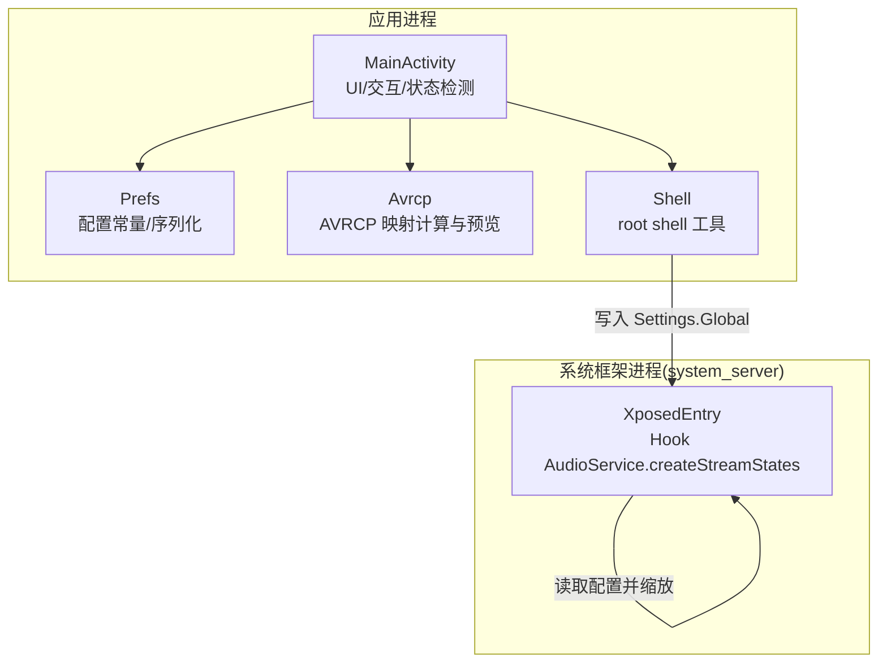
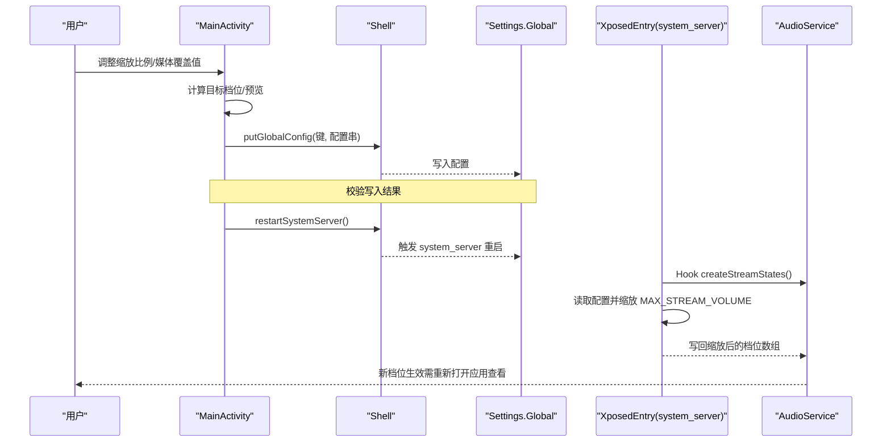
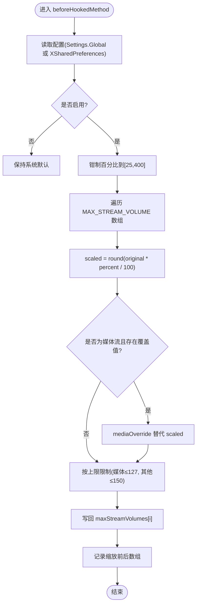
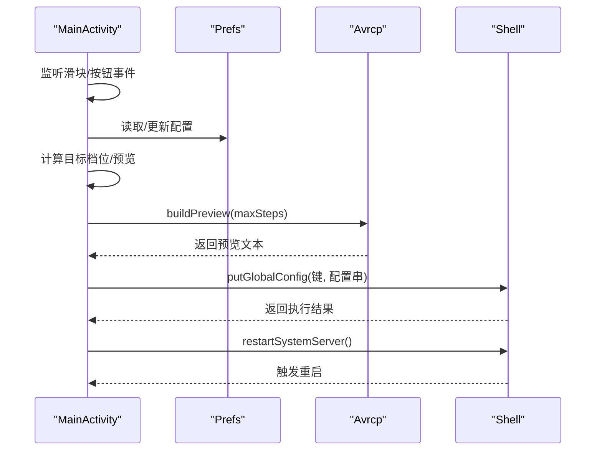
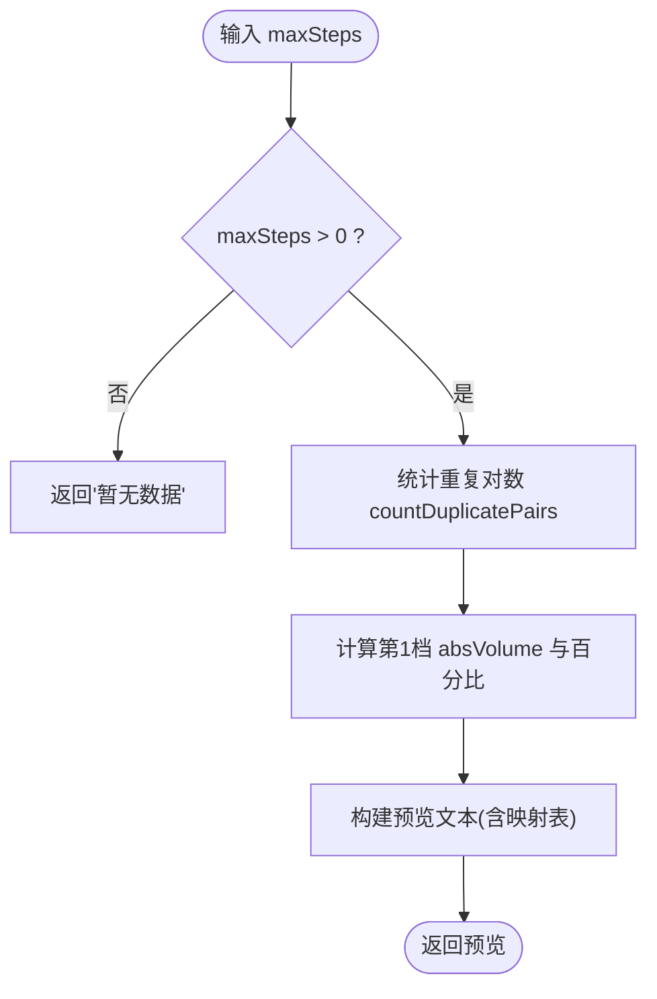
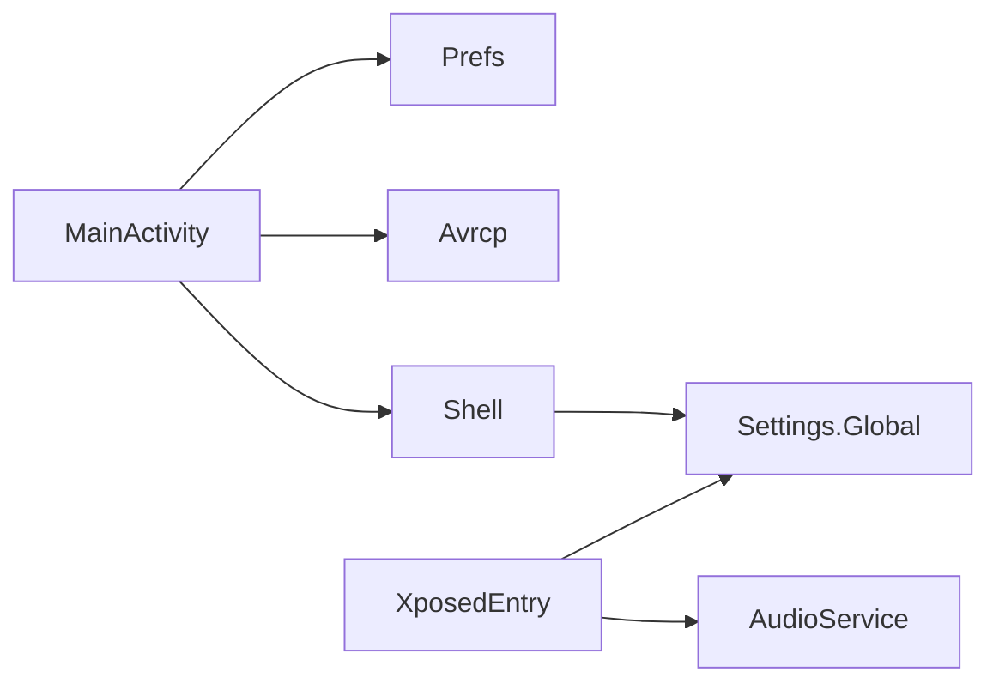

# 项目概述

<cite>
**本文引用的文件**
- [XposedEntry.java](file://app/src/main/java/com/xiefeihong/volumecontrol/XposedEntry.java)
- [MainActivity.java](file://app/src/main/java/com/xiefeihong/volumecontrol/MainActivity.java)
- [Avrcp.java](file://app/src/main/java/com/xiefeihong/volumecontrol/Avrcp.java)
- [Prefs.java](file://app/src/main/java/com/xiefeihong/volumecontrol/Prefs.java)
- [Shell.java](file://app/src/main/java/com/xiefeihong/volumecontrol/Shell.java)
- [AndroidManifest.xml](file://app/src/main/AndroidManifest.xml)
- [build.gradle](file://app/build.gradle)
- [strings.xml](file://app/src/main/res/values/strings.xml)
</cite>

## 目录
1. [简介](#简介)
2. [项目结构](#项目结构)
3. [核心组件](#核心组件)
4. [架构总览](#架构总览)
5. [详细组件分析](#详细组件分析)
6. [依赖关系分析](#依赖关系分析)
7. [性能与稳定性](#性能与稳定性)
8. [故障排查指南](#故障排查指南)
9. [结论](#结论)
10. [附录](#附录)

## 简介
本项目是一个基于 Xposed/LSPosed 的音量控制模块，目标是在系统框架层对 Android 音频系统的音量档位进行缩放，并优化蓝牙 AVRCP 绝对音量的映射体验。通过普通 Android 应用界面提供可视化配置、实时预览与安全重启机制，最终实现对媒体、铃声、闹钟等音频流的细粒度音量控制，尤其改善蓝牙耳机在低音量区“无声”或“相邻档位听感相同”的问题。

主要特性：
- 25%–400% 音量档位缩放：按比例调整系统各音频流的最大档位数，默认保持系统行为（100%）。
- 蓝牙 AVRCP 优化：将媒体档位限制在 AVRCP 绝对音量范围（0–127）内，避免多档映射到同一耳机音量；并提供映射预览。
- 实时预览：界面可即时显示各音频流“原始→目标”档位变化及蓝牙 AVRCP 映射情况。
- 安全重启机制：写入系统设置后软重启 system_server，使新档位生效，不丢失用户数据。

适用场景与用户群体：
- 需要精细音量控制的音频爱好者（尤其是低音量区需要更细腻调节的用户）。
- 使用蓝牙耳机（A2DP/SCO/LE 耳机/音箱）的用户，希望改善 AVRCP 映射导致的音量跳变或无声问题。
- 高级用户与开发者，希望通过系统级 Hook 实现统一的音量策略。

技术栈概览：
- 语言与平台：Java（JDK 17），Android（minSdk 26，targetSdk 35）。
- 系统级能力：Xposed/LSPosed API（编译期引入，运行期由 LSPosed 提供）。
- 系统集成：通过 Hook AudioService 初始化流程修改 MAX_STREAM_VOLUME 数组；通过 Settings.Global 传递配置；通过 root shell 执行系统命令。

**章节来源**
- [strings.xml:3-5](file://app/src/main/res/values/strings.xml#L3-L5)
- [build.gradle:7-14](file://app/build.gradle#L7-L14)
- [build.gradle:22-25](file://app/build.gradle#L22-L25)
- [build.gradle:38-43](file://app/build.gradle#L38-L43)

## 项目结构
项目采用“应用界面 + Xposed 模块”的双进程协作模式：
- 应用进程：提供 UI、配置持久化、状态检测、蓝牙设备信息展示、AVRCP 映射预览、root shell 操作（写入 Settings.Global、软重启 system_server）。
- 系统框架进程（system_server）：加载 Xposed 模块入口，Hook AudioService 的 createStreamStates，按配置缩放 MAX_STREAM_VOLUME 数组，从而改变系统音量档位。

**图表来源**
- [MainActivity.java:23-50](file://app/src/main/java/com/xiefeihong/volumecontrol/MainActivity.java#L23-L50)
- [XposedEntry.java:16-65](file://app/src/main/java/com/xiefeihong/volumecontrol/XposedEntry.java#L16-L65)
- [Prefs.java:12-47](file://app/src/main/java/com/xiefeihong/volumecontrol/Prefs.java#L12-L47)
- [Avrcp.java:3-19](file://app/src/main/java/com/xiefeihong/volumecontrol/Avrcp.java#L3-L19)
- [Shell.java:8-13](file://app/src/main/java/com/xiefeihong/volumecontrol/Shell.java#L8-L13)

**章节来源**
- [AndroidManifest.xml:21-36](file://app/src/main/AndroidManifest.xml#L21-L36)
- [MainActivity.java:23-50](file://app/src/main/java/com/xiefeihong/volumecontrol/MainActivity.java#L23-L50)
- [XposedEntry.java:16-65](file://app/src/main/java/com/xiefeihong/volumecontrol/XposedEntry.java#L16-L65)

## 核心组件
- XposedEntry：系统级 Hook 入口，拦截 AudioService 的 createStreamStates，按比例缩放 MAX_STREAM_VOLUME 数组，支持媒体流覆盖与 AVRCP 上限限制。
- MainActivity：主界面控制器，负责配置采集、预览、持久化、状态检测、蓝牙设备汇总、触发软重启。
- Avrcp：实现 AOSP 一致的 AVRCP 绝对音量换算公式，统计重复映射对数，生成预览文本。
- Prefs：跨进程共享的配置常量与序列化/反序列化工具，定义缩放范围、流索引、上限等。
- Shell：封装 root shell 执行、Settings.Global 读写、system_server 软重启。

**章节来源**
- [XposedEntry.java:16-148](file://app/src/main/java/com/xiefeihong/volumecontrol/XposedEntry.java#L16-L148)
- [MainActivity.java:23-427](file://app/src/main/java/com/xiefeihong/volumecontrol/MainActivity.java#L23-L427)
- [Avrcp.java:3-90](file://app/src/main/java/com/xiefeihong/volumecontrol/Avrcp.java#L3-L90)
- [Prefs.java:12-124](file://app/src/main/java/com/xiefeihong/volumecontrol/Prefs.java#L12-L124)
- [Shell.java:8-114](file://app/src/main/java/com/xiefeihong/volumecontrol/Shell.java#L8-L114)

## 架构总览
整体架构分为“应用层”和“系统框架层”，通过 Settings.Global 作为桥接通道，结合 root shell 完成配置下发与系统重启。

**图表来源**
- [MainActivity.java:261-296](file://app/src/main/java/com/xiefeihong/volumecontrol/MainActivity.java#L261-L296)
- [Shell.java:92-112](file://app/src/main/java/com/xiefeihong/volumecontrol/Shell.java#L92-L112)
- [XposedEntry.java:41-114](file://app/src/main/java/com/xiefeihong/volumecontrol/XposedEntry.java#L41-L114)

## 详细组件分析

### XposedEntry（系统级 Hook）
- 作用域：仅作用于系统框架包（android）。
- Hook 点：AudioService.createStreamStates，在创建各音频流状态前按比例缩放 MAX_STREAM_VOLUME。
- 配置读取：优先从 Settings.Global 读取（system_server 可访问），回退到模块 SharedPreferences。
- 缩放逻辑：对每个流计算 scaled = round(original * percent / 100)，媒体流可被 mediaOverride 覆盖，且所有流均受上限限制（媒体 ≤ AVRCP_MAX_VOLUME，其他 ≤ OTHER_STREAM_MAX）。
- 日志与异常：记录缩放前后数组、错误堆栈，便于调试。

**图表来源**
- [XposedEntry.java:41-114](file://app/src/main/java/com/xiefeihong/volumecontrol/XposedEntry.java#L41-L114)
- [Prefs.java:26-47](file://app/src/main/java/com/xiefeihong/volumecontrol/Prefs.java#L26-L47)

**章节来源**
- [XposedEntry.java:16-148](file://app/src/main/java/com/xiefeihong/volumecontrol/XposedEntry.java#L16-L148)

### MainActivity（应用界面与控制）
- 功能：启用开关、缩放滑块、媒体覆盖滑块、预设按钮、刷新状态、基准采集、保存并重启。
- 实时预览：根据当前配置计算各流“原始→目标”档位，调用 Avrcp.buildPreview 展示 AVRCP 映射详情。
- 状态检测：检查 Root、LSPosed、当前媒体档位、蓝牙设备列表，渲染提示与待生效状态。
- 持久化与系统写入：将配置写入 SharedPreferences 与 Settings.Global，并在成功后延迟触发 system_server 软重启。

**图表来源**
- [MainActivity.java:60-121](file://app/src/main/java/com/xiefeihong/volumecontrol/MainActivity.java#L60-L121)
- [MainActivity.java:193-231](file://app/src/main/java/com/xiefeihong/volumecontrol/MainActivity.java#L193-L231)
- [MainActivity.java:261-296](file://app/src/main/java/com/xiefeihong/volumecontrol/MainActivity.java#L261-L296)
- [Avrcp.java:44-89](file://app/src/main/java/com/xiefeihong/volumecontrol/Avrcp.java#L44-L89)
- [Shell.java:92-112](file://app/src/main/java/com/xiefeihong/volumecontrol/Shell.java#L92-L112)

**章节来源**
- [MainActivity.java:23-427](file://app/src/main/java/com/xiefeihong/volumecontrol/MainActivity.java#L23-L427)

### Avrcp（蓝牙 AVRCP 映射）
- 换算公式：absVolume = round(step * 127 / maxSteps)，与 AOSP 一致。
- 重复映射统计：统计相邻档位映射到相同 AVRCP 音量的对数，用于评估“档位偏多”的风险。
- 预览输出：生成媒体档位与 AVRCP 映射表，标注第 1 档最小值与最大档对应 127。

**图表来源**
- [Avrcp.java:25-42](file://app/src/main/java/com/xiefeihong/volumecontrol/Avrcp.java#L25-L42)
- [Avrcp.java:44-89](file://app/src/main/java/com/xiefeihong/volumecontrol/Avrcp.java#L44-L89)

**章节来源**
- [Avrcp.java:3-90](file://app/src/main/java/com/xiefeihong/volumecontrol/Avrcp.java#L3-L90)

### Prefs（配置常量与序列化）
- 关键常量：缩放范围 25–400%，步长 5%，默认 100%；媒体流索引 3；AVRCP 上限 127；非媒体流上限 150；流数量 12。
- 序列化：encodeConfig/decodeConfig 用于 Settings.Global 的键值；joinInts/parseInts 用于基准档位 CSV。
- 安全取值：getOr 防止越界。

**章节来源**
- [Prefs.java:12-124](file://app/src/main/java/com/xiefeihong/volumecontrol/Prefs.java#L12-L124)

### Shell（root shell 工具）
- 能力：su 执行命令、超时处理、合并 stdout/stderr；检测 Root/LSPosed/Magisk；读写 Settings.Global；软重启 system_server。
- 注意事项：所有方法阻塞当前线程，应在后台线程调用；超时销毁进程，避免卡死。

**章节来源**
- [Shell.java:8-114](file://app/src/main/java/com/xiefeihong/volumecontrol/Shell.java#L8-L114)

## 依赖关系分析
- 应用进程依赖：
  - Android Framework：AudioManager、AudioDeviceInfo、Settings、SharedPreferences。
  - 第三方库：Material Design、AppCompat（UI 组件）。
  - Xposed API（compileOnly）：仅在编译期引用，运行期由 LSPosed 提供。
- 系统框架进程依赖：
  - XposedBridge/XposedHelpers：动态查找类与方法、Hook 回调。
  - AudioService：系统音频服务，createStreamStates 为关键 Hook 点。
  - Settings.Global：跨进程配置通道。

**图表来源**
- [MainActivity.java:23-50](file://app/src/main/java/com/xiefeihong/volumecontrol/MainActivity.java#L23-L50)
- [XposedEntry.java:41-65](file://app/src/main/java/com/xiefeihong/volumecontrol/XposedEntry.java#L41-L65)
- [Shell.java:92-112](file://app/src/main/java/com/xiefeihong/volumecontrol/Shell.java#L92-L112)

**章节来源**
- [build.gradle:38-43](file://app/build.gradle#L38-L43)
- [AndroidManifest.xml:21-36](file://app/src/main/AndroidManifest.xml#L21-L36)

## 性能与稳定性
- 性能特征：
  - Hook 发生在 AudioService 初始化阶段，仅一次缩放 MAX_STREAM_VOLUME 数组，时间复杂度 O(n)（n=流数量，约 12），开销极低。
  - 界面预览计算为轻量数学运算，无 I/O 阻塞。
  - Shell 操作为阻塞式，需在后台线程执行，避免 UI 卡顿。
- 稳定性考虑：
  - 配置读取具备回退机制（Settings.Global → XSharedPreferences），提高鲁棒性。
  - 缩放值钳制在合理范围，避免极端值导致系统异常。
  - 媒体流上限限制在 AVRCP 范围内，降低蓝牙映射风险。
  - 软重启 system_server 会中断播放，但不会丢失数据；建议在合适时机触发。

[本节为通用指导，无需特定文件来源]

## 故障排查指南
- 无法写入系统配置：
  - 检查 Root 授权与 su 可用性；确认 Shell.isRootAvailable 返回 true。
  - 检查 Settings.Global 写入是否成功（putGlobalConfig 返回值与 readback 校验）。
- 模块未生效：
  - 确认已在 LSPosed 中启用模块并将作用域勾选“系统框架”。
  - 确认已点击“保存设置并软重启系统框架”，等待 system_server 重启完成。
- 蓝牙音量异常：
  - 查看 AVRCP 映射预览，若出现大量重复映射对，建议降低媒体档位或调整缩放比例。
  - 部分耳机在极低 AVRCP 音量下无声，属硬件限制；可适当提高缩放比例以细化低音区。
- 基准档位不正确：
  - 确保当前没有其它音量修改生效；必要时先恢复系统默认并重启后再采集基准。

**章节来源**
- [MainActivity.java:298-366](file://app/src/main/java/com/xiefeihong/volumecontrol/MainActivity.java#L298-L366)
- [Shell.java:74-112](file://app/src/main/java/com/xiefeihong/volumecontrol/Shell.java#L74-L112)
- [strings.xml:28-38](file://app/src/main/res/values/strings.xml#L28-L38)

## 结论
本项目通过“应用界面 + Xposed 模块”的组合，实现了系统级音量档位缩放与蓝牙 AVRCP 映射优化，满足音频爱好者与蓝牙设备用户对精细音量控制的需求。其设计清晰、扩展性强，具备实时预览与安全重启机制，能够在保证稳定性的前提下提升用户体验。对于需要统一音量策略的系统定制或高级用户，该方案提供了可靠的技术路径。

[本节为总结性内容，无需特定文件来源]

## 附录
- 关键常量与范围：
  - 缩放比例：25%–400%，步长 5%，默认 100%。
  - 媒体流索引：3（STREAM_MUSIC）。
  - AVRCP 上限：127；非媒体流上限：150；流数量：12。
- 配置文件键：
  - Settings.Global 键：volume_steps_hook_config。
  - SharedPreferences 文件名：settings。
- 使用说明要点：
  - 在 LSPosed 中启用模块并勾选系统框架。
  - 调整缩放比例与媒体覆盖值后，点击“保存设置并软重启系统框架”。
  - 重启期间屏幕短暂黑屏属正常现象；重启后重新打开应用查看效果。

**章节来源**
- [Prefs.java:26-47](file://app/src/main/java/com/xiefeihong/volumecontrol/Prefs.java#L26-L47)
- [strings.xml:28-38](file://app/src/main/res/values/strings.xml#L28-L38)